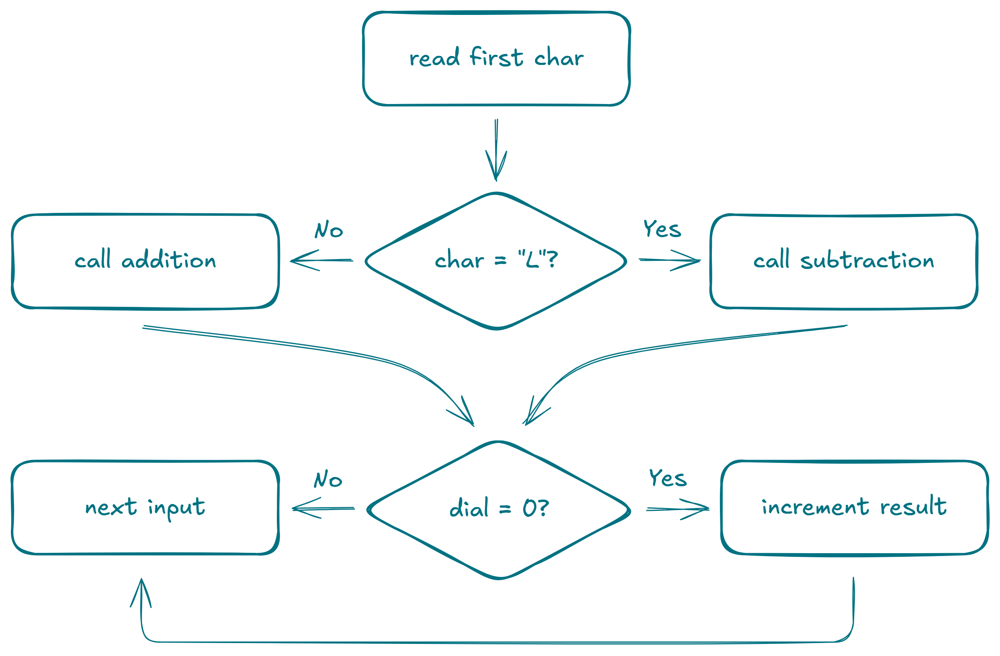

## Day 1: Secret Entrance

### Part 1

``` /apply/ /components/
The Elves have good news and bad news.

The good news is that they've discovered project management! This has given them the tools they need to prevent their usual Christmas emergency. For example, they now know that the North Pole decorations need to be finished soon so that other critical tasks can start on time.

The bad news is that they've realized they have a different emergency: according to their resource planning, none of them have any time left to decorate the North Pole!

To save Christmas, the Elves need you to finish decorating the North Pole by December 12th.

Collect stars by solving puzzles. Two puzzles will be made available on each day; the second puzzle is unlocked when you complete the first. Each puzzle grants one star. Good luck!

You arrive at the secret entrance to the North Pole base ready to start decorating. Unfortunately, the password seems to have been changed, so you can't get in. A document taped to the wall helpfully explains:

"Due to new security protocols, the password is locked in the safe below. Please see the attached document for the new combination."

The safe has a dial with only an arrow on it; around the dial are the numbers 0 through 99 in order. As you turn the dial, it makes a small click noise as it reaches each number.

The attached document (your puzzle input) contains a sequence of rotations, one per line, which tell you how to open the safe. A rotation starts with an L or R which indicates whether the rotation should be to the left (toward lower numbers) or to the right (toward higher numbers). Then, the rotation has a distance value which indicates how many clicks the dial should be rotated in that direction.

So, if the dial were pointing at 11, a rotation of R8 would cause the dial to point at 19. After that, a rotation of L19 would cause it to point at 0.

Because the dial is a circle, turning the dial left from 0 one click makes it point at 99. Similarly, turning the dial right from 99 one click makes it point at 0.

So, if the dial were pointing at 5, a rotation of L10 would cause it to point at 95. After that, a rotation of R5 could cause it to point at 0.

The dial starts by pointing at 50.

You could follow the instructions, but your recent required official North Pole secret entrance security training seminar taught you that the safe is actually a decoy. The actual password is the number of times the dial is left pointing at 0 after any rotation in the sequence.

For example, suppose the attached document contained the following rotations:
L68
L30
R48
L5
R60
L55
L1
L99
R14
L82

Following these rotations would cause the dial to move as follows:
- The dial starts by pointing at 50.
- The dial is rotated L68 to point at 82.
- The dial is rotated L30 to point at 52.
- The dial is rotated R48 to point at 0.
- The dial is rotated L5 to point at 95.
- The dial is rotated R60 to point at 55.
- The dial is rotated L55 to point at 0.
- The dial is rotated L1 to point at 99.
- The dial is rotated L99 to point at 0.
- The dial is rotated R14 to point at 14.
- The dial is rotated L82 to point at 32.

Because the dial points at 0 a total of three times during this process, the password in this example is 3.

Analyze the rotations in your attached document. What's the actual password to open the door?
```

```text title="1/problem/input.txt" /apply/ /components/
R38
R2
L2
R25
R15
R9
L40
R37
L11
L16
L46
R27
L22
R36
L14
L39
L43
R22
L30
R49
R38
R38
R3
L15
R40
R19
R42
R36
L7
R41
R3
R48
L12
R11
L8
R14
R11
R50
L27
L50
R6
R32
R19
R31
L39
R22
L1
L44
R37
R94
L17
R79
L41
R38
L45
L99
R6
R22
L58
R86
R21
L71
L20
R20
L2
L98
L83
R46
L61
L2
L45
L55
R78
L78
L97
R79
R32
L24
L80
L40
L70
R93
L93
L80
R89
L36
R60
L88
R43
R4
R59
L51
L51
R37
R14
R83
R59
R58
L48
L63
R911
L15
L16
L7
L62
R36
L99
R50
L4
R94
L84
R75
L86
L382
R85
R23
L8
L13
R70
R99
R79
L35
R699
L6
L30
R80
R50
R12
L98
L57
L24
L26
R670
R830
R245
L45
R98
L59
L90
R59
R92
R4
R96
R24
L230
L94
L91
R15
L572
R48
R445
L45
R74
L74
L698
L14
L267
L49
L27
L92
R26
L805
R97
L558
R76
R11
L424
L50
L840
R93
R21
L625
L70
L42
L44
R81
R28
L28
L78
L367
L27
L44
R16
L32
R114
L72
R8
L18
R15
L2
L13
R1
L1
L36
L71
L40
L53
R98
L98
L62
L57
R19
L558
R14
L33
L90
L33
R64
L664
L878
R230
L67
R72
L57
L59
R398
R49
L86
R68
R76
L83
R26
R11
L28
R928
L85
R14
L29
L428
L72
R24
L124
L5
L59
L7
L20
R315
R76
R21
L21
R44
L56
L13
L86
R11
R43
L43
R35
L35
R635
L56
R11
R260
R50
R87
L54
L78
R45
L776
L5
R33
R48
R59
L59
R73
L428
L945
R11
L30
R430
R10
L21
L91
L47
L62
R28
R46
R26
L39
L28
R37
L59
R89
R78
L769
R91
L395
L55
R25
R25
R65
R75
L32
R92
L79
R57
L65
R56
L15
L744
L60
L861
R11
R14
R86
L38
R54
R84
L93
L7
R86
L86
R51
R10
R17
R22
L27
L9
L10
L25
R671
L96
R663
L310
L74
R69
L57
L95
R36
L48
R805
R84
R91
L5
R937
L86
R86
L29
R43
L83
R12
L45
L17
R19
R76
R25
L11
R810
L96
R88
L92
R62
R638
L74
R79
R95
R77
R9
L7
L79
L13
R70
R55
L36
R24
R63
R71
L34
L31
R2
L4
L84
R829
L70
R58
R97
L825
R18
L15
R104
R468
L47
R60
R70
R92
L45
R95
L31
R8
L49
L92
L933
R25
R727
L23
R96
L30
L65
R95
R93
L35
L754
L4
R89
R311
L702
L27
L98
L11
L25
R63
L69
R22
R51
L34
R730
R17
L351
L45
L76
L25
L20
R17
L17
L16
L21
L68
R5
R695
R318
L82
L63
R80
L15
L516
R27
L144
L13
R77
R39
R66
L258
L91
R62
L82
L29
R229
L18
L82
R68
R5
L73
R852
L493
R54
R278
L79
L82
L30
R92
L27
L37
L34
L94
L42
R42
R8
R371
R21
L98
L913
L57
R17
R51
L27
R10
L26
L57
L64
L24
L79
L94
R65
R937
L441
L63
L32
L7
R32
L84
L98
R852
L466
R494
L24
R71
L69
L6
R66
R899
L65
L648
R48
R41
R14
R45
L17
R81
L97
L67
L28
R63
R9
R56
L29
R29
R34
R66
L11
L24
R30
L17
L424
R46
L94
R65
R5
R956
R26
L73
L11
R26
L35
L372
R7
R24
L77
L67
L680
L45
L23
R68
R97
R85
R64
R96
L42
R98
L98
R869
L59
R21
L263
L72
L96
L62
R62
L32
R7
L14
L61
R88
L49
R5
R76
L44
L98
R12
L95
L95
L567
L33
R81
R919
R31
R29
L44
L74
R11
L65
R80
R25
L20
L73
L82
L18
R294
L94
L418
L82
R132
L83
L32
R83
R33
L433
R47
L53
L28
L64
L438
L20
R34
R22
L32
R77
L354
R9
R9
L109
L97
R97
R8
L664
L44
R34
R66
L61
R61
L76
L282
L51
R9
R1
R99
L317
R61
L44
L606
R19
R887
R39
L39
L29
R29
L54
L15
L227
L66
L38
L22
R303
L16
L25
R280
R25
L683
L96
R92
R2
R205
R19
L84
R26
L6
L20
L96
R90
R51
R55
R53
L90
R35
L3
R769
R393
R82
R261
R26
R30
R42
R77
L38
R94
R269
R68
R432
L82
L18
R251
R45
R4
R12
L15
L652
R91
R964
R84
R16
R4
L49
R33
R12
R70
R15
R831
L21
R47
R26
L768
R946
R838
R693
L63
L96
L235
L62
R325
R744
L67
L84
R48
L53
L256
R62
L40
L646
L355
R701
R29
L59
R30
R46
L45
L67
R11
L45
L55
L264
L31
R550
R660
R93
L55
L98
L64
L48
L88
L5
R23
L18
R32
R736
R93
L47
R33
R29
L24
L49
L3
R48
L97
R149
R45
R293
L85
L82
L349
L72
R50
R52
R48
L353
L47
R56
L522
R66
L991
R91
L29
R64
L735
R73
L526
R84
R55
R69
R52
R89
L96
R20
L927
R8
L201
R57
R5
R38
L95
R23
R67
L195
L67
L121
L95
R50
L94
R14
R30
L47
R22
R610
R20
L71
R433
R84
R30
R502
R613
R44
L509
L48
R17
R67
L984
R387
R72
L75
R301
R301
L22
L38
R87
L13
L40
L60
L43
L57
L48
L95
L248
R76
R26
L89
L22
R43
L43
L23
L487
L171
R532
L99
R87
R761
R81
L81
R99
R1
L52
R52
R10
R90
L56
R56
L209
L34
L57
R95
R22
R89
R94
L93
L7
L54
L18
L42
L986
L44
L5
R23
R26
R72
L92
R120
L36
L64
R81
R41
R75
L97
L46
L15
R61
L93
R93
R69
R44
L67
L46
R443
R77
L220
R67
R33
R95
R305
L57
L344
R135
L70
L64
L19
L69
L933
R77
L56
L38
L21
R59
R97
L97
L19
L8
R74
R11
R69
R73
L56
R156
L53
R346
L404
R58
L94
R14
R729
R4
R33
L327
R59
R935
L89
L35
L143
L33
R854
R29
L83
R28
R72
R78
L49
R71
L94
R694
R367
L439
L75
R55
R6
R86
L47
L513
R11
R49
L126
L774
L329
R611
R818
R58
R42
R44
L44
R28
R372
L75
L477
R84
L82
R50
L71
R44
L999
R26
R98
L198
L99
L56
L63
R18
L41
L59
L80
L61
R5
L64
L32
R18
L86
R24
R74
L17
L11
R30
R41
R13
R81
L56
L89
R97
R57
R68
L12
L25
R61
R89
R75
R64
L536
L31
R20
L85
R68
R97
R3
R84
L54
R36
R14
R51
R69
L64
R2
R9
R153
R56
R44
L97
L403
L32
R15
L188
L973
L222
L51
R651
R97
L70
L495
L32
R36
L19
R83
L795
R10
R385
L857
R57
R22
R78
R11
R690
L1
L410
L890
L79
R93
R86
R72
L72
L84
L262
L34
R180
L61
L39
R26
L50
L76
L427
R179
R17
R49
R82
R35
L23
R1
L79
L734
R44
L329
R126
L41
R81
R43
L60
R843
L989
R74
L370
L22
L64
L18
L61
R43
L79
L70
R131
R89
R5
L24
R26
R22
L114
L459
L59
L66
R89
R458
R51
R5
L45
R19
L2
L677
R17
L417
R78
L757
L77
L81
L1
L62
R68
L503
L45
L20
L60
R50
R73
L39
L79
L545
R34
R66
R87
R76
L126
L295
L65
R90
L30
R63
L481
L29
L83
R393
L979
R11
R214
L46
L361
L93
L46
R47
R86
R96
R71
R979
L62
R18
R65
L97
L23
L380
L375
L64
L692
R41
L81
L50
R554
L6
L127
R93
R21
L14
R10
L41
R63
L244
L68
L916
L92
L12
L16
L57
R21
R44
R790
R18
L68
L96
R64
L17
L41
R204
L24
R57
R14
L87
R88
L34
R40
R11
L98
R87
L51
R56
L21
L86
L9
R811
L75
R62
L76
R89
L54
L36
R73
R30
R41
L54
R58
R80
R62
L11
L689
L346
L54
R59
L195
R97
L40
R32
R73
R35
L15
L246
L4
R4
L88
L760
L552
L95
L54
L51
R83
L83
R44
R13
R51
R92
L92
L8
R26
L26
L28
R42
L352
R38
R217
L17
L72
L64
L364
R158
L75
L49
L34
R21
R76
L18
L12
L94
L91
L149
R323
L56
R16
L685
L31
R27
R2
R65
R929
L85
R703
R26
R233
R61
L62
R1
L22
R422
R85
L706
R87
L64
L102
L19
R79
R40
L47
L86
R76
R57
L87
R26
L39
L769
R98
L72
L2
L55
L322
R87
R958
R98
L21
L44
R44
L69
R69
R14
L26
R12
R37
L68
R91
R6
L77
L22
R85
L76
L380
R4
L62
R62
L73
R73
L26
L86
L9
L8
L912
R41
L90
R72
L40
R35
L49
L976
L94
L58
R93
L8
R23
R86
R46
L850
L10
R20
R62
L35
L27
R58
R42
L17
L16
L50
R37
R7
R74
R671
R38
L44
R98
L78
L520
L2
R78
L31
R55
R41
R28
R807
L59
R83
R47
L78
L56
R34
R40
R613
L56
R56
R97
L43
L38
R62
L78
L46
R941
R59
L75
R51
R32
R38
L88
R88
R750
R94
L49
L284
R473
R907
R42
R549
L248
R58
L95
L76
R80
R1
L2
L70
R70
R253
L53
L9
R18
L77
R83
R80
L493
L65
L37
R82
R73
R83
R761
L487
L12
R86
L86
L2
R802
L53
R75
L447
R84
L21
R62
L72
R202
L30
L62
R62
R10
R92
R71
R27
L537
L526
R57
L599
L19
L76
R121
L21
L55
R55
L166
R77
R11
R78
L59
R59
L53
R87
L68
L67
R1
R172
L37
R98
L333
L30
L63
R47
L380
R39
L13
R88
R26
R86
L77
R77
L693
L53
L92
L53
L69
L88
L65
L87
R75
R89
R90
R47
R54
R80
L14
R79
L96
R61
L65
L32
R76
R42
L86
L88
L12
R63
R37
R84
L84
L99
R899
R58
L58
R65
R26
L91
L90
R16
L98
R72
L29
R28
L68
R969
R441
R36
R23
R581
R473
L149
L205
R72
L72
R76
R16
L92
R64
R36
L555
R99
R56
R54
L733
R79
L96
R96
R26
L26
R85
R84
R73
L75
L936
L8
R64
L87
R54
R11
R34
L66
R1
R65
R1
L508
L92
R54
R23
L587
L35
L55
L96
R883
R20
L82
L55
R30
R77
L202
R25
R44
R56
R526
R74
R7
L76
R23
L493
R83
L31
R27
L40
L19
R59
L40
L67
R67
L17
L54
R71
R34
R66
R703
L903
R71
R22
L70
L23
R13
L52
L161
R8
L34
R15
L25
L64
L239
R94
L58
L39
L58
R60
L1
R441
L71
L52
R4
R27
L29
R95
L320
L80
L76
R523
L67
L172
R43
R58
R17
R559
L198
R77
L38
R61
L101
L45
R89
R96
L62
L38
L7
L19
L63
L32
R61
R60
R6
R229
L35
R88
R12
L71
R86
L87
L328
R86
R26
R42
L506
R421
R62
L31
R10
R90
L22
L85
L49
L1
R3
L46
L99
R19
L720
L90
R5
L528
R13
R38
L77
L61
R76
R431
R93
L807
R51
R48
R910
L2
L14
L47
R71
L64
L799
L47
R408
R92
R703
R30
R30
L671
R8
R99
R481
L35
L68
L88
R413
R30
L21
L21
R10
L29
L514
L95
L27
L59
R324
R16
R77
L93
L16
R70
L54
L19
R19
R18
R82
R1
L52
R51
L17
R17
R19
R42
L53
R21
R75
R296
L116
R16
L48
L22
R93
R77
L51
R955
L4
L19
R84
L33
R68
L36
R36
L2
L17
R719
R77
R21
L4
L94
R88
L96
R938
R48
L796
R18
L594
R857
R37
L49
R49
L50
L54
L296
R75
R28
L31
L72
R597
L97
R40
R60
L936
R91
L55
L75
L96
R31
L33
L357
R30
L2
R2
R97
R3
R70
R30
R24
R35
R33
R8
L24
R41
L917
R621
R29
L50
L743
R55
R32
R56
L17
L68
R8
R77
L80
R10
L15
R82
R957
L48
R126
R68
R93
L51
L61
L27
L54
L56
R156
L24
L8
R232
L966
L12
R589
L11
L43
R19
R32
L8
L278
R75
L97
R68
L72
R93
R11
L20
R2
R18
R60
R140
R358
L558
L85
R68
R17
L54
L138
R89
R32
R71
L19
L81
L72
L28
L250
R50
R80
L27
L42
L711
R49
R54
R16
R68
R96
R3
L87
R17
R93
R34
L43
L93
R8
L1
L14
R80
R20
L79
L321
L75
L8
R6
R30
R955
L994
L6
R524
R55
R13
R730
R53
L981
R98
R1
R699
R47
L60
L87
L70
L44
R76
L62
R665
L71
L62
R39
L71
L59
L35
R559
R47
L12
L364
L36
L28
L367
L40
R35
L193
L322
L81
L4
R86
L20
R734
L756
L785
L164
R405
L62
R62
R9
L11
R28
R774
R8
L639
R47
L16
R29
R68
R3
L57
L28
L15
L784
R84
L18
L12
L51
L17
R50
L7
L45
R96
L13
R75
R42
L49
R65
L405
R57
R34
L89
L108
R51
R89
R27
L15
R98
L55
L59
R5
L86
L757
L3
R67
R233
R91
R9
R495
L458
R46
R527
L644
R34
L10
L20
L51
R381
L28
L72
R441
R76
L13
L72
L803
R104
R29
L90
L97
R12
R86
L6
R77
R56
L22
R13
L91
R30
R11
L80
R282
L98
R8
L83
L87
L9
R26
R64
R36
R16
R684
R3
L3
L94
R96
L36
R34
L61
L66
L96
L31
R83
L81
L26
L122
R204
L4
L10
R10
L25
L73
L2
R189
L89
R37
L855
L57
R775
L3
L84
L35
R22
R62
R38
L93
L96
L11
R49
R51
L59
L41
R73
R432
R95
L76
R45
R31
L70
R75
R295
L665
L35
L775
L63
L62
L5
R205
R8
L496
R88
L50
R50
R63
L99
L85
L828
L951
L86
L6
R292
R78
R73
R77
R90
R90
L8
L28
L72
L64
L50
R14
L81
R2
L60
R906
L668
R1
R35
L835
L29
R24
L95
R94
L4
L78
R29
L50
R50
L641
L71
L29
L98
L18
L84
R11
R1
L85
L27
L6
R99
L397
L896
L836
L77
R46
R60
R68
R39
R889
R11
R25
L99
R68
R206
R10
R90
L21
L37
L42
R88
L88
L34
L616
R65
R58
R62
R76
L11
R86
R85
L71
L36
R836
L56
L148
R4
R32
R42
R93
L272
R11
R349
L21
R21
L55
R30
L85
L945
R14
L88
L126
R24
L24
L10
R624
R51
L36
R71
R8
L8
R38
R304
R47
R53
L62
R418
L198
R7
L20
R29
R26
R58
R14
R1
R180
R968
R22
R90
R25
R80
L380
L663
R51
R12
R79
R48
L27
L88
R69
R19
L32
L25
R53
R47
L660
L51
R68
R477
R7
R65
R494
R486
R94
R77
R92
L40
R416
L556
R888
L31
L32
R856
L88
L46
L61
L82
L69
L87
L60
L272
R73
R764
R35
L61
L68
R56
R73
L50
L7
L4
R39
R111
L5
L36
L24
L82
L42
L18
R361
L43
R29
R27
R64
L439
R72
R283
R64
L28
R28
R51
L69
L380
L935
R21
R84
L72
R64
R36
L76
L24
L11
R70
R41
R64
R36
L419
L77
R41
R23
R847
L683
L95
L801
R368
L89
R885
L73
R73
R32
R68
L325
L27
R23
L86
L85
L46
L38
R884
R752
L57
L57
R62
L72
L76
R748
R4
R96
L329
L90
R24
L605
L30
R470
L60
L72
R14
R61
L83
R274
L574
R321
R72
R70
R48
R89
R270
R47
R70
L1
L86
R4
L87
R56
R43
R84
L90
R99
R30
L85
R46
R62
L517
L586
L95
R745
R34
R77
R80
L40
L156
L925
R44
R87
R87
R3
R54
L54
L93
R52
R853
L12
L71
L57
R950
L322
L73
R73
L55
L45
L56
L77
L67
R77
R23
L1
L76
L23
R7
R4
L258
R66
L719
R57
R743
R25
L7
R37
R838
L593
L39
L57
R884
R12
L37
L63
L37
R37
L13
R69
L592
L64
R92
R8
L72
L82
R413
R547
L94
R81
R56
R58
L79
L65
L84
R86
L58
L7
L85
L22
R25
L11
R93
R507
L7
L393
R113
R63
R64
R42
R92
R68
L849
R324
R77
L935
R42
L5
L3
R72
L30
L922
R80
L166
R99
L16
R37
R46
R95
L95
L33
R49
R4
L20
R709
L9
L35
R21
R32
R86
R96
L92
L70
R31
R31
L5
R13
R92
L33
L967
R77
L77
L4
R904
L79
R38
R64
L24
L660
L35
R933
R98
L51
R11
R47
L66
R24
R41
L241
R86
L86
L53
R11
L26
L14
R82
R46
R54
L51
L749
R42
L42
L32
R24
L92
R93
R759
R270
R61
L186
R92
L189
L8
L472
L78
R558
L65
L92
L43
L307
L65
L44
L602
R82
R389
L765
L82
R704
R90
L17
L83
L79
R48
L29
L40
L59
R65
R96
R98
R21
L987
R866
L26
R704
L92
R43
R71
R47
L23
R576
R68
L13
R71
L26
R87
L87
R11
L31
L48
L32
L94
L6
L33
R933
R59
L59
L684
L87
R75
R84
L1
L87
L2
L98
L167
R56
L40
R70
R76
R60
R689
R644
L88
L61
R37
R70
L30
L17
R23
R1
R877
L599
R87
R35
R30
L53
R56
R33
R877
L66
R182
L66
R11
L27
R86
L386
L94
R94
L761
R42
R48
R98
R373
R59
R72
R99
R770
L31
L10
R46
L10
L60
R565
L93
R82
L89
L22
R10
L60
L84
L39
R33
R66
R982
R214
L82
L97
R79
R5
L5
R66
R25
L978
R30
L43
R27
R73
L92
R91
L19
R13
R74
L18
L549
R23
L30
L93
L538
R44
L28
L62
R84
R259
L24
R365
L14
L86
R67
R382
L99
L53
R73
L61
R44
L53
R4
R96
L92
R992
L41
L28
R17
R21
L58
L62
L58
R557
L89
R41
R96
R199
L90
L23
R33
R85
R62
R838
L76
L51
L27
R944
L878
L565
L58
R11
R13
R965
R6
R61
R74
R1
L220
R81
L84
R3
R87
R413
R76
L293
R17
R2
R327
R92
L84
R25
R20
R290
L908
R91
L19
R674
R91
R73
L74
L97
L19
L84
R73
R71
L44
R24
R76
L4
R134
L87
L3
R246
R67
R786
L56
L83
R263
R37
L696
R96
R92
R8
L787
L687
R462
R91
L87
L21
R143
R86
R8
L27
L65
R84
L90
R10
R80
L53
R90
R63
L448
R48
L10
L22
L93
L75
L47
R847
R97
R95
L392
R81
L3
R92
L77
L143
L26
L24
R633
R14
R82
L6
L23
L6
R206
R429
R33
R38
R941
L56
L285
R37
R16
L58
R40
R465
R18
L20
R28
R63
R111
R64
L60
R71
L4
R471
R758
L494
R131
L37
L27
R46
L641
L47
L577
R52
L82
R966
R10
L94
R56
L62
L52
L88
L72
R40
L28
R85
L79
R52
L58
R53
L79
L74
L554
R91
L93
R19
L63
L98
L402
R79
R34
L13
R1
L72
L24
R49
R29
L2
L81
R55
R45
R78
R40
R73
L11
L80
L56
R24
L52
L76
L66
R1
R4
L68
R89
R66
L277
L40
R449
R80
R22
R335
R59
R37
R69
R67
R52
R959
L32
L46
R50
L95
L55
R64
R417
R90
L40
R16
L45
R98
L95
L66
L39
L45
R349
R96
R90
L66
R76
L14
L86
L72
L28
R52
L638
L15
L499
L71
L33
R65
L79
R18
L90
L54
R22
L80
R17
L39
L56
L20
R314
R86
R66
L89
L77
R96
L63
R162
R88
R17
R707
R93
R85
L46
L46
L62
L31
R17
L17
L30
R116
R14
R49
L549
R1
L101
L39
L51
L10
L14
R14
R41
L41
R70
L4
R52
R26
L22
R939
L61
R261
R23
L84
R281
R411
L31
R20
L81
R27
R22
L49
L59
R57
R49
L67
R72
L29
R15
R62
L92
L90
R82
R5
L896
L7
L22
R47
R773
L74
L89
L66
L42
R92
R95
R684
R73
L873
L7
R7
R1
R40
L41
L832
R32
R35
L326
R91
R10
L10
L21
L47
R12
R756
R18
R82
R37
L25
L12
R81
L4
L24
R4
R443
L18
L920
L78
R25
L13
R604
L12
R24
R88
L54
L26
R47
L67
L747
R47
R312
R88
L57
R31
L74
L8
L757
L535
L701
R1
L10
L90
L70
L95
L35
R44
L44
L65
R65
L8
L92
L52
L48
R45
R312
L157
R182
R96
L78
L99
R721
R37
R15
R54
R30
L875
L94
L41
L48
L29
R429
R401
R24
L25
R63
R88
L946
R54
R25
R64
L48
R363
R937
R60
R16
L661
R939
L10
L44
R7
R93
R27
L827
R54
R89
R57
L44
L14
R87
R72
L56
R55
L28
R54
L24
L95
R44
R49
R12
R99
L111
L51
L49
L88
R84
R4
R98
R43
L24
L96
L97
L94
L20
L860
R50
R53
L776
L15
L55
R87
L94
R14
L84
R14
L89
L48
R43
L50
L57
R954
R3
R426
L26
R66
R34
R921
R2
R60
R26
L53
L56
R89
R11
R45
R504
R983
L86
R92
L38
L4
L20
L676
L58
R714
R44
L27
R5
L69
L537
R43
L97
L41
L77
R80
R38
L98
R736
L56
R33
R736
L74
R90
R115
L32
R85
L75
R637
R85
R90
R7
R25
R78
L34
R97
L87
R92
R49
L19
R719
R92
R496
R72
L7
R30
R99
R94
R733
R3
R37
R96
R38
L7
L799
L52
R58
R753
L53
L77
L437
R92
L78
L2
L98
R97
R603
R83
L83
R66
R28
R23
L234
R17
L58
L39
R49
L98
R94
L48
L21
L30
L7
R16
R42
R54
R46
R24
R2
R74
L90
L69
L72
R87
L49
L63
L544
R702
R45
L84
R37
L35
L29
L651
R15
R45
L58
L61
L16
R748
R942
R37
L53
L29
R321
L76
L255
L45
L50
L92
L58
L606
L2
L20
L72
L42
L66
L804
L88
L43
R14
L71
L81
L36
R17
L56
L44
L80
R980
L84
L23
L11
L82
L89
R21
R68
L35
R995
L11
L49
R5
L5
R32
L47
L85
L39
R39
R28
L28
L71
L29
L75
R75
R47
L25
L22
R79
L69
R24
L34
L35
R92
L57
L54
R54
L73
R73
L46
R72
L63
R37
R38
R25
L51
R88
R28
R72
L14
L39
R255
L2
R97
R19
R464
R4
R211
L56
R61
L101
R43
L79
L63
L30
R418
R12
R35
R465
L133
R15
L19
L76
L485
R46
R11
R41
R12
R19
R50
L38
R914
R83
R563
L654
R162
L19
L92
L826
L69
L35
R886
R93
L16
R36
R75
R56
R9
R91
R496
L113
L83
L380
L92
L28
L63
L494
L31
L67
L525
R27
L47
L187
L720
R7
L96
R96
L11
L489
R51
R442
R107
R10
R45
L37
R36
L354
R77
R23
L37
R74
R98
R41
L15
L571
R10
R4
L4
R268
L92
R70
L84
R844
L264
R635
R61
R37
R79
R98
R48
L417
L83
R67
R33
L28
L572
L31
R21
R66
L156
L704
R841
R46
L83
R93
L35
R58
R7
L923
L883
R83
R73
L73
R82
R73
R45
L21
R7
L71
L15
R34
R23
L30
R73
L75
L25
R75
R25
R45
R55
R88
R88
R48
R80
L81
R925
L17
L31
R39
L39
R54
L33
L508
R92
L5
R818
L25
L93
R51
R49
L56
R90
L41
L942
L58
L13
L90
R10
L65
L34
R29
L30
R701
L83
L418
L8
L43
L49
R18
R40
L58
L15
L85
L416
R16
R26
L26
L74
L26
L26
L97
R23
L16
R6
R51
R76
L37
R20
R62
L28
L34
R31
L31
L28
R39
L975
R83
L73
L45
R549
L50
L28
R28
R11
R89
L294
L43
L16
R785
L34
R60
L97
R705
L92
R626
L58
L20
R96
L805
L13
L41
L89
L5
L681
R26
R59
R31
L24
L76
R375
L22
R47
R74
L74
R451
L52
L22
R39
L28
L31
R43
R216
L961
R45
R52
L852
L47
R47
R25
R75
R39
L1
R81
R81
L3
L97
R784
L8
L76
R37
R333
L22
L92
R42
R78
L2
L86
R66
R46
L92
L19
R23
L12
L99
L88
L13
L273
L27
R66
R17
R28
L25
L86
L92
L508
L36
L90
R78
L952
R61
L788
L73
R60
L960
L28
L11
L61
R62
L17
L45
L33
R339
R12
R872
L90
R37
R68
L5
L168
R68
L25
L64
L11
R61
R22
R17
R54
L54
L89
L12
R1
L48
R64
R84
R59
L809
L99
L51
R4
L64
R560
L77
R845
R89
R943
L17
R17
L40
R98
L561
L512
R51
R864
L64
R86
R78
R257
R243
R954
R50
R96
R96
L244
R72
R76
L1
L99
L934
R334
R60
L29
L31
R17
L13
L5
R1
R41
L34
L43
R13
L235
R99
L441
R25
R48
R6
R21
L86
L347
R33
L71
L18
L78
R89
L472
R57
L32
L89
L786
R12
L401
R247
L23
R65
L90
L10
L42
R30
L88
L789
R28
R61
L18
R18
L82
R682
L499
L1
L80
L40
L8
R28
L33
L67
R712
L59
R8
R39
R62
L344
R82
L670
R12
R4
R79
L25
L21
L22
L57
L67
R467
L25
L75
R15
R41
R71
L68
L359
L703
L68
L48
L81
L80
R11
L853
L187
R86
R232
R86
R10
L30
L75
L48
R48
L812
L27
R39
L65
R44
R821
L957
R88
R84
L1
R686
R982
L13
R947
R62
L78
R39
L32
L611
R4
R692
R93
R15
L75
L12
R87
L43
R421
R3
L81
R89
L10
L79
R42
R58
R21
L26
R119
R20
R76
L39
L71
L80
R45
R282
L947
R75
R7
R43
R75
L6
L49
L89
L56
L172
L62
R58
R76
R58
L58
R76
R17
L393
R79
R56
R82
L81
L36
R25
L25
L67
R730
R37
L51
L49
R70
L70
R562
L562
R70
L614
L56
L64
R52
L761
L27
R43
L41
L102
L78
R53
L913
R159
R330
L51
L90
R77
L344
R35
R90
L942
R74
R35
R65
L52
L86
L30
L64
R72
L40
L110
R43
R57
R10
L89
L28
R17
L57
R32
R25
R65
R10
L43
R38
L670
R27
L44
R17
L2
L98
L862
R702
R16
R44
R25
R75
L10
R10
L55
R31
R90
L66
R485
R395
R20
R53
R57
L395
L15
L77
L53
L70
R25
R975
L11
R11
R70
L6
R36
L508
L92
L57
R57
L71
R71
R762
L72
R12
L2
R638
R626
R31
R75
R930
R14
L14
L18
L82
L25
R46
L21
L73
L76
R149
L98
L2
L67
R67
L34
R23
L9
L20
L84
R424
R94
R6
R40
R48
L12
L88
L88
R80
L10
L68
R27
R223
L52
R49
R67
L64
R781
L533
L62
R6
R56
R98
L98
L14
R948
L434
L56
R20
R7
R12
L910
L923
R150
L925
L75
R813
R49
R38
R12
L98
L16
L99
L99
R81
L89
R8
L9
R9
R98
L698
L80
R52
R7
R21
L76
L24
L1
L64
R736
L6
L90
L631
L56
R12
R68
R54
L37
L85
L16
L59
L45
R20
R83
R617
R89
L53
L255
L43
L72
L35
L8
L23
R24
R15
R95
L26
L8
R18
R88
L90
R84
R3
R73
L13
L5
R42
R67
L14
L96
R43
R57
L57
L56
L26
L31
L87
L50
R49
R1
R61
L83
R71
R95
L14
L67
R37
R82
R8
L90
L7
L93
L75
R75
R19
R53
L22
R50
R83
L15
R28
R25
R26
L38
L48
L38
L39
R28
L47
L25
R41
R45
R33
R5
R22
L46
R18
L35
R6
R50
R37
L45
R28
L17
R47
R4
R39
R36
L10
R12
L47
R42
R25
R27
L5
R32
R6
R33
L45
L8
L44
L23
L26
L16
R36
L23
L39
L48
R14
```

Analyzing the problem, instead of simulating a dial, we can treat this as a linear number line wrapping around itself, or we can say this is addition and subtraction done in $Z_{100}$ (the ring of integers modulo 100).
- Right Rotation (x): Add **x** to the current value.
- Left Rotation (y): Subtract **y** from the current value.

Another point worth noticing is that in x86 Assembly, any value that is negative will be wrapped to a very large number based on the maximum value that a register/memory region can hold. Since we want it to wrap to 100 instead, we should apply modulo 100 to the rotation count, and for substraction, we should add 100 to the initial result before executing the final modulo operation.

Gathering every point we made, here is the generalized algorithm:
- Right Rotation (x): `next_state = (prev_state + (x % 100)) % 100`
- Left Rotation (y): `next_state = (100 + prev_state - (y % 100)) % 100`

For each instruction, we apply the above methodology to calculate the next state. Anytime the dial reaches 0, the final result is incremented by 1.

```asm title="1/solution/addition.asm" showLineNumbers{1} /apply/ /components/
; ----------------------------------------------------------------------
; Component: Modulo 100 addition
; Args: rdi, rsi
; Ret: rax = (rdi + (rsi % 100)) % 100

addition:
    mov rax, rsi
    xor rdx, rdx 
    mov rcx, 100 
    div rcx

    mov rax, rdx 
    add rax, rdi
    
    xor rdx, rdx 
    mov rcx, 100 
    div rcx 

    mov rax, rdx
    ret
```

```asm title="1/solution/subtraction.asm" showLineNumbers{1} /apply/ /components/
; ----------------------------------------------------------------------
; Component: Modulo 100 subtraction
; Args: rdi, rsi
; Ret: rax = (100 + rdi - (rsi % 100)) % 100

subtraction:
    mov rax, rsi 
    xor rdx, rdx 
    mov rcx, 100 
    div rcx

    mov rax, rdi
    sub rax, rdx
    add rax, 100
    
    xor rdx, rdx 
    mov rcx, 100 
    div rcx 

    mov rax, rdx
    ret
```

For the main solver, we construct the program flow based on the following flowchart.



The `solver` function will be called with two arguments: `prev_state` and `rotation_count`.

```asm title="1/solution/solver.asm" showLineNumbers{1} /apply/ /components/
; ----------------------------------------------------------------------
; Component: Problem Solver
; Args: rdi, rsi
; Ret: rax = rdi +- atoi(input[rsi + 1:])

solver:
    push r13 
    push r14
    push r15 

    mov r13, rdi
    mov r14, rsi
    movzx r15, byte [r14]
    inc r14 

    mov rdi, r14
    call atoi 

    cmp r15, 'L' 
    je .left_rotation 

    mov rdi, r13 
    mov rsi, rax 
    call addition 

    cmp rax, 0
    je .increase_result
    jmp .done

.left_rotation:
    mov rdi, r13  
    mov rsi, rax 
    call subtraction 

    cmp rax, 0
    jne .done

.increase_result:
    inc qword [result]

.done:
    pop r15 
    pop r14
    pop r13
    ret
```

Concatenate everything into one snippet, we have this working script.

```asm title="1/solution/solve.asm" showLineNumbers{1} /apply/ /components/
section .data
    filename db "../problem/input.txt", 0

section .bss
    input resb 100000
    output resb 20
    result resq 1

section .text
    global _start

_start:
    ; Open input file 
    mov rax, 2
    mov rdi, filename 
    xor rsi, rsi
    xor rdx, rdx
    syscall
    mov rbx, rax

    ; Read input file 
    xor rax, rax
    mov rdi, rbx 
    mov rsi, input
    mov rdx, 100000
    syscall
    mov rcx, rax

    ; Close the file
    mov rax, 3
    mov rdi, rbx
    syscall

    ; Split the instructions and process them one by one
    mov r8, input
    mov r9, input 
    mov r10, 50
    mov qword [result], 0

reader:
    movzx rax, byte [r9]
    test rax, rax 
    je process_last_line

    cmp rax, 10
    je process_line 

    inc r9 
    jmp reader

process_line:
    mov rdi, r10
    mov rsi, r8
    
    call solver 
    mov r10, rax

    inc r9
    mov r8, r9
    jmp reader

process_last_line:
    cmp r8, r9
    je print_output

    mov rdi, r10
    mov rsi, r8
    call solver
    mov r10, rax

print_output:
    ; Print result to stdout 
    mov rdi, qword [result] 
    call print_int

    ; Exit the program
    mov rax, 60
    xor rdi, rdi
    syscall

; ----------------------------------------------------------------------
; Component: Atoi (String to Int) conversion
; Args: rdi
; Ret: rax = atoi(rdi)

atoi:
    xor rax, rax

.convert:
    movzx rsi, byte [rdi]
    test rsi, rsi 
    je .atoi_done

    cmp rsi, 10
    je .atoi_done

    cmp rsi, '0'
    jl .atoi_done

    cmp rsi, '9'
    jg .atoi_done

    sub rsi, '0'
    imul rax, 10
    add rax, rsi 

    inc rdi 
    jmp .convert

.atoi_done:
    ret 

; ----------------------------------------------------------------------
; Component: Print Integer
; Args: rdi

print_int:
    mov rax, rdi
    mov rcx, output
    add rcx, 19
    mov byte [rcx], 10
    mov rbx, 10

.loop:
    dec rcx
    xor rdx, rdx
    div rbx
    add dl, '0'
    mov [rcx], dl
    test rax, rax
    jnz .loop

    ; Calculate length
    mov rdx, output
    add rdx, 20
    sub rdx, rcx

    ; Print
    mov rax, 1
    mov rdi, 1
    mov rsi, rcx
    syscall
    ret

; ----------------------------------------------------------------------
; Component: Modulo 100 addition
; Args: rdi, rsi
; Ret: rax = (rdi + (rsi % 100)) % 100

addition:
    mov rax, rsi
    xor rdx, rdx 
    mov rcx, 100 
    div rcx

    mov rax, rdx 
    add rax, rdi
    
    xor rdx, rdx 
    mov rcx, 100 
    div rcx 

    mov rax, rdx
    ret

; ----------------------------------------------------------------------
; Component: Modulo 100 subtraction
; Args: rdi, rsi
; Ret: rax = (100 + rdi - (rsi % 100)) % 100

subtraction:
    mov rax, rsi 
    xor rdx, rdx 
    mov rcx, 100 
    div rcx

    mov rax, rdi
    sub rax, rdx
    add rax, 100
    
    xor rdx, rdx 
    mov rcx, 100 
    div rcx 

    mov rax, rdx
    ret

; ----------------------------------------------------------------------
; Component: Problem Solver
; Args: rdi, rsi
; Ret: rax = rdi +- atoi(input[rsi + 1:])

solver:
    push r13 
    push r14
    push r15 

    mov r13, rdi
    mov r14, rsi
    movzx r15, byte [r14]
    inc r14 

    mov rdi, r14
    call atoi 

    cmp r15, 'L' 
    je .left_rotation 

    mov rdi, r13 
    mov rsi, rax 
    call addition 

    cmp rax, 0
    je .increase_result
    jmp .done

.left_rotation:
    mov rdi, r13  
    mov rsi, rax 
    call subtraction 

    cmp rax, 0
    jne .done

.increase_result:
    inc qword [result]

.done:
    pop r15 
    pop r14
    pop r13
    ret
```

Run this with the provided input, we have this result: `1064`.

### Part 2

``` /apply/ /components/
You're sure that's the right password, but the door won't open. You knock, but nobody answers. You build a snowman while you think.

As you're rolling the snowballs for your snowman, you find another security document that must have fallen into the snow:

"Due to newer security protocols, please use password method 0x434C49434B until further notice."

You remember from the training seminar that "method 0x434C49434B" means you're actually supposed to count the number of times any click causes the dial to point at 0, regardless of whether it happens during a rotation or at the end of one.

Following the same rotations as in the above example, the dial points at zero a few extra times during its rotations:
- The dial starts by pointing at 50.
- The dial is rotated L68 to point at 82; during this rotation, it points at 0 once.
- The dial is rotated L30 to point at 52.
- The dial is rotated R48 to point at 0.
- The dial is rotated L5 to point at 95.
- The dial is rotated R60 to point at 55; during this rotation, it points at 0 once.
- The dial is rotated L55 to point at 0.
- The dial is rotated L1 to point at 99.
- The dial is rotated L99 to point at 0.
- The dial is rotated R14 to point at 14.
- The dial is rotated L82 to point at 32; during this rotation, it points at 0 once.

In this example, the dial points at 0 three times at the end of a rotation, plus three more times during a rotation. So, in this example, the new password would be 6.

Be careful: if the dial were pointing at 50, a single rotation like R1000 would cause the dial to point at 0 ten times before returning back to 50!

Using password method 0x434C49434B, what is the password to open the door?
```

Apparently, the logic behind dial rotation is kept the same as the previous part. However, we now have to consider every moment the dial points at 0, both during and after a rotation.

To resolve the problem, we have to consider an observation that all rotation counts can be represented as `rotation_count = 100x + y`, in which:

- Rotation of **y** steps will make the dial points to 0 at most **once**. 
- Rotation of **100x** steps will make the dial points to 0 for another **x** times.

For **right rotation**, if `prev_state + rotation_count >= 100`, we can simply increment `result` by `(prev_state + rotation_count) / 100` (as a reminder, `result` is our variable for accounting how many times the dial reaches 0).

Logic for right rotation is then updated as follows.

```asm title="1/solution/addition.asm" showLineNumbers{1}
; ----------------------------------------------------------------------
; Component: Modulo 100 addition
; Args: rdi, rsi
; Ret: rax = (rdi + (rsi % 100)) % 100
; result += (rsi + rdi)/100 if rdi + rsi >= 100 [!code ++]

addition:
    mov rax, rdi                ; [!code ++] 
    add rax, rsi                ; [!code ++]
​; [!code ++]
    cmp rax, 100                ; [!code ++]
    jl .continue_addition       ; [!code ++]
​; [!code ++]
    mov rax, rsi                ; [!code ++]
    add rax, rdi                ; [!code ++]
​; [!code ++]
    xor rdx, rdx                ; [!code ++]
    mov rcx, 100                ; [!code ++]
    div rcx                     ; [!code ++]
​; [!code ++]
    add qword [result], rax     ; [!code ++]
​; [!code ++]   
.continue_addition:             ; [!code ++]
    mov rax, rsi
    xor rdx, rdx 
    mov rcx, 100 
    div rcx

    mov rax, rdx 
    add rax, rdi
    
    xor rdx, rdx 
    mov rcx, 100 
    div rcx 

    mov rax, rdx
    ret
```

On the other hand, for **left rotation**, if `prev_state - rotation_count <= 0`, we can split the rotation into two parts:

- Rotation of **prev_state** steps will make the dial points to 0, `result` is incremented by 1.
- Then we have to calculate how many times that the dial points to 0 with the remaining **rotation_count - prev_state** steps.

Hence, the formula for solving the left rotation is: `result += (rotation_count - prev_state) / 100 + 1`. We also have to decrement the `result` by 1 in case `prev_state == 0` to prevent double-counting.

The above logic will be introduced into our previous implementation for left rotation.

```asm title="1/solution/subtraction.asm" showLineNumbers{1}
; ----------------------------------------------------------------------
; Component: Modulo 100 subtraction
; Args: rdi, rsi
; Ret: rax = (100 + rdi - (rsi % 100)) % 100
; result += (rsi - rdi) / 100 + 1 if rdi - rsi <= 0 [!code ++]
; result -= 1 if rdi == 0 [!code ++]

subtraction:
    cmp rsi, rdi                ; [!code ++]
    jl .continue_subtraction     ; [!code ++]
​; [!code ++]
    mov rax, rsi                ; [!code ++]
    sub rax, rdi                ; [!code ++]
    xor rdx, rdx                ; [!code ++]
    mov rcx, 100                ; [!code ++]
    div rcx                     ; [!code ++]
​; [!code ++]
    add rax, 1                  ; [!code ++]
    add qword [result], rax     ; [!code ++]
​; [!code ++]
    cmp rdi, 0                  ; [!code ++]
    jne .continue_subtraction    ; [!code ++]
    sub qword [result], 1       ; [!code ++]
​; [!code ++]
.continue_subtraction:           ; [!code ++]
    mov rax, rsi 
    xor rdx, rdx 
    mov rcx, 100 
    div rcx

    mov rax, rdi
    sub rax, rdx
    add rax, 100
    
    xor rdx, rdx 
    mov rcx, 100 
    div rcx 

    mov rax, rdx
    ret
```

Since `result` is incremented in the rotation logics, we no longer need to update it in our main solver.

```asm title="1/solution/solver.asm" showLineNumbers{1}
; ----------------------------------------------------------------------
; Component: Problem Solver
; Args: rdi, rsi
; Ret: rax = rdi +- atoi(input[rsi + 1:])

solver:
    push r13 
    push r14
    push r15 

    mov r13, rdi
    mov r14, rsi
    movzx r15, byte [r14]
    inc r14 

    mov rdi, r14
    call atoi 

    cmp r15, 'L' 
    je .left_rotation 

    mov rdi, r13 
    mov rsi, rax 
    call addition 

    cmp rax, 0                  ; [!code --]
    je .increase_result          ; [!code --]
    jmp .done

.left_rotation:
    mov rdi, r13  
    mov rsi, rax 
    call subtraction 

    cmp rax, 0                  ; [!code --]
    jne .done                    ; [!code --]
​; [!code --]
.increase_result:                ; [!code --]
    inc qword [result]          ; [!code --]
​; [!code --]
.done:
    pop r15 
    pop r14
    pop r13
    ret
```

With every changes made, we obtain this final solve script for part two.

```asm title="1/solution/solve.asm" showLineNumbers{1} /apply/ /components/
section .data
    filename db "../problem/input.txt", 0

section .bss
    input resb 100000
    output resb 20
    result resq 1

section .text
    global _start

_start:
    ; Open input file 
    mov rax, 2
    mov rdi, filename 
    xor rsi, rsi
    xor rdx, rdx
    syscall
    mov rbx, rax

    ; Read input file 
    xor rax, rax
    mov rdi, rbx 
    mov rsi, input
    mov rdx, 100000
    syscall
    mov rcx, rax

    ; Close the file
    mov rax, 3
    mov rdi, rbx
    syscall

    ; Split the instructions and process them one by one
    mov r8, input
    mov r9, input 
    mov r10, 50
    mov qword [result], 0

reader:
    movzx rax, byte [r9]
    test rax, rax 
    je process_last_line

    cmp rax, 10
    je process_line 

    inc r9 
    jmp reader

process_line:
    mov rdi, r10
    mov rsi, r8
    
    call solver 
    mov r10, rax

    inc r9
    mov r8, r9
    jmp reader

process_last_line:
    cmp r8, r9
    je print_output

    mov rdi, r10
    mov rsi, r8
    call solver
    mov r10, rax

print_output:
    ; Print result to stdout 
    mov rdi, qword [result] 
    call print_int

    ; Exit the program
    mov rax, 60
    xor rdi, rdi
    syscall

; ----------------------------------------------------------------------
; Component: Atoi (String to Int) conversion
; Args: rdi
; Ret: rax = atoi(rdi)

atoi:
    xor rax, rax

.convert:
    movzx rsi, byte [rdi]
    test rsi, rsi 
    je .atoi_done

    cmp rsi, 10
    je .atoi_done

    cmp rsi, '0'
    jl .atoi_done 

    cmp rsi, '9'
    jg .atoi_done 

    sub rsi, '0'
    imul rax, 10
    add rax, rsi 

    inc rdi 
    jmp .convert

.atoi_done:
    ret 

; ----------------------------------------------------------------------
; Component: Print Integer
; Args: rdi

print_int:
    mov rax, rdi
    mov rcx, output
    add rcx, 19
    mov byte [rcx], 10
    mov rbx, 10

.loop:
    dec rcx
    xor rdx, rdx
    div rbx
    add dl, '0'
    mov [rcx], dl
    test rax, rax
    jnz .loop

    ; Calculate length
    mov rdx, output
    add rdx, 20
    sub rdx, rcx

    ; Print
    mov rax, 1
    mov rdi, 1
    mov rsi, rcx
    syscall
    ret

; ----------------------------------------------------------------------
; Component: Modulo 100 addition
; Args: rdi, rsi
; Ret: rax = (rdi + (rsi % 100)) % 100
; result += (rsi + rdi)/100 if rdi + rsi >= 100

addition:
    mov rax, rdi 
    add rax, rsi 

    cmp rax, 100
    jl .continue_addition

    mov rax, rsi 
    add rax, rdi 

    xor rdx, rdx 
    mov rcx, 100 
    div rcx

    add qword [result], rax
    
.continue_addition:
    mov rax, rsi
    xor rdx, rdx 
    mov rcx, 100 
    div rcx

    mov rax, rdx 
    add rax, rdi
    
    xor rdx, rdx 
    mov rcx, 100 
    div rcx 

    mov rax, rdx
    ret

; ----------------------------------------------------------------------
; Component: Modulo 100 subtraction
; Args: rdi, rsi
; Ret: rax = (100 + rdi - (rsi % 100)) % 100
; result += (rsi - rdi) / 100 + 1 if rdi - rsi <= 0
; result -= 1 if rdi == 0

subtraction:
    cmp rsi, rdi 
    jl .continue_subtraction 

    mov rax, rsi 
    sub rax, rdi 
    xor rdx, rdx 
    mov rcx, 100 
    div rcx

    add rax, 1
    add qword [result], rax

    cmp rdi, 0
    jne .continue_subtraction
    sub qword [result], 1

.continue_subtraction:
    mov rax, rsi 
    xor rdx, rdx 
    mov rcx, 100 
    div rcx

    mov rax, rdi
    sub rax, rdx
    add rax, 100
    
    xor rdx, rdx 
    mov rcx, 100 
    div rcx 

    mov rax, rdx
    ret

; ----------------------------------------------------------------------
; Component: Problem Solver
; Args: rdi, rsi
; Ret: rax = rdi +- atoi(input[rsi + 1:])

solver:
    push r13 
    push r14
    push r15 

    mov r13, rdi
    mov r14, rsi
    movzx r15, byte [r14]
    inc r14 

    mov rdi, r14
    call atoi 

    cmp r15, 'L' 
    je .left_rotation 

    mov rdi, r13 
    mov rsi, rax 
    call addition 

    jmp .done

.left_rotation:
    mov rdi, r13  
    mov rsi, rax 
    call subtraction 

.done:
    pop r15 
    pop r14
    pop r13
    ret
```

Our final answer for the second part of this challenge is `6122`.