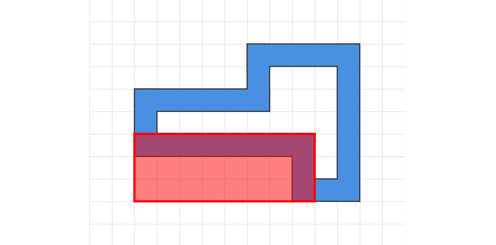
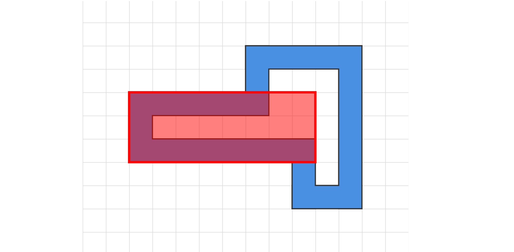
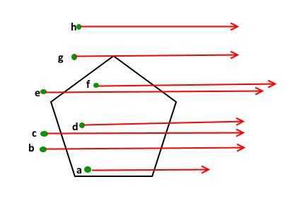

## Day 9: Movie Theater

### Part 1

``` /apply/ /components/
You slide down the firepole in the corner of the playground and land in the North Pole base movie theater!

The movie theater has a big tile floor with an interesting pattern. Elves here are redecorating the theater by switching out some of the square tiles in the big grid they form. Some of the tiles are red; the Elves would like to find the largest rectangle that uses red tiles for two of its opposite corners. They even have a list of where the red tiles are located in the grid (your puzzle input).

For example:
7,1
11,1
11,7
9,7
9,5
2,5
2,3
7,3

Showing red tiles as # and other tiles as ., the above arrangement of red tiles would look like this:
..............
.......#...#..
..............
..#....#......
..............
..#......#....
..............
.........#.#..
..............

You can choose any two red tiles as the opposite corners of your rectangle; your goal is to find the largest rectangle possible.

For example, you could make a rectangle (shown as O) with an area of 24 between 2,5 and 9,7:
..............
.......#...#..
..............
..#....#......
..............
..OOOOOOOO....
..OOOOOOOO....
..OOOOOOOO.#..
..............

Or, you could make a rectangle with area 35 between 7,1 and 11,7:
..............
.......OOOOO..
.......OOOOO..
..#....OOOOO..
.......OOOOO..
..#....OOOOO..
.......OOOOO..
.......OOOOO..
..............

You could even make a thin rectangle with an area of only 6 between 7,3 and 2,3:
..............
.......#...#..
..............
..OOOOOO......
..............
..#......#....
..............
.........#.#..
..............

Ultimately, the largest rectangle you can make in this example has area 50. One way to do this is between 2,5 and 11,1:
..............
..OOOOOOOOOO..
..OOOOOOOOOO..
..OOOOOOOOOO..
..OOOOOOOOOO..
..OOOOOOOOOO..
..............
.........#.#..
..............

Using two red tiles as opposite corners, what is the largest area of any rectangle you can make?
```

```text title="9/problem/input.txt" /apply/ /components/
97579,50266
97579,51480
97846,51480
97846,52706
98052,52706
98052,53936
98137,53936
98137,55152
97997,55152
97997,56381
97963,56381
97963,57477
97049,57477
97049,58747
97282,58747
97282,59822
96478,59822
96478,61106
96671,61106
96671,62191
96023,62191
96023,63337
95644,63337
95644,64707
95972,64707
95972,65699
95104,65699
95104,66797
94586,66797
94586,68211
94861,68211
94861,69116
93866,69116
93866,70156
93229,70156
93229,71410
93036,71410
93036,72281
92079,72281
92079,73403
91614,73403
91614,74739
91494,74739
91494,75404
90254,75404
90254,76881
90295,76881
90295,77673
89289,77673
89289,78482
88336,78482
88336,79349
87481,79349
87481,80291
86727,80291
86727,81699
86510,81699
86510,82235
85280,82235
85280,83220
84558,83220
84558,84018
83640,84018
83640,84692
82609,84692
82609,86114
82262,86114
82262,86410
80905,86410
80905,87231
80012,87231
80012,88400
79382,88400
79382,88576
77995,88576
77995,89838
77399,89838
77399,90455
76339,90455
76339,91070
75281,91070
75281,91344
74027,91344
74027,91996
73003,91996
73003,92501
71899,92501
71899,93002
70796,93002
70796,93733
69798,93733
69798,94130
68646,94130
68646,94277
67400,94277
67400,94745
66287,94745
66287,95898
65402,95898
65402,96077
64174,96077
64174,96361
62985,96361
62985,96350
61724,96350
61724,96813
60587,96813
60587,97412
59467,97412
59467,97010
58154,97010
58154,97335
56980,97335
56980,97200
55743,97200
55743,98273
54636,98273
54636,97934
53380,97934
53380,98294
52178,98294
52178,97494
50937,97494
50937,97700
49733,97700
49733,97488
48530,97488
48530,97888
47302,97888
47302,98177
46059,98177
46059,97703
44879,97703
44879,97874
43630,97874
43630,97749
42411,97749
42411,97257
41256,97257
41256,97013
40063,97013
40063,96407
38956,96407
38956,96030
37806,96030
37806,95851
36602,95851
36602,96150
35236,96150
35236,94954
34352,94954
34352,95323
32924,95323
32924,94055
32115,94055
32115,94269
30708,94269
30708,93208
29853,93208
29853,92698
28758,92698
28758,92112
27701,92112
27701,92044
26354,92044
26354,91135
25474,91135
25474,90761
24275,90761
24275,90036
23291,90036
23291,89649
22072,89649
22072,88140
21662,88140
21662,87422
20696,87422
20696,86865
19595,86865
19595,86175
18590,86175
18590,85744
17340,85744
17340,84539
16797,84539
16797,83894
15723,83894
15723,82636
15279,82636
15279,81721
14491,81721
14491,81227
13210,81227
13210,80084
12680,80084
12680,78999
12099,78999
12099,77908
11544,77908
11544,77342
10242,77342
10242,76053
9982,76053
9982,75289
8916,75289
8916,74172
8405,74172
8405,72917
8159,72917
8159,72055
7195,72055
7195,70820
6946,70820
6946,69988
5847,69988
5847,68743
5639,68743
5639,67528
5394,67528
5394,66576
4462,66576
4462,65253
4544,65253
4544,64136
4046,64136
4046,62837
4165,62837
4165,61863
3101,61863
3101,60674
2802,60674
2802,59318
3333,59318
3333,58159
2962,58159
2962,56941
2928,56941
2928,55820
2160,55820
2160,54586
2245,54586
2245,53392
1891,53392
1891,52167
1941,52167
1941,50938
2448,50938
2448,50249
94532,50249
94532,48504
1681,48504
1681,47275
1624,47275
1624,46125
2619,46125
2619,44916
2641,44916
2641,43701
2658,43701
2658,42480
2685,42480
2685,41291
2931,41291
2931,39994
2659,39994
2659,38860
3187,38860
3187,37702
3576,37702
3576,36617
4199,36617
4199,35414
4408,35414
4408,34093
4300,34093
4300,33186
5369,33186
5369,31975
5598,31975
5598,30988
6373,30988
6373,29761
6594,29761
6594,28444
6671,28444
6671,27493
7495,27493
7495,26289
7839,26289
7839,25648
9157,25648
9157,24641
9818,24641
9818,23474
10238,23474
10238,22250
10603,22250
10603,21290
11357,21290
11357,20255
12014,20255
12014,19623
13168,19623
13168,18647
13889,18647
13889,17708
14657,17708
14657,16804
15467,16804
15467,15737
16118,15737
16118,14941
17045,14941
17045,14192
18011,14192
18011,13400
18934,13400
18934,12282
19595,12282
19595,11487
20532,11487
20532,11402
21988,11402
21988,10734
22995,10734
22995,9652
23731,9652
23731,9449
25038,9449
25038,8202
25709,8202
25709,7640
26797,7640
26797,7094
27892,7094
27892,7082
29245,7082
29245,6291
30212,6291
30212,5725
31293,5725
31293,5621
32560,5621
32560,4577
33465,4577
33465,4208
34633,4208
34633,3834
35798,3834
35798,3895
37086,3895
37086,3782
38308,3782
38308,3191
39413,3191
39413,3106
40636,3106
40636,2677
41791,2677
41791,2835
43044,2835
43044,2490
44219,2490
44219,1980
45388,1980
45388,1885
46606,1885
46606,1646
47818,1646
47818,2319
49058,2319
49058,1769
50269,1769
50269,1914
51487,1914
51487,1757
52717,1757
52717,1702
53949,1702
53949,2630
55085,2630
55085,2202
56359,2202
56359,2958
57476,2958
57476,2534
58781,2534
58781,3160
59899,3160
59899,2866
61215,2866
61215,3346
62358,3346
62358,4241
63370,4241
63370,4286
64624,4286
64624,5077
65636,5077
65636,5167
66890,5167
66890,5700
67983,5700
67983,5679
69313,5679
69313,6191
70426,6191
70426,6991
71396,6991
71396,7525
72490,7525
72490,8378
73407,8378
73407,8727
74607,8727
74607,9811
75363,9811
75363,9772
76835,9772
76835,10589
77759,10589
77759,11238
78798,11238
78798,12479
79380,12479
79380,13122
80414,13122
80414,13493
81696,13493
81696,14508
82428,14508
82428,15349
83308,15349
83308,16540
83836,16540
83836,16792
85328,16792
85328,17978
85844,17978
85844,19249
86227,19249
86227,19814
87445,19814
87445,20785
88181,20785
88181,21742
88936,21742
88936,22872
89443,22872
89443,23549
90627,23549
90627,24629
91214,24629
91214,25751
91724,25751
91724,27149
91717,27149
91717,28050
92599,28050
92599,29010
93402,29010
93402,30154
93837,30154
93837,31262
94346,31262
94346,32317
94995,32317
94995,33591
95077,33591
95077,34656
95723,34656
95723,35874
95920,35874
95920,37029
96309,37029
96309,38307
96224,38307
96224,39411
96818,39411
96818,40696
96591,40696
96591,41811
97206,41811
97206,42935
97906,42935
97906,44141
98144,44141
98144,45449
97381,45449
97381,46606
98117,46606
98117,47835
97977,47835
97977,49047
98248,49047
98248,50266
```

Long story short, we have to choose a pair of points that together create the largest rectangle.

The formula for calculating the area of a rectangle formed with vertice $A(x_A, y_A)$ and $B(x_B, y_B)$ is:

$$
  S = (|x_A - x_B| + 1) \cdot (|y_A - y_B| + 1)
$$

We will be using the simplest solution to tackle this challenge: Brute-force every single pair of vertices and find the largest rectangle that we can create.

```asm title="9/solution/solver.asm" showLineNumbers{1} /apply/ /components/
; ----------------------------------------------------------------------
; Component: Solver
; Args: None

solver:
    push r12 
    push r13
    push r14
    push r15 

    xor r14, r14 
    mov r15, qword [points_cnt]

.outer_loop:
    cmp r14, r15
    je .done_outer

    mov r12, r14    
    inc r12
    mov r13, qword [points_cnt]

.inner_loop:
    cmp r12, r13  
    je .done_inner 

    mov rdi, qword [points_x + r12 * 8] 
    mov rsi, qword [points_y + r12 * 8] 
    mov rdx, qword [points_x + r14 * 8] 
    mov rcx, qword [points_y + r14 * 8] 
    call get_size 

    cmp qword [result], rax
    jge .continue_inner

    mov qword [result], rax

.continue_inner:
    inc r12
    jmp .inner_loop

.done_inner:
    inc r14
    jmp .outer_loop
    
.done_outer:
    pop r15
    pop r14
    pop r13
    pop r12
    ret
```

We finish the rest of the implementation for the first part with the remaining components.

```asm title="9/solution/solve.asm" showLineNumbers{1} /apply/ /components/
section .data
    filename db "../problem/input.txt", 0

section .bss
    input resb 100000
    output resb 20
    result resq 1

    points_x resq 1000 
    points_y resq 1000

    points_cnt resq 1

section .text
    global _start

_start:
    ; Open input file 
    mov rax, 2
    mov rdi, filename 
    xor rsi, rsi
    xor rdx, rdx
    syscall
    mov rbx, rax

    ; Read input file 
    xor rax, rax
    mov rdi, rbx 
    mov rsi, input
    mov rdx, 100000
    syscall

    ; Close the file
    mov rax, 3
    mov rdi, rbx
    syscall

    ; Split the lines and process them one by one
    mov r8, input
    mov r9, input
    mov qword [result], 0
    mov qword [points_cnt], 0

reader:
    movzx rax, byte [r9]
    test rax, rax 
    je process_last_line

    cmp rax, 10
    je process_line 

    inc r9 
    jmp reader

process_line:
    mov rdi, r8
    call save_point 

    inc r9
    mov r8, r9
    jmp reader

process_last_line:
    cmp r8, r9
    je print_output

    mov rdi, r8
    call save_point

    call solver

print_output:
    ; Print result to stdout 
    mov rdi, qword [result] 
    call print_int

    ; Exit the program
    mov rax, 60
    xor rdi, rdi
    syscall

; ----------------------------------------------------------------------
; Component: Atoi (String to Int) conversion
; Args: rdi
; Ret: rax = atoi(rdi)
; Terminate if any byte is not in range [0-9]

atoi:
    xor rax, rax

.convert:
    movzx rsi, byte [rdi]
    test rsi, rsi 
    je .atoi_done

    cmp rsi, 10
    je .atoi_done

    cmp rsi, '0'
    jl .atoi_done 

    cmp rsi, '9'
    jg .atoi_done 

    sub rsi, '0'
    imul rax, 10
    add rax, rsi 

    inc rdi 
    jmp .convert

.atoi_done:
    ret 

; ----------------------------------------------------------------------
; Component: Print Integer
; Args: rdi

print_int:
    mov rax, rdi
    mov rcx, output
    add rcx, 19
    mov byte [rcx], 10
    mov rbx, 10

.loop:
    dec rcx
    xor rdx, rdx
    div rbx
    add dl, '0'
    mov [rcx], dl
    test rax, rax
    jnz .loop

    ; Calculate length
    mov rdx, output
    add rdx, 20
    sub rdx, rcx

    ; Print
    mov rax, 1
    mov rdi, 1
    mov rsi, rcx
    syscall
    ret

; ----------------------------------------------------------------------
; Component: Save Point
; Args: rdi

save_point:
    push r15

    mov r15, rdi 
    call atoi
    mov rbx, qword [points_cnt]
    mov qword [points_x + rbx * 8], rax

.find_y:
    movzx rax, byte [r15]
    inc r15
    cmp rax, ','
    je .save_y

    jmp .find_y

.save_y:
    mov rdi, r15
    call atoi
    mov rbx, qword [points_cnt]
    mov qword [points_y + rbx * 8], rax

    add qword [points_cnt], 1

.done_save_point:
    pop r15
    ret

; ----------------------------------------------------------------------
; Component: Get Rectangle Size
; Args: rdi, rsi, rdx, rcx
; Ret: rax = (|rdi - rdx| + 1) * (|rsi - rcx| + 1)

get_size:
    mov rax, rdi 
    sub rax, rdx 
    cmp rax, 0
    jge .get_y

    neg rax
    inc rax

.get_y:
    mov rbx, rsi 
    sub rbx, rcx 
    cmp rbx, 0
    jge .calculate_size

    neg rbx
    inc rbx

.calculate_size:
    mul rbx
    ret

; ----------------------------------------------------------------------
; Component: Solver
; Args: None

solver:
    push r12 
    push r13
    push r14
    push r15 

    xor r14, r14 
    mov r15, qword [points_cnt]

.outer_loop:
    cmp r14, r15
    je .done_outer

    mov r12, r14    
    inc r12
    mov r13, qword [points_cnt]

.inner_loop:
    cmp r12, r13  
    je .done_inner 

    mov rdi, qword [points_x + r12 * 8] 
    mov rsi, qword [points_y + r12 * 8] 
    mov rdx, qword [points_x + r14 * 8] 
    mov rcx, qword [points_y + r14 * 8] 
    call get_size 

    cmp qword [result], rax
    jge .continue_inner

    mov qword [result], rax

.continue_inner:
    inc r12
    jmp .inner_loop

.done_inner:
    inc r14
    jmp .outer_loop
    
.done_outer:
    pop r15
    pop r14
    pop r13
    pop r12
    ret
```

The largest rectangle that can be created by two vertices has an area of `4737096935`.

### Part 2

``` /apply/ /components/
The Elves just remembered: they can only switch out tiles that are red or green. So, your rectangle can only include red or green tiles.

In your list, every red tile is connected to the red tile before and after it by a straight line of green tiles. The list wraps, so the first red tile is also connected to the last red tile. Tiles that are adjacent in your list will always be on either the same row or the same column.

Using the same example as before, the tiles marked X would be green:
..............
.......#XXX#..
.......X...X..
..#XXXX#...X..
..X........X..
..#XXXXXX#.X..
.........X.X..
.........#X#..
..............

In addition, all of the tiles inside this loop of red and green tiles are also green. So, in this example, these are the green tiles:
..............
.......#XXX#..
.......XXXXX..
..#XXXX#XXXX..
..XXXXXXXXXX..
..#XXXXXX#XX..
.........XXX..
.........#X#..
..............

The remaining tiles are never red nor green.

The rectangle you choose still must have red tiles in opposite corners, but any other tiles it includes must now be red or green. This significantly limits your options.

For example, you could make a rectangle out of red and green tiles with an area of 15 between 7,3 and 11,1:
..............
.......OOOOO..
.......OOOOO..
..#XXXXOOOOO..
..XXXXXXXXXX..
..#XXXXXX#XX..
.........XXX..
.........#X#..
..............

Or, you could make a thin rectangle with an area of 3 between 9,7 and 9,5:
..............
.......#XXX#..
.......XXXXX..
..#XXXX#XXXX..
..XXXXXXXXXX..
..#XXXXXXOXX..
.........OXX..
.........OX#..
..............

The largest rectangle you can make in this example using only red and green tiles has area 24. One way to do this is between 9,5 and 2,3:
..............
.......#XXX#..
.......XXXXX..
..OOOOOOOOXX..
..OOOOOOOOXX..
..OOOOOOOOXX..
.........XXX..
.........#X#..
..............

Using two red tiles as opposite corners, what is the largest area of any rectangle you can make using only red and green tiles?
```

Now the real challenge arises: The input vertices form a polygon based on their initial order, and we have to select the largest rectangle - created by two vertices - that resides completely in the polygon.

My initial approach was to apply **Bounding-box** check - for each of the rectangles, it is only valid if no polygon edge cuts through our rectangle.

We implement the check for each edge of the polygon by verifying if any of the following conditions is met:
- The edge strictly spans above the rectangle.
- The edge strictly spans below the rectangle.
- The edge strictly spans to the left of the rectangle.
- The edge strictly spans to the right of the rectangle.

In that case, the edge cannot overlap the rectangle, which is considered *safe*. If every edge is *safe*, the rectangle can be selected.

```asm title="9/solution/check_edges_valid.asm" showLineNumbers{1} /apply/ /components/
; ----------------------------------------------------------------------
; Component: Check edges valid
; Args: rdi, rdx, rsi, rcx
; Ret: Check if any edge overlaps the rectangle

check_edges_valid:
    push r10
    push r11
    push r12
    push r13
    push r14
    push r15

    xor r10, r10
    mov r11, [points_cnt]

.edge_loop:
    cmp r10, r11
    je .edges_safe

    mov r12, r10
    inc r12
    cmp r12, r11
    jl .no_wrap

    xor r12, r12

.no_wrap:
    mov r8, [points_x + r10 * 8]
    mov r9, [points_x + r12 * 8]
    
    call get_min_max

    cmp r9, rdi
    jle .next_edge
    cmp r8, rdx
    jge .next_edge

    mov r13, [points_y + r10 * 8]
    mov r14, [points_y + r12 * 8]

    call get_min_max

    cmp r14, rsi
    jle .next_edge
    cmp r13, rcx
    jge .next_edge

    jmp .edges_fail

.next_edge:
    inc r10
    jmp .edge_loop

.edges_fail:
    pop r15
    pop r14
    pop r13
    pop r12
    pop r11
    pop r10
    xor rax, rax
    ret

.edges_safe:
    pop r15
    pop r14
    pop r13
    pop r12
    pop r11
    pop r10
    mov rax, 1
    ret
```

The initial solution for the problem was the following snippet.

```asm title="9/solution/solve.asm" showLineNumbers{1} /apply/ /components/
section .data
    filename db "../problem/input.txt", 0

section .bss
    input resb 100000
    output resb 20
    result resq 1

    points_x resq 1000 
    points_y resq 1000

    points_cnt resq 1

section .text
    global _start

_start:
    ; Open input file 
    mov rax, 2
    mov rdi, filename 
    xor rsi, rsi
    xor rdx, rdx
    syscall
    mov rbx, rax

    ; Read input file 
    xor rax, rax
    mov rdi, rbx 
    mov rsi, input
    mov rdx, 100000
    syscall

    ; Close the file
    mov rax, 3
    mov rdi, rbx
    syscall

    ; Split the lines and process them one by one
    mov r8, input
    mov r9, input
    mov qword [result], 0
    mov qword [points_cnt], 0

reader:
    movzx rax, byte [r9]
    test rax, rax 
    je process_last_line

    cmp rax, 10
    je process_line 

    inc r9 
    jmp reader

process_line:
    mov rdi, r8
    call save_point 

    inc r9
    mov r8, r9
    jmp reader

process_last_line:
    cmp r8, r9
    je print_output

    mov rdi, r8
    call save_point

    call solver

print_output:
    ; Print result to stdout 
    mov rdi, qword [result] 
    call print_int

    ; Exit the program
    mov rax, 60
    xor rdi, rdi
    syscall

; ----------------------------------------------------------------------
; Component: Atoi (String to Int) conversion
; Args: rdi
; Ret: rax = atoi(rdi)
; Terminate if any byte is not in range [0-9]

atoi:
    xor rax, rax

.convert:
    movzx rsi, byte [rdi]
    test rsi, rsi 
    je .atoi_done

    cmp rsi, 10
    je .atoi_done

    cmp rsi, '0'
    jl .atoi_done 

    cmp rsi, '9'
    jg .atoi_done 

    sub rsi, '0'
    imul rax, 10
    add rax, rsi 

    inc rdi 
    jmp .convert

.atoi_done:
    ret 

; ----------------------------------------------------------------------
; Component: Print Integer
; Args: rdi

print_int:
    mov rax, rdi
    mov rcx, output
    add rcx, 19
    mov byte [rcx], 10
    mov rbx, 10

.loop:
    dec rcx
    xor rdx, rdx
    div rbx
    add dl, '0'
    mov [rcx], dl
    test rax, rax
    jnz .loop

    ; Calculate length
    mov rdx, output
    add rdx, 20
    sub rdx, rcx

    ; Print
    mov rax, 1
    mov rdi, 1
    mov rsi, rcx
    syscall
    ret

; ----------------------------------------------------------------------
; Component: Save Point
; Args: rdi

save_point:
    push r15

    mov r15, rdi 
    call atoi
    mov rbx, qword [points_cnt]
    mov qword [points_x + rbx * 8], rax

.find_y:
    movzx rax, byte [r15]
    inc r15
    cmp rax, ','
    je .save_y

    jmp .find_y

.save_y:
    mov rdi, r15
    call atoi
    mov rbx, qword [points_cnt]
    mov qword [points_y + rbx * 8], rax

    add qword [points_cnt], 1

.done_save_point:
    pop r15
    ret

; ----------------------------------------------------------------------
; Component: Get Rectangle Size
; Args: rdi, rsi, rdx, rcx
; Ret: rax = (|rdi - rdx| + 1) * (|rsi - rcx| + 1)

get_size:
    mov rax, rdi 
    sub rax, rdx 
    cmp rax, 0
    jge .get_y

    neg rax
    inc rax

.get_y:
    mov rbx, rsi 
    sub rbx, rcx 
    cmp rbx, 0
    jge .calculate_size

    neg rbx
    inc rbx

.calculate_size:
    mul rbx
    ret

; ----------------------------------------------------------------------
; Component: Sort 2 values
; Args: r8, r9 
; Ret: r8, r9 in ascending order

get_min_max:
    cmp r8, r9
    jle .ordered
    xchg r8, r9
.ordered:
    ret

; ----------------------------------------------------------------------
; Component: Check edges valid
; Args: rdi, rdx, rsi, rcx
; Ret: Check if any edge overlaps the rectangle

check_edges_valid:
    push r10
    push r11
    push r12
    push r13
    push r14
    push r15

    xor r10, r10
    mov r11, [points_cnt]

.edge_loop:
    cmp r10, r11
    je .edges_safe

    mov r12, r10
    inc r12
    cmp r12, r11
    jl .no_wrap

    xor r12, r12

.no_wrap:
    mov r8, [points_x + r10 * 8]
    mov r9, [points_x + r12 * 8]
    
    call get_min_max

    cmp r9, rdi
    jle .next_edge
    cmp r8, rdx
    jge .next_edge

    mov r13, [points_y + r10 * 8]
    mov r14, [points_y + r12 * 8]

    call get_min_max

    cmp r14, rsi
    jle .next_edge
    cmp r13, rcx
    jge .next_edge

    jmp .edges_fail

.next_edge:
    inc r10
    jmp .edge_loop

.edges_fail:
    pop r15
    pop r14
    pop r13
    pop r12
    pop r11
    pop r10
    xor rax, rax
    ret

.edges_safe:
    pop r15
    pop r14
    pop r13
    pop r12
    pop r11
    pop r10
    mov rax, 1
    ret

; ----------------------------------------------------------------------
; Component: Solver
; Args: None

solver:
    push r12 
    push r13
    push r14
    push r15 

    xor r14, r14
    mov r15, qword [points_cnt]

.outer_loop:
    cmp r14, r15
    je .done_outer

    mov r12, r14
    inc r12

.inner_loop:
    cmp r12, r15
    je .done_inner 

    mov r8, [points_x + r14 * 8]
    mov r9, [points_x + r12 * 8]
    call get_min_max
    mov rdi, r8
    mov rdx, r9

    mov r8, [points_y + r14 * 8]
    mov r9, [points_y + r12 * 8]
    call get_min_max
    mov rsi, r8
    mov rcx, r9

    call check_edges_valid
    test rax, rax
    jz .continue_inner

    call get_size
    
    cmp rax, [result]
    jle .continue_inner
    mov [result], rax

.continue_inner:
    inc r12
    jmp .inner_loop

.done_inner:
    inc r14
    jmp .outer_loop
    
.done_outer:
    pop r15
    pop r14
    pop r13
    pop r12
    ret
```

It indeed gives the right answer for the example - `24` (funni thing is the algorithm also produces the correct answer for the real testcase 🤷‍♂️). But when I tried to plot the polygon and the selected rectangle, I immediately recognized the flaw within the algorithm.


<figcaption class="text-center text-muted-foreground" style="margin-top: -10px">
yep, it looks very wrong :)
</figcaption>

Due to how we validate a rectangle (just by checking overlapping edges), the above rectangle is still considered to be OK and is selected, while the actual solution should be the following:


<figcaption class="text-center text-muted-foreground" style="margin-top: -10px">
should look like this
</figcaption>

Then, I started to think about applying [Ray-Casting Algorithm](https://rosettacode.org/wiki/Ray-casting_algorithm) for the center of the chosen rectangle to ensure it lies within the polygon.

*"The Ray-Casting Algorithm is a way of checking if a point lies inside a polygon, by drawing a horizontal ray from the point to the outside of the polygon and count how many times the ray intersects the polygon's edges. If the number of intersections is odd, the point is inside the polygon; if even, it is outside." - GeeksForGeeks.*


<figcaption class="text-center text-muted-foreground" style="margin-top: -10px">
Ray-Casting Algorithm (Source: GeeksForGeeks)
</figcaption>

```asm title="9/solution/ray_casting.asm" showLineNumbers{1} /apply/ /components/
 ----------------------------------------------------------------------
; Component: Ray-Casting Algorithm
; Args: rdi, rsi
; Ret: Check if the point lies inside the polygon.

ray_casting:
    push rbx
    push r12
    push r13
    push r14
    push r15

    xor r14, r14
    mov r15, qword [points_cnt]
    xor rbx, rbx

.loop:
    cmp rbx, r15
    je .done

    mov r12, rbx
    inc r12
    cmp r12, r15
    jl .load_coords
    
    xor r12, r12

.load_coords:
    mov r8, qword [points_x + rbx * 8]
    mov r9, qword [points_y + rbx * 8]

    mov r10, qword [points_x + r12 * 8]
    mov r11, qword [points_y + r12 * 8]

    xor rcx, rcx
    cmp r9, rsi
    setg cl

    xor rdx, rdx
    cmp r11, rsi
    setg dl

    cmp cl, dl
    je .next_iter 

    mov rax, r10
    sub rax, r8

    mov rcx, rsi
    sub rcx, r9

    imul rax, rcx

    mov rcx, r11
    sub rcx, r9
    
    cqo
    idiv rcx

    add rax, r8

    cmp rdi, rax
    jge .next_iter

    xor r14, 1

.next_iter:
    inc rbx
    jmp .loop

.done:
    mov rax, r14
    pop r15
    pop r14
    pop r13
    pop r12
    pop rbx
    ret
```

We update the initial solution as follow.

```asm title="9/solution/solve.asm" showLineNumbers{1} /apply/ /components/
section .data
    filename db "../problem/input.txt", 0

section .bss
    input resb 100000
    output resb 20
    result resq 1

    points_x resq 1000 
    points_y resq 1000

    points_cnt resq 1

section .text
    global _start

_start:
    ; Open input file 
    mov rax, 2
    mov rdi, filename 
    xor rsi, rsi
    xor rdx, rdx
    syscall
    mov rbx, rax

    ; Read input file 
    xor rax, rax
    mov rdi, rbx 
    mov rsi, input
    mov rdx, 100000
    syscall

    ; Close the file
    mov rax, 3
    mov rdi, rbx
    syscall

    ; Split the lines and process them one by one
    mov r8, input
    mov r9, input
    mov qword [result], 0
    mov qword [points_cnt], 0

reader:
    movzx rax, byte [r9]
    test rax, rax 
    je process_last_line

    cmp rax, 10
    je process_line 

    inc r9 
    jmp reader

process_line:
    mov rdi, r8
    call save_point 

    inc r9
    mov r8, r9
    jmp reader

process_last_line:
    cmp r8, r9
    je print_output

    mov rdi, r8
    call save_point

    call solver

print_output:
    ; Print result to stdout 
    mov rdi, qword [result] 
    call print_int

    ; Exit the program
    mov rax, 60
    xor rdi, rdi
    syscall

; ----------------------------------------------------------------------
; Component: Atoi (String to Int) conversion
; Args: rdi
; Ret: rax = atoi(rdi)
; Terminate if any byte is not in range [0-9]

atoi:
    xor rax, rax

.convert:
    movzx rsi, byte [rdi]
    test rsi, rsi 
    je .atoi_done

    cmp rsi, 10
    je .atoi_done

    cmp rsi, '0'
    jl .atoi_done 

    cmp rsi, '9'
    jg .atoi_done 

    sub rsi, '0'
    imul rax, 10
    add rax, rsi 

    inc rdi 
    jmp .convert

.atoi_done:
    ret 

; ----------------------------------------------------------------------
; Component: Print Integer
; Args: rdi

print_int:
    mov rax, rdi
    mov rcx, output
    add rcx, 19
    mov byte [rcx], 10
    mov rbx, 10

.loop:
    dec rcx
    xor rdx, rdx
    div rbx
    add dl, '0'
    mov [rcx], dl
    test rax, rax
    jnz .loop

    ; Calculate length
    mov rdx, output
    add rdx, 20
    sub rdx, rcx

    ; Print
    mov rax, 1
    mov rdi, 1
    mov rsi, rcx
    syscall
    ret

; ----------------------------------------------------------------------
; Component: Save Point
; Args: rdi

save_point:
    push r15

    mov r15, rdi 
    call atoi
    mov rbx, qword [points_cnt]
    mov qword [points_x + rbx * 8], rax

.find_y:
    movzx rax, byte [r15]
    inc r15
    cmp rax, ','
    je .save_y

    jmp .find_y

.save_y:
    mov rdi, r15
    call atoi
    mov rbx, qword [points_cnt]
    mov qword [points_y + rbx * 8], rax

    add qword [points_cnt], 1

.done_save_point:
    pop r15
    ret

; ----------------------------------------------------------------------
; Component: Get Rectangle Size
; Args: rdi, rsi, rdx, rcx
; Ret: rax = (|rdi - rdx| + 1) * (|rsi - rcx| + 1)

get_size:
    mov rax, rdi 
    sub rax, rdx 
    cmp rax, 0
    jge .get_y

    neg rax
    inc rax

.get_y:
    mov rbx, rsi 
    sub rbx, rcx 
    cmp rbx, 0
    jge .calculate_size

    neg rbx
    inc rbx

.calculate_size:
    mul rbx
    ret

; ----------------------------------------------------------------------
; Component: Sort 2 values
; Args: r8, r9 
; Ret: r8, r9 in ascending order

get_min_max:
    cmp r8, r9
    jle .ordered
    xchg r8, r9
.ordered:
    ret

; ----------------------------------------------------------------------​ [!code ++]
; Component: Ray-Casting Algorithm​ [!code ++]
; Args: rdi, rsi​ [!code ++]
; Ret: Check if the point lies inside the polygon. [!code ++]
​;[!code ++]
ray_casting:​;[!code ++]
    push rbx​;[!code ++]
    push r12​;[!code ++]
    push r13​;[!code ++]
    push r14​;[!code ++]
    push r15​;[!code ++]
​;[!code ++]
    xor r14, r14​;[!code ++]
    mov r15, qword [points_cnt]​;[!code ++]
    xor rbx, rbx​;[!code ++]
​;[!code ++]
.loop:​;[!code ++]
    cmp rbx, r15​;[!code ++]
    je .done​;[!code ++]
​;[!code ++]
    mov r12, rbx​;[!code ++]
    inc r12​;[!code ++]
    cmp r12, r15​;[!code ++]
    jl .load_coords​;[!code ++]
​;[!code ++]
    xor r12, r12​;[!code ++]
​;[!code ++]
.load_coords:​;[!code ++]
    mov r8, qword [points_x + rbx * 8]​;[!code ++]
    mov r9, qword [points_y + rbx * 8]​;[!code ++]
​;[!code ++]
    mov r10, qword [points_x + r12 * 8]​;[!code ++]
    mov r11, qword [points_y + r12 * 8]​;[!code ++]
​;[!code ++]
    xor rcx, rcx​;[!code ++]
    cmp r9, rsi​;[!code ++]
    setg cl​;[!code ++]
​;[!code ++]
    xor rdx, rdx​;[!code ++]
    cmp r11, rsi​;[!code ++]
    setg dl​;[!code ++]
​;[!code ++]
    cmp cl, dl​;[!code ++]
    je .next_iter ​;[!code ++]
​;[!code ++]
    mov rax, r10​;[!code ++]
    sub rax, r8​;[!code ++]
​;[!code ++]
    mov rcx, rsi​;[!code ++]
    sub rcx, r9​;[!code ++]
​;[!code ++]
    imul rax, rcx​;[!code ++]
​;[!code ++]
    mov rcx, r11​;[!code ++]
    sub rcx, r9​;[!code ++]
​;[!code ++]    
    cqo​;[!code ++]
    idiv rcx​;[!code ++]
​;[!code ++]
    add rax, r8​;[!code ++]
​;[!code ++]
    cmp rdi, rax​;[!code ++]
    jge .next_iter​;[!code ++]
​;[!code ++]
    xor r14, 1​;[!code ++]
​;[!code ++]
.next_iter:​;[!code ++]
    inc rbx​;[!code ++]
    jmp .loop​;[!code ++]
​;[!code ++]
.done:​;[!code ++]
    mov rax, r14​;[!code ++]
    pop r15​;[!code ++]
    pop r14​;[!code ++]
    pop r13​;[!code ++]
    pop r12​;[!code ++]
    pop rbx​;[!code ++]
    ret​;[!code ++]
​;[!code ++]
; ----------------------------------------------------------------------
; Component: Check edges valid
; Args: rdi, rdx, rsi, rcx
; Ret: Check if any edge overlaps the rectangle

check_edges_valid:
    push r10
    push r11
    push r12
    push r13
    push r14
    push r15

    xor r10, r10
    mov r11, [points_cnt]

.edge_loop:
    cmp r10, r11
    je .edges_safe

    mov r12, r10
    inc r12
    cmp r12, r11
    jl .no_wrap

    xor r12, r12

.no_wrap:
    mov r8, [points_x + r10 * 8]
    mov r9, [points_x + r12 * 8]
    
    call get_min_max

    cmp r9, rdi
    jle .next_edge
    cmp r8, rdx
    jge .next_edge

    mov r13, [points_y + r10 * 8]
    mov r14, [points_y + r12 * 8]

    call get_min_max

    cmp r14, rsi
    jle .next_edge
    cmp r13, rcx
    jge .next_edge

    jmp .edges_fail

.next_edge:
    inc r10
    jmp .edge_loop

.edges_fail:
    pop r15
    pop r14
    pop r13
    pop r12
    pop r11
    pop r10
    xor rax, rax
    ret

.edges_safe:
    pop r15
    pop r14
    pop r13
    pop r12
    pop r11
    pop r10
    mov rax, 1
    ret

; ----------------------------------------------------------------------
; Component: Solver
; Args: None

solver:
    push r12 
    push r13
    push r14
    push r15 

    xor r14, r14
    mov r15, qword [points_cnt]

.outer_loop:
    cmp r14, r15
    je .done_outer

    mov r12, r14
    inc r12

.inner_loop:
    cmp r12, r15
    je .done_inner 

    mov r8, [points_x + r14 * 8]
    mov r9, [points_x + r12 * 8]
    call get_min_max
    mov rdi, r8
    mov rdx, r9

    mov r8, [points_y + r14 * 8]
    mov r9, [points_y + r12 * 8]
    call get_min_max
    mov rsi, r8
    mov rcx, r9

    call check_edges_valid
    test rax, rax
    jz .continue_inner

    push rdi ​;[!code ++]
    push rdx​;[!code ++]
    push rsi ​;[!code ++]
    push rcx​;[!code ++]
​;[!code ++]
    add rdi, rdx ​;[!code ++]
    mov rax, rdi ​;[!code ++]
    mov rdi, 2 ​;[!code ++]
    xor rdx, rdx​;[!code ++]
    div rdi ​;[!code ++]
    mov rdi, rax​;[!code ++]
​;[!code ++]
    add rsi, rcx  ​;[!code ++]  
    mov rax, rsi​;[!code ++]
    mov rsi, 2​;[!code ++]
    xor rdx, rdx​;[!code ++]
    div rsi​;[!code ++]
    mov rsi, rax​;[!code ++]
​;[!code ++]
    call ray_casting​;[!code ++]
    pop rcx​;[!code ++]
    pop rsi​;[!code ++]
    pop rdx​;[!code ++]
    pop rdi​;[!code ++]
​;[!code ++]
    test rax, rax​;[!code ++]
    jz .continue_inner​;[!code ++]
​;[!code ++]
    call get_size
    
    cmp rax, [result]
    jle .continue_inner
    mov [result], rax

.continue_inner:
    inc r12
    jmp .inner_loop

.done_inner:
    inc r14
    jmp .outer_loop
    
.done_outer:
    pop r15
    pop r14
    pop r13
    pop r12
    ret
```

This passes several edge cases that I created myself too, and the result for this part is `1644094530`.

### Appendix

The test case for the second part of this problem is very weak in my opition as mutiple testcases can still be found to disprove our updated solution.

*(also it is quite hard to implement a perfect solution to this problem...)*

I will hand the task of finding such edge cases over to the viewers who are reading this line :D