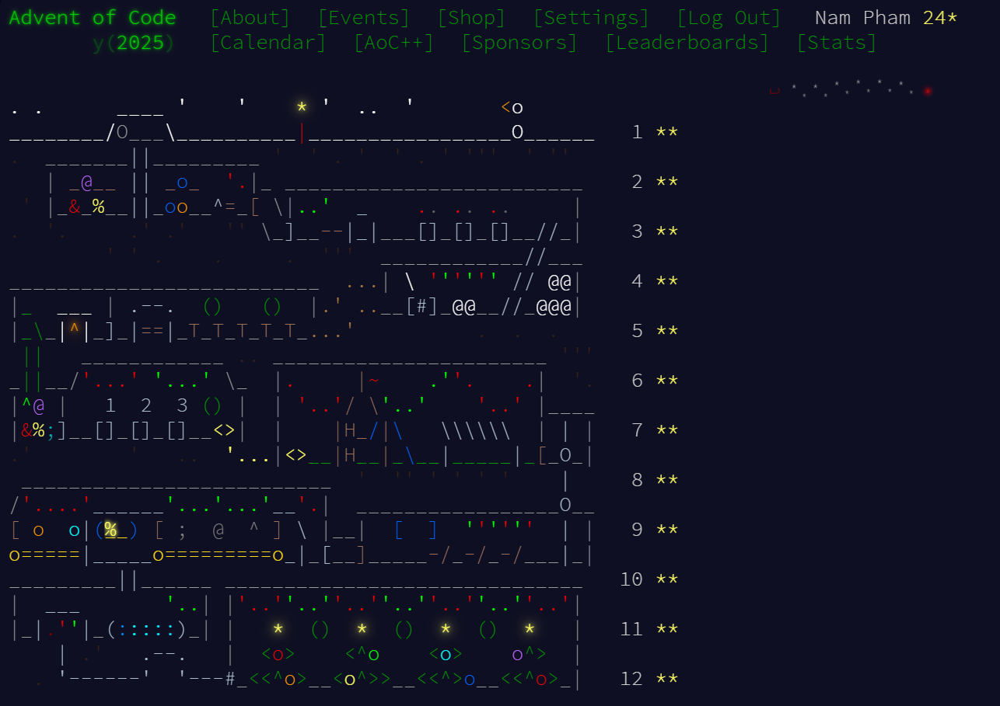

import day1 from 'images/day1.jpg'
import day2 from 'images/day2.jpg'
import day3 from 'images/day3.jpg'
import day4 from 'images/day4.jpg'
import day5 from 'images/day5.jpg'
import day6 from 'images/day6.jpg'
import day7 from 'images/day7.jpg'
import day8 from 'images/day8.jpg'
import day9 from 'images/day9.jpg'
import day10 from 'images/day10.jpg'
import day11 from 'images/day11.jpg'
import day12 from 'images/day12.jpg'
import { Icon } from 'astro-icon/components'

export const options = [
  {
    title: 'Day 1',
    description: 'Secret Entrance',
    image: day1.src,
  },
  {
    title: 'Day 2',
    description: 'Gift Shop',
    image: day2.src,
  },
  {
    title: 'Day 3',
    description: 'Lobby',
    image: day3.src,
  },
  {
    title: 'Day 4',
    description: 'Printing Department',
    image: day4.src,
  },

  {
    title: 'Day 5',
    description: 'Cafeteria',
    image: day5.src,
  },
{
    title: 'Day 6',
    description: 'Trash Compactor',
    image: day6.src,
  },
{
    title: 'Day 7',
    description: 'Laboratories',
    image: day7.src,
  },
{
    title: 'Day 8',
    description: 'Playground',
    image: day8.src,
  },
{
    title: 'Day 9',
    description: 'Movie Theater',
    image: day9.src,
  },
{
    title: 'Day 10',
    description: 'Factory',
    image: day10.src,
  },
{
    title: 'Day 11',
    description: 'Reactor',
    image: day11.src,
  },
{
    title: 'Day 12',
    description: 'Christmas Tree Farm',
    image: day12.src,
  },

]

## Overview

Over the last two weeks, I participated in `Advent of Code 2025` — a series of daily programming puzzles that get progressively harder. This year, the event consists of **12** challenges in total, each challenge has two parts (except the very last one) where the second part is more advanced than the previous one.

Usually, I spend my time reversing x86 binaries for CTFs. For Advent of Code 2025, I decided to write them instead. I challenged myself to solve all problems entirely in [x86 Assembly](https://en.wikipedia.org/wiki/X86_assembly_language), **without the help of LLMs**.

I will provide my thought process during the challenges, and explain how I constructed the algorithms using x86 Assembly in the sections below. 

**Disclaimer:** Due to the large amount of challenges within one post, I will try my best to only briefly explain each x86 Assembly snippet, not in detail. Methodology of constructing the solutions will be more focused than the execution. 

All of the solutions can be found [here](https://github.com/FazeCT/Advent-of-Code-2025).

*(link to the event: https://adventofcode.com/2025/)*

## Preparation 

To better address the problems, here are some x86 Assembly snippets that can be reused in multiple challenges. Personally, I am more familiar with [Intel syntax](https://en.wikipedia.org/wiki/X86_assembly_language#Syntax) compared to [AT&T syntax](https://en.wikipedia.org/wiki/X86_assembly_language#Syntax), hence I chose to program the solutions in Intel syntax and used [NASM](https://www.nasm.us) to compile.

### Input reading

To get the input for the problem, we utilize chain of syscalls to read the input file, store the input into a null-initialized buffer and close the file.

Each line of input will be separated by an endline `\n`, and passed as argument to the `solver` function.

Some variables are also introduced in `.bss` section, in which `input` is for storing the challenge input, `result` is for storing the challenge result, and `output` is used for integer printing that will be explained in the next part.

```asm title="templates/input_read.asm" showLineNumbers{1} /apply/ /components/
section .data
    filename db "../problem/input.txt", 0

section .bss
    input resb 100000
    output resb 20
    result resq 1

section .text
    global _start

_start:
    ; Open input file 
    mov rax, 2
    mov rdi, filename 
    xor rsi, rsi
    xor rdx, rdx
    syscall
    mov rbx, rax

    ; Read input file 
    xor rax, rax
    mov rdi, rbx 
    mov rsi, input
    mov rdx, 100000
    syscall

    ; Close the file
    mov rax, 3
    mov rdi, rbx
    syscall

    ; Split the ranges and process them one by one
    mov r8, input
    mov r9, input 
    mov qword [result], 0

reader:
    movzx rax, byte [r9]
    test rax, rax 
    je process_last_line

    cmp rax, 10
    je process_line 

    inc r9 
    jmp reader

process_line:
    mov rdi, r8
    call solver 

    inc r9
    mov r8, r9
    jmp reader

process_last_line:
    cmp r8, r9
    je print_output

    mov rdi, r8
    call solver

print_output:
    ; Print result to stdout 
    mov rdi, qword [result] 
    call print_int

    ; Exit the program
    mov rax, 60
    xor rdi, rdi
    syscall
```

### Integer printing 

We generally can not directly print an integer from a register or a memory region. To resolve this, a helper is used to convert the integer to string and then print it to the screen. The default length of converted string is `20`.

```asm title="templates/print_int.asm" showLineNumbers{1} /apply/ /components/
; ----------------------------------------------------------------------
; Component: Print Integer
; Args: rdi

print_int:
    mov rax, rdi
    mov rcx, output
    add rcx, 19
    mov byte [rcx], 10
    mov rbx, 10

.loop:
    dec rcx
    xor rdx, rdx
    div rbx
    add dl, '0'
    mov [rcx], dl
    test rax, rax
    jnz .loop

    ; Calculate length
    mov rdx, output
    add rdx, 20
    sub rdx, rcx

    ; Print
    mov rax, 1
    mov rdi, 1
    mov rsi, rcx
    syscall
    ret
```

### ASCII to Integer (Atoi)

Another helper to convert strings of digits into integers is also being used a lot to solve the problems. Just a clarification, the function is terminated right away when any byte that is not in range `[0-9]` is detected.

```asm title="templates/atoi.asm" showLineNumbers{1} /apply/ /components/
; ----------------------------------------------------------------------
; Component: Atoi (String to Int) conversion
; Args: rdi
; Ret: rax = atoi(rdi)
; Terminate if any byte is not in range [0-9]

atoi:
    xor rax, rax

.convert:
    movzx rsi, byte [rdi]
    test rsi, rsi 
    je .atoi_done

    cmp rsi, 10
    je .atoi_done

    cmp rsi, '0'
    jl .atoi_done 

    cmp rsi, '9'
    jg .atoi_done 

    sub rsi, '0'
    imul rax, 10
    add rax, rsi 

    inc rdi 
    jmp .convert

.atoi_done:
    ret
```

## Challenges 

<div class="not-prose grid grid-cols-1 sm:grid-cols-3 gap-6 my-8">
  <a 
    href="/blog/adventofcode-2025/challenge-1"
    class="group relative flex flex-col overflow-hidden rounded-xl border bg-card hover:bg-accent/10 hover:border-primary/50 transition-all duration-300"
  >
    <div class="invisible !h-0"> ### Day 1: Secret Entrance</div>

    <div class="aspect-[4/3] overflow-hidden">
      
    </div>

    <div class="flex flex-col p-4">
      <h3 class="text-xl font-semibold tracking-tight mb-1" id="">Day 1</h3>
      <p class="text-sm text-muted-foreground">Secret Entrance</p>
      <div class="absolute bottom-4 right-4 opacity-0 transform translate-x-2 group-hover:opacity-100 group-hover:translate-x-0 transition-all duration-300">
        <Icon name="lucide:arrow-right" class="h-4 w-4" />
      </div>
    </div>
  </a>

  <a 
    href="/blog/adventofcode-2025/challenge-2"
    class="group relative flex flex-col overflow-hidden rounded-xl border bg-card hover:bg-accent/10 hover:border-primary/50 transition-all duration-300"
  >
    <div class="invisible !h-0"> ### Day 2: Gift Shop</div>

    <div class="aspect-[4/3] overflow-hidden">
      
    </div>

    <div class="flex flex-col p-4">
      <h3 class="text-xl font-semibold tracking-tight mb-1" id="">Day 2</h3>
      <p class="text-sm text-muted-foreground">Gift Shop</p>
      <div class="absolute bottom-4 right-4 opacity-0 transform translate-x-2 group-hover:opacity-100 group-hover:translate-x-0 transition-all duration-300">
        <Icon name="lucide:arrow-right" class="h-4 w-4" />
      </div>
    </div>
  </a>

    <a 
    href="/blog/adventofcode-2025/challenge-3"
    class="group relative flex flex-col overflow-hidden rounded-xl border bg-card hover:bg-accent/10 hover:border-primary/50 transition-all duration-300"
  >
    <div class="invisible !h-0"> ### Day 3: Lobby</div>

    <div class="aspect-[4/3] overflow-hidden">
      
    </div>

    <div class="flex flex-col p-4">
      <h3 class="text-xl font-semibold tracking-tight mb-1" id="">Day 3</h3>
      <p class="text-sm text-muted-foreground">Lobby</p>
      <div class="absolute bottom-4 right-4 opacity-0 transform translate-x-2 group-hover:opacity-100 group-hover:translate-x-0 transition-all duration-300">
        <Icon name="lucide:arrow-right" class="h-4 w-4" />
      </div>
    </div>
  </a>

  <a 
    href="/blog/adventofcode-2025/challenge-4"
    class="group relative flex flex-col overflow-hidden rounded-xl border bg-card hover:bg-accent/10 hover:border-primary/50 transition-all duration-300"
  >
    <div class="invisible !h-0"> ### Day 4: Printing Department</div>

    <div class="aspect-[4/3] overflow-hidden">
      
    </div>

    <div class="flex flex-col p-4">
      <h3 class="text-xl font-semibold tracking-tight mb-1" id="">Day 4</h3>
      <p class="text-sm text-muted-foreground">Printing Department</p>
      <div class="absolute bottom-4 right-4 opacity-0 transform translate-x-2 group-hover:opacity-100 group-hover:translate-x-0 transition-all duration-300">
        <Icon name="lucide:arrow-right" class="h-4 w-4" />
      </div>
    </div>
  </a>

  <a 
    href="/blog/adventofcode-2025/challenge-5"
    class="group relative flex flex-col overflow-hidden rounded-xl border bg-card hover:bg-accent/10 hover:border-primary/50 transition-all duration-300"
  >
    <div class="invisible !h-0"> ### Day 5: Cafeteria</div>

    <div class="aspect-[4/3] overflow-hidden">
      
    </div>

    <div class="flex flex-col p-4">
      <h3 class="text-xl font-semibold tracking-tight mb-1" id="">Day 5</h3>
      <p class="text-sm text-muted-foreground">Cafeteria</p>
      <div class="absolute bottom-4 right-4 opacity-0 transform translate-x-2 group-hover:opacity-100 group-hover:translate-x-0 transition-all duration-300">
        <Icon name="lucide:arrow-right" class="h-4 w-4" />
      </div>
    </div>
  </a>
<a 
    href="/blog/adventofcode-2025/challenge-6"
    class="group relative flex flex-col overflow-hidden rounded-xl border bg-card hover:bg-accent/10 hover:border-primary/50 transition-all duration-300"
  >
    <div class="invisible !h-0"> ### Day 6: Trash Compactor</div>

    <div class="aspect-[4/3] overflow-hidden">
      
    </div>

    <div class="flex flex-col p-4">
      <h3 class="text-xl font-semibold tracking-tight mb-1" id="">Day 6</h3>
      <p class="text-sm text-muted-foreground">Trash Compactor</p>
      <div class="absolute bottom-4 right-4 opacity-0 transform translate-x-2 group-hover:opacity-100 group-hover:translate-x-0 transition-all duration-300">
        <Icon name="lucide:arrow-right" class="h-4 w-4" />
      </div>
    </div>
  </a>
<a 
    href="/blog/adventofcode-2025/challenge-7"
    class="group relative flex flex-col overflow-hidden rounded-xl border bg-card hover:bg-accent/10 hover:border-primary/50 transition-all duration-300"
  >
    <div class="invisible !h-0"> ### Day 7: Laboratories</div>

    <div class="aspect-[4/3] overflow-hidden">
      
    </div>

    <div class="flex flex-col p-4">
      <h3 class="text-xl font-semibold tracking-tight mb-1" id="">Day 7</h3>
      <p class="text-sm text-muted-foreground">Laboratories</p>
      <div class="absolute bottom-4 right-4 opacity-0 transform translate-x-2 group-hover:opacity-100 group-hover:translate-x-0 transition-all duration-300">
        <Icon name="lucide:arrow-right" class="h-4 w-4" />
      </div>
    </div>
  </a>
<a 
    href="/blog/adventofcode-2025/challenge-8"
    class="group relative flex flex-col overflow-hidden rounded-xl border bg-card hover:bg-accent/10 hover:border-primary/50 transition-all duration-300"
  >
    <div class="invisible !h-0"> ### Day 8: Playground</div>

    <div class="aspect-[4/3] overflow-hidden">
      
    </div>

    <div class="flex flex-col p-4">
      <h3 class="text-xl font-semibold tracking-tight mb-1" id="">Day 8</h3>
      <p class="text-sm text-muted-foreground">Playground</p>
      <div class="absolute bottom-4 right-4 opacity-0 transform translate-x-2 group-hover:opacity-100 group-hover:translate-x-0 transition-all duration-300">
        <Icon name="lucide:arrow-right" class="h-4 w-4" />
      </div>
    </div>
  </a>
<a 
    href="/blog/adventofcode-2025/challenge-9"
    class="group relative flex flex-col overflow-hidden rounded-xl border bg-card hover:bg-accent/10 hover:border-primary/50 transition-all duration-300"
  >
    <div class="invisible !h-0"> ### Day 9: Movie Theater</div>

    <div class="aspect-[4/3] overflow-hidden">
      
    </div>

    <div class="flex flex-col p-4">
      <h3 class="text-xl font-semibold tracking-tight mb-1" id="">Day 9</h3>
      <p class="text-sm text-muted-foreground">Movie Theater</p>
      <div class="absolute bottom-4 right-4 opacity-0 transform translate-x-2 group-hover:opacity-100 group-hover:translate-x-0 transition-all duration-300">
        <Icon name="lucide:arrow-right" class="h-4 w-4" />
      </div>
    </div>
  </a>
<a 
    href="/blog/adventofcode-2025/challenge-10"
    class="group relative flex flex-col overflow-hidden rounded-xl border bg-card hover:bg-accent/10 hover:border-primary/50 transition-all duration-300"
  >
    <div class="invisible !h-0"> ### Day 10: Factory</div>

    <div class="aspect-[4/3] overflow-hidden">
      
    </div>

    <div class="flex flex-col p-4">
      <h3 class="text-xl font-semibold tracking-tight mb-1" id="">Day 10</h3>
      <p class="text-sm text-muted-foreground">Factory</p>
      <div class="absolute bottom-4 right-4 opacity-0 transform translate-x-2 group-hover:opacity-100 group-hover:translate-x-0 transition-all duration-300">
        <Icon name="lucide:arrow-right" class="h-4 w-4" />
      </div>
    </div>
  </a>
<a 
    href="/blog/adventofcode-2025/challenge-11"
    class="group relative flex flex-col overflow-hidden rounded-xl border bg-card hover:bg-accent/10 hover:border-primary/50 transition-all duration-300"
  >
    <div class="invisible !h-0"> ### Day 11: Reactor</div>

    <div class="aspect-[4/3] overflow-hidden">
      
    </div>

    <div class="flex flex-col p-4">
      <h3 class="text-xl font-semibold tracking-tight mb-1" id="">Day 11</h3>
      <p class="text-sm text-muted-foreground">Reactor</p>
      <div class="absolute bottom-4 right-4 opacity-0 transform translate-x-2 group-hover:opacity-100 group-hover:translate-x-0 transition-all duration-300">
        <Icon name="lucide:arrow-right" class="h-4 w-4" />
      </div>
    </div>
  </a>
<a 
    href="/blog/adventofcode-2025/challenge-12"
    class="group relative flex flex-col overflow-hidden rounded-xl border bg-card hover:bg-accent/10 hover:border-primary/50 transition-all duration-300"
  >
    <div class="invisible !h-0"> ### Day 12: Christmas Tree Farm</div>

    <div class="aspect-[4/3] overflow-hidden">
      
    </div>

    <div class="flex flex-col p-4">
      <h3 class="text-xl font-semibold tracking-tight mb-1" id="">Day 12</h3>
      <p class="text-sm text-muted-foreground">Christmas Tree Farm</p>
      <div class="absolute bottom-4 right-4 opacity-0 transform translate-x-2 group-hover:opacity-100 group-hover:translate-x-0 transition-all duration-300">
        <Icon name="lucide:arrow-right" class="h-4 w-4" />
      </div>
    </div>
  </a>

</div>

*(yes I vibe-designed all of these thumbnails with Gemini...)*

## In a nutshell



The hardest challenge in my opinion is [Day 10: Factory, Part 2](/blog/adventofcode-2025/challenge-10#part-2). Along with that, parsing grids and graphs were also a nightmare using x86 Assembly.

Nonetheless, I really enjoyed solving all the challenges this year ~~with x86 Assembly~~.