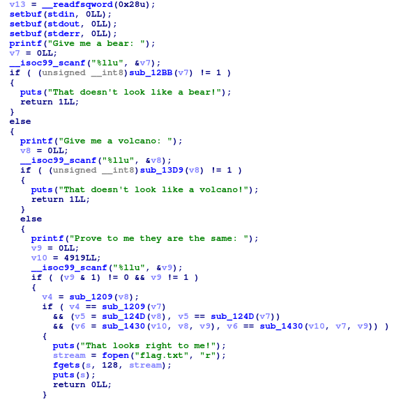
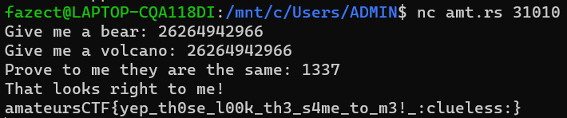
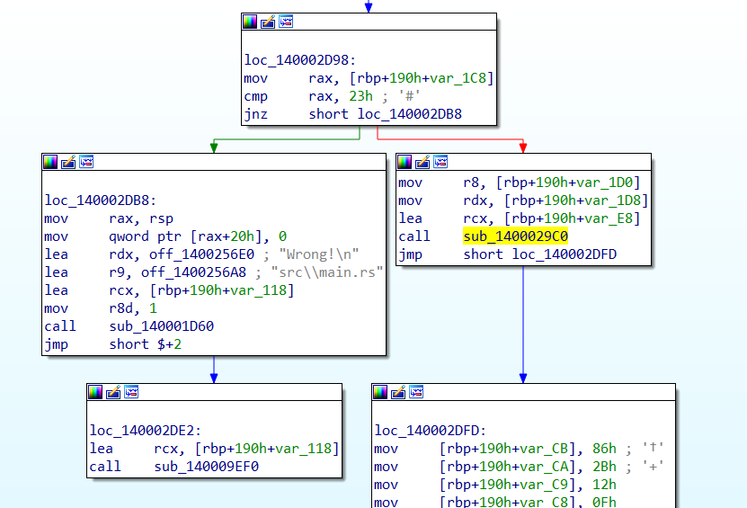
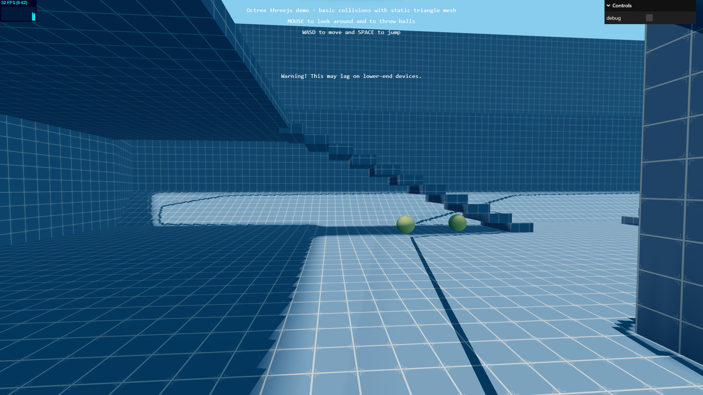
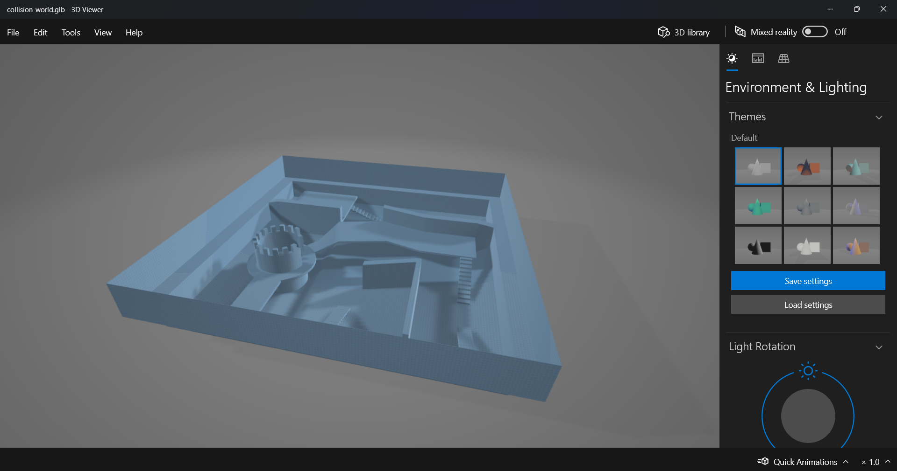
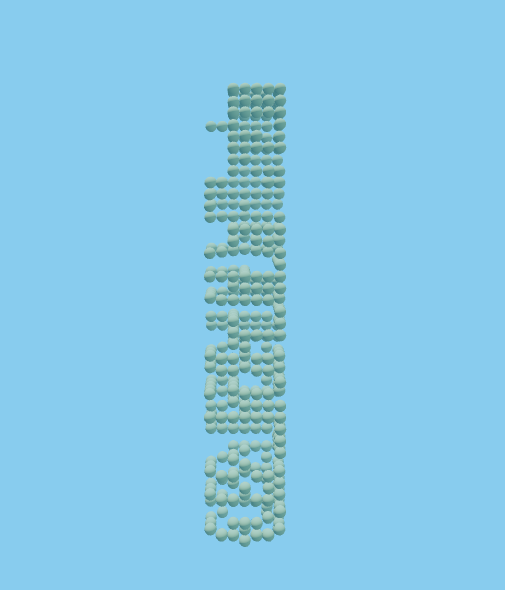
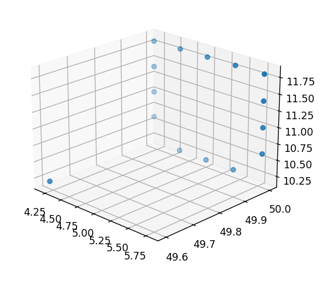

## Overview

Last weekend, I had the opportunity to participate in the event with my team, `NEW JEANS FC` (aka `thehackerscrew`), where I did all the reverse engineering challenges!

I want to give a big shoutout to the authors, and especially `flocto`, for creating such cool reverse challenges!

All of the challenges' binaries can be found here: [Click me!](https://github.com/FazeCT/ctf/tree/main/amateursCTF%202023)

## volcano


> * **Given file:** `volcano`
> * **Description:** Inspired by recent "traumatic" events.

We are given a binary file named `volcano`. Load it in your favorite tool (mine was `IDA`) and get ready for our first task!



The program prompts user for `3` numeral inputs.

First input is checked using the below function:

```c showLineNumbers{1} /apply/ /components/
    _BOOL8 __fastcall check_first(unsigned __int64 input)
    {
    if ( (input & 1) != 0 )
        return 0LL;
    if ( input % 3 != 2 )
        return 0LL;
    if ( input % 5 != 1 )
        return 0LL;
    if ( input % 7 == 3 )
        return input % 0x6D == 55;
    return 0LL;
    }
```

By using some math (or even trial and error), we can easily point out that there are a lot of solutions to this in the form of `18476 + 22890 * n`.

Second input is checked using the below function:

```c showLineNumbers{1} /apply/ /components/
    _BOOL8 __fastcall check_second(unsigned __int64 input)
    {
    unsigned __int64 v2; // [rsp+8h] [rbp-10h]

    v2 = 0LL;
    while ( input )
    {
        v2 += input & 1;
        input >>= 1;
    }
    return v2 > 0x10 && v2 <= 0x1A;
    }
```

This function maybe harder for analyzing than the first, but it is just counting number of set bits (`1` bits) of the input.

Third input is used in several functions to compare first two inputs.

And to solve this challenge, it is really simple to just write a script to find a 64-bit number that satisfies both constraints, and I used this script below to get it.

```py title="solve/solver.py" showLineNumbers{1} /apply/ /components/
    for i in range(18476, 2 ** 64, 22890):
        k = bin(i).count('1')
        if 0x10 < k <= 0x14:
            print(i)
```

From the list of results, I chose `26264942966` to send for the first two inputs, and randomly chose `1337` for the third input.



Flag is: `amateursCTF{yep_th0se_l00k_th3_s4me_to_m3!_:clueless:}`

## rusteze


> * **Given file:** `rusteze`
> * **Description:** Get rid of all your Rust rust with this brand new Rust-eze™ de-ruster. Flag is `amateursCTF{[a-zA-Z0-9_]+}`.

We are provided a binary named `rusteze`. Again, load it using a decompiler of your choice and seek for the main function.

The program wants us to input in a string with length `38`. Then it initiates `2` arrays also of size `38` each (I will call them `a` and `b`).

The input is checked like this: 

`assert rol(input[i] ^ a[i], 2) == b[i]`

Knowing that, I dumped out `2` arrays and used this script to solve for the input.

```py title="solve/solver.py" showLineNumbers{1} /apply/ /components/
    def solve(a, b):
        k = bin(b)[2:].rjust(8, '0')
        k = k[-2:] + k[:-2]
        print(end=chr(a ^ int(k, 2)))


    arr_1 = [0] * 100
    arr_2 = [0] * 100
    arr_1[0] = 39
    arr_1[1] = -105
    arr_1[2] = 87
    arr_1[4] = -87
    arr_1[5] = 117
    arr_1[6] = 102
    arr_1[7] = 62
    arr_1[8] = 27
    arr_1[9] = 99
    arr_1[10] = -29
    arr_1[11] = -96
    arr_1[12] = 5
    arr_1[13] = 115
    arr_1[14] = 89
    arr_1[15] = -5
    arr_1[16] = 10
    arr_1[17] = 67
    arr_1[18] = -113
    arr_1[19] = -32
    arr_1[20] = -70
    arr_1[21] = -64
    arr_1[22] = 84
    arr_1[23] = -103
    arr_1[24] = 6
    arr_1[25] = -65
    arr_1[26] = -97
    arr_1[27] = 47
    arr_1[28] = -60
    arr_1[29] = -86
    arr_1[30] = -90
    arr_1[31] = 116
    arr_1[32] = 30
    arr_1[33] = -35
    arr_1[34] = -105
    arr_1[35] = 34
    arr_1[36] = -19
    arr_1[37] = -59

    arr_2[0] = 25
    arr_2[1] = -21
    arr_2[2] = -40
    arr_2[3] = ord('V')
    arr_2[4] = ord('3')
    arr_2[3 + 3] = 80
    arr_2[4 + 3] = 53
    arr_2[5 + 3] = 97
    arr_2[6 + 3] = -36
    arr_2[7 + 3] = -106
    arr_2[8 + 3] = 111
    arr_2[9 + 3] = -75
    arr_2[10 + 3] = 13
    arr_2[11 + 3] = -92
    arr_2[12 + 3] = 122
    arr_2[13 + 3] = 85
    arr_2[14 + 3] = -24
    arr_2[15 + 3] = -2
    arr_2[16 + 3] = 86
    arr_2[17 + 3] = -105
    arr_2[18 + 3] = -34
    arr_2[19 + 3] = -99
    arr_2[20 + 3] = -81
    arr_2[21 + 3] = -44
    arr_2[22 + 3] = 71
    arr_2[23 + 3] = -81
    arr_2[24 + 3] = -63
    arr_2[25 + 3] = -62
    arr_2[26 + 3] = 106
    arr_2[27 + 3] = 90
    arr_2[28 + 3] = -84
    arr_2[29 + 3] = -79
    arr_2[30 + 3] = -94
    arr_2[31 + 3] = -118
    arr_2[32 + 3] = 89
    arr_2[33 + 3] = 82
    arr_2[34 + 3] = -30

    for i in range(38):
        solve(arr_1[i] & 0xFF, arr_2[i] & 0xFF)

    # ama•eursCTF{h0pe_y0u_w3r3nt_t00_ru5ty}
```

There was something wrong with the first part of the flag but it doesn't matter, and I was also lazy to recheck it.

Flag is: `amateursCTF{h0pe_y0u_w3r3nt_t00_ru5ty}`

## trick question


> * **Given file:** `trick-question.pyc`
> * **Description:** Which one do you hate more: decompiling pycs or reading Python bytecode disassembly? Just kidding that's a trick question. Run with Python version `3.10`. Flag is `amateursCTF{[a-zA-Z0-9_]+}`.

For this challenge, we are given a python bytecode file. I used [pycdc](https://github.com/zrax/pycdc) as always to decompile the `.pyc` file and got this python source.

```py title="src/output.py" caption="Decompiled using pycdc" showLineNumbers{1} /apply/ /components/
    # Source Generated with Decompyle++
    # File: trick-question.pyc (Python 3.10)

    b64decode = lambda x: id.__self__.__dict__['exec'](id.__self__.__dict__['__import__']('base64').b64decode(x))
    r = [
        0,
        0,
        1,
        [...]
        0,
        0,
        0]
    x = [
        'gIHByaW50KCJJbmNvcnJlY3QuIik=',
        'gcHJpbnQoIkNvcnJlY3QhIikKZWxzZToKIC',
        'CIgogOpkiIgozZhxmZgUGa0BiclRnbFJCK0VHculGKrNWZoNGImlmCp0HZpBiOnQWansHIsUGZvNGKps2Ylh2YoUGc5RHI9',
        [...]
        'ya1x4MDNyXHgwZXRceD',
        'xXHg4NVx4MDJceDE5XHgwMGRceD',
        'Y2hlY2sgPSBsYW1iZGE6Tm9uZQpjb2RlID0gdHlwZShjaGVjay5fX2NvZGVfXykoMSwgMCwgMCwgNiwgNSwgNjcsIGInfFx4MDBkXHgwMGRceD']
    for i in range(len(r)):
        if r[i]:
            x[i] = x[i][::-1]
    b64decode('A'.join(x[::-1]))
```

Next thing I did was taking the result of this `'A'.join(x[::-1])` and threw it in an online decoder so that we can get raw code instead of running it (a good online decoder can be found here: [CyberChef](https://gchq.github.io/CyberChef/)). I got this as a result:

```py title="src/output_2.py" caption="Decoded using Cyberchef" showLineNumbers{1} /apply/ /components/
    check = lambda:None
    code = type(check.__code__)(1, 0, 0, 6, 5, 67, b'|\x00d\x00d\x01\x85\x02\x19\x00d\x02k\x03r\x0et\x00j\x01j\x02d\x03\x19\x00S\x00|\x00d\x04\x19\x00d\x05k\x03r\x1at\x00j\x01j\x02d\x03\x19\x00S\x00|\x00d\x01d\x04\x85\x02\x19\x00}\x00t\x00j\x01j\x02d\x06\x19\x00|\x00\x83\x01d\x07k\x03r0t\x00j\x01j\x02d\x03\x19\x00S\x00g\x00}\x01t\x00j\x01j\x02d\x08\x19\x00|\x00\x83\x01D\x00]\r\\\x02}\x02}\x03|\x03d\tk\x02rG|\x01\xa0\x03|\x02\xa1\x01\x01\x00q:|\x01g\x00d\n\xa2\x01k\x03rTt\x00j\x01j\x02d\x03\x19\x00S\x00|\x00\xa0\x04\xa1\x00\xa0\x05d\x0b\xa1\x01}\x00|\x00d\x0c\x19\x00d\x00d\x00d\x04\x85\x03\x19\x00d\rk\x03rlt\x00j\x01j\x02d\x03\x19\x00S\x00|\x00d\x0e\x19\x00d\x0c\x19\x00|\x00d\x0e\x19\x00d\x0e\x19\x00\x17\x00|\x00d\x0e\x19\x00d\x0f\x19\x00\x18\x00|\x00d\x0e\x19\x00d\x0e\x19\x00|\x00d\x0e\x19\x00d\x0f\x19\x00\x17\x00|\x00d\x0e\x19\x00d\x0c\x19\x00\x18\x00|\x00d\x0e\x19\x00d\x0f\x19\x00|\x00d\x0e\x19\x00d\x0c\x19\x00\x17\x00|\x00d\x0e\x19\x00d\x0e\x19\x00\x18\x00f\x03d\x10k\x03r\xa9t\x00j\x01j\x02d\x03\x19\x00S\x00t\x00j\x01j\x02d\x11\x19\x00d\x12\x83\x01\xa0\x06|\x00d\x0f\x19\x00\xa1\x01\xa0\x07\xa1\x00d\x13k\x03r\xc0t\x00j\x01j\x02d\x03\x19\x00S\x00t\x00j\x01j\x02d\x11\x19\x00d\x14\x83\x01}\x04|\x04\xa0\x08|\x00d\x0f\x19\x00\xa1\x01\x01\x00t\x00j\x01j\x02d\x15\x19\x00|\x00d\x16\x19\x00\x83\x01|\x00d\x16<\x00|\x04\xa0\t|\x00d\x16\x19\x00\xa1\x01\x01\x00|\x00d\x16\x19\x00g\x00d\x17\xa2\x01k\x03r\xf0t\x00j\x01j\x02d\x03\x19\x00S\x00|\x00d\x18\x19\x00d\x19\x17\x00d\x1ak\x03r\xfet\x00j\x01j\x02d\x03\x19\x00S\x00t\x00j\x01j\x02d\x1b\x19\x00\xa0\n|\x00d\x1c\x19\x00d\x0cd\x18\x85\x02\x19\x00d\x1d\xa1\x02|\x04\xa0\x0bd\x0cd\x1e\xa1\x02A\x00d\x1fk\x03\x90\x01r\x1dt\x00j\x01j\x02d\x03\x19\x00S\x00t\x00j\x01j\x02d\x1b\x19\x00\xa0\n|\x00d\x1c\x19\x00d\x18d \x85\x02\x19\x00d\x1d\xa1\x02|\x04\xa0\x0bd\x0cd\x1e\xa1\x02A\x00d!k\x03\x90\x01r<t\x00j\x01j\x02d\x03\x19\x00S\x00t\x00j\x01j\x02d\x1b\x19\x00\xa0\n|\x00d\x1c\x19\x00d d\x01\x85\x02\x19\x00d"\x17\x00d\x1d\xa1\x02|\x04\xa0\x0bd\x0cd\x1e\xa1\x02A\x00d#k\x03\x90\x01r]t\x00j\x01j\x02d\x03\x19\x00S\x00d\x0c}\x05|\x00d$\x19\x00D\x00]\x0b}\x02|\x05d%9\x00}\x05|\x05|\x027\x00}\x05\x90\x01qct\x00j\x01j\x02d&\x19\x00|\x05\x83\x01d\'k\x03\x90\x01r\x80t\x00j\x01j\x02d\x03\x19\x00S\x00t\x00j\x01j\x02d(\x19\x00S\x00', (None, 12, 'amateursCTF{', 'False', -1, '}', 'len', 42, 'enumerate', '_', (7, 11, 13, 20, 23, 35), b'_', 0, b'sn0h7YP', 1, 2, (160, 68, 34), '__import__', 'hashlib', '4b227777d4dd1fc61c6f884f48641d02b4d121d3fd328cb08b5531fcacdabf8a', 'random', 'list', 3, (49, 89, 102, 109, 108, 52), 4, b'freebie', b'0ffreebie', 'int', 5, 'little', 4294967295, 4227810561, 8, 825199122, b'\x00', 4277086886, 6, 128, 'hex', '0x29ee69af2f3', 'True', 'Did you know? pycdc can decompile marshaled code objects. Just make sure you mention the right version!'), ('id', '__self__', '__dict__', 'append', 'encode', 'split', 'sha256', 'hexdigest', 'seed', 'shuffle', 'from_bytes', 'randint'), ('input', 'underscores', 'i', 'x', 'r', 'c'), '', 'check', 3, b'\x10\x01\x0c\x01\x0c\x01\x0c\x01\x0c\x01\x14\x02\x0c\x01\x04\x02\x18\x01\x08\x01\n\x01\x02\x80\x0c\x01\x0c\x01\x0e\x02\x16\x01\x0c\x01n\x03\x0c\x01"\x02\x0c\x01\x10\x02\x0e\x01\x18\x01\x0e\x01\x10\x02\x0c\x01\x10\x02\x0c\x012\x02\x0c\x012\x02\x0c\x016\x02\x0c\x01\x04\x02\x0c\x01\x08\x01\x0c\x01\x16\x02\x0c\x01\x0c\x02', (), ())

    check = type(check)(code, {'id': id})
    if check(input("Enter the flag: ")):
        print("Correct!")
    else:
        print("Incorrect.")
```

There is a hint in the source above of what we should do next. which is `Did you know? pycdc can decompile marshaled code objects`. So we dump out the marshaled code object, then use `pycdc` again to decompile it.

```py title="src/output_3.py" caption="Decompiled using pycdc" showLineNumbers{1} /apply/ /components/
    import marshal

    f = open('D:/ctf/revChalls/amateursCTF/dump.txt', 'wb')
    check = lambda:None
    code = type(check.__code__)(1, 0, 0, 6, 5, 67, b'|\x00d\x00d[...]

    f.write(marshal.dumps(code))
```

Use the below command to decompile the marshaled code object.

`./pycdc -c -v 3.10 /[Replace this with your path!]/dump.txt`

```py title="src/final_output.py" showLineNumbers{1} /apply/ /components/
    # Source Generated with Decompyle++
    # File: dump.txt (Python 3.10)

    if input[:12] != 'amateursCTF{':
        return id.__self__.__dict__['False']
    if None[-1] != '}':
        return id.__self__.__dict__['False']
    input = None[12:-1]
    if id.__self__.__dict__['len'](input) != 42:
        return id.__self__.__dict__['False']
    underscores = None
    for i, x in id.__self__.__dict__['enumerate'](input):
        if x == '_':
            underscores.append(i)
    if underscores != [
        7,
        11,
        13,
        20,
        23,
        35]:
        return id.__self__.__dict__['False']
    input = None.encode().split(b'_')
    if input[0][::-1] != b'sn0h7YP':
        return id.__self__.__dict__['False']
    if (None[1][0] + input[1][1] - input[1][2], input[1][1] + input[1][2] - input[1][0], input[1][2] + input[1][0] - input[1][1]) != (160, 68, 34):
        return id.__self__.__dict__['False']
    if None.__self__.__dict__['__import__']('hashlib').sha256(input[2]).hexdigest() != '4b227777d4dd1fc61c6f884f48641d02b4d121d3fd328cb08b5531fcacdabf8a':
        return id.__self__.__dict__['False']
    r = None.__self__.__dict__['__import__']('random')
    r.seed(input[2])
    input[3] = id.__self__.__dict__['list'](input[3])
    r.shuffle(input[3])
    if input[3] != [
        49,
        89,
        102,
        109,
        108,
        52]:
        return id.__self__.__dict__['False']
    if None[4] + b'freebie' != b'0ffreebie':
        return id.__self__.__dict__['False']
    if None.__self__.__dict__['int'].from_bytes(input[5][0:4], 'little') ^ r.randint(0, 0xFFFFFFFF) != 0xFBFF4501:
        return id.__self__.__dict__['False']
    if None.__self__.__dict__['int'].from_bytes(input[5][4:8], 'little') ^ r.randint(0, 0xFFFFFFFF) != 825199122:
        return id.__self__.__dict__['False']
    if None.__self__.__dict__['int'].from_bytes(input[5][8:12] + b'\x00', 'little') ^ r.randint(0, 0xFFFFFFFF) != 0xFEEF2AA6:
        return id.__self__.__dict__['False']
    c = None
    for i in input[6]:
        c *= 128
        c += i
    if id.__self__.__dict__['hex'](c) != '0x29ee69af2f3':
        return id.__self__.__dict__['False']
    return None.__self__.__dict__['True']
```

From this, I wrote a script to solve each part of the input.

```py title="solve/solver.py" showLineNumbers{1} /apply/ /components/
    from Crypto.Util.number import *
    import random

    flag = ['amateursCTF{']

    # Part 1:
    flag[0] += 'sn0h7YP'[::-1]

    # Part 2: (I used calculator to solve it)
    flag += [''.join(chr(i) for i in [97, 114, 51])]

    # Part 3: (I used online crackers to solve it)
    flag += ['4']

    # Part 4: (I solved this using brain lol)
    flag += ['f4m1lY']

    # Part 5:
    flag += ['0f']

    # Part 6:
    random.seed(b'4')

    x = bytearray(b'f4m1lY')
    random.shuffle(x)

    flag += [long_to_bytes(random.randint(0, 0xFFFFFFFF) ^ 0xFBFF4501)[::-1].decode() +
            long_to_bytes(random.randint(0, 0xFFFFFFFF) ^ 825199122)[::-1].decode() +
            long_to_bytes(random.randint(0, 0xFFFFFFFF) ^ 0xFEEF2AA6)[::-1].decode()]

    # Part 7:
    val = 0x29ee69af2f3
    res = ''
    while val != 0:
        res += chr(val % 128)
        val //= 128

    flag += [res[::-1]]

    print('_'.join(i for i in flag) + '}')

    # amateursCTF{PY7h0ns_ar3_4_f4m1lY_0f_N0Nv3nom0us_Sn4kes}
```

Flag is: `amateursCTF{PY7h0ns_ar3_4_f4m1lY_0f_N0Nv3nom0us_Sn4kes}`

## headache


> * **Given file:** `headache`
> * **Description:** Ugh... my head hurts... Flag is `amateursCTF{[a-zA-Z0-9_]+}`

We are provided with a binary named `headache`. Using decompilers, we can see that the input should has length of `61`. Dug a bit further into the checker, I see that this binary is a `self-modifying binary`.

> ### What is self-modifying binary
> * A binary that self constructs during runtime (modifies its content to turn raw data into opcodes).

```c showLineNumbers{1} /apply/ /components/
    __int64 __fastcall sub_401290(_BYTE *a1)
    {
    _DWORD *v2; // rsi

    if ( (*a1 ^ a1[25]) != 86 )
        return 0LL;
    v2 = &loc_4012A4;
    do
        *v2++ ^= 0xEA228DE6;
    while ( *(v2 - 1) != -366834202 );
    return ((__int64 (*)(void))loc_4012A4)();
    }
```

So, how exactly this program works? Firstly, we can see that it checks whether `input[0] ^ input[25] == 0x56`. If that satisfies, the binary does some `XOR` operations to reveal new codes and call them. And after doing some debugging, I could see the scheme of this challenge.

> ### How the challenge works
> * It checks the input's character pairs by pairs using `bitwise XOR` and compares the result with a constant. If they are equal, a new code section is unlocked - which also does the same thing, and the program calls it. Doing so for a reasonable amount of times, a set of constraint for the input is built.

So how we gonna solve this? At first I was thinking of using `angr`, but I failed to do so (again, `zer0ptsCTF 2023` flashbacks if you guys have read my last blog on that CTF), so I took the looooooong path of debugging and `Z3` (which was really painful). While debugging, you can modify `ZF` runtime to skip the comparisons and come to the self-modifying parts.

And, here is the script after all that debugging. (I also cheesed the flag and guessed it without putting all constraints in to save some time).

```py title="solve/solver.py" showLineNumbers{1} /apply/ /components/
    from z3 import *

    s = Solver()
    a = [BitVec('x{}'.format(i), 8) for i in range(61)]

    for i in range(61):
        s.add(a[i] < 127)
        s.add(a[i] >= 32)
        s.add(a[i] != ord(' '))

    for i in range(12):
        s.add(a[i] == ord('amateursCTF{'[i]))
    s.add(a[-1] == ord('}'))

    s.add(a[0] ^ a[25] == 0x56)
    s.add(a[0x0E] ^ a[0x2D] == 0x1D)
    s.add(a[0x21] ^ a[0x22] == 5)
    s.add(a[0x28] ^ a[0x34] == 5)
    s.add(a[0x0C] ^ a[0x38] == 5)
    s.add(a[0x0B] ^ a[4] == 0x1e)
    [...]

    sol_count = 0
    while s.check() == sat and sol_count < 10:
        result = s.model()
        for i in range(61):
            print(end=chr(result[a[i]].as_long()))
        print()

        sol_count += 1
        cond = True
        for i in range(61):
            cond = And(cond, a[i] == result[a[i]])
        s.add(Not(cond))

    # amateursCTF{i_h4v3_a_spli77ing_headache_1_r3qu1re_m04r_sl33p}
```

Flag is: `amateursCTF{i_h4v3_a_spli77ing_headache_1_r3qu1re_m04r_sl33p}`

## CSCE221-Data Structures and Algorithms


> * **Given file:** `csce221.tar.gz`
> * **Description:** I was doing some homework for my Data Structures and Algorithms class, but my program unexpectedly crashed when I entered in my flag. Could you help me get it back? Here's the coredump and the binary, I'll even toss in the header file. Can't give out the source code though, how do I know you won't cheat off me?

For this challenge, I had an ~~unintended~~ intended solution (confirmed by the author himself that this is intended, I just took the shorter route instead) to just view the `main.coredump` file to get the flag.


Sorry `flocto` for that!

Flag is: `amateursCTF{l1nk3d_bY_4n_xor}`

> ### Appendix
> * I looked at `main` and the `header` before, and combined with the flag's content, probably the author's intended solution is to mix `bitwise XOR` and `linked list data structures`?

## jvm


> * **Given file:** `JVM.class` and `code.jvm`
> * **Description:** I heard my professor talking about some "Java Virtual Machine" and its weird gimmicks, so I took it upon myself to complete one. It wasn't even that hard? I don't know why he was complaining about it so much. Compiled with `openjdk 11.0.19`. Run with `java JVM code.jvm`.

For this problem, we have two files, `JVM.class` and `code.jvm`. View `JVM.class` in [JADX](https://github.com/skylot/jadx), we can see that this is an another `VM` reversing challenge.

My way of tackling a `VM` challenge is to first, write a quick and dirty interpreter.

```py title="solve/vm.py" showLineNumbers{1} /apply/ /components/
    vm = open("C:/Users/ADMIN/OneDrive/Desktop/temp/jvm/code.jvm", 'rb').read()
    vm = [i for i in vm]

    ls = [0] * 1024
    ls2 = [0] * 4
    i = 0
    i2 = 0
    inp_stream = 'amateursCTF{xxxxxxxxxxxxxxxxxxxxxxxxxxxxxxxx}'

    while i < len(vm):
        op = vm[i]
        if op in [0, 1, 2, 3]:
            ls2[vm[i]], ls2[vm[i + 1]] = ls2[vm[i + 1]], ls2[vm[i]]
            print('op {}: swap ls2[{}] and ls2[{}].'.format(vm[i], vm[i], vm[i + 1]))
            i += 2
        elif op == 8:
            ls2[vm[i + 1]] += vm[i + 2]
            print('op {}: ls2[{}] += {}.'.format(vm[i], vm[i + 1], vm[i + 2]))
            i += 3
        elif op == 9:
            ls2[vm[i + 1]] += ls2[vm[i + 2]]
            print('op {}: ls2[{}] += ls2[{}] = {}.'.format(vm[i], vm[i + 1], vm[i + 2], ls2[vm[i + 1]]))
            i += 3
        elif op == 12:
            ls2[vm[i + 1]] -= vm[i + 2]
            print('op {}: ls2[{}] -= {}.'.format(vm[i], vm[i + 1], vm[i + 2]))
            i += 3
        elif op == 13:
            ls2[vm[i + 1]] -= ls2[vm[i + 2]]
            print('op {}: ls2[{}] -= ls2[{}] = {}.'.format(vm[i], vm[i + 1], vm[i + 2], ls2[vm[i + 1]]))
            i += 3
        elif op == 16:
            ls2[vm[i + 1]] *= vm[i + 2]
            print('op {}: ls2[{}] *= {}.'.format(vm[i], vm[i + 1], vm[i + 2]))
            i += 3
        elif op == 17:
            ls2[vm[i + 1]] *= ls2[vm[i + 2]]
            print('op {}: ls2[{}] *= ls2[{}] = {}.'.format(vm[i], vm[i + 1], vm[i + 2], ls2[vm[i + 1]]))
            i += 3
        elif op == 20:
            ls2[vm[i + 1]] //= vm[i + 2]
            print('op {}: ls2[{}] //= {}.'.format(vm[i], vm[i + 1], vm[i + 2]))
            i += 3
        elif op == 21:
            ls2[vm[i + 1]] //= ls2[vm[i + 2]]
            print('op {}: ls2[{}] //= ls2[{}] = {}.'.format(vm[i], vm[i + 1], vm[i + 2], ls2[vm[i + 1]]))
            i += 3
        elif op == 24:
            ls2[vm[i + 1]] %= vm[i + 2]
            print('op {}: ls2[{}] %= {}.'.format(vm[i], vm[i + 1], vm[i + 2]))
            i += 3
        elif op == 25:
            ls2[vm[i + 1]] %= ls2[vm[i + 2]]
            print('op {}: ls2[{}] %= ls2[{}].'.format(vm[i], vm[i + 1], vm[i + 2]))
            i += 3
        elif op == 28:
            ls2[vm[i + 1]] <<= vm[i + 2]
            print('op {}: ls2[{}] <<= {}.'.format(vm[i], vm[i + 1], vm[i + 2]))
            i += 3
        elif op == 29:
            ls2[vm[i + 1]] <<= ls2[vm[i + 2]]
            print('op {}: ls2[{}] <<= ls2[{}].'.format(vm[i], vm[i + 1], vm[i + 2]))
            i += 3
        elif op == 31:
            ls2[vm[i + 1]] = ord(inp_stream[0])
            print('op {}: ls2[{}] = {}.'.format(vm[i], vm[i + 1], inp_stream[0]))
            inp_stream = inp_stream[1:]
            i += 2
        elif op == 32:
            i4 = i2
            i2 += 1
            ls[i4] = ord(inp_stream[0])
            print('op {}: ls[{}] = {}.'.format(vm[i], i4, inp_stream[0]))
            inp_stream = inp_stream[1:]
            i += 1
        elif op == 33:
            print('op {}: print({}).'.format(vm[i], chr(ls2[vm[i + 1]])))
            i += 2
        elif op == 34:
            i2 -= 1
            print('op {}: print({}).'.format(vm[i], chr(ls[i2])))
            i += 1
        elif op == 41:
            print('op {}: if {} == 0, i set to {}.'.format(vm[i], ls2[vm[i + 1]], vm[i + 2]))
            if ls2[vm[i + 1]] == 0:
                i = vm[i + 2]
            else:
                i += 3
        elif op == 42:
            print('op {}: if ls2[{}] = {} != 0, i set to vm[{}] = {}.'.format(vm[i], vm[i + 1], ls2[vm[i + 1]], i + 2, vm[i + 2]))
            if ls2[vm[i + 1]] != 0:
                i = vm[i + 2]
            else:
                i += 3
        elif op == 43:
            print('op {}: i set to vm[{}] = {}.'.format(vm[i], i + 1, vm[i + 1]))
            i = vm[i + 1]
        elif op == 52:
            i5 = i2
            i2 += 1
            ls[i5] = ls2[vm[i + 1]]
            print('op {}: ls[{}] = ls2[{}] = {}.'.format(vm[i], i5, vm[i + 1], ls[i5]))
            i += 2
        elif op == 53:
            i2 -= 1
            ls2[vm[i + 1]] = ls[i2]
            print('op {}: ls2[{}] = ls[{}] = {}.'.format(vm[i], vm[i + 1], i2, ls2[vm[i + 1]]))
            i += 2
        elif op == 54:
            i6 = i2
            i2 += 1
            ls[i6] = vm[i + 1]
            print('op {}: ls[{}] = vm[{}] = {}.'.format(vm[i], i6, i + 1, ls[i6]))
            i += 2
        elif op == 255:
            break
```

After some trials and errors, I could see that the `VM` wants an input of length `45`. I tried `amateursCTF{xxxxxxxxxxxxxxxxxxxxxxxxxxxxxxxx}` as an input, and got this result.

``` showLineNumbers{1} /apply/ /components/
    op 43: i set to vm[26] = 44.
    op 53: ls2[0] = ls[44] = 125.
    op 12: ls2[0] -= 125.
    op 42: if ls2[0] = 0 != 0, i set to vm[51] = 37.
    op 53: ls2[1] = ls[43] = 120.
    op 12: ls2[1] -= 9.
    op 12: ls2[1] -= 54.
    op 42: if ls2[1] = 57 != 0, i set to vm[62] = 37.
    op 54: ls[43] = vm[38] = 79.
    op 54: ls[44] = vm[40] = 78.
    op 34: print(N).
    op 34: print(O).
```

We can easily see that it is checking from our last character (which is our `}` character, and obviously I got it right). For the next character, it checks whether `char - 9 - 54 == 0`, and that evaluates to character `?`.

Knowing the algorithm, I solved each character one by one (without any script, I used `Python CLI`).

Also, there was a character that has a different checking technique, which I remember involving `2 ** 7` (left for the readers to find and solve it).

And, as we get `YES` outputted, there is our flag.

Flag is: `amateursCTF{wh4t_d0_yoU_m34n_j4v4_isnt_A_vm?}`

## rusteze 2


> * **Given file:** `rusteze-2.exe`
> * **Description:** My boss said Linux binaries wouldn't reach enough customers so I was forced to make a Windows version. Flag is `amateursCTF{[a-zA-Z0-9_]+}`.

We are given a Windows executable for this challenge. Load it in `IDA`, what I saw was a bunch of functions.

> ### Well, what should we do then?
> * Normally, we can seek for main function. But in this case, we should seek for the strings that the executable outputs.
> * We can do so via `View > Open subviews > Strings`.
> * In this executable, we have two outputs `Wrong!` and `Correct!`. By clicking on their offsets then press `X`, you can view their xrefs and quickly get to the main encrypt function.



The graph part above is our main target. First, it checks whether our input's length is `35` or not, then it calls `sub_1400029C0` for encryption.

Basically, the encryption is almost the same with `rusteze` challenge above but with a small twist, that is we have to input a `key` instead, and the flag will be in the memory of the program.

Here is how it works (with `a, b, c` are hardcoded arrays):

`assert rol(key[i] ^ a[i], 2) == b[i]`

`flag[i] = a[i] ^ c[i] ^ key[i]`

From that, we can conclude in: `flag[i] = rol(b[i], 6) ^ c[i]`.

Knowing the technique, I wrote a script to get the flag.

```py title="solve/solver.py" showLineNumbers{1} /apply/ /components/
    def rol(a):
        k = bin(a)[2:].rjust(8, '0')
        k = k[6:] + k[:6]
        return int(k, 2)

    a = [210, 165, 246, 177, 31, 108, 51, 61, 132, 61, 46, 198, 143, 132, 35, 123, 163, 191, 118, 180, 203, 166, 29, 124, 36, 219, 245, 108, 149, 125, 86, 97, 133, 0x4D, 0x2F]
    b = [134, 43, 18, 15, 153, 204, 29, 85, 183, 57, 197, 190, 243, 171, 93, 144, 95, 95, 76, 175, 182, 43, 241, 108, 237, 190, 118, 20, 155, 136, 136, 32, 163, 160, 4]
    c = [0xC0, 0x0A7, 0x0E5, 0x0B7, 0x3, 0x46, 0x35, 0x26, 0x0AE, 0x1A, 0x37, 0x0D4, 0x98, 0x0DA, 0x39, 0x17, 0x88, 0x0E3, 0x7D, 0x8F, 0x0F2, 0x0AE, 0x19, 0x49, 0x0E, 0x0DC, 0x0E9, 0x36, 0x82, 0x5F]

    for i in range(len(c)):
        print(end=chr(rol(b[i]) ^ c[i]))

    # amateursCTF{d0n3_4nd_deRust3d}
```

Flag is: `amateursCTF{d0n3_4nd_deRust3d}`

## flagchecker


> * **Given file:** `flagchecker.sb3`
> * **Description:** I was making this simple flag checker in Scratch, but my friend logged into my account and messed up all my variable names. Can you help me recover my flag please? You should run on [Turbowarp](https://turbowarp.org/) for better performance.

We are given a scratch file `.sb3` to work with. I used onine [Scratch](https://scratch.mit.edu/) to open and edit the code.


Looks like the code is obfuscated, and after a while cleaning up, I renamed all the functions to their usages.


And the logic was really easy to understand after that, so here is the source code that I rewrote in `Python`.

```py title="solve/problem.py" showLineNumbers{1} /apply/ /components/
    from Crypto.Util.number import *

    inp = input()
    inp_ls = [ord(i) for i in inp]
    res = []

    while len(inp) != 0:
        t = bytes_to_long(inp[:4].encode())
        u = bytes_to_long(inp[4:8].encode())
        inp = inp[8:]

        val = 0
        for i in range(32):
            val += 0x9E3779B9
            val &= 0xFFFFFFFF

            tmp = (u * 16 + 69420) & 0xFFFFFFFF
            tmp ^= (u + val) & 0xFFFFFFFF
            tmp ^= (u // 32 + 1412141) & 0xFFFFFFFF
            t += tmp
            t &= 0xFFFFFFFF

            tmp = (t * 16 + 1936419188) & 0xFFFFFFFF
            tmp ^= (t + val) & 0xFFFFFFFF
            tmp ^= (t // 32 + 1953260915) & 0xFFFFFFFF
            u += tmp
            u &= 0xFFFFFFFF

        res_new = []
        for i in range(4):
            res_new = [u & 0xFF] + res_new
            u //= 256

        for i in range(4):
            res_new = [t & 0xFF] + res_new
            t //= 256

        res += res_new

    # print(res)
    assert res == [239, 202, 230, 114, 17, 147, 199, 39, 182, 230, 119, 248, 78, 246, 224, 46, 99, 164, 112, 134, 30, 216, 53, 194, 60, 75, 223, 122, 67, 202, 207, 56, 16, 128, 216, 142, 248, 16, 27, 202, 119, 105, 158, 232, 251, 201, 158, 69, 242, 193, 90, 191, 63, 96, 38, 164]
```

To solve that, I wrote another script to start working backwards.

```py title="solve/solver.py" showLineNumbers{1} /apply/ /components/
    from z3 import *
    from Crypto.Util.number import *

    res = [239, 202, 230, 114, 17, 147, 199, 39, 182, 230, 119, 248, 78, 246, 224, 46, 99, 164, 112, 134, 30, 216, 53, 194, 60, 75, 223, 122, 67, 202, 207, 56, 16, 128, 216, 142, 248, 16, 27, 202, 119, 105, 158, 232, 251, 201, 158, 69, 242, 193, 90, 191, 63, 96, 38, 164]
    ls = []
    val = 0
    for i in range(32):
        val += 0x9E3779B9
        val &= 0xFFFFFFFF
        ls.append(val)
    ls = ls[::-1]

    for i in range(0, len(res), 8):
        t = res[i + 3] + res[i + 2] * 256 + res[i + 1] * 256 * 256 + res[i] * 256 * 256 * 256
        u = res[i + 7] + res[i + 6] * 256 + res[i + 5] * 256 * 256 + res[i + 4] * 256 * 256 * 256

        for _ in range(32):
            tmp = (t * 16 + 1936419188) & 0xFFFFFFFF
            tmp ^= (t + ls[_]) & 0xFFFFFFFF
            tmp ^= (t // 32 + 1953260915) & 0xFFFFFFFF
            if tmp > u:
                u = 0xFFFFFFFF + 1 - (tmp - u)
            else:
                u = u - tmp

            tmp = (u * 16 + 69420) & 0xFFFFFFFF
            tmp ^= (u + ls[_]) & 0xFFFFFFFF
            tmp ^= (u // 32 + 1412141) & 0xFFFFFFFF

            if tmp > t:
                t = 0xFFFFFFFF + 1 - (tmp - t)
            else:
                t = t - tmp

        print(end=long_to_bytes(t).decode())
        print(end=long_to_bytes(u).decode())

    # amateursCTF{screw_scratch_llvm_we_code_by_hand_1a89c87b}
```

Flag is: `amateursCTF{screw_scratch_llvm_we_code_by_hand_1a89c87b}`

## 🏴❓🇨🇹🇫


> * **Given file:** `emojis.tar.gz`
> * **Description:** I apologize in advance. Flag is `amateursCTF{[a-z0-9_]+}`. Compiled using the latest version of `emojicode`. Note that there may be multiple inputs that cause the program to print ✅. The correct input (and the flag) has sha256 hash `53cf379fa8fd802fd2f99b2aa395fe8b19b066ab5e2ff49e44633ce046c346c4`.

We are given a source written in `emojicode`. After a while researching the [emojicode docs](https://www.emojicode.org/docs/guides), I managed to rewrite the source code using `Python`, as below.

```py title="solve/problem.py" showLineNumbers{1} /apply/ /components/
    from Crypto.Util.number import *

    egg = [[], [], [], [], [], [], [], [], [], [], [], [], [], [], [], []]
    bacon = [[], [], [], [], [], [], [], [], [], [], [], [], [], [], [], []]

    s = input()

    inp = ''
    for i in s:
        inp += bin(ord(i))[2:]

    if len(inp) > 256:
        print("Wrong")
        exit(0)

    for i in range(len(inp)):
        if inp[i] == '1':
            if len(egg[i % 16]) == 0:
                egg[i % 16].append(0)
            egg[i % 16][-1] += 1

            if len(bacon[i // 16]) == 0:
                bacon[i // 16].append(0)
            bacon[i // 16][-1] += 1

        else:
            if len(egg[i % 16]) > 0 and egg[i % 16][-1] > 0:
                egg[i % 16].append(0)

            if len(bacon[i // 16]) > 0 and bacon[i // 16][-1] > 0:
                bacon[i // 16].append(0)

    for i in range(16):
        if len(egg[i]) > 0 and egg[i][-1] == 0:
            egg[i] = egg[i][:-1]
        if len(bacon[i]) > 0 and bacon[i][-1] == 0:
            bacon[i] = bacon[i][:-1]

    res = 0

    chicken = [[1, 1, 1, 2, 1], [1, 2, 10], [2, 3, 2, 1, 2], [4, 3, 1, 1], [2, 4, 4], [2, 1, 5, 1], [2, 2, 1, 3, 2],
            [4, 6, 1, 1], [1, 1, 2, 1, 2, 2], [2, 2, 5, 1], [1, 1, 3, 5, 1], [1, 1, 2, 2, 1, 3], [2, 1, 2, 3], [2, 5, 7],
            [1, 2, 6, 1], [1, 3, 1, 3, 3]]

    pig = [[2, 3, 2, 3], [4, 1, 2], [1, 4, 1, 4, 1], [3, 3, 3], [1, 1, 1, 2, 3], [1, 4, 5, 1], [2, 1, 4, 3], [7, 1, 2],
        [1, 3, 2, 2, 2], [4, 3, 2, 3], [3, 3, 7], [1, 3, 3, 3], [4, 3, 1], [2, 1, 2, 7], [2, 3, 1, 3, 1], [3, 7, 1]]

    for i in range(16):
        if chicken[i] == egg[i]:
            res += 1
        if pig[i] == bacon[i]:
            res += 1

    if res == 32:
        print("Correct")
    else:
        print("Wrong")

    print(res)
    # print(egg)
    # print(bacon)
```

So our problem now becomes easier, just need to know how `egg[]` and `bacon[]` are generated. And that took me quite some time to realize that this is implementing the game [nonogram](https://www.puzzle-nonograms.com/), where `chicken[]` contains rules for columns and `pig[]` contains rules for rows.

There are plenty of nonogram solvers online, but I chose to solve this manually (really enjoyed it xD). Here is the final solution:

> ### Solution
> 1100001110110111
> 0000111101001100
> 1011110101111001
> 0111001110000111
> 0101001000110111
> 1011110111110100
> 0110100111100111
> 0111111100010110
> 0101110110011011
> 1111011101100111
> 1110011101111111
> 0100111011101110
> 0111100011100100
> 1100101101111111
> 0110111010011101
> 0111000111111101

Then the only thing left is to convert it into readable characters. Here, since our characters might have either `6` or `7` bits, so we need to do some trials and errors to get it. (`6` bits for numbers and `7` bits for any other characters of the regex in the description).

I didn't need to use the `sha256` hash because the flag was easy to read!

Flag is: `amateursCTF{7his_belongs_ins1de_mi5c}`

## jsrev


> * **Given link:** `jsrev.amt.rs`
> * **Description:** Someone wanted this, so I delivered. Have fun!

We are given a game written in `js`. 



From `index.js`, I saw this `loader.load( 'collision-world.glb', ( gltf )` and tried to view the `3D` model of the map but found nothing.



Then I saw this line `const GRAVITY = 30;`, and thought about why not just modify it to `0` to fly around?

> ### How to modify js locally
> * Here is a great tutorial for doing that: [Click me!](https://www.youtube.com/watch?v=i7Sdq4av8d4&t)

After modified the `GRAVITY` variable to `0`, I flew up using right click (it works like a jetpack) and saw the balls are stacked above in the sky. Take a closer look, I recognized that it is showing our characters of the flag, in a stack.



It got more obvious when I saw this line `await fetch('./coords.json')` and that is where the coordinates of the balls are saved.

I tried to plot them in `Python` using below script.

```py title="solve/solver.py" showLineNumbers{1} /apply/ /components/
    import numpy as np
    import matplotlib.pyplot as plt

    fig = plt.figure()
    ax = plt.axes(projection='3d')

    ls = [[4.2, 50, 10.6], [4.2, 50, 11.0], [...], [5.4, 34.4, 11.0], [5.8, 34.4, 10.6]]
    a = (0, 472)

    x = [i[0] for i in ls][a[0]:a[1]]
    y = [i[1] for i in ls][a[0]:a[1]]
    z = [i[2] for i in ls][a[0]:a[1]]

    ax.scatter(x, y, z, 'green', marker='o')
    plt.show()
```

At first, set `a` in the script to `(0, 472)` is really hard (impossible) to read the flag, so I tried to output the points in subgroups (ex. `(0, 50)`, `(50, 100)`, ...).

Here is the output if we set `a` in the script to `(0, 15)`, which reveals letter `a`.



And, here is the output if we set `a` in the script to `(15, 30)`, which reveals letter `m`.


We will eventually get the flag after a while!

Flag is: `amateursCTF{asK_4nD_thr33_5h4ll_r3c31v3}`

## Appendix

The challenges were quite fun to solve, some of them were written in uncommon languages, which I think is really cool!

If you have any question regarding the above solutions, you can DM me via my [Twitter](https://twitter.com/FazeCT1512) or my `Discord` (FazeCT #fazect).