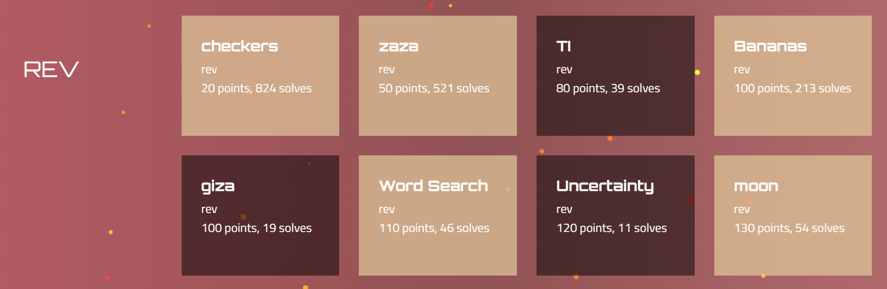
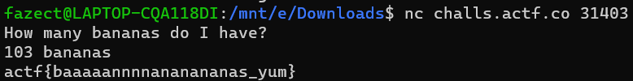

Also check out our team's blogs at [BKISC Blog](https://blog.bkisc.com/blog/) for other challenges/categories.

## Overview

Our team, [BKISC](https://bkisc.com/) finished at top **17** of this year **ångstromCTF**, got **2550** points in total. 


For reverse, we got `5` out of `8` challenges pwn-ed.



Without further ado, let's hop into this year's ångstromCTF - REV category.

## checkers

> * **Given file:** [Get it here!](https://drive.google.com/drive/folders/1NMzxgX2cOQ4Ihvb8eulQCnVQmvvHcxAe?usp=share_link)
> * **Description:** None
> * **Category:** Reverse Engineering
> * **Points:** 20

We are given a 64-bit ELF file to work with. Since ångstromCTF always has a very easy Reverse challenge for us to warm up, I decided to just use `strings checkers | grep -i 'actf{'` to get the flag.


Flag is: `actf{ive_be3n_checkm4ted_21d1b2cebabf983f}`

## zaza

> * **Given file:** [Get it here!](https://drive.google.com/drive/folders/1f0V9FJvKUMoizRtHBPH46v-HdCLRpCkM?usp=share_link)
> * **Description:** Bedtime!
> * **Remote:** nc challs.actf.co 32760
> * **Points:** 50

Once again we are given a 64-bit ELF file to work with. I used [IDA Pro](https://hex-rays.com/ida-pro/) to get the decompiled source code, which looks like this.

```c caption="Main function of the binary" showLineNumbers{1} /apply/ /components/
  int __cdecl main(int argc, const char **argv, const char **envp)
  {
    int v5; // [rsp+8h] [rbp-58h] BYREF
    unsigned int v6; // [rsp+Ch] [rbp-54h] BYREF
    char s[72]; // [rsp+10h] [rbp-50h] BYREF
    unsigned __int64 v8; // [rsp+58h] [rbp-8h]

    v8 = __readfsqword(0x28u);
    setbuf(_bss_start, 0LL);
    v5 = 0;
    v6 = 0;
    printf("I'm going to sleep. Count me some sheep: ");
    __isoc99_scanf("%d", &v5);
    if ( v5 != 4919 )
    {
      puts("That's not enough sheep!");
      exit(1);
    }
    printf("Nice, now reset it. Bet you can't: ");
    __isoc99_scanf("%d", &v6);
    if ( v5 * v6 == 1 )
    {
      printf("%d %d", v6, v6 + v5);
      puts("Not good enough for me.");
      exit(1);
    }
    puts("Okay, what's the magic word?");
    getchar();
    fgets(s, 64, stdin);
    s[strcspn(s, "\n")] = 0;
    xor_((__int64)s);
    if ( strncmp(s, "2& =$!-( <*+*( ?!&$$6,. )' $19 , #9=!1 <*=6 <6;66#", 0x32uLL) )
    {
      puts("Nope");
      exit(1);
    }
    win();
    return v8 - __readfsqword(0x28u);
  }
```

```c showLineNumbers{1} /apply/ /components/
  printf("I'm going to sleep. Count me some sheep: ");
    __isoc99_scanf("%d", &v5);
    if ( v5 != 4919 )
    {
      puts("That's not enough sheep!");
      exit(1);
    }
```

We can easily observe that, for the first `scanf`, we will have to input `4919` to pass the check.

```c showLineNumbers{1} /apply/ /components/
  printf("Nice, now reset it. Bet you can't: ");
    __isoc99_scanf("%d", &v6);
    if ( v5 * v6 == 1 )
    {
      printf("%d %d", v6, v6 + v5);
      puts("Not good enough for me.");
      exit(1);
    }
```

For this check, we will have to input a number `x` so that `x * 4919 != 1`.

Let's input `1` to pass this check (or anything that doesn't satisfy the equation `x * 4919 == 1`).

```c showLineNumbers{1} /apply/ /components/
  puts("Okay, what's the magic word?");
    getchar();
    fgets(s, 64, stdin);
    s[strcspn(s, "\n")] = 0;
    xor_((__int64)s);
    if ( strncmp(s, "2& =$!-( <*+*( ?!&$$6,. )' $19 , #9=!1 <*=6 <6;66#", 0x32uLL) )
    {
      puts("Nope");
      exit(1);
    }
    win();
```

For this last check, the program prompts us to input a string, which will go through a XOR function and will be compared against `2& =$!-( <*+*( ?!&$$6,. )' $19 , #9=!1 <*=6 <6;66#`.

```c showLineNumbers{1} /apply/ /components/
  size_t __fastcall xor_(__int64 a1)
  {
    size_t result; // rax
    int i; // [rsp+14h] [rbp-1Ch]

    for ( i = 0; ; ++i )
    {
      result = strlen("anextremelycomplicatedkeythatisdefinitelyuselessss");
      if ( i >= result )
        break;
      *(_BYTE *)(i + a1) ^= aAnextremelycom[i];
    }
    return result;
  }
```

To get our input, just simply XOR `anextremelycomplicatedkeythatisdefinitelyuselessss` together with `2& =$!-( <*+*( ?!&$$6,. )' $19 , #9=!1 <*=6 <6;66#`.

```py title="solve/solver.py" showLineNumbers{1} /apply/ /components/
  from malduck import *

  s1 = b'2& =$!-( <*+*( ?!&$$6,. )\' $19 , #9=!1 <*=6 <6;66#'
  s2 = b'anextremelycomplicatedkeythatisdefinitelyuselessss'

  print(xor(s1, s2))

  # b'SHEEPSHEEPSHEEPSHEEPSHEEPSHEEPSHEEPSHEEPSHEEPSHEEP'
```

`SHEEPSHEEPSHEEPSHEEPSHEEPSHEEPSHEEPSHEEPSHEEPSHEEP` will be our input for the last check.

Put everything altogether, we should get our precious flag.

 

Flag is: `actf{g00dnight_c7822fb3af92b949}`

## Bananas

> * **Given file:** [Get it here!](https://drive.google.com/drive/folders/1uZBLT4779RYaZYHu1fxOCIeS6HQ3GL52?usp=share_link)
> * **Description:** A friend sent this to me. Can you help me find out what they want?
> * **Remote:** nc challs.actf.co 31403
> * **Points:** 100

For this challenge, we are given an Erlang BEAM file to work with. This time, I googled and got [this tool](https://github.com/michalmuskala/decompile) to decompile the BEAM file.

After having decompiled the BEAM file, we should obtain a file named `Elixir.Bananas.erl`.

```elixir title="src/Elixir.Bananas.erl" showLineNumbers{1} /apply/ /components/
  -file("lib/bananas.ex", 1).

  -module('Elixir.Bananas').

  -compile([no_auto_import]).

  -export(['__info__'/1,main/0,main/1]).

  -spec '__info__'(attributes | compile | functions | macros | md5 |
                  exports_md5 | module | deprecated) ->
                      any().

  '__info__'(module) ->
      'Elixir.Bananas';
  '__info__'(functions) ->
      [{main, 0}, {main, 1}];
  '__info__'(macros) ->
      [];
  '__info__'(exports_md5) ->
      <<"TÀ}ÏÚ|º6þ\020Í\f\035\005\222\203">>;
  '__info__'(Key = attributes) ->
      erlang:get_module_info('Elixir.Bananas', Key);
  '__info__'(Key = compile) ->
      erlang:get_module_info('Elixir.Bananas', Key);
  '__info__'(Key = md5) ->
      erlang:get_module_info('Elixir.Bananas', Key);
  '__info__'(deprecated) ->
      [].

  check([_num@1, <<"bananas">>]) ->
      (_num@1 + 5) * 9 - 1 == 971;
  check(__asdf@1) ->
      false.

  convert_input(_string@1) ->
      to_integer('Elixir.String':split('Elixir.String':trim(_string@1))).

  main() ->
      main([]).

  main(_args@1) ->
      print_flag(check(convert_input('Elixir.IO':gets(<<"How many bananas"
                                                        " do I have?\n">>)))).

  print_flag(false) ->
      'Elixir.IO':puts(<<"Nope">>);
  print_flag(true) ->
      'Elixir.IO':puts('Elixir.File':'read!'(<<"flag.txt">>)).

  to_integer([_num@1, _string@1]) ->
      [binary_to_integer(_num@1), _string@1];
  to_integer(_list@1) ->
      _list@1.
```

Although it looks complicated at first, but turns out the algorithm is easy to understand.

> ### About the intended algorithm flow
> The algorithm here is very simple, it takes our input as a string, splits it into several "words", then it checks whether:
> * Our input has only two words.
> * First word (after converted to `int`) should satisfy this equation: `(x + 5) * 9 - 1 == 971`.
> * Second word should be `bananas`.

It is very easy to solve the challenge from this point, and our input should be `103 bananas` according to the above rules.

 

Flag is: `actf{baaaaannnnananananas_yum}`

## Word Search 

> * **Given file:** [Get it here!](https://drive.google.com/drive/folders/1Ne3b6Ybct9pFxRXJMePYDaxYLrnOYrdn?usp=share_link)
> * **Description:** I decided to put a few puzzles in the kids' menu for the new AngstromCTF restaurant, but nobody has been able to solve it. Maybe you could take a crack at it.
> * **Points:** 110

We are given a binary and a PDF file. The PDF file contains our needed string for solving the challenge.

For the binary, we will have to use the latest IDA version to get the decompiled function (I tried using both `IDA 7.6` and `IDA 8.2`, and only `IDA 8.2` worked for me).

```c showLineNumbers{1} /apply/ /components/
  __int64 __fastcall sub_1129(char *input_1, _BYTE *input_2)
  {
    char *v2; // rax
    char *v4; // rax
    char v5; // al
    char *v6; // rax
    char *v7; // rax
    _BYTE *v8; // rax
    _BYTE *v9; // rax
    _BYTE *v10; // rax
    _BYTE *v11; // [rsp+0h] [rbp-30h]
    char v13; // [rsp+16h] [rbp-1Ah]
    char v14; // [rsp+1Bh] [rbp-15h]
    int v15; // [rsp+1Ch] [rbp-14h]
    int v16; // [rsp+20h] [rbp-10h]
    int v17; // [rsp+24h] [rbp-Ch]

    v11 = input_2;
    while ( 1 )
    {
      while ( 1 )
      {
        // here
        while ( 1 )
        {
  LABEL_2:
          v2 = input_1++;
          v13 = *v2;
          if ( *v2 == ')' || v13 == ']' || !v13 )
            return v11 - input_2;
          if ( v13 != '(' && v13 != '[' )
            break;
          if ( v13 == '(' )
          {
            v4 = input_1++;
            v5 = *v4;
          }
          else
          {
            v5 = 95;
          }
          v14 = v5;
          qword_4040[v5] = input_1;
          while ( (*input_1 != ')' || v5 != input_1[1]) && *input_1 != ']' )
            ++input_1;
          input_1 += 2;
          if ( v13 == '[' )
          {
            while ( 1 )
            {
              v17 = sub_1129((char *)qword_4040[v14], v11);
              if ( v17 < 0 )
                break;
              v11 += v17;
            }
            --input_1;
          }
        }
        if ( v13 != '\'' )
          break;
        v6 = input_1++;
        if ( (unsigned int)sub_1129((char *)qword_4040[*v6], v11) != -1 )
          return 0xFFFFFFFFLL;
      }
      if ( v13 == '*' )
        break;
      if ( v13 == ' ' )
      {
        v8 = v11++;
        if ( !*v8 )
          return 0xFFFFFFFFLL;
      }
      else if ( v13 == '?' )
      {
        v9 = v11++;
        v15 = 0;
        while ( *input_1 != '?' )
        {
          if ( *v9 == *input_1 )
            v15 = 1;
          ++input_1;
        }
        ++input_1;
        if ( !v15 )
          return 0xFFFFFFFFLL;
      }
      else if ( v13 != '.' )
      {
        v10 = v11++;
        if ( *v10 != v13 )
          return 0xFFFFFFFFLL;
      }
    }
    --input_1;
    while ( *input_1 == '*' )
    {
      v7 = input_1 + 1;
      input_1 += 2;
      v16 = sub_1129((char *)qword_4040[*v7], v11);
      if ( v16 >= 0 )
      {
        v11 += v16;
        while ( *input_1 == '*' )
          input_1 += 2;
        goto LABEL_2;
      }
    }
    return 0xFFFFFFFFLL;
  }
```

After a relatively short time of analyzing the source, I came up with some conclusions.

> ### Conclusions
> * The string given in the PDF file doesn't contain any of these: `[].*`. Therefore, we can skip the correspondence parts in the source.
> * For the substring between `(...)`: The program sets the value of `qword_4040[i]` (with `i` being the character following the closing bracket) to that substring. For example: If we have `(ab)c`, the program will set `qword_4040[c] = "ab"`.
> * For the space: Don't mind about it, kinda useless.
> * For the apostrophe: Filter out `qword_4040[i]` (with `i` being the character following that apostrophe). Suppose we have something like `(ab)c'c`, then the program will filter out `a` and `b`.
> * For the substring between `?...?`: The program uses applied filter (as of the above clarification) to omit out some characters, and take the last character remaining.

With that being considered, I wrote everything on a piece of paper (no script sadly) to get the flag from the hint provided in the PDF file (also with some reasonable guesses, too).

Flag is: `actf{both_irregular_and_inexpressive}`

> ### Appendix
> * After having solved the challenge, I did try to write a Python script. However, I failed to generate the flag using Python, maybe because the program has some additional constraints that I did not read carefully back then. But who cares, I got the flag anyway.

## moon

> * **Given file:** [Get it here!](https://drive.google.com/drive/folders/1ThJytLyNWmUymOXZMwz0kDMxNF763R4I?usp=share_link)
> * **Description:** To the moon! The correct sequence of inputs is the flag in ASCII.
> * **Points:** 130

We are once again given a 64-bit ELF file to work with. I decompiled it using IDA and after several hours into the source, I got to understand the general algorithm of the source.

> ### Algorithm
> Suppose that our input is represented by an array named `arr`.
> * The input should have length of `1293`.
> * Each character of the input is assigned to a function, for example `arr[i]` is associated with `func_i`.
> * Each function modifies `1293` variables (in the same order).
> * Each variable will be checked with a hard-coded array, named `needed`.

In conclusion, the problem is very basic. Just solve a system of `1293` equations, with `1293` variables and we are good to go. 

Having the algorithm in mind, it is time to write a Python script to solve it.

```py title="solve/solver.py" showLineNumbers{1} /apply/ /components/
  from pwn import *

  e = ELF('./moon',checksec=False)

  needed = []
  for i in range(1293):
      needed.append(int.from_bytes(e.read(e.sym['needed']+i*8, 8),'little'))
```

Here, I dumped out `needed` - contains our right hand side for the system of equations.

```py title="solve/solver.py" showLineNumbers{1} /apply/ /components/
  needed = [63393110, 58886046, 67388269, 63461910, 67974569, 60993599, 67115864, 65470744, ..., 60800092, 65494190, 67202755, 63501212, 65078012, 67079286, 59084245, 65591500]
```

```py title="solve/solver.py" showLineNumbers{1} /apply/ /components/
  eq = []
  base = 0x23ab900

  check = []
  for j in range(1293):
      if j != 1292:
          func = e.disasm(e.sym[f'func{j}'], e.sym[f'func{j+1}']-e.sym[f'func{j}'])
      else:
          func = e.disasm(e.sym['func1292'], e.sym['main']-e.sym['func1292'])
      ins = func.split('\n')
      eq = []
      i = 3
      while i < len(ins):
          if 'mov' in ins[i] and 'add    rax,' in ins[i+1] and 'mov' in ins[i+2]:
              # print(ins[i+1])
              num = int(ins[i+1].split(',')[1],16)
              eq.append(num)
              i = i + 3
          elif 'mov' in ins[i] and 'sub    rax,' in ins[i+1] and 'mov' in ins[i+2]:
              num = 0xffffffffffffffff - int(ins[i+1].split(',')[1], 16) + 1
              eq.append(num)
              i = i + 3
          elif 'mov' in ins[i] and 'mov' in ins[i+1]:
              eq.append(0)
              i = i + 2
          else:
              i = i + 1      
      check.append(eq)
```

For this part, I dumped out all coefficients of all equations.

```py title="solve/solver.py" showLineNumbers{1} /apply/ /components/
  check = [[546, 25, 519, 123, 670, 104, 374, 208, ..., 183, 495, 82, 546, 770, 173, 68, 473]]
```

```py title="solve/final_solver.py" showLineNumbers{1} /apply/ /components/
  from sage.all import *

  mat = Matrix(check)
  mat = mat.T
  needed = vector(needed)
  print(mat.solve_right(needed))
```
 
Put everything together, and using [SageMath](https://www.sagemath.org/), we get the input needed.

``` showLineNumbers{1} /apply/ /components/
  (74, 65, 78, 69, 32, 69, 89, 82, ..., 101, 56, 57, 54, 99, 57, 50, 125)
```

Convert these into ASCII characters, we get the following (which turns out to also contain the flag):

``` showLineNumbers{1} /apply/ /components/
  JANE EYRE
  AN AUTOBIOGRAPHY

  by Charlotte Brontë

  _ILLUSTRATED BY F. H. TOWNSEND_

  London
  SERVICE & PATON
  5 HENRIETTA STREET
  1897

  _The Illustrations_
  _in this Volume are the copyright of_
  SERVICE & PATON, _London_

  TO
  W. M. THACKERAY, ESQ.,

  This Work
  IS RESPECTFULLY INSCRIBED

  BY
  THE AUTHOR


  PREFACE


  A preface to the first edition of “Jane Eyre” being unnecessary, I gave
  none: this second edition demands a few words both of acknowledgment
  and miscellaneous remark.

  My thanks are due in three quarters.

  To the Public, for the indulgent ear it has inclined to a plain tale
  with few pretensions.

  To the Press, for the fair field its honest suffrage has opened to an
  obscure aspirant.

  To my Publishers, for the aid their tact, their energy, their practical
  sense and frank liberality have afforded an unknown and unrecommended
  Author.

  The Press and the Public are but vague personifications for me, and I
  must thank them in vague terms; but my Publishers are definite: so are
  certain generous critics who have encouraged me as only large-hearted
  and high-minded men know how to encourage a struggling stranger; to
  them, _i.e._, to my Publishers and the select Reviewers, I say
  cordially, Gentlemen, I thank you from my heart.

  actf{3verything_is_just_linear_algebr4_33e431e52e896c92}
```

Flag is: `actf{3verything_is_just_linear_algebr4_33e431e52e896c92}`

> ### Appendix
> * I tried using z3 to solve the input as a BitVec, but gained no success. Only after one of my Crypto teammate told me to use SageMath and some Linear Algebra (I learned the subject before) that I could get the flag. Kudos to the guy!