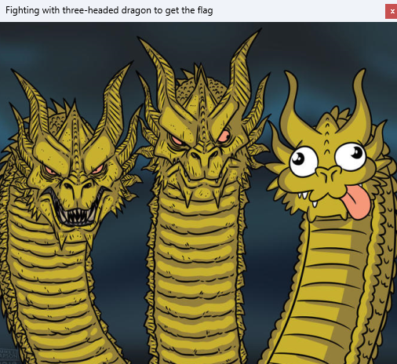
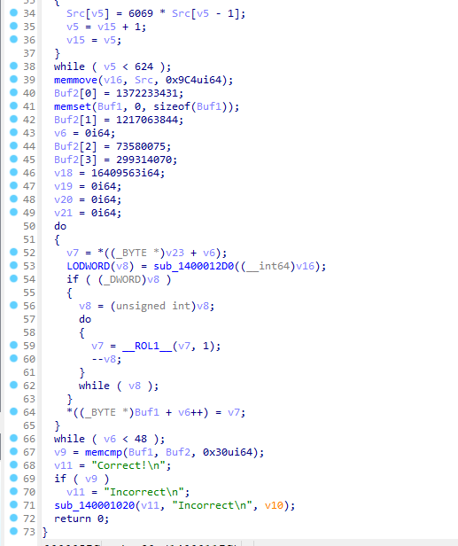
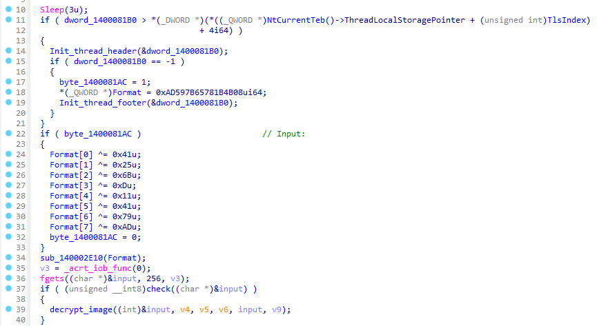
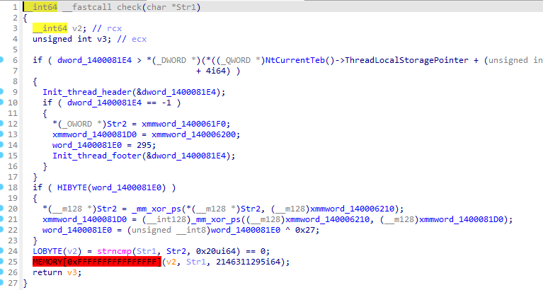

## Overview

Last weekend, I participated in ASEAN Students Contest on Information Security (ASCIS) with my university team, and we secured one slot in the Finals. Although the Final round will be re-organized soon due to some technical difficulties in Attack & Defense, we ended our day by being the only solver of a Reverse Engineering challenge named `Sanryu`, in the very last seconds of the CTF.

## Challenge Information

> ### Sanryu
> * **Given file:** [Get it here!](https://github.com/FazeCT/ctf/blob/main/sanryu.exe)

## Main binary

We are given a DotNet executable to work with. Running the binary prompts us an image of the hydra meme.



```c# caption="Main function of the given binary" showLineNumbers{1} /apply/ /components/
  private void pictureBox1_MouseUp(object sender, EventArgs e)
  {
      Cursor cursor = new Cursor(Resources.sword_up.Handle);
      this.pictureBox1.Cursor = cursor;
      Point location = ((MouseEventArgs)e).Location;
      if (location.X > 8 && location.X < 157 && location.Y > 117 && location.Y < 429)
      {
          this.runResource("challenge_1.exe", Resources.challenge_1);
      }
      if (location.X > 203 && location.X < 314 && location.Y > 88 && location.Y < 434)
      {
          this.runResource("challenge_2.exe", Resources.challenge_2);
      }
      if (location.X > 368 && location.Y < 494 && location.Y > 138 && location.Y < 430)
      {
          this.runResource("challenge_3.exe", Resources.challenge_3);
      }
  }
```

From the decompiled code, we can see that when you click on each of the three heads of the hydra, a different binary will be run. I used dnspy's debugger to quickly dump out the 3 binaries.

The meme also implies that the third challenge should be the easiest to solve, so I will start from it.

## Challenge 3

I used IDA to analyze the binary. At first glance, it does look simple with just about 20 lines of encryption.



The program prompts us for an input, that input will go through a simple ROL cipher.

I debugged to get the values, and quickly wrote a script to solve it. The general idea is to modulo the value by `8` (because each character is `1` byte) to minimize the time taken.

```py title="solve/part3_solver.py" showLineNumbers{1} /apply/ /components/
  def rol(a, x):
      tmp = bin(a)[2:].rjust(8, '0')
      return int(tmp[x:] + tmp[:x], 2)

  data = [0xD7, 0x9E, 0xCA, 0x51, 0xA4, 0xEB, 0x8A, 0x48, 0x2B, 0xBE, 
    0x62, 0x04, 0x96, 0x2B, 0xD7, 0x11, 0xDB, 0x63, 0xFA]

  ls = [0xf3a8d24e, 0x57286251, 0xed0bb215, 0xc54297c6, 0x1372d3d1, 0x9aebb2fd,
        0x4074858d, 0xd8f50000, 0x95e8f163, 0x325640e9, 0x6c750331, 0x86a54774,
        0xd88dda56, 0xfbd660c5, 0x77f412ae, 0x9077a73e, 0xb8817c4e, 0xb4a4110c,
        0xbc4e8a99, 0x409d7713, 0x935c8213]

  for i in range(min(len(ls), len(data))):
      print(end=chr(rol(data[i], 8 - (ls[i] % 8))))

  # _OVER_THe_1@ZY_Do6}
```

Okay, this gives us the third part of the flag. Let's move on to the next challenge.

## Challenge 2

I also used IDA on this binary, and it does look more complicated than the previous one. A quick static analysis on the main function gave me this result.



The check function compares our input with the XOR-decoded value being stored in the memory.



```py title="solve/part2_test.py" showLineNumbers{1} /apply/ /components/
  from pwn import xor

  print(xor([0x7D, 0x7E, 0xB3, 0x90, 0xF9, 0x15, 0xBA, 0xA7, 0x72, 0x68, 
    0xA7, 0x97, 0xF6, 0x62, 0xB7, 0xC1, 0x7E, 0x66, 0xB3, 0x98, 0xF0, 0x12, 0xB9, 0xC9, 0x71, 0x76, 
    0xAA, 0xED, 0xF4, 0x1B, 0xB7, 0xD6], [0x27, 0x2F, 0xFF, 0xDF, 0xBD, 0x57, 0xE3, 0x93, 0x27, 0x2F, 
    0xFF, 0xDF, 0xBD, 0x57, 0xE3, 0x93]))
```

A quick script gave `ZQLODBY4UGXHK5TRYILGMEZZVYU2ILTE` as the result. I tried it on the binary but it gave nothing.

I tried to decrypt the image by myself (it uses `RC4` to encrypt the image), but I got this.


Okay, something really squishy here. I went back to recheck the code flow and I saw the assembly part where the binary does `call 0x0FFFFFFFFFFFFFFFF` in the `check()` function. That surely gives Exception when you run it. I did some further static analysis until I saw that the function to decrypt `RC4` was called twice. So I went on and check the other part that calls it.

Turns out, that part in `sub_140001F50()` is where we should look at. The binary decrypts another PE file using `RC4`, and we can actually dump it out by putting a breakpoint at the end of the `RC4` decrypt function to dump the binary out.


The binary wants an input and it will go through the check function below.

```c showLineNumbers{1} /apply/ /components/
  char __fastcall sub_180001040(__int64 a1)
  {
    int i; // [rsp+24h] [rbp-24h]
    char v3; // [rsp+28h] [rbp-20h]

    for ( i = 0; i < 15; ++i )
    {
      v3 = *(_BYTE *)(a1 + i) + 10;
      if ( (unsigned __int8)(byte_180004048[i] ^ sub_180001000(byte_180004048[i], 2) ^ v3) != byte_180004038[i] )
        return 0;
    }
    return 1;
  }
```

It was relatively easy to solve, so I will just give out my script below.

```py title="solve/part2_solver.py" showLineNumbers{1} /apply/ /components/
  def enc(a1, a2):
      return ((a1 << (8 - a2)) | (a1 >> a2)) & 0xFF

  a = [0xDC, 0x3C, 0x0A, 0xBE, 0x75, 0xCB, 0x0A, 0x80, 0xF4, 0x4A, 
    0x8C, 0x86, 0xAA, 0xE4, 0xC3]

  b = [0xA7, 0x4F, 0xB2, 0x70, 0x70, 0x50, 0xD8, 0xF9, 0xAB, 0xB1, 
    0xFB, 0x78, 0x77, 0x87, 0x1D, 0xC3]

  for i in range(15):
      for j in range(32, 127):
          c = j + 10
          if a[i] ^ enc(a[i], 2) ^ c == b[i]:
              print(end=chr(j))
              break
  # Br0WN_FOX_JUmP$
```

So we have our second part of the flag, it's time to move on to the last one.

## Challenge 1

I consider this one to be the hardest. The binary is actually nanomites, where there are 2 parallel processes communicating with each other. I debugged each of them individually by patching the mutex check to debug the child process.

In general, the parent process wants an input from us, then it is sent to the child process by the second value of the argv. The processes communicate with each other using functions like `WaitForDebugEvent`, `GetThreadContext`, ... and through registers, like how a nanomites related challenge should work. Each time the child process encounter an `int 3` call, the parent process continues, and the parent process - having finished its job, the `eip` is changed and the flow returns to the child process and so on.

```c showLineNumbers{1} /apply/ /components/
  if ( OpenMutexA(0x100000u, 0, "ASCIS_2023") ) // Patched this for child process debugging later.
    {
      parentProc(); // Parent process
      return 0;
    }
    else if ( argc == 2 ) // Child process
    {
      v16 = argv[1];
      v10 = v16 + 1;
      v17 = (unsigned int)&v16[strlen(v16) + 1];
      v19 = malloc(__CFADD__(v17 - (_DWORD)v10, 1) ? -1 : v17 - (_DWORD)v10 + 1);
      v14 = argv[1];
      v9 = v14 + 1;
      v15 = (unsigned int)&v14[strlen(v14) + 1];
      memset(v19, 0, v15 - (_DWORD)v9 + 1);
      v12 = argv[1];
      v8 = v12 + 1;
      v13 = (unsigned int)&v12[strlen(v12) + 1];
      memmove(v19, argv[1], v13 - (_DWORD)v8);
      if ( sub_B81120(v20) )
      {
        v3 = sub_B83190((void **)v20[0], (int)"checkFormat");
        result = ((int (__stdcall *)(void *, int, _DWORD, _DWORD, int, int, char *, unsigned int, const char *, unsigned int, const char *, unsigned int, const char *, int, unsigned int, unsigned int, unsigned int, int, void *, int, int))v3)(
                  v19,
                  v5,
                  0,
                  0,
                  v6,
                  v7,
                  v3,
                  v13 - (_DWORD)v8,
                  v8,
                  v15 - (_DWORD)v9,
                  v9,
                  v17 - (_DWORD)v10,
                  v10,
                  v11,
                  v13,
                  v15,
                  v17,
                  v18,
                  v19,
                  v20[0],
                  v20[1]);
        __debugbreak();
      }
      else
      {
        return -1;
      }
    }
    else
    {
      return -1;
    }
```

Above is the main flow of the child process of the nanomites.

I debugged into the function stored in `v3` variable and figured out that it was used to check the format of the input from the parent process.

```c showLineNumbers{1} /apply/ /components/
  BOOL __cdecl sub_10001000(_BYTE *a1)
  {
    int v1; // edx
    _BYTE *v2; // esi
    int v3; // edi
    char v4; // cl
    char v5; // bl
    char v6; // ch
    int v7; // eax
    _BYTE *v8; // esi
    int v9; // eax
    __int128 v11; // [esp+0h] [ebp-14h]

    v1 = 0;
    v2 = a1;
    v3 = 0;
    v11 = xmmword_100020A0;
    v4 = *a1;
    if ( !*a1 )
      return 0;
    v5 = *a1;
    do
    {
      v6 = v5;
      if ( v5 == 10 )
        break;
      v5 = v2[1];
      v7 = v3 + 1;
      ++v2;
      if ( v6 != 45 )
        v7 = v3;
      v3 = v7;
    }
    while ( v5 );
    v8 = a1;
    if ( v3 != 3 )
      return 0;
    v9 = 0;
    do
    {
      if ( v4 == 10 )
        break;
      if ( v4 == 45 )
      {
        if ( *((_DWORD *)&v11 + v1) != v9 )
          return 0;
        ++v1;
        v9 = 0;
      }
      else
      {
        ++v9;
      }
      v4 = *++v8;
    }
    while ( v4 );
    return *((_DWORD *)&v11 + v1) == v9;
  }
```

The format of the license is `X-XXXX-XX-XXX` according to the function.


These will be the part that does some magic on our input, then the flow will be changed to the parent process to do some comparisons. The key for the flag image decryption will be modified throughout the flow.

Analyze the first part and the function `sub_401C50()`, we can see that this does some kind of encryption based on the system time.

```c showLineNumbers{1} /apply/ /components/
  int __stdcall sub_401C50(char a1)
  {
    _DWORD *v2; // [esp+8h] [ebp-24h]
    HANDLE hFile; // [esp+Ch] [ebp-20h]
    HANDLE hFilea; // [esp+Ch] [ebp-20h]
    CHAR *lpBuffer; // [esp+10h] [ebp-1Ch]
    int v6; // [esp+14h] [ebp-18h] BYREF
    char Buffer[11]; // [esp+1Ch] [ebp-10h] BYREF
    unsigned __int8 v8; // [esp+27h] [ebp-5h]

    v2 = VirtualAlloc(0, 0xAu, 0x1000u, 0x40u);
    getTime((int)Buffer);
    lpBuffer = (CHAR *)malloc(0x1000u);
    GetEnvironmentVariableA("temp", lpBuffer, 0x1000u);
    sub_401280(lpBuffer, "%s\\pointer.time", lpBuffer);
    hFile = CreateFileA(lpBuffer, 0x40000000u, 0, 0, 1u, 0x80u, 0);
    if ( GetLastError() == 80 )
    {
      hFilea = CreateFileA(lpBuffer, 0x80000000, 0, 0, 3u, 0x80u, 0);
      ReadFile(hFilea, Buffer, 8u, 0, 0);
    }
    else
    {
      WriteFile(hFile, Buffer, 8u, 0, 0);
    }
    getTime((int)&v6);
    v8 = a1 ^ (v6 - Buffer[0]);
    *v2 = 0;
    v2[1] = 0;
    *((_WORD *)v2 + 4) = 0;
    *(_BYTE *)v2 = v8;
    ((void (__cdecl *)(_DWORD *))v2)(v2);
    return v8;
  }
```

I debugged and got to know the function `getTime()` was called twice to get the time at two different moment.

The variable `v8` contains the difference between the two results gathered from `getTime()`, XORed with `a1`, which is our input character for the first part of the license.

It puts the value of `v8` into `v2`, then call `v2()` like a shellcode. This reminds me of the `4th` challenge from last year `Flare-On 9th`, where we have to make it calls `ret`, so that the program will continue to run normally.

From that, we can conclude that our input for the first part should equal to the difference of the time that I mentioned above XORed with `0xC3` - the hex value of `ret`. To easily bypass this, I patched this function, so that we can input anything we want, but it still gives `0xC3`.

Move on to the second part (I modified the `eip` register while debugging the child process to get pass the `int 3` calls to get to the second part check, because before each check function will be another function that loads them in), I can see that the function being called at `0xB81F4D` actually separates the first part out. 

After that we are left with `XXXX-XX-XXX`, then the first character will be compared with `1`, which means we have `1XXX-XX-XXX`.

The function being called at `0xB81F82` is the checker for the second part of the license. Further debugging inside it reveals the flow, as below.

``` showLineNumbers{1} /apply/ /components/
  debug035:100010E7 mov     al, [edi+2]
  debug035:100010EA xor     al, [edi+1]
  debug035:100010ED mov     byte ptr [ebp+arg_0+3], al
  debug035:100010F0 xor     ebx, ebx
  debug035:100010F2 mov     ebx, 3
  debug035:100010F7 xor     edx, edx
  debug035:100010F9 mov     dl, byte ptr [ebp+arg_0+3]
  debug035:100010FC int     3                               ; Trap to Debugger
  debug035:100010FD mov     eax, 0
  debug035:10001102 retn
```

With the `edi` register being the position in the second part of the license.

Below is the part after the `int 3` call (which is being looped `4` times).

```c showLineNumbers{1} /apply/ /components/
  int __usercall sub_10001103@<eax>(int a1@<ecx>, int a2@<ebp>, char *a3@<edi>)
  {
    int result; // eax
    char v4; // al
    char v5; // bl

    *(_DWORD *)(a2 + 8) = 0;
    result = 1;
    if ( a1 > 0 )
    {
      *(_DWORD *)(a2 - 4) = 1 - (_DWORD)a3;
      v4 = *a3;
      v5 = a3[1 % a1];
      if ( (*(_DWORD *)(a2 + 8) & 1) != 0 )
        *(_BYTE *)(a2 + 11) = v4 - v5 + 48;
      else
        *(_BYTE *)(a2 + 11) = v4 + v5;
      __debugbreak();
      return 0;
    }
    return result;
  }
```

The `ebx` this time has the value of `0xDEAD`, so we will look for that case in the parent process.

```c showLineNumbers{1} /apply/ /components/
  strcpy(v16, "d0j6");

  case 0xDEADu:
    Eax = Context.Eax;
    Eax = v16[i++] ^ LOBYTE(Context.Eax);
    if ( !Eax )
      Context.Eip += 6;
    break;
```

So `v4` and `v5` contain each pair of characters in our input for the second part (it uses `[1 % a1]` to make the input `circular` - i.e. `a3[3]` with `a3[0]` are also considered to be one pair). Then based on the parity of `*(a2 + 8)`, `*(a2 + 11)` will be calculated differently, and being pulled out by `eax` register for the parent process to use.

I wrote a script to solve this part, as below.

```py title="solve/part1_solver.py" showLineNumbers{1} /apply/ /components/
  buf = b'1'
  s = b'd0j6'

  for i in range(3):
      if i % 2 == 0:
          buf += bytes([s[i] - buf[-1]])
      else:
          buf += bytes([buf[-1] - s[i] + 0x30])

  print(buf.decode())
  # 1337
```

For the third part, I changed `eip` to `0xB81FA4` for faster access, and debugged into the function being called at `0xB81FBC`. That function checks the third part.

``` showLineNumbers{1} /apply/ /components/
  debug035:10001193 loc_10001193:                           ; CODE XREF: sub_10001170+2F↓j
  debug035:10001193 movsx   ecx, byte ptr [esi+edi]
  debug035:10001197 inc     esi
  debug035:10001198 shl     edx, 8
  debug035:1000119B add     edx, ecx
  debug035:1000119D cmp     esi, eax
  debug035:1000119F jl      short loc_10001193
  debug035:100011A1 mov     [ebp+var_4], edx
  debug035:100011A4
  debug035:100011A4 loc_100011A4:                           ; CODE XREF: sub_10001170+21↑j
  debug035:100011A4 xor     eax, eax
  debug035:100011A6 xor     ebx, ebx
  debug035:100011A8 mov     ebx, 0BEEFh
  debug035:100011AD mov     eax, [ebp+var_4]
  debug035:100011B0 xor     eax, ebx
  debug035:100011B2 int     3                               ; Trap to Debugger
  debug035:100011B3 mov     eax, 0
  debug035:100011B8 retn
```

The third part only has `2` characters, the second character will be stored into `ecx`, while the first one is in `edx`.

For this part, `[ebp+var_4]` will contain `(edx << 8) + ecx` and `eax` will contain `((edx << 8) + ecx) ^ 0xBEEF`.

The `ebx` register has the value `0xBEEF`.

```c showLineNumbers{1} /apply/ /components/
  case 0xBEEFu:
    v1[179] = Context.Eax ^ 0xD6A6;
    if ( Context.Eax == 0xD6A6 )
      Context.Eip += 6;
    break;
```

We can easily see that `((edx << 8) + ecx) ^ 0xBEEF == 0xD6A6`. To solve this, I wrote this short script below.

```py title="solve/part1_solver.py" showLineNumbers{1} /apply/ /components/
  for i in range(32, 127):
      for j in range(32, 127):
          if 0xD6A6 == ((i << 8) + j) ^ 0xBEEF:
              print(end=chr(i) + chr(j))
  # hI
```

The function `sub_B813E0()` will be the checker for our last part. Debugging into this function shows that `sub_B85D70()` calculates `sha256` hash of our `3-character-input` for the last part.

The hash is then compared with the long buffer in the parent process, due to the `ebx` having the value of `0xFEED`.

``` showLineNumbers{1} /apply/ /components/
  .text:00B81517                 mov     ebx, 0FEEDh
  .text:00B8151C                 xor     eax, eax
  .text:00B8151E                 mov     eax, [ebp+var_8]
  .text:00B81521                 int     3               ; Trap to Debugger
  .text:00B81522                 mov     eax, 0
  .text:00B81527                 retn
```

```c showLineNumbers{1} /apply/ /components/            
  case 0xFEEDu:
    v9 = Context.Eax;
    v9 = hash[v3++] ^ LOBYTE(Context.Eax);
    if ( !v9 )
      Context.Eip += 6;
    break;
```

I cracked the hash and got `br0` as the result.

Combine everything together, we have `X-1337-hI-br0` as our license, with `X` being anything because we patched the first check function.

Input the license in yields us the first part of the flag.


Combine all `3` parts of the flag, we solved the challenge!


Flag is: `ASCIS{ThE_quicK_Br0WN_FOX_JUmP$_OVER_THe_1@ZY_Do6}`
