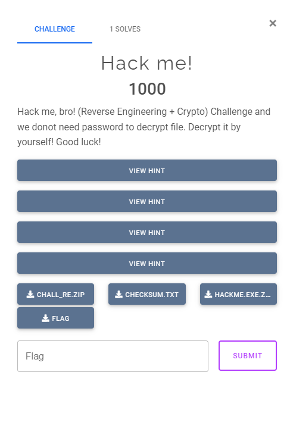

## ASCIS Overview

Last weekend, I participated in ASEAN Students Contest on Information Security (ASCIS) with my university team, and we got top 3 in the Jeopardy Finals. For me, I think I did not do well in the CTF, as I only solved one Reverse Engineering challenge by the end of the contest day.


Who created the cursed first challenge, I wonder?

## Challenge Information

> ### HACK ME!
> * **Given files:** [Get it here!](https://github.com/FazeCT/ctf/blob/main/HACKME.zip)

## Overview



At first, only `CHALL_RE.ZIP`, `HACKME.EXE.ZIP` and `CHECKSUM.TXT` were given. 

`CHALL_RE.ZIP` contains `flag` file and `HACKME.EXE` binary.

`HACKME.EXE.ZIP` contains `HACKME.EXE` binary (I guess it is the same binary).

I will explain the four hints throughout this writeup.

## Main binary

We are given an executable that reads from a file named `flag` and prompts us for a password.

At this point I was thinking if I should crack the zip that contains the `flag` file, but honestly what's the point of doing that in a reverse challenge?

Luckily, they gave the `flag` file later on (this was the first hint).

```c caption="Main function of the given binary" showLineNumbers{1} /apply/ /components/
    int __fastcall main(int argc, const char **argv, const char **envp)
    {
        FILE *v3; // rax
        FILE *v4; // rbx

        v3 = fopen("flag", "rb");
        v4 = v3;
        if ( !v3 )
        {
            return 1;
        }

        fread(&flag, 1ui64, 32ui64, v3);
        fclose(v4);
        printf("Enter your password:\n");
        smth();
        return 0;
    }
```

First, it reads `32` bytes from the `flag` file, and stores the content at `&flag`.

Looking into `smth()`, we can see that it loads the buffer at `&flag` and call `sub_140001834(v2)`. The function looks like it is implementing kind of a VM, so `v2` must be the context of the VM.

We can clearly see that this challenge uses structs to store things, so let's start creating custom structs to beautify this.

> ### Defining custom structs in IDA
> To define a custom struct in IDA, navigate to `View > Open Subviews > Local types` or press `Shift + F1`. Right click in the `Local types` tab and choose `Insert`.

A quick analysis into the VM function also helps us define the struct entries.

```c caption="Part of the VM handler" showLineNumbers{1} /apply/ /components/
    char __fastcall sub_140001834(__int64 a1)
    {
        unsigned __int64 v1; // r8
        unsigned int v3; // edx

        v1 = *(unsigned int *)(a1 + 0x48);
        if ( v1 < *(_QWORD *)(a1 + 0x60) )
        {
            while ( !*(_BYTE *)a1 )
            {
                v3 = *(unsigned __int8 *)((unsigned int)v1 + *(_QWORD *)(a1 + 0x58));
                *(_DWORD *)(a1 + 0x48) = v1 + 1;
```

It is clearly shown that `*(_DWORD *)(a1 + 0x48)` should be the VM pointer, `*(_QWORD *)(a1 + 0x58)` is the VM bytecodes buffer, and `*(_BYTE *)a1` is the condition for that while loop. Lastly, `*(_QWORD *)(a1 + 0x60)` looks like the length of the VM bytecodes list.

Let's start defining our custom struct!

```c showLineNumbers{1} /apply/ /components/
    struct object
    {
    _BYTE inactive;
    _BYTE padding[3];
    _DWORD padding2[17];
    _DWORD pointer;
    _DWORD padding3[3];
    _QWORD vm_bytes;
    _QWORD total_len;
    _QWORD padding4[3];
    };
```

Above is our first struct, with some unknown fields that I will cover later on.

```c caption="Part of the VM handler" showLineNumbers{1} /apply/ /components/
    char __fastcall sub_140001834(object *a1)
    {
        unsigned __int64 pointer; // r8
        unsigned int v3; // edx

        pointer = (unsigned int)a1->pointer;
        if ( pointer < a1->total_len )
        {
            while ( !a1->inactive )
            {
                v3 = *(unsigned __int8 *)((unsigned int)pointer + a1->vm_bytes);
                a1->pointer = pointer + 1;
```

After inserting the struct and changing the type of `a1` to `object* a1`, we got this beautiful piece of code.

```c showLineNumbers{1} /apply/ /components/
    char smth()
    {
        char v0; // di
        object *v1; // rax
        object *v2; // rbx
        _OWORD *v3; // rax
        __int128 v4; // xmm0

        v0 = 0;
        v1 = (object *)j__malloc_base(0xF8ui64);
        v2 = v1;
        if ( v1 )
        {
            sub_14001E240(v1, 0i64, 0xF8i64);
            v2->total_len = 0x10000i64;
            v3 = j__malloc_base(0x10000ui64);
            v2->vm_bytes = v3;
            if ( v3 )
            {
                v2->padding2[0x10] = 0xFF00;
                v4 = flag;
                v2->padding4[1] = 0x10000i64;
                *v3 = v4;
                v3[1] = *((_OWORD *)&flag + 1);
                v3[2] = *((_OWORD *)&flag + 2);
                v3[3] = *((_OWORD *)&flag + 3);
                v3[4] = *((_OWORD *)&flag + 4);
                v3[5] = *((_OWORD *)&flag + 5);
                v3[6] = *((_OWORD *)&flag + 6);
                v3[7] = *((_OWORD *)&flag + 7);
                v3[8] = *((_OWORD *)&flag + 8);
                v3[9] = *((_OWORD *)&flag + 9);
                v3[0xA] = *((_OWORD *)&flag + 0xA);
                v3[0xB] = *((_OWORD *)&flag + 0xB);
                v3[0xC] = *((_OWORD *)&flag + 0xC);
                v3[0xD] = *((_OWORD *)&flag + 0xD);
                *((_BYTE *)v3 + 0xE0) = *((_BYTE *)&flag + 0xE0);
                v2->pointer = 0x20;
                v0 = sub_140001834(v2);
                free((void *)v2->vm_bytes);
            }

            free(v2);
        }

        return v0;
    }
```

Back to the `smth()` function, we can see that `v2->padding4[1]` is also the VM length, along with `v2->padding2[0x10]` being another pointer that could possibly be used afterward.

At this point, the VM bytecodes buffer should look like this: `flag (32 bytes) + actual VM bytecodes`

Let's update our struct once again!

```c showLineNumbers{1} /apply/ /components/
    struct object
    {
    _BYTE inactive;
    _BYTE padding[3];
    _DWORD padding2[16];
    _DWORD weird_pointer;
    _DWORD pointer;
    _DWORD padding3[3];
    _QWORD vm_bytes;
    _QWORD total_len;
    _QWORD padding4;
    _QWORD total_len_2;
    _QWORD padding5;
    };
```

Let's look at the function inside `case 0x20` (because it has `%d`, which could be the input function).

```c showLineNumbers{1} /apply/ /components/
    __int64 __fastcall sub_1400017CC(object *a1)
    {
        __int64 result; // rax

        result = read_stdin("%d", &a1->padding2[*(unsigned __int8 *)(a1->vm_bytes + (unsigned int)a1->pointer)]);
        ++a1->pointer;
        return result;
    }
```

From this, we can see 2 things: `&a1->padding2[]` is the memory of the VM, and each section of the memory will be 4 bytes. The input will be a 4-byte number.

Below is the new struct, that has `padding2` replaced by `memory`.

```c showLineNumbers{1} /apply/ /components/
    struct object
    {
    _BYTE inactive;
    _BYTE padding[3];
    _DWORD memory[16];
    _DWORD weird_pointer;
    _DWORD pointer;
    _DWORD padding3[3];
    _QWORD vm_bytes;
    _QWORD total_len;
    _QWORD padding4;
    _QWORD total_len_2;
    _QWORD padding5;
    };
```

Another function that we should try to look at is the one in `case 0x0E`, since it looks like it is doing conditional jump.

```c showLineNumbers{1} /apply/ /components/
    __int64 __fastcall sub_14000124C(object *a1)
    {
        __int64 pointer; // rdx
        __int64 result; // rax
        int v3; // r8d
        int v4; // edx
        bool v5; // zf

        pointer = (unsigned int)a1->pointer;
        result = a1->vm_bytes;
        v3 = *(_DWORD *)(pointer + result);
        v4 = pointer + 4;
        v5 = (a1->padding3[1] & 1) == 0;
        a1->pointer = v4;
        if ( v5 )
        {
            result = (unsigned int)(v4 + v3);
            a1->pointer = result;
        }

        return result;
    }
```

From this, we know that `a1->padding3[1]` might be a bool value to check something, so let's edit our struct to define it.

```c showLineNumbers{1} /apply/ /components/
    struct object
    {
    _BYTE inactive;
    _BYTE padding[3];
    _DWORD memory[16];
    _DWORD weird_pointer;
    _DWORD pointer;
    _DWORD padding3;
    _QWORD check_flag;
    _QWORD vm_bytes;
    _QWORD total_len;
    _QWORD padding4;
    _QWORD total_len_2;
    _QWORD padding5;
    };
```
## Interpreter

At this point, the VM is already easy to solve statically, for example (`case 0x18`):

```c showLineNumbers{1} /apply/ /components/
    __int64 __fastcall sub_1400014D0(object *a1)
    {
        __int64 pointer; // rax
        __int64 vm_bytes; // r8
        __int64 v4; // r9
        int check_flag; // ecx
        __int64 result; // rax
        int v7; // ecx

        pointer = (unsigned int)a1->pointer;
        vm_bytes = a1->vm_bytes;
        v4 = *(unsigned __int8 *)(pointer + vm_bytes);
        a1->memory[v4] |= a1->memory[*(unsigned __int8 *)((unsigned int)(pointer + 1) + vm_bytes)];
        check_flag = a1->check_flag;
        result = check_flag & 0xFFFFFFFE;
        v7 = check_flag | 1;
        if ( a1->memory[v4] )
        {
            v7 = result;
        }

        LODWORD(a1->check_flag) = v7;
        a1->pointer += 2;
        return result;
    }
```

This can be rewrote into Python like this:

```py showLineNumbers{1} /apply/ /components/
    elif opcode == 24:
        mem[blob[ptr]] |= mem[blob[ptr + 1]]
        if mem[blob[ptr]]:
            check_flag = check_flag & 0xFFFFFFFE
        else:
            check_flag = check_flag | 1
        ptr += 2
```

From this point, I started to write an interpreter for the VM, and got the trace.

```py title="solve/vm.py" showLineNumbers{1} /apply/ /components/
    blob = [0x5E, 0x3C, 0xAF, 0x64, 0x2C, 0x09, 0xBA, 0xAF, 0x00, 0xD3, 
    0xBF, 0xEE, 0x84, 0xAE, 0xBF, 0xB4, 0x56, 0x5F, 0xD6, 0x40, 
    0xAB, 0x01, 0x4D, 0x08, 0xC7, 0x5D, 0x8F, 0x0C, 0xB2, 0xCA, 
    0xF1, 0x42, 0x02, 0x08, 0x00, 0x00, 0x00, 0x00, 0x02, 0x09, 
    0x10, 0x00, 0x00, 0x00, 0x02, 0x0A, 0x00, 0x00, 0x00, 0x00, 
    0x02, 0x0B, 0x20, 0x00, 0x00, 0x00, 0x02, 0x0C, 0x00, 0x00, 
    0x00, 0x00, 0x02, 0x0D, 0x6C, 0x16, 0xBC, 0xAD, 0x02, 0x00, 
    0x21, 0x00, 0x00, 0x00, 0x02, 0x01, 0x43, 0x00, 0x00, 0x00, 
    0x02, 0x02, 0x05, 0x00, 0x00, 0x00, 0x02, 0x03, 0x27, 0x00, 
    0x00, 0x00, 0x20, 0x04, 0x06, 0x04, 0x08, 0x0E, 0x01, 0x00, 
    0x00, 0x00, 0x1F, 0x20, 0x05, 0x06, 0x05, 0x08, 0x0E, 0x01, 
    0x00, 0x00, 0x00, 0x1F, 0x20, 0x06, 0x06, 0x06, 0x08, 0x0E, 
    0x01, 0x00, 0x00, 0x00, 0x1F, 0x20, 0x07, 0x06, 0x07, 0x08, 
    0x0E, 0x01, 0x00, 0x00, 0x00, 0x1F, 0x10, 0x00, 0x04, 0x11, 
    0x01, 0x05, 0x12, 0x03, 0x07, 0x19, 0x00, 0x02, 0x19, 0x01, 
    0x06, 0x19, 0x01, 0x07, 0x02, 0x02, 0x15, 0x40, 0x29, 0x71, 
    0x02, 0x00, 0x01, 0x08, 0x05, 0x03, 0x17, 0x02, 0x00, 0x02, 
    0x03, 0x27, 0x65, 0x22, 0x41, 0x02, 0x00, 0x20, 0x20, 0x20, 
    0x20, 0x18, 0x03, 0x00, 0x11, 0x01, 0x02, 0x03, 0x03, 0x01, 
    0x19, 0x01, 0x03, 0x06, 0x01, 0x0D, 0x0C, 0x01, 0x00, 0x00, 
    0x00, 0x1F, 0x04, 0x04, 0x04, 0x05, 0x04, 0x06, 0x04, 0x07, 
    0x01, 0x08, 0x10, 0x11, 0x08, 0x09, 0x1E, 0x08, 0x09, 0x0A, 
    0x0B, 0x0C, 0x21, 0x0C, 0x1F]

    blob = blob + [0] * (0x10000 - len(blob))

    mem = [0 for _ in range(160)] 
    ptr = 32 
    inp = [1337] * 4
    check_flag = 0
    ptr_store = -1
    not_total = 0xFF00

    def debug_mem(mem):
        print([hex(i) for i in mem])   

    while True:
        opcode = blob[ptr]
        ptr += 1

        if opcode == 1:
            mem[blob[ptr]] = mem[blob[ptr + 1]]
            print(f'mem[{blob[ptr]}] = {hex(mem[blob[ptr]])}')
            ptr += 2

        elif opcode == 2:
            mem[blob[ptr]] = blob[ptr + 4] << 24 | blob[ptr + 3] << 16 | blob[ptr + 2] << 8 | blob[ptr + 1]
            print(f'mem[{blob[ptr]}] = {hex(mem[blob[ptr]])}')
            ptr += 5 

        elif opcode == 3:
            mem[blob[ptr]], mem[blob[ptr + 1]] = mem[blob[ptr + 1]], mem[blob[ptr]]
            print(f'mem[{blob[ptr]}] = {hex(mem[blob[ptr]])} and mem[{blob[ptr + 1]}] = {hex(mem[blob[ptr + 1]])}')
            ptr += 2

        elif opcode == 4:
            blob[not_total] = mem[blob[ptr]]
            print(f'blob[{not_total}] = {hex(blob[not_total])} = mem[{blob[ptr]}]')
            not_total += 4
            ptr += 1

        elif opcode == 6:
            tmp = check_flag | 1
            if mem[blob[ptr + 1]] != mem[blob[ptr]]:
                tmp = check_flag & 0xFFFFFFFE

            check_flag = tmp
            print(f'compare mem[{blob[ptr + 1]}] = {hex(mem[blob[ptr + 1]])} and mem[{blob[ptr]}] = {hex(mem[blob[ptr]])}')
            ptr += 2

        elif opcode == 12:
            tmp = blob[ptr + 3] << 24 | blob[ptr + 2] << 16 | blob[ptr + 1] << 8 | blob[ptr + 0]
            prev_ptr = ptr
            if check_flag & 1 != 0:
                ptr += 4 + tmp
            else:
                ptr += 4

            print(f'ptr from {hex(prev_ptr)} to {hex(ptr)}')

        elif opcode == 14:
            tmp = blob[ptr + 3] << 24 | blob[ptr + 2] << 16 | blob[ptr + 1] << 8 | blob[ptr + 0]
            prev_ptr = ptr
            if check_flag & 1 == 0:
                ptr += 4 + tmp
            else:
                ptr += 4

            print(f'ptr from {hex(prev_ptr)} to {hex(ptr)}')

        elif opcode == 16:
            mem[blob[ptr]] += mem[blob[ptr + 1]]
            mem[blob[ptr]] &= 0xFFFFFFFF
            if mem[blob[ptr]]:
                check_flag = check_flag & 0xFFFFFFFE
            else:
                check_flag = check_flag | 1

            print(f'mem[{blob[ptr]}] = {hex(mem[blob[ptr]])} = mem[{blob[ptr]}] + mem[{blob[ptr + 1]}]')

            ptr += 2

        elif opcode == 17:
            mem[blob[ptr]] -= mem[blob[ptr + 1]]
            mem[blob[ptr]] &= 0xFFFFFFFF
            if mem[blob[ptr]]:
                check_flag = check_flag & 0xFFFFFFFE
            else:
                check_flag = check_flag | 1

            print(f'mem[{blob[ptr]}] = {hex(mem[blob[ptr]])} = mem[{blob[ptr]}] - mem[{blob[ptr + 1]}]')

            ptr += 2

        elif opcode == 18:
            mem[blob[ptr]] *= mem[blob[ptr + 1]]
            mem[blob[ptr]] &= 0xFFFFFFFF
            if mem[blob[ptr]]:
                check_flag = check_flag & 0xFFFFFFFE
            else:
                check_flag = check_flag | 1

            print(f'mem[{blob[ptr]}] = {hex(mem[blob[ptr]])} = mem[{blob[ptr]}] * mem[{blob[ptr + 1]}]')

            ptr += 2

        elif opcode == 23:
            mem[blob[ptr]] &= mem[blob[ptr + 1]]
            if mem[blob[ptr]]:
                check_flag = check_flag & 0xFFFFFFFE
            else:
                check_flag = check_flag | 1

            print(f'mem[{blob[ptr]}] = {hex(mem[blob[ptr]])} = mem[{blob[ptr]}] & mem[{blob[ptr + 1]}]')

            ptr += 2

        elif opcode == 24:
            mem[blob[ptr]] |= mem[blob[ptr + 1]]
            if mem[blob[ptr]]:
                check_flag = check_flag & 0xFFFFFFFE
            else:
                check_flag = check_flag | 1

            print(f'mem[{blob[ptr]}] = {hex(mem[blob[ptr]])} = mem[{blob[ptr]}] | mem[{blob[ptr + 1]}]')

            ptr += 2

        elif opcode == 25:
            mem[blob[ptr]] ^= mem[blob[ptr + 1]]
            if mem[blob[ptr]]:
                check_flag = check_flag & 0xFFFFFFFE
            else:
                check_flag = check_flag | 1

            print(f'mem[{blob[ptr]}] = {hex(mem[blob[ptr]])} = mem[{blob[ptr]}] ^ mem[{blob[ptr + 1]}]')

            ptr += 2

        elif opcode == 30:
            print('RC4 decryption.')
            exit()

        elif opcode == 31:
            print('No.')
            exit()

        elif opcode == 32:
            mem[blob[ptr]] = inp[0]
            inp = inp[1:]
            print(f'mem[{blob[ptr]}] = {hex(mem[blob[ptr]])}')
            ptr += 1

        else:
            print('Unknown opcode')
            print(opcode)
            exit()  
```

``` title="solve/output.txt" showLineNumbers{1} /apply/ /components/
    mem[8] = 0x0
    mem[9] = 0x10
    mem[10] = 0x0
    mem[11] = 0x20
    mem[12] = 0x0
    mem[13] = 0xadbc166c
    mem[0] = 0x21
    mem[1] = 0x43
    mem[2] = 0x5
    mem[3] = 0x27
    mem[4] = 0x539
    compare mem[8] = 0x0 and mem[4] = 0x539
    ptr from 0x62 to 0x67
    mem[5] = 0x539
    compare mem[8] = 0x0 and mem[5] = 0x539
    ptr from 0x6d to 0x72
    mem[6] = 0x539
    compare mem[8] = 0x0 and mem[6] = 0x539
    ptr from 0x78 to 0x7d
    mem[7] = 0x539
    compare mem[8] = 0x0 and mem[7] = 0x539
    ptr from 0x83 to 0x88
    mem[0] = 0x55a = mem[0] + mem[4]
    mem[1] = 0xfffffb0a = mem[1] - mem[5]
    mem[3] = 0xcbaf = mem[3] * mem[7]
    mem[0] = 0x55f = mem[0] ^ mem[2]
    mem[1] = 0xfffffe33 = mem[1] ^ mem[6]
    mem[1] = 0xfffffb0a = mem[1] ^ mem[7]
    mem[2] = 0x71294015
    mem[0] = 0x3050801
    mem[2] = 0x1010001 = mem[2] & mem[0]
    mem[3] = 0x41226527
    mem[0] = 0x20202020
    mem[3] = 0x61226527 = mem[3] | mem[0]
    mem[1] = 0xfefefb09 = mem[1] - mem[2]
    mem[3] = 0xfefefb09 and mem[1] = 0x61226527
    mem[1] = 0x9fdc9e2e = mem[1] ^ mem[3]
    compare mem[13] = 0xadbc166c and mem[1] = 0x9fdc9e2e
    ptr from 0xc5 to 0xc9
    No.
```
From the trace, we can see that the executable wants four numbers instead of one, and how those numbers are checked (even though some lines are useless).

## Solver

The challenge can be modeled into Z3 like this:

```py title="solve/solver.py" showLineNumbers{1} /apply/ /components/
    from z3 import *

    flag = [0x21, 0x43, 0x5, 0x27] + [BitVec(f'flag_{i}', 64) for i in range(4)]

    s = Solver()

    for i in range(4, 8):
        s.add(flag[i] >= 1)
        s.add(flag[i] <= 0xffffffff)

    flag[0] = flag[0] + flag[4]
    flag[0] &= 0xFFFFFFFF
    flag[1] = flag[1] - flag[5]
    flag[1] &= 0xFFFFFFFF
    flag[3] = flag[3] * flag[7]
    flag[3] &= 0xFFFFFFFF
    flag[0] = flag[0] ^ flag[2]
    flag[1] = flag[1] ^ flag[6]
    flag[1] = flag[1] ^ flag[7]
    flag[2] = 0x71294015
    flag[0] = 0x3050801

    flag[2] = flag[2] & flag[0]
    flag[3] = 0x41226527
    flag[0] = 0x20202020
    flag[3] = flag[3] | flag[0]
    flag[1] = flag[1] - flag[2]
    flag[1] &= 0xFFFFFFFF
    flag[1], flag[3] = flag[3], flag[1]
    flag[1] = flag[1] ^ flag[3]
    s.add(0xadbc166c == flag[1])

    while s.check() == sat:
        ls = []
        for i in range(4, 8):
            ls.append(s.model()[flag[i]].as_long())
        
        print(ls)

        cond = True
        for i in range(4, 8):
            cond = And(cond, flag[i] == ls[i - 4])

        s.add(Not(cond))
```

Unfortunately, this gave infinite results :sob:

Let's take one example and see the trace of the VM - `[1073741824, 1480589314, 3780755636, 2332472249]`

``` title="solve/output.txt" showLineNumbers{1} /apply/ /components/
    mem[8] = 0x0
    mem[9] = 0x10
    mem[10] = 0x0
    mem[11] = 0x20
    mem[12] = 0x0
    mem[13] = 0xadbc166c
    mem[0] = 0x21
    mem[1] = 0x43
    mem[2] = 0x5
    mem[3] = 0x27
    mem[4] = 0x40000000
    compare mem[8] = 0x0 and mem[4] = 0x40000000
    ptr from 0x62 to 0x67
    mem[5] = 0x58400002
    compare mem[8] = 0x0 and mem[5] = 0x58400002
    ptr from 0x6d to 0x72
    mem[6] = 0xe159c0b4
    compare mem[8] = 0x0 and mem[6] = 0xe159c0b4
    ptr from 0x78 to 0x7d
    mem[7] = 0x8b06b3b9
    compare mem[8] = 0x0 and mem[7] = 0x8b06b3b9
    ptr from 0x83 to 0x88
    mem[0] = 0x40000021 = mem[0] + mem[4]
    mem[1] = 0xa7c00041 = mem[1] - mem[5]
    mem[3] = 0x2e05612f = mem[3] * mem[7]
    mem[0] = 0x40000024 = mem[0] ^ mem[2]
    mem[1] = 0x4699c0f5 = mem[1] ^ mem[6]
    mem[1] = 0xcd9f734c = mem[1] ^ mem[7]
    mem[2] = 0x71294015
    mem[0] = 0x3050801
    mem[2] = 0x1010001 = mem[2] & mem[0]
    mem[3] = 0x41226527
    mem[0] = 0x20202020
    mem[3] = 0x61226527 = mem[3] | mem[0]
    mem[1] = 0xcc9e734b = mem[1] - mem[2]
    mem[3] = 0xcc9e734b and mem[1] = 0x61226527
    mem[1] = 0xadbc166c = mem[1] ^ mem[3]
    compare mem[13] = 0xadbc166c and mem[1] = 0xadbc166c
    ptr from 0xc5 to 0xca
    blob[65280] = 0x40000000 = mem[4]
    blob[65284] = 0x58400002 = mem[5]
    blob[65288] = 0xe159c0b4 = mem[6]
    blob[65292] = 0x8b06b3b9 = mem[7]
    mem[8] = 0x0
    mem[8] = 0xfffffff0 = mem[8] - mem[9]
    RC4 decryption.
```

Our input will be used to make a key to RC4-decrypting the encrypted flag, so we need the EXACT result from the Z3 script above and I'm pretty sure this is infeasible.

Luckily, the author made three hints that had the first three values of the password - `544047215, 369586174, 635441828`.

Running this updated script yields the final flag:

```py title="solve/solver.py" showLineNumbers{1} /apply/ /components/
    from z3 import *

    flag = [0x21, 0x43, 0x5, 0x27, 544047215, 369586174, 635441828] + [BitVec(f'flag_{i}', 64) for i in range(1)]

    s = Solver()

    for i in range(7, 8):
        s.add(flag[i] >= 0x1)
        s.add(flag[i] <= 0xffffffff)

    flag[0] = flag[0] + flag[4]
    flag[0] &= 0xFFFFFFFF
    flag[1] = flag[1] - flag[5]
    flag[1] &= 0xFFFFFFFF
    flag[3] = flag[3] * flag[7]
    flag[3] &= 0xFFFFFFFF
    flag[0] = flag[0] ^ flag[2]
    flag[1] = flag[1] ^ flag[6]
    flag[1] = flag[1] ^ flag[7]
    flag[2] = 0x71294015
    flag[0] = 0x3050801

    flag[2] = flag[2] & flag[0]
    flag[3] = 0x41226527
    flag[0] = 0x20202020
    flag[3] = flag[3] | flag[0]
    flag[1] = flag[1] - flag[2]
    flag[1] &= 0xFFFFFFFF
    flag[1], flag[3] = flag[3], flag[1]
    flag[1] = flag[1] ^ flag[3]
    s.add(0xadbc166c == flag[1])

    while s.check() == sat:
        ls = [544047215, 369586174, 635441828]
        for i in range(7, 8):
            ls.append(s.model()[flag[i]].as_long())
        key = b''
        for i in ls:
            key += i.to_bytes(4, 'little')
        
        from Crypto.Cipher import ARC4

        cipher = ARC4.new(key)
        ct = open('flag', 'rb').read() 
        pt = cipher.decrypt(ct)

        if b'ASCIS{' in pt or b'FLAG{' in pt:
            print(pt)
            exit()

        cond = True
        for i in range(7, 8):
            cond = And(cond, flag[i] == ls[i - 4])

        s.add(Not(cond))
```

Flag is: `ASCIS{Just_a_simple_machine}`