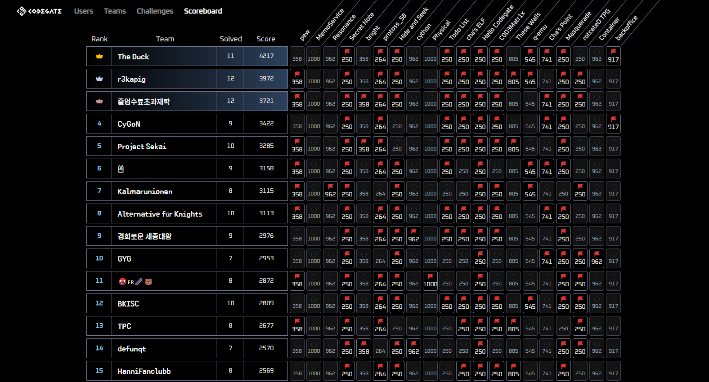
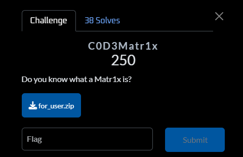
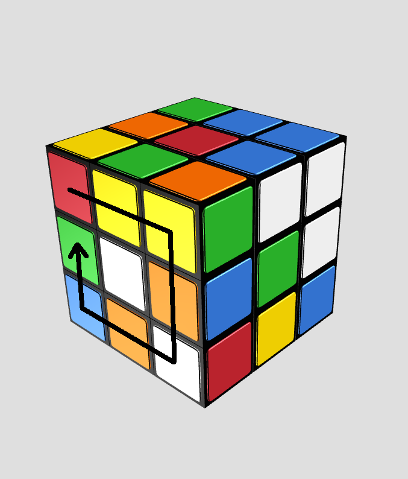
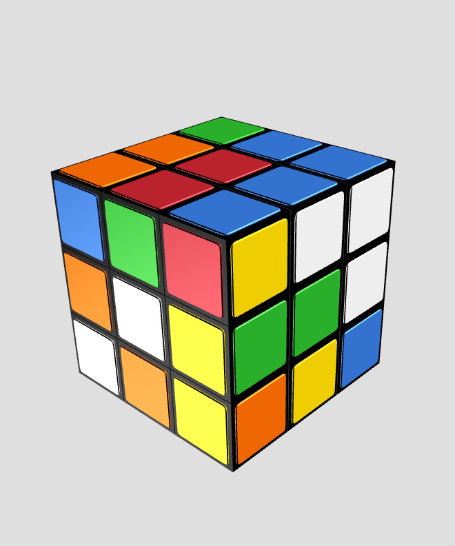
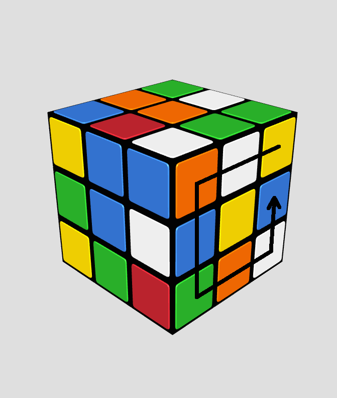
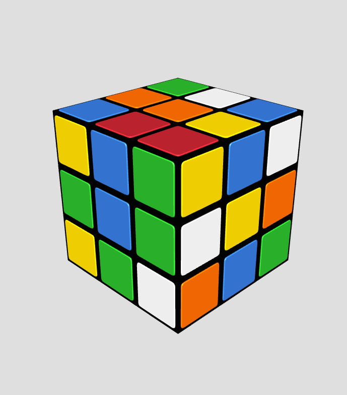
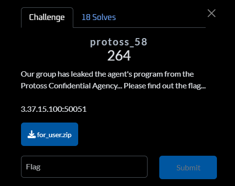
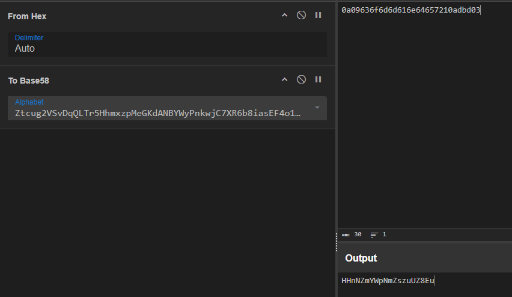

## Intro 

Finally, a technical post after lots of travelling 🗿

During the weekend, I participated in Codegate 2025 CTF Preliminary as a part of team `BKISC`, and we finished 12th - secured a slot in the finals.



I mainly contributed in solving `C0D3Matr1x` and `protoss_58` in the Reverse category, so I will focus on those two challenges in this writeup.

## C0D3Matr1x

> * Do you know what a Matr1x is?
> * **Given files:** [Get it here!](https://github.com/FazeCT/ctf/blob/main/codegate2025/prob)



### Basic program flow

Judging from the challenge name and the appearance of the decompiled code, we can observe that this uses a whole bunch of matrices to check our input of length `484`.

I will start by retyping some of the matrices to the corresponding 2D representaion.

```c caption="Defined matrices within main()" showLineNumbers{1} /apply/ /components/
_DWORD v19[24][24]; // [rsp+38h] [rbp-4BA0h] BYREF
_DWORD v20[24][24]; // [rsp+938h] [rbp-42A0h] BYREF
_DWORD v21[24][24]; // [rsp+1238h] [rbp-39A0h] BYREF
_DWORD v22[24][24]; // [rsp+1B38h] [rbp-30A0h] BYREF
_DWORD v23[24][24]; // [rsp+2438h] [rbp-27A0h] BYREF
_DWORD v24[24][24]; // [rsp+2D38h] [rbp-1EA0h] BYREF
_DWORD v25[24][24]; // [rsp+3638h] [rbp-15A0h] BYREF
_DWORD v26[26][26]; // [rsp+3F38h] [rbp-CA0h] BYREF
```

The first part of `main()` fills in the `v19[24][24]` matrix - which does not involve the use of our input, so we can just dump the result out.

```c caption="" showLineNumbers{1} /apply/ /components/
for ( i = 0; i <= 11; ++i )
{
    if ( (i & 1) != 0 )
    {
        v19[23 - i][i] = 1;
        v3 = 23 - i;
        v4 = 24LL * i;
    }
    else
    {
        v19[0][25 * i] = 1;
        v3 = 23 - i;
        v4 = 24 * v3;
    }
    v19[0][v3 + v4] = 1;
}
```

The next part reads an input of length `484`, then using it to fill up the `v26[26][26]` matrix. Some of the remaining tiles are then being populated with bytes from the string `C0D3GAT3`.

```c caption="" showLineNumbers{1} /apply/ /components/
__isoc99_scanf("%484[^\n]", input);
for ( j = 2; j <= 23; ++j )
{
    for ( k = 2; k <= 23; ++k )
    {
        v5 = v7++;
        v26[j][k] = *((char *)input + v5);
    }
}
for ( m = 1; m <= 24; ++m )
{
    for ( n = 1; n <= 24; ++n )
    {
        if ( !v26[m][n] ) v26[m][n] = aC0d3gat3[(n - 1 + m - 1) % 8];
    }
}
```

Next, it calls a lot of functions to further calculate the matrices, then our final matrix of size `24 * 24` is compared with a target matrix starting from offset `0x5620`.

```c caption="" showLineNumbers{1} /apply/ /components/
for ( ii = 0; ii <= 23; ++ii )
{
    for ( jj = 0; jj <= 23; ++jj )
    {
        if ( v24[ii][jj] != target[ii][jj] )
        {
            puts("Wrong");
            return 0LL;
        }
    }
}
```

Let's resolve the functions one by one to understand how the calculating process is done.

### Function at 0x152B

We will start by retyping the parameters' type for easier understanding, which should result in this code:

```c caption="" showLineNumbers{1} /apply/ /components/
__int64 __fastcall sub_152B(_DWORD *a1, _DWORD *a2)
{
__int64 result; // rax
int i; // [rsp+14h] [rbp-Ch]
int j; // [rsp+18h] [rbp-8h]

for ( i = 0; i <= 23; ++i )
{
    for ( j = 0; j <= 23; ++j )
    {
    result = j;
    a2[24 * i + j] = a1[26 * i + 53 + j]
                    + a1[26 * i + 52 + j]
                    + a1[26 * i + 28 + j]
                    + a1[26 * i + 27 + j]
                    + a1[26 * i + 26 + j]
                    + a1[26 * i + 2 + j]
                    + a1[26 * i + 1 + j]
                    + a1[26 * i + j]
                    + a1[26 * i + 54 + j];
    }
}
return result;
}
```

This function compresses a `26 * 26` matrix into a `24 * 24` matrix, which can be rewritten using Python like this: 

```py caption="" showLineNumbers{1} /apply/ /components/
def _0x152B(matA):
    matB = [[0 for i in range(24)] for j in range(24)]
    for i in range(24):
        for j in range(24):
            matB[i][j] = matA[i][j] + matA[i][j + 1] + matA[i][j + 2] + matA[i + 1][j] + matA[i + 1][j + 1] + matA[i + 1][j + 2] + matA[i + 2][j] + matA[i + 2][j + 1] + matA[i + 2][j + 2]

    return matB
```

### Function at 0x191D

```c caption="" showLineNumbers{1} /apply/ /components/
__int64 __fastcall sub_191D(_DWORD *a1)
{
    __int64 result; // rax
    int i; // [rsp+Ch] [rbp-Ch]
    int j; // [rsp+10h] [rbp-8h]
    int v4; // [rsp+14h] [rbp-4h]

    for ( i = 0; i <= 11; ++i )
    {
        for ( j = i; ; ++j )
        {
        result = (unsigned int)(23 - i);
        if ( j >= (int)result )
            break;
        v4 = a1[24 * j + i];
        a1[24 * j + i] = a1[24 * (23 - i) + j];
        a1[24 * (23 - i) + j] = a1[24 * (23 - j) + 23 - i];
        a1[24 * (23 - j) + 23 - i] = a1[24 * i + 23 - j];
        a1[24 * i + 23 - j] = v4;
        }
    }
    return result;
}
```

This function does clockwise rotation on a `24 x 24` matrix. By clockwise rotation, imagine you are trying to rotate the leftmost face of a Rubik's cube, like the below images:

<div class="flex gap-2 [&>*>*]:my-0">



</div>

Below is the implementation of the clockwise rotation in Python.

```py caption="" showLineNumbers{1} /apply/ /components/
def _0x191D(matA):
    for i in range(12): 
        for j in range(i, 23 - i):
            matA[j][i], matA[23 - i][j], matA[23 - j][23 - i], matA[i][23 - j] = matA[23 - i][j], matA[23 - j][23 - i], matA[i][23 - j], matA[j][i]

    return matA
```

### Function at 0x1413

```c caption="" showLineNumbers{1} /apply/ /components/
__int64 __fastcall sub_1413(_DWORD *a1, _DWORD *a2, _DWORD *a3)
{
    __int64 result; // rax
    int sum; // [rsp+18h] [rbp-10h]
    int i; // [rsp+1Ch] [rbp-Ch]
    int j; // [rsp+20h] [rbp-8h]
    int k; // [rsp+24h] [rbp-4h]

    for ( i = 0; i <= 23; ++i )
    {
        for ( j = 0; j <= 23; ++j )
        {
        sum = 0;
        for ( k = 0; k <= 23; ++k )
            sum += a2[24 * k + j] * a1[24 * i + k];
        result = j;
        a3[24 * i + j] = sum % 0xFFFF;
        }
    }
    return result;
}
```

This function multiplies two matrices of size `24 x 24` and stores the result in the third matrix, which can be rescripted into this Sage snippet:

```py caption="" showLineNumbers{1} /apply/ /components/
def _0x1413(matA, matB):
    f = Zmod(0xFFFF)
    matA = matrix(f, matA)
    matB = matrix(f, matB)
    matC = (matA * matB).list()
    return [[matC[i + j * 24] for i in range(24)] for j in range(24)]
```

### Function at 0x1769

```c caption="" showLineNumbers{1} /apply/ /components/
__int64 __fastcall sub_1769(_DWORD *a1)
{
    __int64 result; // rax
    int i; // [rsp+Ch] [rbp-Ch]
    int j; // [rsp+10h] [rbp-8h]
    int v4; // [rsp+14h] [rbp-4h]

    for ( i = 0; i <= 11; ++i )
    {
        for ( j = i; ; ++j )
        {
            result = (unsigned int)(23 - i);
            if ( j >= (int)result )
                break;
            v4 = a1[24 * j + i];
            a1[24 * j + i] = a1[24 * i + 23 - j];
            a1[24 * i + 23 - j] = a1[24 * (23 - j) + 23 - i];
            a1[24 * (23 - j) + 23 - i] = a1[24 * (23 - i) + j];
            a1[24 * (23 - i) + j] = v4;
        }
    }
    return result;
}
```

This function behaves like an opposition of the one at `0x191D` earlier - which does counter-clockwise rotation on a `24 x 24` matrix. Again, imagine you are rotating the rightmost side of a Rubik's cube like the following illustrators:

<div class="flex gap-2 [&>*>*]:my-0">



</div>

This is remodeled into the following Python snippet:

```py caption="" showLineNumbers{1} /apply/ /components/
def _0x1769(matA):
    for i in range(12):
        for j in range(i, 23 - i):
            matA[j][i], matA[i][23 - j], matA[23 - j][23 - i], matA[23 - i][j] = matA[i][23 - j], matA[23 - j][23 - i], matA[23 - i][j], matA[j][i]

return matA
```

### Function at 0x1249 and 0x132E

```c caption="" showLineNumbers{1} /apply/ /components/
__int64 __fastcall sub_1249(_DWORD *a1, _DWORD *a2, _DWORD *a3)
{
    __int64 result; // rax
    int i; // [rsp+20h] [rbp-8h]
    int j; // [rsp+24h] [rbp-4h]

    for ( i = 0; i <= 23; ++i )
    {
        for ( j = 0; j <= 23; ++j )
        {
            result = (a1[24 * i + j] + a2[24 * i + j]) % 0xFFFFu;
            a3[24 * i + j] = result;
        }
    }
    return result;
}
```

This function adds two matrices of size `24 x 24` and stores the result in the third matrix.

```py caption="" showLineNumbers{1} /apply/ /components/
def _0x1249(matA, matB):
    f = Zmod(0xFFFF)
    matA = matrix(f, matA)
    matB = matrix(f, matB)
    matC = (matA + matB).list()
    return [[matC[i + j * 24] for i in range(24)] for j in range(24)]
```

Also, the function at `0x132E` behaves the same with the above one, so I will use this implementation for both of them.

### The solution 

Having analyzed (almost) everything, I proceed to write the following Sage code to reimplement the whole problem:

```py title="codematrix/problem.py" caption="The actual challenge" showLineNumbers{1} /apply/ /components/
from sage.all import *

inp = b"a" * 484 # placeholder
key = b'C0D3GAT3'

table1 = [[84, 18, 2, 2, 76, 65, 51, 81, 63, 12, 6, 24, 64, 67, 52, 71, 95, 34, 98, 33, 94, 26, 39, 77], [51, 86, 72, 44, 16, 4, 73, 2, 28, 40, 77, 28, 63, 43, 23, 25, 39, 66, 82, 70, 60, 0, 57, 65], [41, 9, 98, 39, 21, 23, 26, 29, 25, 72, 86, 18, 0, 4, 55, 74, 63, 0, 75, 25, 63, 55, 57, 36], [14, 89, 21, 184, 17, 61, 9, 33, 70, 37, 99, 63, 4, 23, 89, 95, 62, 97, 81, 30, 82, 54, 1, 27], [37, 12, 19, 58, 140, 97, 68, 46, 34, 34, 62, 98, 57, 86, 62, 30, 44, 59, 50, 13, 50, 79, 76, 67], [96, 50, 45, 21, 85, 174, 6, 90, 34, 17, 83, 85, 47, 27, 29, 19, 11, 38, 56, 33, 89, 10, 51, 82], [98, 15, 24, 83, 43, 44, 138, 1, 52, 73, 77, 3, 37, 9, 63, 24, 93, 60, 44, 36, 68, 17, 1, 24], [40, 56, 58, 77, 31, 69, 15, 16, 52, 12, 26, 46, 94, 1, 49, 89, 6, 51, 57, 7, 5, 74, 11, 53], [98, 65, 27, 21, 96, 49, 25, 39, 156, 77, 39, 79, 79, 33, 7, 56, 99, 50, 42, 88, 15, 47, 95, 21], [59, 17, 79, 94, 45, 5, 15, 14, 41, 66, 38, 60, 19, 79, 18, 43, 65, 17, 9, 6, 65, 56, 14, 7], [68, 43, 1, 62, 26, 83, 67, 44, 3, 12, 50, 0, 79, 15, 91, 96, 88, 71, 75, 16, 6, 10, 49, 71], [25, 16, 53, 10, 78, 6, 23, 7, 86, 76, 59, 88, 24, 24, 46, 75, 80, 8, 66, 29, 46, 89, 89, 52], [94, 22, 66, 4, 18, 71, 32, 33, 2, 32, 52, 5, 120, 68, 21, 64, 96, 42, 89, 39, 23, 98, 91, 96], [23, 75, 70, 8, 39, 85, 89, 66, 11, 96, 30, 88, 81, 150, 61, 25, 50, 48, 85, 86, 86, 80, 65, 28], [76, 6, 0, 76, 5, 42, 24, 53, 18, 81, 3, 25, 82, 52, 70, 8, 13, 86, 58, 54, 73, 43, 71, 70], [71, 21, 72, 83, 74, 24, 36, 67, 9, 40, 24, 38, 12, 54, 5, 112, 97, 77, 17, 39, 35, 57, 19, 88], [67, 29, 11, 52, 15, 25, 54, 37, 88, 67, 85, 88, 58, 64, 83, 51, 82, 10, 54, 89, 59, 9, 49, 89], [79, 86, 77, 22, 84, 89, 31, 27, 65, 96, 10, 81, 76, 71, 17, 78, 70, 122, 12, 61, 25, 14, 44, 41], [78, 23, 25, 63, 7, 11, 46, 40, 82, 4, 94, 94, 91, 7, 29, 12, 4, 0, 18, 34, 78, 73, 37, 52], [71, 6, 55, 45, 41, 2, 94, 52, 48, 22, 22, 73, 59, 1, 76, 16, 65, 67, 30, 34, 52, 92, 33, 2], [95, 24, 34, 11, 38, 5, 2, 74, 59, 60, 11, 28, 75, 50, 91, 21, 55, 34, 32, 92, 192, 92, 40, 75], [54, 16, 83, 92, 28, 81, 0, 79, 81, 91, 26, 33, 82, 34, 62, 12, 15, 30, 52, 13, 24, 30, 75, 48], [92, 41, 20, 90, 84, 46, 39, 14, 95, 51, 31, 28, 54, 64, 61, 64, 16, 91, 68, 10, 37, 66, 48, 4], [4, 16, 51, 91, 9, 46, 26, 59, 45, 88, 89, 8, 91, 34, 32, 0, 58, 67, 47, 47, 11, 84, 24, 138]]
table2 = [[1734, 45904, 64298, 43078, 43989, 64442, 3360, 45764, 3029, 42227, 16484, 48591, 34065, 10513, 50365, 26038, 28688, 8003, 8433, 29288, 28408, 5412, 63144, 930], [14283, 50191, 38688, 5074, 938, 18033, 49660, 8519, 63983, 47274, 33263, 8058, 57002, 35263, 49409, 10642, 58637, 32981, 42946, 1490, 2527, 44581, 52062, 42409], [38755, 47858, 34552, 39932, 17461, 28851, 43921, 17652, 17557, 57921, 17353, 52226, 42872, 20529, 39316, 56289, 59084, 63749, 32468, 28986, 7815, 42529, 58309, 11727], [38338, 63841, 42979, 64215, 8772, 57881, 32764, 19661, 1458, 13716, 63197, 24631, 11407, 1459, 15797, 21345, 36901, 56213, 46025, 25680, 44654, 63311, 46945, 63952], [169, 61708, 60605, 50840, 3106, 32440, 60069, 43896, 17279, 48976, 40352, 28897, 56296, 39744, 47525, 52212, 58514, 46582, 37279, 19251, 40687, 24218, 65472, 2743], [62399, 33411, 16863, 30579, 33204, 47623, 4054, 36819, 23823, 13233, 62896, 65467, 18357, 59895, 55171, 43494, 38593, 6166, 49930, 41933, 30852, 45548, 3169, 3959], [45386, 35583, 51065, 25197, 55129, 27777, 52317, 48410, 38389, 23905, 40094, 25235, 10513, 38744, 46800, 23508, 15256, 56447, 62076, 38934, 56905, 34165, 54599, 28214], [34357, 16021, 55494, 9415, 27480, 40175, 60044, 22572, 51680, 48445, 48206, 53260, 15457, 51703, 57875, 18579, 20934, 42799, 57844, 63335, 6776, 36175, 16955, 55861], [60691, 8843, 52521, 40756, 39293, 23838, 49546, 24921, 27014, 15416, 41078, 64552, 28612, 34641, 38624, 64253, 21190, 18694, 4467, 1116, 56688, 17907, 20548, 37550], [17034, 10712, 50770, 26525, 8511, 48899, 61633, 3690, 48600, 17809, 46521, 9560, 43309, 51334, 49199, 35279, 21397, 50552, 8312, 19167, 50943, 28353, 18965, 4873], [65005, 18060, 36843, 44778, 55411, 7047, 59227, 32949, 9069, 28823, 26711, 27459, 700, 37354, 45085, 30586, 46738, 14616, 53711, 38302, 1394, 22983, 54522, 55723], [36943, 23847, 14700, 19330, 34290, 41712, 51338, 35045, 62690, 27016, 25750, 16437, 15630, 5596, 46813, 52196, 11666, 16783, 39636, 44764, 64070, 9703, 8872, 44773], [6040, 57277, 52627, 1422, 10204, 60159, 43866, 14251, 46991, 24066, 36467, 15084, 63500, 28954, 37196, 56674, 58067, 28158, 13719, 9669, 44312, 58463, 14344, 60246], [13290, 27929, 64460, 41864, 45309, 49777, 60816, 16533, 17423, 9773, 46354, 25146, 25616, 25253, 27029, 40960, 47865, 58437, 9317, 42590, 46595, 49673, 45401, 27698], [285, 15406, 45629, 46201, 40271, 61231, 33598, 65039, 11955, 35707, 25051, 7622, 25908, 14321, 37007, 3453, 53850, 50832, 2857, 12832, 2431, 12826, 51908, 1963], [29614, 56142, 19045, 38560, 25840, 24389, 7799, 11747, 56588, 42184, 13279, 64207, 10673, 1995, 9387, 10777, 17394, 12947, 51538, 33774, 3585, 16972, 11468, 8651], [28703, 18983, 20016, 19164, 2118, 55909, 57841, 54991, 5569, 60792, 53234, 7273, 61189, 56659, 11193, 5121, 3837, 28721, 61401, 22416, 5304, 42438, 64115, 8076], [24945, 42091, 50468, 35448, 11715, 25020, 1186, 56772, 29636, 35920, 53180, 13192, 29680, 59724, 34254, 8380, 36616, 26599, 58824, 27069, 18111, 27108, 61476, 62907], [43921, 3122, 22504, 52272, 50826, 42483, 61375, 24436, 3711, 14719, 61483, 11857, 4094, 13006, 63082, 42653, 37809, 58687, 63572, 24760, 42914, 61271, 27270, 50122], [37860, 45809, 1424, 36037, 61111, 26173, 25361, 56086, 37524, 33433, 189, 64673, 54591, 32352, 65348, 42028, 43249, 20853, 59808, 60180, 56164, 45170, 12665, 22994], [47103, 12000, 64768, 17149, 6139, 43121, 54222, 29625, 21292, 9289, 17832, 58522, 50123, 17559, 22593, 4567, 32008, 18115, 53086, 28764, 49188, 53372, 32534, 40343], [16017, 9375, 59815, 5349, 35893, 31341, 62441, 47350, 56541, 17565, 42276, 3896, 17680, 22685, 30881, 19130, 41957, 2515, 62283, 22277, 55885, 13104, 6473, 10569], [52844, 21145, 832, 51093, 39106, 54801, 25106, 45123, 12883, 64753, 22844, 13462, 2261, 62871, 29750, 57670, 52890, 65011, 46460, 22954, 36660, 27214, 8953, 56085], [714, 7648, 7771, 14863, 43847, 29312, 5821, 33387, 65519, 27044, 3682, 26446, 52675, 9089, 4487, 4812, 54888, 19919, 35244, 30134, 38349, 6421, 54558, 30898]]
table3 = [[-115, 0, 15, 1, -21, 49, -24, 5, 42, -2, -16, -9, 40, 46, 56, -34, 16, -25, 39, 26, 23, 42, -56, 0], [-31, -15, 7, -14, 11, 22, 13, -33, -9, 40, 31, 54, -19, -26, -20, 12, 30, 14, 44, -14, 49, -4, -4, 25], [53, 8, -45, 20, -5, 58, 16, -15, 18, 59, 45, 23, 50, 51, -33, 11, 46, -34, -15, -9, -46, -50, 3, -35], [9, 39, -13, -127, 19, -40, 30, 21, -40, 32, 37, -20, 30, 30, 29, 25, 3, 18, -12, -58, -44, -76, 39, -55], [-18, -34, 4, -16, -19, -9, -4, -35, 31, -32, 0, 59, 5, 23, 29, -40, -30, -1, 54, -13, -1, -31, 36, 56], [17, 16, -40, 18, 9, -129, 36, -33, 0, -23, 23, 43, 3, 30, 10, -4, -40, 3, -42, -40, 10, -22, 28, -36], [24, -6, -20, -2, -25, 17, -53, -6, -18, 49, -16, 14, -1, 27, -12, -72, -10, -38, -4, 0, 53, 26, 23, -28], [56, 26, 2, 57, -38, -18, 14, -123, 48, 38, -29, -12, -12, 18, -38, 31, 59, -27, -44, -56, 27, -33, -29, 19], [54, 22, -14, -29, 16, -31, 46, 30, -34, 72, -94, 24, 41, 52, -9, -13, -33, -9, 56, -5, 25, 54, 3, 43], [-13, 49, 56, 36, 43, -27, 53, -15, 7, -94, 83, -28, -28, 31, 23, -29, 44, -40, -31, 3, 0, 58, 60, -42], [-40, -27, 55, 46, -36, -22, -45, 25, -9, 22, 24, -2, 12, -30, 35, 32, 11, -2, 29, -32, -33, 42, -53, 22], [-34, -30, 33, -2, 2, 23, -28, 58, -95, -7, 20, 23, -16, 57, -12, -75, -3, 19, -26, 58, 49, -19, 45, 33], [57, 21, 47, 16, 18, 15, -22, 6, 59, -12, -25, 45, 39, 1, 27, -2, 41, -73, 25, 6, 8, -24, 9, 11], [-29, 40, -26, 26, -77, -45, -88, -30, -95, 34, -28, 1, -40, -113, 2, 6, -6, -4, -34, 27, -37, -12, -11, 35], [27, 2, 9, 13, -31, -6, 12, -14, -16, -10, 34, -9, 25, -19, -115, -9, -22, -1, 9, 41, -46, -53, -60, 28], [-36, -22, 18, 34, 25, 48, 50, 27, -51, -24, 45, 71, -38, -15, 32, 51, -24, 15, 45, 5, -55, 23, 8, 38], [43, 19, 22, -39, -37, -14, -4, -34, 8, -19, -13, 43, -36, -39, 28, 24, 63, -54, 8, -23, -27, -50, 34, 36], [38, -5, 40, -3, -8, -6, 35, -17, 26, 35, 30, -19, -37, 8, 0, -29, -57, -61, -54, 0, -16, 59, -13, -39], [-14, -26, 55, 0, 58, 24, 39, 21, 44, -22, 22, -38, -17, 3, 57, -20, -10, 2, 14, -10, 21, -40, 8, 21], [-30, -18, -35, -21, -3, -3, -8, 45, -28, 8, 20, -38, -29, -40, -40, 69, 20, -19, 28, 22, 15, 13, -34, -26], [-29, -19, -32, -14, 38, -37, 27, 54, -30, -38, 56, 39, -15, 43, -35, -3, 31, -53, -9, -47, -58, 3, 12, 25], [45, 52, -38, -10, 14, -17, -29, 12, 41, 23, -39, 16, -30, 5, 3, 27, 5, 21, 16, 41, 33, -128, 17, 23], [34, 51, 23, 22, 20, -2, 39, 55, 14, 40, 48, 56, 57, 4, 37, -23, 27, 2, 5, 35, 27, -16, -66, -39], [15, 40, -24, -29, -2, -5, 54, -25, 20, 59, -8, 8, -11, -4, 15, 58, 42, -38, -11, 31, 50, 6, 37, -56]]

def _0x1249(matA, matB):
    """
    Matrix addition in Zmod(0xFFFF)
    """
    f = Zmod(0xFFFF)
    matA = matrix(f, matA)
    matB = matrix(f, matB)
    matC = (matA + matB).list()
    return [[matC[i + j * 24] for i in range(24)] for j in range(24)]

def _0x1413(matA, matB):
    """
    Matrix multiplication in Zmod(0xFFFF)
    """
    f = Zmod(0xFFFF)
    matA = matrix(f, matA)
    matB = matrix(f, matB)
    matC = (matA * matB).list()
    return [[matC[i + j * 24] for i in range(24)] for j in range(24)]

def _0x152B(matA):
    """
    Matrix compression
    """
    matB = [[0 for i in range(24)] for j in range(24)]
    for i in range(24):
        for j in range(24):
            matB[i][j] = matA[i][j] + matA[i][j + 1] + matA[i][j + 2] + matA[i + 1][j] + matA[i + 1][j + 1] + matA[i + 1][j + 2] + matA[i + 2][j] + matA[i + 2][j + 1] + matA[i + 2][j + 2]

    return matB

def _0x1769(matA):
    """
    Matrix counter-clockwise rotation
    """
    for i in range(12):
        for j in range(i, 23 - i):
            matA[j][i], matA[i][23 - j], matA[23 - j][23 - i], matA[23 - i][j] = matA[i][23 - j], matA[23 - j][23 - i], matA[23 - i][j], matA[j][i]

    return matA

def _0x191D(matA):
    """
    Matrix clockwise rotation
    """
    for i in range(12): 
        for j in range(i, 23 - i):
            matA[j][i], matA[23 - i][j], matA[23 - j][23 - i], matA[i][23 - j] = matA[23 - i][j], matA[23 - j][23 - i], matA[i][23 - j], matA[j][i]

    return matA

mat0 = [[0 for i in range(26)] for j in range(26)]
mat1 = [[1, 0, 0, 0, 0, 0, 0, 0, 0, 0, 0, 0, 0, 0, 0, 0, 0, 0, 0, 0, 0, 0, 0, 0], [0, 0, 0, 0, 0, 0, 0, 0, 0, 0, 0, 0, 0, 0, 0, 0, 0, 0, 0, 0, 0, 0, 1, 0], [0, 0, 1, 0, 0, 0, 0, 0, 0, 0, 0, 0, 0, 0, 0, 0, 0, 0, 0, 0, 0, 0, 0, 0], [0, 0, 0, 0, 0, 0, 0, 0, 0, 0, 0, 0, 0, 0, 0, 0, 0, 0, 0, 0, 1, 0, 0, 0], [0, 0, 0, 0, 1, 0, 0, 0, 0, 0, 0, 0, 0, 0, 0, 0, 0, 0, 0, 0, 0, 0, 0, 0], [0, 0, 0, 0, 0, 0, 0, 0, 0, 0, 0, 0, 0, 0, 0, 0, 0, 0, 1, 0, 0, 0, 0, 0], [0, 0, 0, 0, 0, 0, 1, 0, 0, 0, 0, 0, 0, 0, 0, 0, 0, 0, 0, 0, 0, 0, 0, 0], [0, 0, 0, 0, 0, 0, 0, 0, 0, 0, 0, 0, 0, 0, 0, 0, 1, 0, 0, 0, 0, 0, 0, 0], [0, 0, 0, 0, 0, 0, 0, 0, 1, 0, 0, 0, 0, 0, 0, 0, 0, 0, 0, 0, 0, 0, 0, 0], [0, 0, 0, 0, 0, 0, 0, 0, 0, 0, 0, 0, 0, 0, 1, 0, 0, 0, 0, 0, 0, 0, 0, 0], [0, 0, 0, 0, 0, 0, 0, 0, 0, 0, 1, 0, 0, 0, 0, 0, 0, 0, 0, 0, 0, 0, 0, 0], [0, 0, 0, 0, 0, 0, 0, 0, 0, 0, 0, 0, 1, 0, 0, 0, 0, 0, 0, 0, 0, 0, 0, 0], [0, 0, 0, 0, 0, 0, 0, 0, 0, 0, 0, 1, 0, 0, 0, 0, 0, 0, 0, 0, 0, 0, 0, 0], [0, 0, 0, 0, 0, 0, 0, 0, 0, 0, 0, 0, 0, 1, 0, 0, 0, 0, 0, 0, 0, 0, 0, 0], [0, 0, 0, 0, 0, 0, 0, 0, 0, 1, 0, 0, 0, 0, 0, 0, 0, 0, 0, 0, 0, 0, 0, 0], [0, 0, 0, 0, 0, 0, 0, 0, 0, 0, 0, 0, 0, 0, 0, 1, 0, 0, 0, 0, 0, 0, 0, 0], [0, 0, 0, 0, 0, 0, 0, 1, 0, 0, 0, 0, 0, 0, 0, 0, 0, 0, 0, 0, 0, 0, 0, 0], [0, 0, 0, 0, 0, 0, 0, 0, 0, 0, 0, 0, 0, 0, 0, 0, 0, 1, 0, 0, 0, 0, 0, 0], [0, 0, 0, 0, 0, 1, 0, 0, 0, 0, 0, 0, 0, 0, 0, 0, 0, 0, 0, 0, 0, 0, 0, 0], [0, 0, 0, 0, 0, 0, 0, 0, 0, 0, 0, 0, 0, 0, 0, 0, 0, 0, 0, 1, 0, 0, 0, 0], [0, 0, 0, 1, 0, 0, 0, 0, 0, 0, 0, 0, 0, 0, 0, 0, 0, 0, 0, 0, 0, 0, 0, 0], [0, 0, 0, 0, 0, 0, 0, 0, 0, 0, 0, 0, 0, 0, 0, 0, 0, 0, 0, 0, 0, 1, 0, 0], [0, 1, 0, 0, 0, 0, 0, 0, 0, 0, 0, 0, 0, 0, 0, 0, 0, 0, 0, 0, 0, 0, 0, 0], [0, 0, 0, 0, 0, 0, 0, 0, 0, 0, 0, 0, 0, 0, 0, 0, 0, 0, 0, 0, 0, 0, 0, 1]]

idx = 0 
for i in range(2, 24):
    for j in range(2, 24):
        mat0[i][j] = inp[idx]
        idx += 1

for i in range(1, 25):
    for j in range(1, 25):
        if not mat0[i][j]:
            mat0[i][j] = key[(j - 1 + i - 1) % 8]

mat2 = _0x152B(mat0)
mat2 = _0x191D(mat2)
mat3 = _0x1413(mat2, mat1)
mat2 = _0x1413(mat1, mat3)
mat2 = _0x1769(mat2)
mat4 = _0x1249(mat2, table1)
mat5 = _0x1413(mat4, table2)
res = _0x1249(mat5, table3)

target = [[59, 59, 59, 59, 59, 59, 59, 59, 59, 59, 59, 59, 59, 59, 59, 59, 59, 59, 59, 59, 59, 59, 19, 61], [59, 59, 59, 59, 59, 59, 59, 59, 59, 59, 59, 59, 59, 59, 59, 59, 59, 59, 59, 59, 59, 1, 12, 61], [59, 59, 59, 59, 59, 59, 59, 59, 59, 59, 59, 59, 59, 59, 59, 59, 59, 59, 59, 4, 12, 12, 54, 54], [59, 59, 59, 59, 59, 59, 59, 59, 59, 59, 59, 59, 59, 59, 59, 59, 59, 80, 12, 12, 12, 12, 61, 6], [59, 59, 59, 59, 59, 59, 59, 59, 59, 59, 59, 59, 59, 59, 59, 5, 65, 12, 61, 54, 61, 18, 59, 59], [59, 59, 59, 59, 59, 59, 59, 59, 59, 59, 59, 59, 59, 59, 12, 61, 12, 54, 12, 31, 19, 59, 59, 59], [59, 59, 59, 59, 59, 59, 59, 59, 59, 59, 59, 79, 59, 59, 59, 24, 12, 54, 12, 61, 54, 28, 59, 59], [59, 59, 59, 59, 59, 59, 59, 59, 59, 59, 62, 84, 59, 59, 59, 59, 63, 61, 54, 12, 61, 61, 56, 55], [59, 59, 59, 59, 59, 59, 59, 59, 22, 84, 3, 84, 59, 59, 59, 59, 59, 59, 81, 12, 61, 61, 61, 61], [59, 59, 59, 59, 59, 59, 67, 84, 84, 84, 84, 68, 59, 59, 59, 59, 59, 59, 59, 59, 52, 61, 61, 12], [59, 59, 59, 59, 41, 3, 3, 84, 3, 50, 60, 59, 59, 59, 59, 38, 70, 59, 59, 59, 59, 59, 25, 31], [59, 59, 55, 84, 84, 84, 3, 73, 1, 59, 59, 59, 59, 59, 59, 18, 73, 47, 44, 59, 59, 59, 59, 59], [59, 59, 59, 61, 66, 47, 3, 84, 84, 63, 59, 59, 59, 59, 59, 38, 84, 12, 59, 59, 59, 59, 59, 59], [59, 59, 59, 59, 16, 50, 3, 3, 3, 84, 65, 64, 59, 59, 59, 6, 16, 59, 59, 59, 59, 59, 39, 49], [59, 59, 59, 59, 59, 59, 13, 50, 66, 3, 84, 84, 59, 59, 59, 59, 59, 59, 59, 59, 29, 39, 39, 75], [59, 59, 59, 59, 59, 59, 59, 59, 32, 50, 84, 73, 59, 59, 59, 59, 59, 59, 71, 36, 36, 36, 36, 75], [59, 59, 59, 59, 59, 59, 59, 59, 59, 59, 76, 68, 59, 59, 59, 59, 83, 36, 36, 36, 36, 39, 74, 59], [59, 59, 59, 59, 59, 59, 59, 59, 59, 59, 59, 59, 59, 59, 34, 39, 36, 39, 36, 36, 15, 59, 59, 59], [59, 59, 59, 59, 59, 59, 59, 59, 59, 59, 59, 59, 59, 59, 77, 36, 36, 36, 36, 36, 34, 59, 59, 59], [59, 59, 59, 59, 59, 59, 59, 59, 59, 59, 59, 59, 59, 59, 59, 79, 33, 29, 36, 36, 36, 36, 9, 59], [59, 59, 59, 59, 59, 59, 59, 59, 59, 59, 59, 59, 59, 59, 59, 59, 59, 20, 36, 36, 36, 36, 36, 36], [59, 59, 59, 59, 59, 59, 59, 59, 59, 59, 59, 59, 59, 59, 59, 59, 59, 59, 59, 82, 36, 36, 36, 36], [59, 59, 59, 59, 59, 59, 59, 59, 59, 59, 59, 59, 59, 59, 59, 59, 59, 59, 59, 59, 59, 78, 36, 36], [59, 59, 59, 59, 59, 59, 59, 59, 59, 59, 59, 59, 59, 59, 59, 59, 59, 59, 59, 59, 59, 59, 59, 10]]

assert res == target
```

The only thing left is to reverse the operations one by one to solve for the input, and here is the solution:

```py title="codematrix/solve.py" caption="The solution" showLineNumbers{1} /apply/ /components/
from sage.all import *

def _0x152B(matA):
    """
    Matrix compression
    """
    matB = [[0 for i in range(24)] for j in range(24)]
    for i in range(24):
        for j in range(24):
            matB[i][j] = matA[i][j] + matA[i][j + 1] + matA[i][j + 2] + matA[i + 1][j] + matA[i + 1][j + 1] + matA[i + 1][j + 2] + matA[i + 2][j] + matA[i + 2][j + 1] + matA[i + 2][j + 2]

    return matB

def _0x1769(matA):
    """
    Matrix counter-clockwise rotation
    """
    for i in range(12):
        for j in range(i, 23 - i):
            matA[j][i], matA[i][23 - j], matA[23 - j][23 - i], matA[23 - i][j] = matA[i][23 - j], matA[23 - j][23 - i], matA[23 - i][j], matA[j][i]

    return matA

def _0x191D(matA):
    """
    Matrix clockwise rotation
    """
    for i in range(12): 
        for j in range(i, 23 - i):
            matA[j][i], matA[23 - i][j], matA[23 - j][23 - i], matA[i][23 - j] = matA[23 - i][j], matA[23 - j][23 - i], matA[i][23 - j], matA[j][i]

    return matA

target = [[59, 59, 59, 59, 59, 59, 59, 59, 59, 59, 59, 59, 59, 59, 59, 59, 59, 59, 59, 59, 59, 59, 19, 61], [59, 59, 59, 59, 59, 59, 59, 59, 59, 59, 59, 59, 59, 59, 59, 59, 59, 59, 59, 59, 59, 1, 12, 61], [59, 59, 59, 59, 59, 59, 59, 59, 59, 59, 59, 59, 59, 59, 59, 59, 59, 59, 59, 4, 12, 12, 54, 54], [59, 59, 59, 59, 59, 59, 59, 59, 59, 59, 59, 59, 59, 59, 59, 59, 59, 80, 12, 12, 12, 12, 61, 6], [59, 59, 59, 59, 59, 59, 59, 59, 59, 59, 59, 59, 59, 59, 59, 5, 65, 12, 61, 54, 61, 18, 59, 59], [59, 59, 59, 59, 59, 59, 59, 59, 59, 59, 59, 59, 59, 59, 12, 61, 12, 54, 12, 31, 19, 59, 59, 59], [59, 59, 59, 59, 59, 59, 59, 59, 59, 59, 59, 79, 59, 59, 59, 24, 12, 54, 12, 61, 54, 28, 59, 59], [59, 59, 59, 59, 59, 59, 59, 59, 59, 59, 62, 84, 59, 59, 59, 59, 63, 61, 54, 12, 61, 61, 56, 55], [59, 59, 59, 59, 59, 59, 59, 59, 22, 84, 3, 84, 59, 59, 59, 59, 59, 59, 81, 12, 61, 61, 61, 61], [59, 59, 59, 59, 59, 59, 67, 84, 84, 84, 84, 68, 59, 59, 59, 59, 59, 59, 59, 59, 52, 61, 61, 12], [59, 59, 59, 59, 41, 3, 3, 84, 3, 50, 60, 59, 59, 59, 59, 38, 70, 59, 59, 59, 59, 59, 25, 31], [59, 59, 55, 84, 84, 84, 3, 73, 1, 59, 59, 59, 59, 59, 59, 18, 73, 47, 44, 59, 59, 59, 59, 59], [59, 59, 59, 61, 66, 47, 3, 84, 84, 63, 59, 59, 59, 59, 59, 38, 84, 12, 59, 59, 59, 59, 59, 59], [59, 59, 59, 59, 16, 50, 3, 3, 3, 84, 65, 64, 59, 59, 59, 6, 16, 59, 59, 59, 59, 59, 39, 49], [59, 59, 59, 59, 59, 59, 13, 50, 66, 3, 84, 84, 59, 59, 59, 59, 59, 59, 59, 59, 29, 39, 39, 75], [59, 59, 59, 59, 59, 59, 59, 59, 32, 50, 84, 73, 59, 59, 59, 59, 59, 59, 71, 36, 36, 36, 36, 75], [59, 59, 59, 59, 59, 59, 59, 59, 59, 59, 76, 68, 59, 59, 59, 59, 83, 36, 36, 36, 36, 39, 74, 59], [59, 59, 59, 59, 59, 59, 59, 59, 59, 59, 59, 59, 59, 59, 34, 39, 36, 39, 36, 36, 15, 59, 59, 59], [59, 59, 59, 59, 59, 59, 59, 59, 59, 59, 59, 59, 59, 59, 77, 36, 36, 36, 36, 36, 34, 59, 59, 59], [59, 59, 59, 59, 59, 59, 59, 59, 59, 59, 59, 59, 59, 59, 59, 79, 33, 29, 36, 36, 36, 36, 9, 59], [59, 59, 59, 59, 59, 59, 59, 59, 59, 59, 59, 59, 59, 59, 59, 59, 59, 20, 36, 36, 36, 36, 36, 36], [59, 59, 59, 59, 59, 59, 59, 59, 59, 59, 59, 59, 59, 59, 59, 59, 59, 59, 59, 82, 36, 36, 36, 36], [59, 59, 59, 59, 59, 59, 59, 59, 59, 59, 59, 59, 59, 59, 59, 59, 59, 59, 59, 59, 59, 78, 36, 36], [59, 59, 59, 59, 59, 59, 59, 59, 59, 59, 59, 59, 59, 59, 59, 59, 59, 59, 59, 59, 59, 59, 59, 10]]

table1 = [[84, 18, 2, 2, 76, 65, 51, 81, 63, 12, 6, 24, 64, 67, 52, 71, 95, 34, 98, 33, 94, 26, 39, 77], [51, 86, 72, 44, 16, 4, 73, 2, 28, 40, 77, 28, 63, 43, 23, 25, 39, 66, 82, 70, 60, 0, 57, 65], [41, 9, 98, 39, 21, 23, 26, 29, 25, 72, 86, 18, 0, 4, 55, 74, 63, 0, 75, 25, 63, 55, 57, 36], [14, 89, 21, 184, 17, 61, 9, 33, 70, 37, 99, 63, 4, 23, 89, 95, 62, 97, 81, 30, 82, 54, 1, 27], [37, 12, 19, 58, 140, 97, 68, 46, 34, 34, 62, 98, 57, 86, 62, 30, 44, 59, 50, 13, 50, 79, 76, 67], [96, 50, 45, 21, 85, 174, 6, 90, 34, 17, 83, 85, 47, 27, 29, 19, 11, 38, 56, 33, 89, 10, 51, 82], [98, 15, 24, 83, 43, 44, 138, 1, 52, 73, 77, 3, 37, 9, 63, 24, 93, 60, 44, 36, 68, 17, 1, 24], [40, 56, 58, 77, 31, 69, 15, 16, 52, 12, 26, 46, 94, 1, 49, 89, 6, 51, 57, 7, 5, 74, 11, 53], [98, 65, 27, 21, 96, 49, 25, 39, 156, 77, 39, 79, 79, 33, 7, 56, 99, 50, 42, 88, 15, 47, 95, 21], [59, 17, 79, 94, 45, 5, 15, 14, 41, 66, 38, 60, 19, 79, 18, 43, 65, 17, 9, 6, 65, 56, 14, 7], [68, 43, 1, 62, 26, 83, 67, 44, 3, 12, 50, 0, 79, 15, 91, 96, 88, 71, 75, 16, 6, 10, 49, 71], [25, 16, 53, 10, 78, 6, 23, 7, 86, 76, 59, 88, 24, 24, 46, 75, 80, 8, 66, 29, 46, 89, 89, 52], [94, 22, 66, 4, 18, 71, 32, 33, 2, 32, 52, 5, 120, 68, 21, 64, 96, 42, 89, 39, 23, 98, 91, 96], [23, 75, 70, 8, 39, 85, 89, 66, 11, 96, 30, 88, 81, 150, 61, 25, 50, 48, 85, 86, 86, 80, 65, 28], [76, 6, 0, 76, 5, 42, 24, 53, 18, 81, 3, 25, 82, 52, 70, 8, 13, 86, 58, 54, 73, 43, 71, 70], [71, 21, 72, 83, 74, 24, 36, 67, 9, 40, 24, 38, 12, 54, 5, 112, 97, 77, 17, 39, 35, 57, 19, 88], [67, 29, 11, 52, 15, 25, 54, 37, 88, 67, 85, 88, 58, 64, 83, 51, 82, 10, 54, 89, 59, 9, 49, 89], [79, 86, 77, 22, 84, 89, 31, 27, 65, 96, 10, 81, 76, 71, 17, 78, 70, 122, 12, 61, 25, 14, 44, 41], [78, 23, 25, 63, 7, 11, 46, 40, 82, 4, 94, 94, 91, 7, 29, 12, 4, 0, 18, 34, 78, 73, 37, 52], [71, 6, 55, 45, 41, 2, 94, 52, 48, 22, 22, 73, 59, 1, 76, 16, 65, 67, 30, 34, 52, 92, 33, 2], [95, 24, 34, 11, 38, 5, 2, 74, 59, 60, 11, 28, 75, 50, 91, 21, 55, 34, 32, 92, 192, 92, 40, 75], [54, 16, 83, 92, 28, 81, 0, 79, 81, 91, 26, 33, 82, 34, 62, 12, 15, 30, 52, 13, 24, 30, 75, 48], [92, 41, 20, 90, 84, 46, 39, 14, 95, 51, 31, 28, 54, 64, 61, 64, 16, 91, 68, 10, 37, 66, 48, 4], [4, 16, 51, 91, 9, 46, 26, 59, 45, 88, 89, 8, 91, 34, 32, 0, 58, 67, 47, 47, 11, 84, 24, 138]]
table2 = [[1734, 45904, 64298, 43078, 43989, 64442, 3360, 45764, 3029, 42227, 16484, 48591, 34065, 10513, 50365, 26038, 28688, 8003, 8433, 29288, 28408, 5412, 63144, 930], [14283, 50191, 38688, 5074, 938, 18033, 49660, 8519, 63983, 47274, 33263, 8058, 57002, 35263, 49409, 10642, 58637, 32981, 42946, 1490, 2527, 44581, 52062, 42409], [38755, 47858, 34552, 39932, 17461, 28851, 43921, 17652, 17557, 57921, 17353, 52226, 42872, 20529, 39316, 56289, 59084, 63749, 32468, 28986, 7815, 42529, 58309, 11727], [38338, 63841, 42979, 64215, 8772, 57881, 32764, 19661, 1458, 13716, 63197, 24631, 11407, 1459, 15797, 21345, 36901, 56213, 46025, 25680, 44654, 63311, 46945, 63952], [169, 61708, 60605, 50840, 3106, 32440, 60069, 43896, 17279, 48976, 40352, 28897, 56296, 39744, 47525, 52212, 58514, 46582, 37279, 19251, 40687, 24218, 65472, 2743], [62399, 33411, 16863, 30579, 33204, 47623, 4054, 36819, 23823, 13233, 62896, 65467, 18357, 59895, 55171, 43494, 38593, 6166, 49930, 41933, 30852, 45548, 3169, 3959], [45386, 35583, 51065, 25197, 55129, 27777, 52317, 48410, 38389, 23905, 40094, 25235, 10513, 38744, 46800, 23508, 15256, 56447, 62076, 38934, 56905, 34165, 54599, 28214], [34357, 16021, 55494, 9415, 27480, 40175, 60044, 22572, 51680, 48445, 48206, 53260, 15457, 51703, 57875, 18579, 20934, 42799, 57844, 63335, 6776, 36175, 16955, 55861], [60691, 8843, 52521, 40756, 39293, 23838, 49546, 24921, 27014, 15416, 41078, 64552, 28612, 34641, 38624, 64253, 21190, 18694, 4467, 1116, 56688, 17907, 20548, 37550], [17034, 10712, 50770, 26525, 8511, 48899, 61633, 3690, 48600, 17809, 46521, 9560, 43309, 51334, 49199, 35279, 21397, 50552, 8312, 19167, 50943, 28353, 18965, 4873], [65005, 18060, 36843, 44778, 55411, 7047, 59227, 32949, 9069, 28823, 26711, 27459, 700, 37354, 45085, 30586, 46738, 14616, 53711, 38302, 1394, 22983, 54522, 55723], [36943, 23847, 14700, 19330, 34290, 41712, 51338, 35045, 62690, 27016, 25750, 16437, 15630, 5596, 46813, 52196, 11666, 16783, 39636, 44764, 64070, 9703, 8872, 44773], [6040, 57277, 52627, 1422, 10204, 60159, 43866, 14251, 46991, 24066, 36467, 15084, 63500, 28954, 37196, 56674, 58067, 28158, 13719, 9669, 44312, 58463, 14344, 60246], [13290, 27929, 64460, 41864, 45309, 49777, 60816, 16533, 17423, 9773, 46354, 25146, 25616, 25253, 27029, 40960, 47865, 58437, 9317, 42590, 46595, 49673, 45401, 27698], [285, 15406, 45629, 46201, 40271, 61231, 33598, 65039, 11955, 35707, 25051, 7622, 25908, 14321, 37007, 3453, 53850, 50832, 2857, 12832, 2431, 12826, 51908, 1963], [29614, 56142, 19045, 38560, 25840, 24389, 7799, 11747, 56588, 42184, 13279, 64207, 10673, 1995, 9387, 10777, 17394, 12947, 51538, 33774, 3585, 16972, 11468, 8651], [28703, 18983, 20016, 19164, 2118, 55909, 57841, 54991, 5569, 60792, 53234, 7273, 61189, 56659, 11193, 5121, 3837, 28721, 61401, 22416, 5304, 42438, 64115, 8076], [24945, 42091, 50468, 35448, 11715, 25020, 1186, 56772, 29636, 35920, 53180, 13192, 29680, 59724, 34254, 8380, 36616, 26599, 58824, 27069, 18111, 27108, 61476, 62907], [43921, 3122, 22504, 52272, 50826, 42483, 61375, 24436, 3711, 14719, 61483, 11857, 4094, 13006, 63082, 42653, 37809, 58687, 63572, 24760, 42914, 61271, 27270, 50122], [37860, 45809, 1424, 36037, 61111, 26173, 25361, 56086, 37524, 33433, 189, 64673, 54591, 32352, 65348, 42028, 43249, 20853, 59808, 60180, 56164, 45170, 12665, 22994], [47103, 12000, 64768, 17149, 6139, 43121, 54222, 29625, 21292, 9289, 17832, 58522, 50123, 17559, 22593, 4567, 32008, 18115, 53086, 28764, 49188, 53372, 32534, 40343], [16017, 9375, 59815, 5349, 35893, 31341, 62441, 47350, 56541, 17565, 42276, 3896, 17680, 22685, 30881, 19130, 41957, 2515, 62283, 22277, 55885, 13104, 6473, 10569], [52844, 21145, 832, 51093, 39106, 54801, 25106, 45123, 12883, 64753, 22844, 13462, 2261, 62871, 29750, 57670, 52890, 65011, 46460, 22954, 36660, 27214, 8953, 56085], [714, 7648, 7771, 14863, 43847, 29312, 5821, 33387, 65519, 27044, 3682, 26446, 52675, 9089, 4487, 4812, 54888, 19919, 35244, 30134, 38349, 6421, 54558, 30898]]
table3 = [[-115, 0, 15, 1, -21, 49, -24, 5, 42, -2, -16, -9, 40, 46, 56, -34, 16, -25, 39, 26, 23, 42, -56, 0], [-31, -15, 7, -14, 11, 22, 13, -33, -9, 40, 31, 54, -19, -26, -20, 12, 30, 14, 44, -14, 49, -4, -4, 25], [53, 8, -45, 20, -5, 58, 16, -15, 18, 59, 45, 23, 50, 51, -33, 11, 46, -34, -15, -9, -46, -50, 3, -35], [9, 39, -13, -127, 19, -40, 30, 21, -40, 32, 37, -20, 30, 30, 29, 25, 3, 18, -12, -58, -44, -76, 39, -55], [-18, -34, 4, -16, -19, -9, -4, -35, 31, -32, 0, 59, 5, 23, 29, -40, -30, -1, 54, -13, -1, -31, 36, 56], [17, 16, -40, 18, 9, -129, 36, -33, 0, -23, 23, 43, 3, 30, 10, -4, -40, 3, -42, -40, 10, -22, 28, -36], [24, -6, -20, -2, -25, 17, -53, -6, -18, 49, -16, 14, -1, 27, -12, -72, -10, -38, -4, 0, 53, 26, 23, -28], [56, 26, 2, 57, -38, -18, 14, -123, 48, 38, -29, -12, -12, 18, -38, 31, 59, -27, -44, -56, 27, -33, -29, 19], [54, 22, -14, -29, 16, -31, 46, 30, -34, 72, -94, 24, 41, 52, -9, -13, -33, -9, 56, -5, 25, 54, 3, 43], [-13, 49, 56, 36, 43, -27, 53, -15, 7, -94, 83, -28, -28, 31, 23, -29, 44, -40, -31, 3, 0, 58, 60, -42], [-40, -27, 55, 46, -36, -22, -45, 25, -9, 22, 24, -2, 12, -30, 35, 32, 11, -2, 29, -32, -33, 42, -53, 22], [-34, -30, 33, -2, 2, 23, -28, 58, -95, -7, 20, 23, -16, 57, -12, -75, -3, 19, -26, 58, 49, -19, 45, 33], [57, 21, 47, 16, 18, 15, -22, 6, 59, -12, -25, 45, 39, 1, 27, -2, 41, -73, 25, 6, 8, -24, 9, 11], [-29, 40, -26, 26, -77, -45, -88, -30, -95, 34, -28, 1, -40, -113, 2, 6, -6, -4, -34, 27, -37, -12, -11, 35], [27, 2, 9, 13, -31, -6, 12, -14, -16, -10, 34, -9, 25, -19, -115, -9, -22, -1, 9, 41, -46, -53, -60, 28], [-36, -22, 18, 34, 25, 48, 50, 27, -51, -24, 45, 71, -38, -15, 32, 51, -24, 15, 45, 5, -55, 23, 8, 38], [43, 19, 22, -39, -37, -14, -4, -34, 8, -19, -13, 43, -36, -39, 28, 24, 63, -54, 8, -23, -27, -50, 34, 36], [38, -5, 40, -3, -8, -6, 35, -17, 26, 35, 30, -19, -37, 8, 0, -29, -57, -61, -54, 0, -16, 59, -13, -39], [-14, -26, 55, 0, 58, 24, 39, 21, 44, -22, 22, -38, -17, 3, 57, -20, -10, 2, 14, -10, 21, -40, 8, 21], [-30, -18, -35, -21, -3, -3, -8, 45, -28, 8, 20, -38, -29, -40, -40, 69, 20, -19, 28, 22, 15, 13, -34, -26], [-29, -19, -32, -14, 38, -37, 27, 54, -30, -38, 56, 39, -15, 43, -35, -3, 31, -53, -9, -47, -58, 3, 12, 25], [45, 52, -38, -10, 14, -17, -29, 12, 41, 23, -39, 16, -30, 5, 3, 27, 5, 21, 16, 41, 33, -128, 17, 23], [34, 51, 23, 22, 20, -2, 39, 55, 14, 40, 48, 56, 57, 4, 37, -23, 27, 2, 5, 35, 27, -16, -66, -39], [15, 40, -24, -29, -2, -5, 54, -25, 20, 59, -8, 8, -11, -4, 15, 58, 42, -38, -11, 31, 50, 6, 37, -56]]

f = Zmod(0xFFFF)

mat5 = matrix(f, target) - matrix(f, table3)
mat4 = matrix(f, table2).solve_left(mat5)
mat2 = mat4 - matrix(f, table1)
mat2 = mat2.list()
mat2 = [[mat2[i + j * 24] for i in range(24)] for j in range(24)]
mat1 = [[1, 0, 0, 0, 0, 0, 0, 0, 0, 0, 0, 0, 0, 0, 0, 0, 0, 0, 0, 0, 0, 0, 0, 0], [0, 0, 0, 0, 0, 0, 0, 0, 0, 0, 0, 0, 0, 0, 0, 0, 0, 0, 0, 0, 0, 0, 1, 0], [0, 0, 1, 0, 0, 0, 0, 0, 0, 0, 0, 0, 0, 0, 0, 0, 0, 0, 0, 0, 0, 0, 0, 0], [0, 0, 0, 0, 0, 0, 0, 0, 0, 0, 0, 0, 0, 0, 0, 0, 0, 0, 0, 0, 1, 0, 0, 0], [0, 0, 0, 0, 1, 0, 0, 0, 0, 0, 0, 0, 0, 0, 0, 0, 0, 0, 0, 0, 0, 0, 0, 0], [0, 0, 0, 0, 0, 0, 0, 0, 0, 0, 0, 0, 0, 0, 0, 0, 0, 0, 1, 0, 0, 0, 0, 0], [0, 0, 0, 0, 0, 0, 1, 0, 0, 0, 0, 0, 0, 0, 0, 0, 0, 0, 0, 0, 0, 0, 0, 0], [0, 0, 0, 0, 0, 0, 0, 0, 0, 0, 0, 0, 0, 0, 0, 0, 1, 0, 0, 0, 0, 0, 0, 0], [0, 0, 0, 0, 0, 0, 0, 0, 1, 0, 0, 0, 0, 0, 0, 0, 0, 0, 0, 0, 0, 0, 0, 0], [0, 0, 0, 0, 0, 0, 0, 0, 0, 0, 0, 0, 0, 0, 1, 0, 0, 0, 0, 0, 0, 0, 0, 0], [0, 0, 0, 0, 0, 0, 0, 0, 0, 0, 1, 0, 0, 0, 0, 0, 0, 0, 0, 0, 0, 0, 0, 0], [0, 0, 0, 0, 0, 0, 0, 0, 0, 0, 0, 0, 1, 0, 0, 0, 0, 0, 0, 0, 0, 0, 0, 0], [0, 0, 0, 0, 0, 0, 0, 0, 0, 0, 0, 1, 0, 0, 0, 0, 0, 0, 0, 0, 0, 0, 0, 0], [0, 0, 0, 0, 0, 0, 0, 0, 0, 0, 0, 0, 0, 1, 0, 0, 0, 0, 0, 0, 0, 0, 0, 0], [0, 0, 0, 0, 0, 0, 0, 0, 0, 1, 0, 0, 0, 0, 0, 0, 0, 0, 0, 0, 0, 0, 0, 0], [0, 0, 0, 0, 0, 0, 0, 0, 0, 0, 0, 0, 0, 0, 0, 1, 0, 0, 0, 0, 0, 0, 0, 0], [0, 0, 0, 0, 0, 0, 0, 1, 0, 0, 0, 0, 0, 0, 0, 0, 0, 0, 0, 0, 0, 0, 0, 0], [0, 0, 0, 0, 0, 0, 0, 0, 0, 0, 0, 0, 0, 0, 0, 0, 0, 1, 0, 0, 0, 0, 0, 0], [0, 0, 0, 0, 0, 1, 0, 0, 0, 0, 0, 0, 0, 0, 0, 0, 0, 0, 0, 0, 0, 0, 0, 0], [0, 0, 0, 0, 0, 0, 0, 0, 0, 0, 0, 0, 0, 0, 0, 0, 0, 0, 0, 1, 0, 0, 0, 0], [0, 0, 0, 1, 0, 0, 0, 0, 0, 0, 0, 0, 0, 0, 0, 0, 0, 0, 0, 0, 0, 0, 0, 0], [0, 0, 0, 0, 0, 0, 0, 0, 0, 0, 0, 0, 0, 0, 0, 0, 0, 0, 0, 0, 0, 1, 0, 0], [0, 1, 0, 0, 0, 0, 0, 0, 0, 0, 0, 0, 0, 0, 0, 0, 0, 0, 0, 0, 0, 0, 0, 0], [0, 0, 0, 0, 0, 0, 0, 0, 0, 0, 0, 0, 0, 0, 0, 0, 0, 0, 0, 0, 0, 0, 0, 1]]

mat2 = _0x191D(mat2)

mat3 = matrix(f, mat1).solve_right(matrix(f, mat2))
mat2 = matrix(f, mat1).solve_left(matrix(f, mat3))  
mat2 = mat2.list()
mat2 = [[mat2[i + j * 24] for i in range(24)] for j in range(24)]

mat2 = _0x1769(mat2)

flag = [[0 for i in range(26)] for j in range(26)]

P = PolynomialRing(f, [f'x_{i}' for i in range(484)])
inp = list(P.gens())
key = b'C0D3GAT3'

idx = 0 
for i in range(2, 24):
    for j in range(2, 24):
        flag[i][j] = inp[idx]
        idx += 1

for i in range(1, 25):
    for j in range(1, 25):
        if not flag[i][j]:
            flag[i][j] = key[(j - 1 + i - 1) % 8]

expect = _0x152B(flag)

t = []
for row in expect:
    t.extend(row)
a, b = Sequence(t).coefficient_matrix()

count = 0
for i in range(576):
    if a[i].list().count(1) == 1:
        count += 1

mat2 = Matrix(f, mat2).list()
mat2 = Matrix(f, mat2).T

print(bytes(a.solve_right(mat2).list()).decode())
```

``` /apply/ /components/
$ sage solve.py 
C0DEGATE 1s a gl0ba1 internationa1 hacking d3f3ns3 competition and 5ecurity conference. Held annually since 2008, C0D3GAT3 is known as the Olympics for hackers, wh3re hack3rs and security 3xperts from around the world gath3r t0 c0mpet3 for the title of the w0rld's best hack3r. In addition to fierce competition among tru3 white-hat hackers, a juni0r division is also he1d, s3rv1ng as a p1atform f0r discover1ng talented 1ndividuals 1n th3 fi3ld of cyb3rsecurity. You are good hacker.
```

Input the above string yields us the flag for this challenge.

``` /apply/ /components/
                      ·£C
                     Ì0££0½
                   ¼00VVV0££{
                 >0000£uÌ£0£0ͪ
               /Y0£V£ò   ’£00£0Í›
              0£0V0Í·      ÷0VV£V±
           ¨   30V0£V¡    r00V£Vs ¨n
          Ïù    ¸£V0££±~{£00VY@  @Y00s
        @ù2ù      ‹0£££££000±  ¢0£0V00£c
      ‡ùùùùw        ÷££0V£V‘ ƒ0Y00V£Y£000>
    i22ù2©I    öv     7ÍV¯ /££000£   00£££Í÷
  ~ùùù2çÌ      òçü?
   £™ü2ùù¸     öù0        ÂÂÂWWÂWWWWWWWÂWWWÂW
    …©222ùY´   u…     Â}    WWWWWWWWWWWWÂWQ
      ³©™2ùù        QÂÂ×     ¨€AÕWWWÂWÕŠÕ
        «©ùç      GWWWW×         âWWWh
          ìw    aWWWWÂÛ          GWWWr
              ƒÂWÂWWþ   €WWWWWWA GWú
              gWWWWWƒ   €WWWWWWA t
               ¨NQWWWW|   ÂWWWWD
                 —WWWWWWWWWWWQ
                   ¤WWWWWWÂÂ…
                     4WWWW‹
                       $7

FLAG: codegate2025{de955b80b49fcf6922e7313778fb72d3644721b19c467f95c671b527b14d97f2}
```

Flag: `codegate2025{de955b80b49fcf6922e7313778fb72d3644721b19c467f95c671b527b14d97f2}`

First blood for `BKISC` 🩸!

## protoss_58

> * Our group has leaked the agent's program from the Protoss Confidential Agency... Please find out the flag...
> * 3.37.15.100:50051
> * **Given files:** [Get it here!](https://github.com/FazeCT/ctf/blob/main/codegate2025/client)



### Overview

The given binary implements a client that uses `Golang grpc` to communicate with a server at `3.37.15.100:50051`. Running the binary, we get this output:

``` /apply/ /components/
__________                __
\______   \_______  _____/  |_  ____  ______ ______
 |     ___/\_  __ \/  _ \   __\/  _ \/  ___//  ___/
 |    |     |  | \(  <_> )  | (  <_> )___ \ \___ \
 |____|     |__|   \____/|__|  \____/____  >____  >
                                         \/     \/
_________                _____.__    .___             __  .__       .__   
\_   ___ \  ____   _____/ ____\__| __| _/____   _____/  |_|__|____  |  |  
/    \  \/ /  _ \ /    \   __\|  |/ __ |/ __ \ /    \   __\  \__  \ |  |  
\     \___(  <_> )   |  \  |  |  / /_/ \  ___/|   |  \  | |  |/ __ \|  |__
 \______  /\____/|___|  /__|  |__\____ |\___  >___|  /__| |__(____  /____/
        \/            \/              \/    \/     \/             \/      
   _____
  /  _  \    ____   ____   ____   ____ ___.__.
 /  /_\  \  / ___\_/ __ \ /    \_/ ___<   |  |
/    |    \/ /_/  >  ___/|   |  \  \___\___  |
\____|__  /\___  / \___  >___|  /\___  > ____|
        \//_____/      \/     \/     \/\/

Enter the server address: (server:port)
> 3.37.15.100:50051
Your access level is: 2

Idx Secret Titles                         Access Level
00. Xel'Naga's First Experiment           2
01. Dark Templar's Origin                 3
02. Colossus Controversy                  3
03. Mothership Relics                     4
04. Immortals and Dragoons                4
05. Psionic Matrix Vulnerability          2
06. Hidden Guardianship of Lesser Races   3
07. Void Ray Pilots                       5
08. Tal'darim's Secrets                   3
09. Protoss-Zerg Hybrids                  2
10. The location of the flag              1
What secret do you want to read?
>
```

### Basic program flow

```c caption="" showLineNumbers{1} /apply/ /components/
v125.str = (uint8 *)"Enter the server address: (server:port)\n> ";
v125.len = 42LL;
v105.array = 0LL;
v105.len = 0LL;
v105.cap = 0LL;
fmt_Fprintf(v114, v125, v105, v3, v67);
```

The client first asks for the server address then tries to connect to that server.

Next, a token is generated using the `auth_GenerateAuthData()` function, then is verified through `authServiceClient_Verify()`.

Finally, the server returns a list of secrets and their access level requirements - in which `The location of the flag` requires access level `1`.

### Function auth_GenerateAuthData()

```c caption="" showLineNumbers{1} /apply/ /components/
void __golang protoss_58_internal_auth_GenerateAuthData(string_0 username, int32 flag, string_0 _r0)
{
  // variables' definitions

  str = username.str;
  ...
  google_golang_org_protobuf_proto_Marshal(
    *(google_golang_org_protobuf_reflect_protoreflect_ProtoMessage *)(&v8 - 1),
    *(_slice_uint8_0 *)&_r0.str,
    *(error_0 *)(&v4 - 1));
  if ( !_r0.str )
  {
    ...
    math_rand_Int63((int64)v10);
    ...
    protoss_58_pkg_utils_EncodeBase58(*(_slice_uint8_0 *)(&v8 - 1), (int64)_r0.str, *(string_0 *)&_r0.len);
    ...
  }
}
```

Let's analyze how a token is generated within this function.

```c caption="The function call" /apply/ /components/
void __golang protoss_58_internal_auth_GenerateAuthData(string_0 username, int32 flag, string_0 _r0)
```

```c caption="" showLineNumbers{1} /apply/ /components/
v116.tab = (internal_abi_ITab *)&byte_975D1A;
v116.data = &unk_5;
protoss_58_internal_auth_GenerateAuthData((string_0)v116, 1, v17);
```

```/apply/ /components/
.rodata:0000000000975D1A ; const uint8 byte_975D1A
.rodata:0000000000975D1A byte_975D1A     db 'g', 'u', 'e', 's', 't'
.rodata:0000000000975D1A       
```

The first parameter of the function requires a username, which is being read from `0x975D1A` - `guest`, and has a length of `5`.

The second parameter requires an `int32` value. The original code has the function called with value `1`.

```/apply/ /components/
.text:000000000081023B                 mov     [user+8], rcx   ; username
.text:000000000081023F                 mov     ecx, [rsp+70h+flag]
.text:0000000000810246                 mov     [user+18h], ecx ; value
.text:0000000000810249                 mov     rbx, user       ; m
...
.text:0000000000810253                 call    google_golang_org_protobuf_proto_Marshal
```

The object that has the username and the value is then marshaled using [proto.Marshal()](https://pkg.go.dev/github.com/golang/protobuf/proto#Marshal).

To simulate the process, we can either debug and see the return value of the function, or use the following Python code and proto definition.

```proto3 showLineNumbers{1} title="protoss_58/message.proto" /apply/ /components/
syntax = "proto3";

message user {
    string username = 1; 
    int32 value = 2;
}
```

```bash /apply/ /components/
$ protoc --python_out=. message.proto
```

```py showLineNumbers{1} /apply/ /components/
from message_pb2 import user

obj = user()
obj.username = 'fazect'
obj.value = 1337

print(obj.SerializeToString().hex()) # 0a0666617a65637410b90a
```

The function then generates a random number, which is used as a `seed` within the encode base58 function.

Inside the `ShuffleBase58Alphabet()` function, the `seed` is used to generate another random number - to shuffle the to-be-used alphabet.

```c showLineNumbers{1} /apply/ /components/
void __golang protoss_58_pkg_utils_ShuffleBase58Alphabet(int64 seed, string_0 _r0)
{
    // variables definition

    a.array = (int32 *)0x3200000031LL;
    a.len = 0x3400000033LL;
    a.cap = 0x3600000035LL;
    ...
    v34 = 0x7600000075LL;
    v35 = 0x7800000077LL;
    v36 = 0x7A00000079LL;
    runtime_newobject((internal_abi_Type *)&RTYPE_rand_rngSource, _r0.str);
    v42 = v3;
    math_rand__ptr_rngSource_Seed(v3, seed);
    ...
    for ( i = 57LL; i > 0; i = (__int64)(v5.str - 1) )
    {
        _r0a.str = (uint8 *)i;
        math_rand__ptr_Rand_Intn((math_rand_Rand *)&_r0a.len, i + 1, (int)Cache);
        if ( v9 >= 0x3A )
            runtime_panicIndex();
        v5.str = _r0a.str;
        v5.len = *((unsigned int *)&a.array + (__int64)_r0a.str);
        *((_DWORD *)&a.array + (__int64)_r0a.str) = *((_DWORD *)&a.array + v9);
        *((_DWORD *)&a.array + v9) = v5.len;
    }
    ...
}
```

First, the original alphabet is loaded into an array. Then, `rand.Intn(i + 1)` is called to generate a random number for shuffling the alphabet, using this formula:

```go /apply/ /components/
alphabet[i], alphabet[rand.Intn(i + 1)] = alphabet[rand.Intn(i + 1)], alphabet[i]
```

Knowing the algorithm, we can write a golang script to generate a base58 alphabet for a specific seed:

```go showLineNumbers{1} /apply/ /components/
package main

import (
    "fmt"
    "math/rand"
)

func main() {
    seed := int64(0x1337)
    r := rand.New(rand.NewSource(seed))

	alp := []rune("123456789ABCDEFGHJKLMNPQRSTUVWXYZabcdefghijkmnopqrstuvwxyz")
	for i := 57; i >= 0; i-- {
		random := r.Intn(i + 1)
		alp[i], alp[random] = alp[random], alp[i]
	}

    fmt.Println(string(alp))
    // Ztcug2VSvDqQLTr5HhmxzpMeGKdANBYWyPnkwjC7XR6b8iasEF4o19Jf3U
}
```

The previously marshaled is base58 encoded using the shuffled alphabet, then a token is generated by concatenating the base58-encoded string with the seed, separated by a dot `.` in between.

### Leaked functions

Within the `main_main()` function, we immediately notice `main_for_test_have_to_delete()` at the very start. Even though IDA decompiled code shows nothing inside, the assembly shows `2` leaked functions inside - `auth.VerifyFlag()` and `auth.VerifyToken()`.

Suppose that the `auth.VerifyToken()` is used on the server to verify the sent token, we will analyze this one first.

#### Function `auth.VerifyToken()`

For this function, I worked with Binary Ninja's decompilation instead.

```c showLineNumbers{1}
int64_t protoss_58/internal/auth.VerifyToken(struct string authData, int32 ~r0)
{
    ...
    authData.str = rax;
    void* rax_1 = strings.genSplit(1, 0);
    
    ...
    rax_5 = protoss_58/pkg/utils.DecodeBase58();
    
    if (typ)
        return 0;
    
    ...
    google.golang.org/protobuf/proto.Unmarshal();
    int32_t rdx_2;
    
    if (!rax_7)
        rdx_2 = 0;
    else
        rdx_2 = *(uint32_t*)((char*)rax_7 + 0x18);
    
    if (rdx_2 == 1)
        return 2;
    
    int32_t rdx_3;
    
    if (!rax_7)
        rdx_3 = 0;
    else
        rdx_3 = *(uint32_t*)((char*)rax_7 + 0x18);
    
    if (rdx_3 == 0xdead)
    {
        int64_t* rcx_6;
        int64_t rdx_4;
        
        if (!rax_7)
        {
            rdx_4 = 0;
            rcx_6 = nullptr;
        }
        else
        {
            rdx_4 = *(uint64_t*)((char*)rax_7 + 0x10);
            rcx_6 = *(uint64_t*)((char*)rax_7 + 8);
        }
        
        if (rdx_4 == 9 && *(uint64_t*)rcx_6 == 'commande' && rcx_6[1] == 'r')
            return 1;
    }
    
    return 3;
}
```

Focus on some of the checks in this function, we can see that to get access level `1`, the server wants a token that is generated from the user `commander` with value `0xDEAD`.

Using the previously implemented scripts, we can forge a token that satisfies these requirements.

```py showLineNumbers{1} /apply/ /components/
from message_pb2 import user

obj = user()
obj.username = 'commander'
obj.value = 0xDEAD

print(obj.SerializeToString().hex()) # 0a09636f6d6d616e64657210adbd03
```

Using the alphabet that is generated from the seed `0x1337`, we can base58 encode the above marshaled object using [CyberChef](https://gchq.github.io/CyberChef/#recipe=From_Hex('Auto')To_Base58('Ztcug2VSvDqQLTr5HhmxzpMeGKdANBYWyPnkwjC7XR6b8iasEF4o19Jf3U')&input=MGEwOTYzNmY2ZDZkNjE2ZTY0NjU3MjEwYWRiZDAz).



That should give us this token: `HHnNZmYWpNmZszuUZ8Eu.1337`. Let's try to replace it into our client and see if we can read the location of the flag.

```py showLineNumbers{1} /apply/ /components/
from pwn import *

bp = 0x810E45

io = process('./client', aslr=False)

token = b'HHnNZmYWpNmZszuUZ8Eu.1337'
length = len(token)

cmdlist = f"""
    b *0x810E45
    c
    set $rbx={length}
"""

for i in range(length):
    cmdlist += f"set {{char}} ($rax+{i}) = {token[i]}\n"

cmdlist += "c\n"
gdb.attach(io, cmdlist)

io.sendline(b'3.37.15.100:50051')

io.recvuntil(b'> Your access level is: ')
io.sendline(b'10')
io.interactive()
```

``` /apply/ /components/
1

Idx Secret Titles                         Access Level
00. Xel'Naga's First Experiment           2
01. Dark Templar's Origin                 3
02. Colossus Controversy                  3
03. Mothership Relics                     4
04. Immortals and Dragoons                4
05. Psionic Matrix Vulnerability          2
06. Hidden Guardianship of Lesser Races   3
07. Void Ray Pilots                       5
08. Tal'darim's Secrets                   3
09. Protoss-Zerg Hybrids                  2
10. The location of the flag              1
What secret do you want to read?
> 
content : You have to explore the whole galaxy to find it. (Find verify flag function... I think you need top-level access and hidden message for this {hint : secretService.Flag})
```

The secret tells us that we should look at the `auth.VerifyFlag()` function and query the `secretService.Flag` endpoint for the flag.

#### Function `auth.VerifyFlag()`

This function verifies a hidden string of length `18`, perhaps to query for the actual flag.

The process of checking the string is fairly simple, here is the reimplementation in Python of the checker.

```py title="protoss_58/checker.py" showLineNumbers{1} /apply/ /components/
def rol(x, n):
    return ((x << n) | (x >> (8 - n))) & 0xFF

hiddenValue = b'a' * 18 # placeholder
hiddenValue = [x for x in hiddenValue]

for i in range(17):
    hiddenValue[i] = rol(rol(hiddenValue[i] ^ 0x44, 5) ^ hiddenValue[i + 1], 4)

hiddenValue[17] = rol(rol(hiddenValue[17] ^ 0x44, 5) ^ 0xA5, 4)

enc = []
for i in range(0, 18, 3):
    a = (hiddenValue[i] & 0xFC) >> 2
    b = (hiddenValue[i + 1] & 0xFC) >> 2
    c = (hiddenValue[i + 2] & 0xFC) >> 2
    d = (hiddenValue[i] & 3) << 4 | (hiddenValue[i + 1] & 3) << 2 | (hiddenValue[i + 2] & 3)
    enc.extend([a, b, c, d])

table = b'4E6nQpOkBcWmIfXorxGhg_z81qC3sv79DlRSN5PHeUZAwVYuat0TF2djJbKLyMi'
enc = bytes([table[x] for x in enc])

assert enc == b'lScv9oQ6VgELTPBdHnxp9dND'
```

We can reverse the operations to solve for an input, like so:

```py title="protoss_58/solve.py" showLineNumbers{1} /apply/ /components/
from itertools import product

def ror(x, n):
    return ((x >> n) | (x << (8 - n))) & 0xFF

enc = b'lScv9oQ6VgELTPBdHnxp9dND'
table = b'4E6nQpOkBcWmIfXorxGhg_z81qC3sv79DlRSN5PHeUZAwVYuat0TF2djJbKLyMi'

enc = [table.index(x) for x in enc]

result = []

for i in range(0, 24, 4):
    for comb in product(range(256), repeat=3):
        current = enc[i:i + 4]

        a = (comb[0] & 0xFC) >> 2
        b = (comb[1] & 0xFC) >> 2
        c = (comb[2] & 0xFC) >> 2
        d = (comb[0] & 3) << 4 | (comb[1] & 3) << 2 | (comb[2] & 3)

        if [a, b, c, d] == current:
            result += comb
            break

hiddenValue = [0] * 18
hiddenValue[17] = ror(ror(result[17], 4) ^ 0xA5, 5) ^ 0x44

for i in range(16, -1, -1):
    hiddenValue[i] = ror(ror(result[i], 4) ^ hiddenValue[i + 1], 5) ^ 0x44

print(bytes(hiddenValue).decode()) # My_1ife_F0r_Aiur!!
```

### Get the flag 

Now we have a working token `HHnNZmYWpNmZszuUZ8Eu.1337` and the hidden value `My_1ife_F0r_Aiur!!`, we should try to query for the flag from the `secretService.Flag` endpoint.

Looking into the `FlagRequest` struct, we can see how to construct an object for the request.

```c /apply/ /components/
struct __attribute__((aligned(8))) protoss_58_pkg_api_v1_FlagRequest
{
    ...
    string_0 Token;
    string_0 Hidden;
    ...
};
```

Also, we should see how the flag is returned too - which is defined in `FlagResponse` struct.

```c /apply/ /components/
struct __attribute__((aligned(8))) protoss_58_pkg_api_v1_FlagResponse
{
    ...
    int32 Status;
    string_0 Flag;
    ...
};
```

Lastly, we have to check how the service is defined. Notice the two endpoints `/secret.SecretService/Secret` and `/secret.SecretService/SecretTitles`, the server should have another endpoint `/secret.SecretService/Flag` running (according to the hint).

To get the flag, we create the following proto:

```proto3 title="protoss_58/final.proto" showLineNumbers{1} /apply/ /components/
syntax = "proto3";

package secret;

option go_package = "../";

service SecretService {
    rpc Flag(FlagRequest) returns (FlagResponse);
}

message FlagRequest {
    string token = 1;
    string hidden = 2;
}

message FlagResponse {
    int32 status = 1;
    string flag = 2;
}
```

Then, use [grpcurl](https://github.com/fullstorydev/grpcurl) to query for the flag:

```bash /apply/ /components/
$ grpcurl -plaintext -d '{"token":"HHnNZmYWpNmZszuUZ8Eu.1337", "hidden":"My_1ife_F0r_Aiur!!"}' -proto final.proto 3.37.15.100:50051 secret.SecretService/Flag
```


``` /apply/ /components/
{
  "status": 1,
  "flag": "codegate2025{c04d0a087f91f6a254b607eea68e12b91529f6b0d6f626a3773df31748661243}"
}
```

Flag: `codegate2025{c04d0a087f91f6a254b607eea68e12b91529f6b0d6f626a3773df31748661243}`