import museum from 'images/museum.jpeg'
import taipei101 from 'images/taiwan.jpg'
import { Icon } from 'astro-icon/components'

export const options = [
  {
    title: 'Option A',
    description: 'National Palace Museum',
    image: museum.src,
  },
  {
    day: 1,
    title: 'Option B',
    description: 'Taipei 101',
    image: taipei101.src,
  },
]

## Intro

Last year I went to [GCC'24 Thailand](https://gcc.ac/archive/gcc_2024/) as one of the Vietnamese students (I also have a blog about it [here](https://blog.fazect.com/blog/gcc-2024)). This time, I came back to GCC'25 Taiwan as the only staff for the Vietnamese (we did not have one last time 💀).

For this edition, Vietnam sent 3 students to participate in the main event and fully sponsored them. I got partial cover for my accommodation so I only had to pay for my flight from Ho Chi Minh City to Taoyuan City.

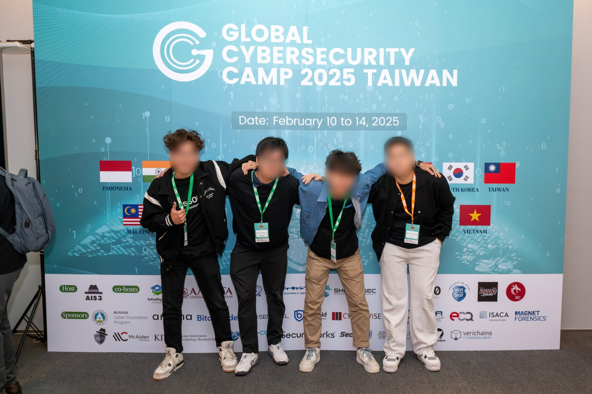
<figcaption class="text-center text-muted-foreground" style="margin-top: -10px">
image of the Vietnamese @ GCC'25
</figcaption>

I will try to not making any comparisons between the two editions of GCC'24 and GCC'25. Also, since I did not have much time to attend the classes, I will be sharing more about the actual trip to Taiwan rather than the content of this year GCC.

Anyways, information about GCC'25 Taiwan can be found [here](https://gcc.ac).

## Accommodation

It took me ~15 minutes to go from Taoyuan Int'l Airport to Chang Gung Memorial Hospital (A8) Station by Airport MRT. One ticket for a single trip cost `60NT$` ~ around `1.8$`.

Our accommodation were already booked at [Fullon Hotel Taoyuan Airport](https://www.booking.com/Share-1tSLjG4). The hotel had an entrance inside Global Mall on 2F, which was also the same floor with the exit of the MRT station.

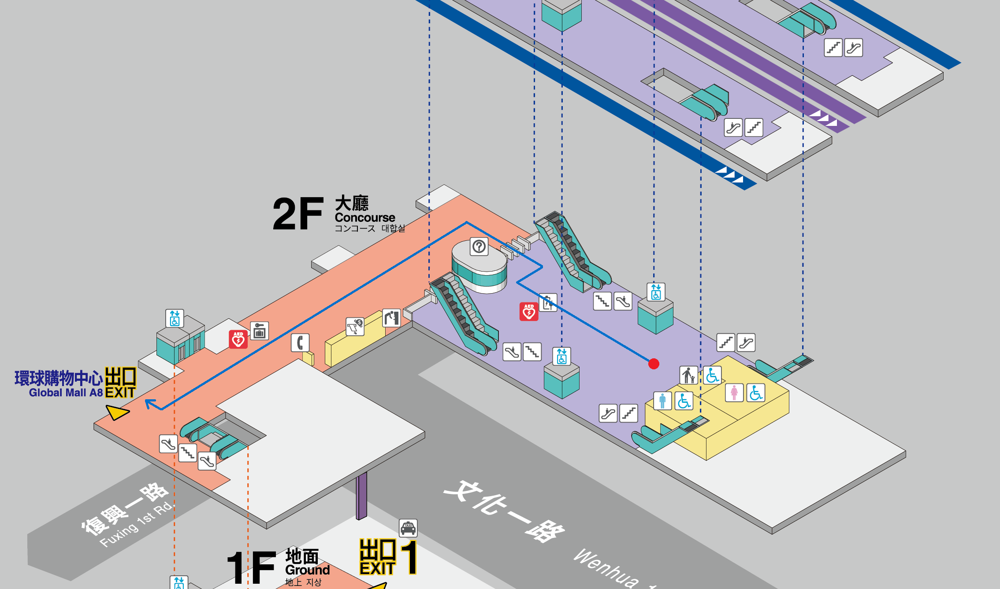
<figcaption class="text-center text-muted-foreground" style="margin-top: -10px">
how to get to the Global Mall from the exit of the MRT Station
</figcaption>

I arrived so late (it was 22:45 when I reached the hotel) that I missed the 18:00 - 21:00 ice-breaking party of the event 😭

My room was a two-bed at the price of `350$/person` for 5 days. It was pretty big (that later served as the party room for us 💀) and my roommate was one of the three staffs from India, `Abhinand`.

<figcaption class="text-center text-muted-foreground" style="margin-top: -10px">
I took this image from <a href="https://www.booking.com" target="_blank" rel="noopener noreferrer">booking.com</a> because ours was identical to this one
</figcaption>

Also, I really like the idea of them putting water dispensers in some public closets for each floor instead of water bottles inside each rooms.

## Training venue

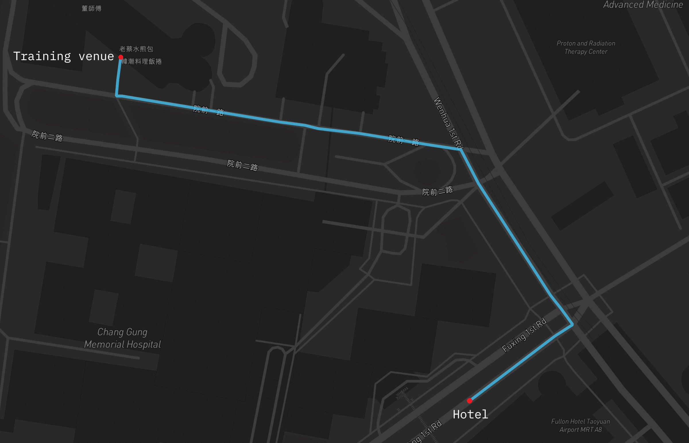

The training venue for the main event is located near the hotel, with a short 8-minute-walk distance. It was on the second floor of [Taoyuan Chang Gung Bus Terminal](https://www.google.com/maps/@25.0631692,121.3670662,3a,81.9y,263.84h,92.93t/data=!3m8!1e1!3m6!1sAF1QipO3YlfURj5lIye1ec_xoLNrvVTV7IE29ZFSOFGw!2e10!3e11!6shttps:%2F%2Flh3.googleusercontent.com%2Fp%2FAF1QipO3YlfURj5lIye1ec_xoLNrvVTV7IE29ZFSOFGw%3Dw900-h600-k-no-pi-2.9339976209015646-ya44.84454586301047-ro0-fo100!7i6144!8i3072?entry=ttu&g_ep=EgoyMDI1MDIxOS4xIKXMDSoASAFQAw%3D%3D), which had underground amenities and an underground link to the nearby Linkou Chang Gung Memorial Hospital.

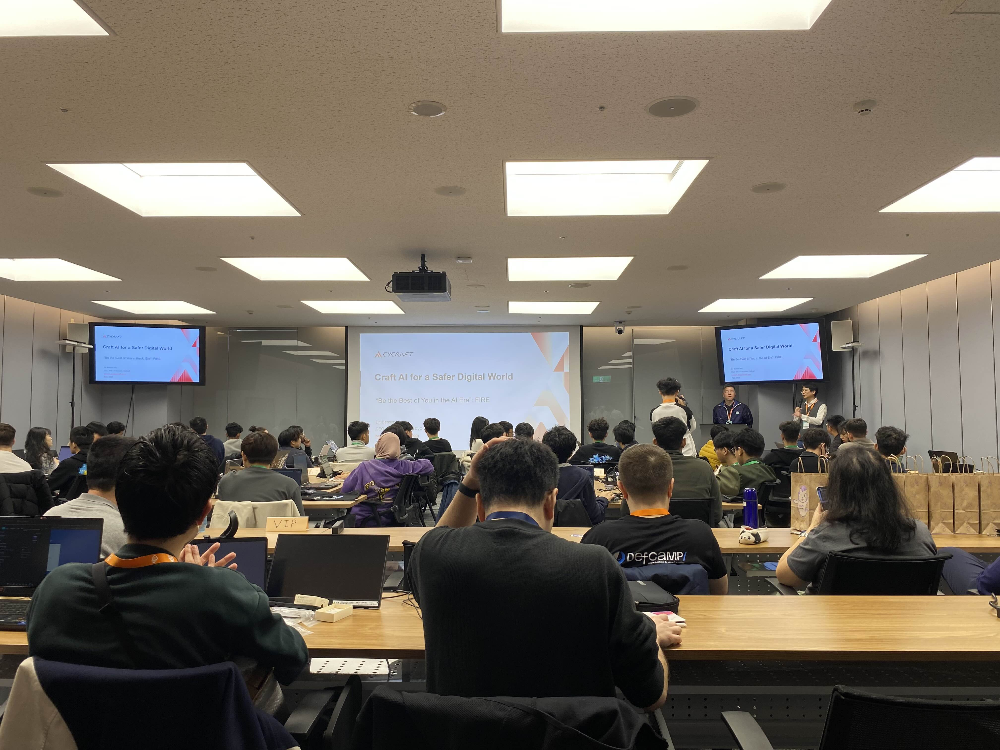
<figcaption class="text-center text-muted-foreground" style="margin-top: -10px">
the main lecture room inside the venue
</figcaption>

## GCC souvenir

Upon arriving at the training venue, we were all given a custom-made tumbler. Besides, I was also given a staff card.

*>*]:my-0">

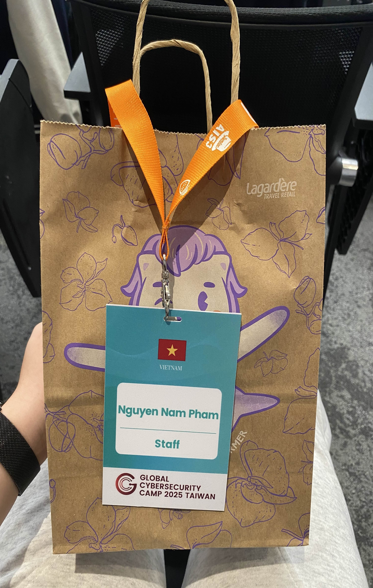

I also heard that if we used the tumbler to buy drinks, we would get a discount (but I never tried 💀).

## GCC contents

Here are some explanation about Global Cybersecurity Camp for readers that have not yet participated in GCC before:

- Lectures are conducted everyday from Monday to Thursday, from 09:00 till ~18:00 (with lunch and breaks in between).
- Students are divided into several (optimally, 8) groups. A group has 5-6 students with different nationalities.
- Four groupwork projects are assigned to the groups (so each topic will be assigned to 2 groups). Evaluation and judgement is made on Friday.

This year, we were presented with 7 different lectures, arranged properly throughout the week.

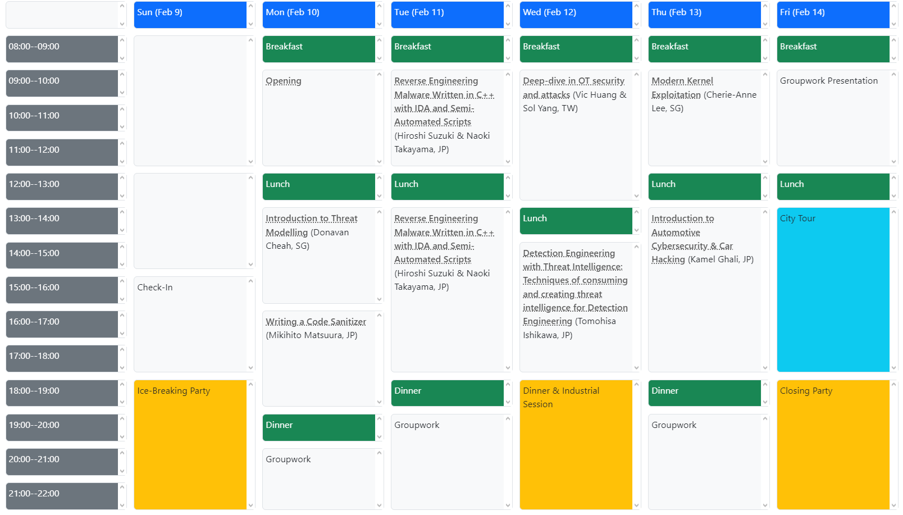
<figcaption class="text-center text-muted-foreground" style="margin-top: -10px">
the timetable of GCC'25 Taiwan
</figcaption>

And for the groupwork projects, these were the topics and their requirements:

1. Quantum Security
  - Discover different quantum computing tools (e.g., Qiskit SDK).
  - Create a sample Quantum Computing Application.
    - Show how security threats can affect it.
    - Show how to protect against them.
2. SSO Tracker: Manage Your Logins at a Glance
  - Track and manage SSO (Single Sign-On) login history.
  - Easily check which SSO was used for each service.
  - View granted permissions and linked account status at a glance.
  - Enhance security management and remove unnecessary accounts.
3. Robot Security
  - Find an online simulator based on ROS and develop a simple task for a robot.
  - Analyse cybersecurity problems with the sample robotic task and suggest how to secure it.
4. AI-based ICS Incident Investigation System
  - Analyse malicious or abnormal traffic in ICS environment or traffic recording pcap.
  - Import AI module to support multiple ICS protocol for different environments.
  - Fine tune AI module for traffic analysing.
  - Use AI to automate attacks on ICS.

The groups with Quantum Security and SSO Tracker won the joint first place. Huge congrats to the students!

## Cuisine

(I did not save the location of these restaurants, and it was a nightmare trying to OSINT some of the names while I was writing this section 💀)

To be honest I only tried some of the nearby restaurants since we had limited time for our meals, but anyways here were some of the dishes.

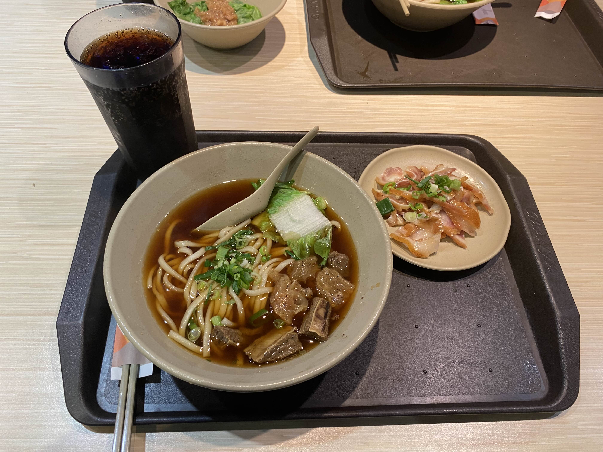

This one was at [三商巧福](https://www.3375.com.tw) on B1F of the bus terminal. The combo consisted of Taiwanese-style beef tendon noodle, stewed pork ear and one coke for `219 NT$` ~ `6.8$`. Despite the high price, I think it tasted quite good, especially the beef tendon.

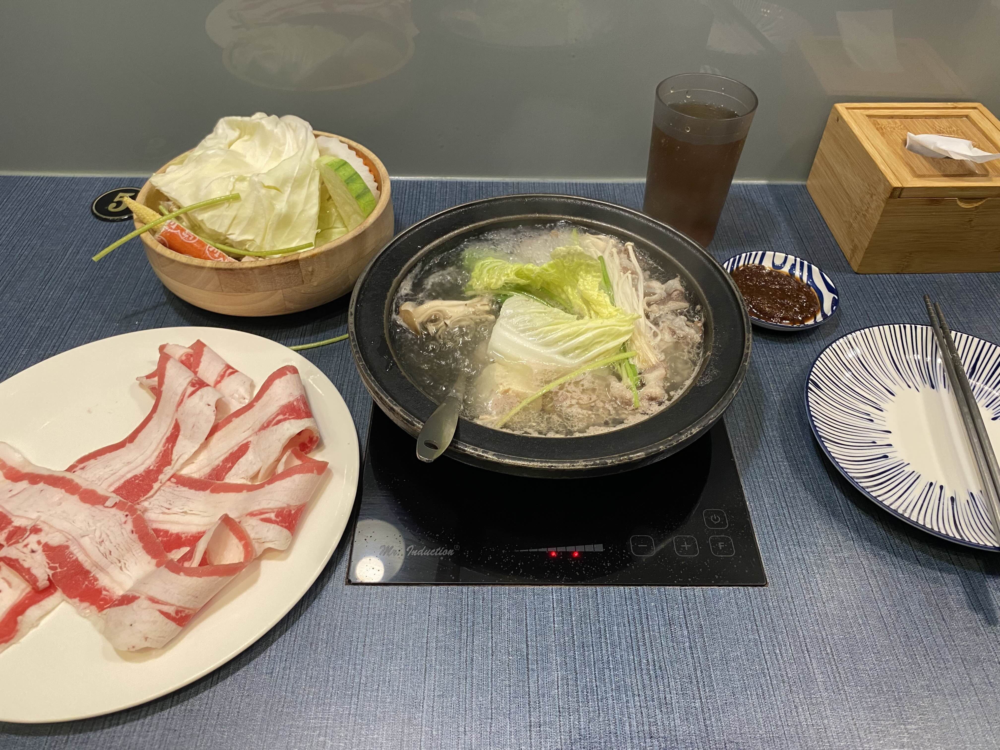

I had this for dinner on Monday, this one was at [敝姓鍋](https://www.facebook.com/p/敝姓鍋-桃園環球a8店-100064047122883/?locale=zh_TW&_rdr), which was directly to the left of Global Mall 2F entrance. This was actually the first time I ever tried single-serving hotpot, and this one was somewhere around `330 NT$` - `10$`. I really liked the freshness of the veggies, but the beef was a little bit too fatty. 

An extra point for this restaurant was that they served sweetened black tea on the self-service counter, and I really enjoyed that.

    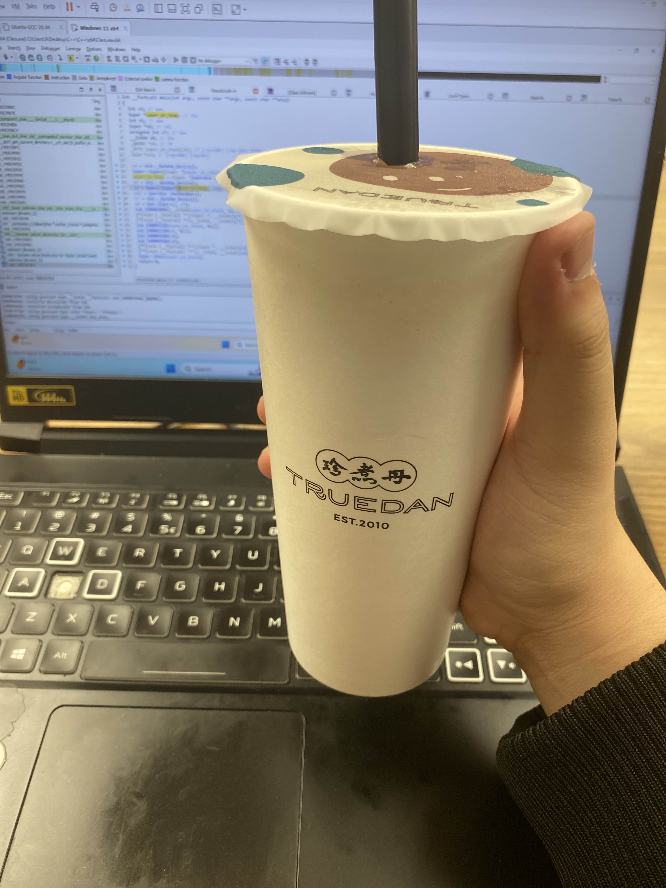

<figcaption class="text-center text-muted-foreground" style="margin-top: -10px">
IDA never leaves the screen 😉
</figcaption>

This [Truedan](https://www.truedan.com.tw/product_en.php) `85 NT$` ~ `2.6$` Brown Sugar Bubble with Milk was the only boba I had during the whole stay in Taiwan (should have tried more 😭). I chose 50% ice and 3/6 sugar, and it was totally awesome.

    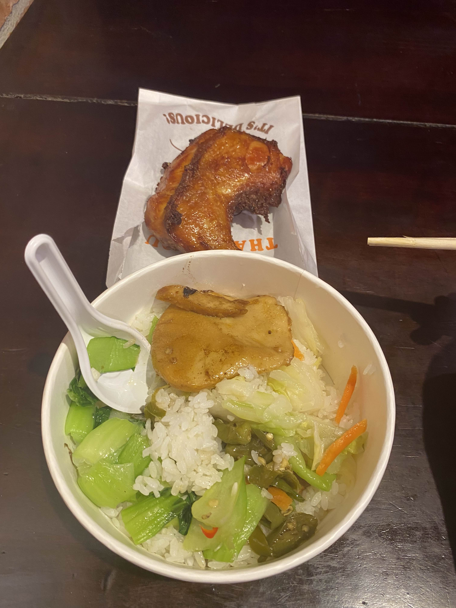

This was from a small takeaway corner of a restaurant named [六合客家麵食館](https://www.google.com/maps/@25.0587672,121.3681141,3a,23.7y,125.36h,86.17t/data=!3m7!1e1!3m5!1sXBATurIqSA_Cqnf_QG9jHw!2e0!6shttps:%2F%2Fstreetviewpixels-pa.googleapis.com%2Fv1%2Fthumbnail%3Fcb_client%3Dmaps_sv.tactile%26w%3D900%26h%3D600%26pitch%3D3.8274190785626985%26panoid%3DXBATurIqSA_Cqnf_QG9jHw%26yaw%3D125.3568819891422!7i16384!8i8192?entry=ttu&g_ep=EgoyMDI1MDIxOS4xIKXMDSoASAFQAw%3D%3D) which had the **外帯區 - takeaway** sign. We did not know the main staff for this vendor was Vietnamese until we started to argue in Vietnamese when no one understood what the menu displayed 💀

Anyways, I paid `120 NT$` - `3.7$` for a box of rice, veggies and a seasoned drumstick. The rice and veggies was normal but the drumstick was surely an 11/10. I wonder if I could recreate the dressing of it just from my own taste 😭.

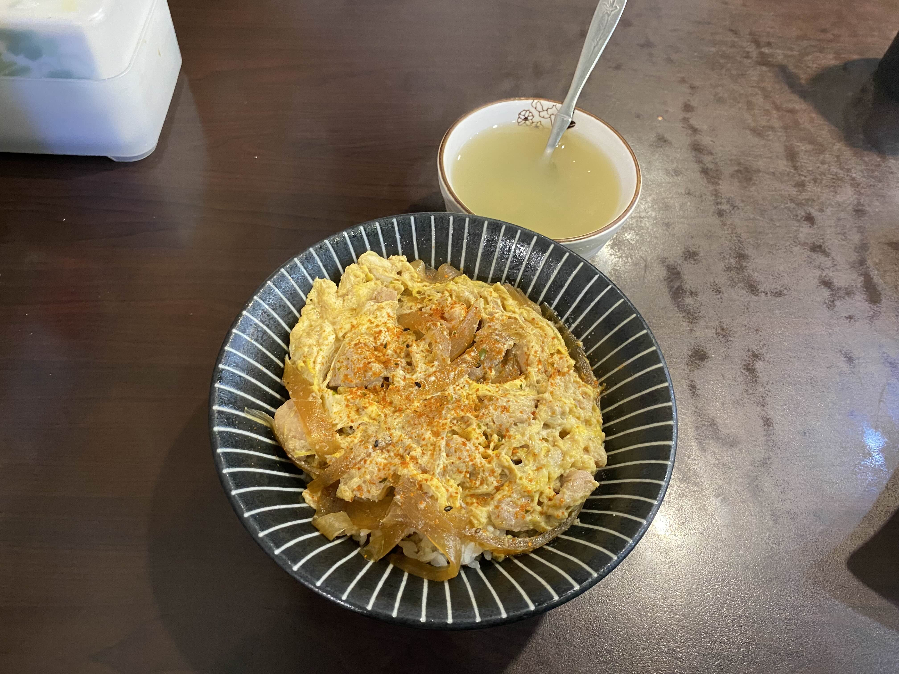

For one of the dinners, I had this oyakodon for `160 NT$` - `4.9$` in [永豐堂料理店](https://www.google.com/maps/@25.05855,121.3677797,3a,33.1y,115.53h,85.89t/data=!3m7!1e1!3m5!1sROLqIoSSkWmMcGlmlomzfA!2e0!6shttps:%2F%2Fstreetviewpixels-pa.googleapis.com%2Fv1%2Fthumbnail%3Fcb_client%3Dmaps_sv.tactile%26w%3D900%26h%3D600%26pitch%3D4.108496218751853%26panoid%3DROLqIoSSkWmMcGlmlomzfA%26yaw%3D115.53166112180642!7i16384!8i8192?entry=ttu&g_ep=EgoyMDI1MDIxOS4xIKXMDSoASAFQAw%3D%3D) - just a few steps away from the previous vendor. I really like the fact that they arranged a corner for free miso soup, and the oyakodon was delicious too.

This `150 NT$` - `4.6$` beef curry rice was at [金園排骨](https://www.kingpork.com.tw) under the training venue. The serving style was different - this was actually the first time I had seen rice and curry being separately served, but nonetheless the curry had a very interesting taste.

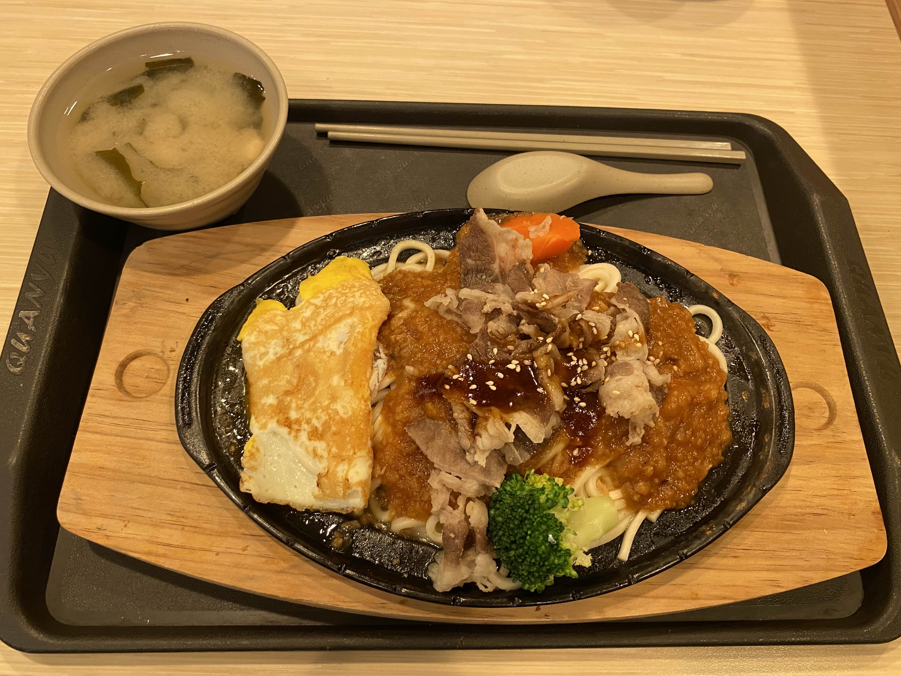

I had this for lunch at [巧竹](https://www.google.com/maps/place/%E5%B7%A7%E7%AB%B9%E7%BE%8E%E9%A3%9F%E5%B0%88%E5%AE%B6/@25.0614584,121.3671688,17z/data=!3m1!4b1!4m6!3m5!1s0x3442a73ad757acd1:0x2d1e213804f930c!8m2!3d25.0614584!4d121.3671688!16s%2Fg%2F1pzsd5qtm?entry=ttu&g_ep=EgoyMDI1MDIxOS4xIKXMDSoASAFQAw%3D%3D). I think this one was `135 NT$` - `4.1$`, which was a fairly reasonable price. The dish tasted good, but if I could change anything, it would be to reduce the greasiness by adjusting the seasonings.

Finally, here is my overall ranking table for each of the meals I tried in Taiwan - excluding breakfasts because those were included within the accommodation.

| Restaurant                                                                             | Type           | Meal      | Rating                                  |
| -------------------------------------------------------------------------------------- | -------------- | --------- | ------------------------------------------ |
| [三商巧福](https://www.3375.com.tw)                                                                                                                                                                                                                                                                                                                                                                                         | À la carte       | Lunch     | 4.5/5 |
| [敝姓鍋](https://www.facebook.com/p/敝姓鍋-桃園環球a8店-100064047122883/?locale=zh_TW&_rdr)                                                                                                                                                                                                                                                                                                                                   | Hot-pot     | Dinner     | 3.5/5    |
| [Truedan](https://www.truedan.com.tw/product_en.php)                                                                                                                                                                                                                                                                                                                                                                      | Milktea          | Snack    | 4.5/5  |
| [六合客家麵食館](https://www.google.com/maps/@25.0587672,121.3681141,3a,23.7y,125.36h,86.17t/data=!3m7!1e1!3m5!1sXBATurIqSA_Cqnf_QG9jHw!2e0!6shttps:%2F%2Fstreetviewpixels-pa.googleapis.com%2Fv1%2Fthumbnail%3Fcb_client%3Dmaps_sv.tactile%26w%3D900%26h%3D600%26pitch%3D3.8274190785626985%26panoid%3DXBATurIqSA_Cqnf_QG9jHw%26yaw%3D125.3568819891422!7i16384!8i8192?entry=ttu&g_ep=EgoyMDI1MDIxOS4xIKXMDSoASAFQAw%3D%3D)         | À la carte       | Dinner | 4.5/5    |
| [永豐堂料理店](https://www.google.com/maps/@25.05855,121.3677797,3a,33.1y,115.53h,85.89t/data=!3m7!1e1!3m5!1sROLqIoSSkWmMcGlmlomzfA!2e0!6shttps:%2F%2Fstreetviewpixels-pa.googleapis.com%2Fv1%2Fthumbnail%3Fcb_client%3Dmaps_sv.tactile%26w%3D900%26h%3D600%26pitch%3D4.108496218751853%26panoid%3DROLqIoSSkWmMcGlmlomzfA%26yaw%3D115.53166112180642!7i16384!8i8192?entry=ttu&g_ep=EgoyMDI1MDIxOS4xIKXMDSoASAFQAw%3D%3D)    | À la carte      | Dinner     | 4/5  |
| [金園排骨](https://www.kingpork.com.tw)                                                                                                                                                                                                                                                                                                                                                                                   | À la carte | Lunch     | 4/5     |
| [巧竹](https://www.google.com/maps/place/%E5%B7%A7%E7%AB%B9%E7%BE%8E%E9%A3%9F%E5%B0%88%E5%AE%B6/@25.0614584,121.3671688,17z/data=!3m1!4b1!4m6!3m5!1s0x3442a73ad757acd1:0x2d1e213804f930c!8m2!3d25.0614584!4d121.3671688!16s%2Fg%2F1pzsd5qtm?entry=ttu&g_ep=EgoyMDI1MDIxOS4xIKXMDSoASAFQAw%3D%3D)                                                                                                                          | À la carte           | Lunch     | 3.5/5  |

## City tour

This year, several hours on Friday afternoon were allocated for a tour within the city, in that participants could pre-register and decide which option to take between [National Palace Museum](https://www.npm.gov.tw/?l=2) and [Taipei 101](https://www.taipei-101.com.tw/en). 

So, which option did I choose?

  <a 
    href="/blog/gcc-2025/museum"
    class="group relative flex flex-col overflow-hidden rounded-xl border bg-card hover:bg-accent/10 hover:border-primary/50 transition-all duration-300"
  >
    
 ### National Palace Museum

    

      
    

    

      <h3 class="text-xl font-semibold tracking-tight mb-1" id="">Option A</h3>
      
National Palace Museum

      

        <Icon name="lucide:arrow-right" class="h-4 w-4" />
      

    

  </a>

  <a 
    href="/blog/gcc-2025/taipei101"
    class="group relative flex flex-col overflow-hidden rounded-xl border bg-card hover:bg-accent/10 hover:border-primary/50 transition-all duration-300"
  >
    
 ### Taipei 101

    

      
    

    
    

      <h3 class="text-xl font-semibold tracking-tight mb-1" id="">Option B</h3>
      
Taipei 101

      

        <Icon name="lucide:arrow-right" class="h-4 w-4" />
      

    

  </a>

## Random things

### Vietnamese team 

Originally, our plan was to send 4 students and 2 staff members, but things did not go as expected — one student had personal issues, and one staff member could not get a visa. So in the end, we were down to just 3 students and 1 staff.

Also, due to some ~~un~~expected issues, only one student made it to the ice-breaking party. He ended up having to do all the introductions by himself 💀

And to top it off, that same guy did not even bring his laptop to Taiwan — so I had to lend him mine for the whole week! 💀

~~On the bright side, I gave him a huge thanks for letting me enjoy the trip without having to deal with other stuff 💀~~

### Late night parties

As staff, I did not have to suffer with the group projects — and thats why I joined other staffs in late night parties.

That’s exactly why I ended up skipping several breakfasts before lectures. Priorities, I guess. 😭

    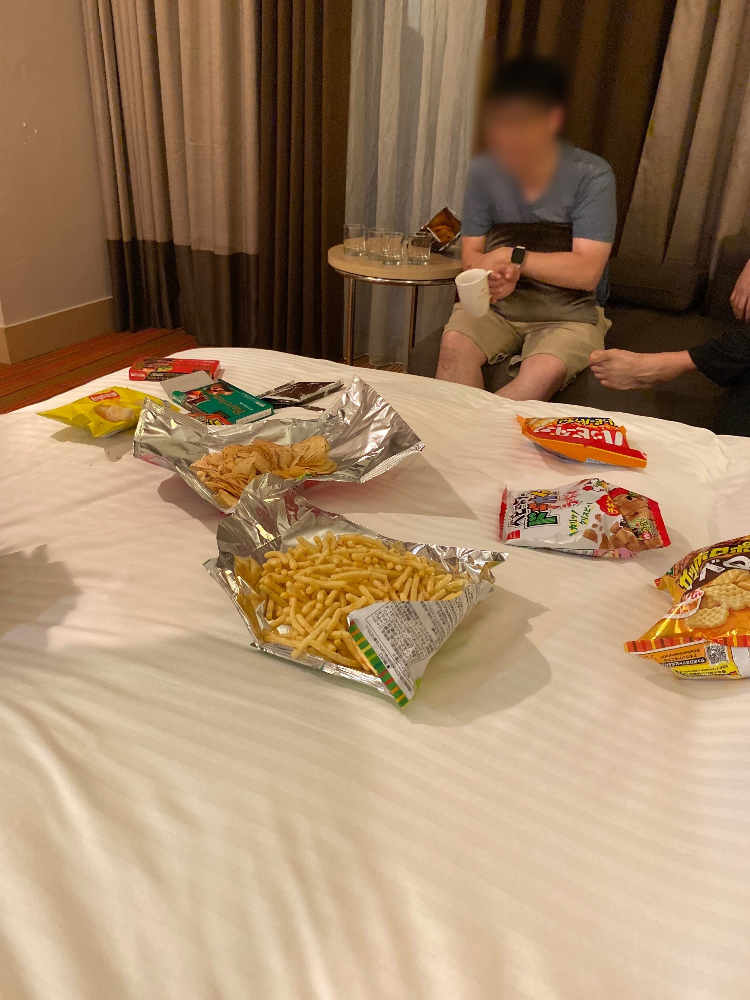

Yep, all the parties somehow ended up happening on that one staff's bed. Hope he still managed to get some good sleep after all that! 💀

Also, I had zero sleep before my flight back to Ho Chi Minh City on Saturday morning — to join the last party 💀

## Closing party

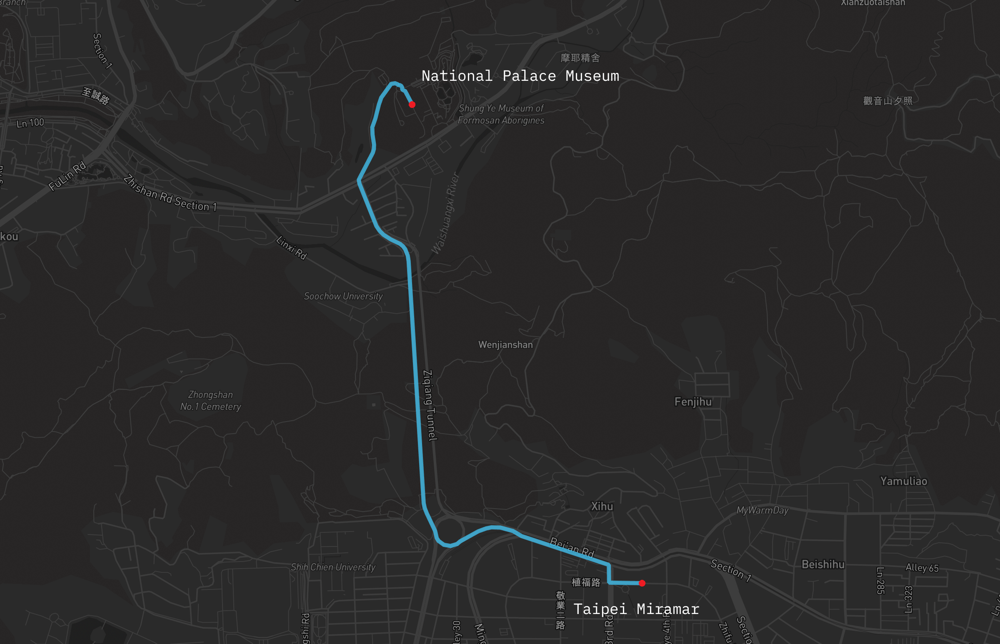

After the city tour, we all joined a closing party at [Le Ble d'Or](https://www.lebledor.com/location/miramar?utm_source=GMB&utm_medium=website-btn&utm_campaign=miramar) in [Taipei Miramar](https://www.miramar.com.tw/miramar).

But before that, we had like an hour to go around the mall and enjoy the scenery.

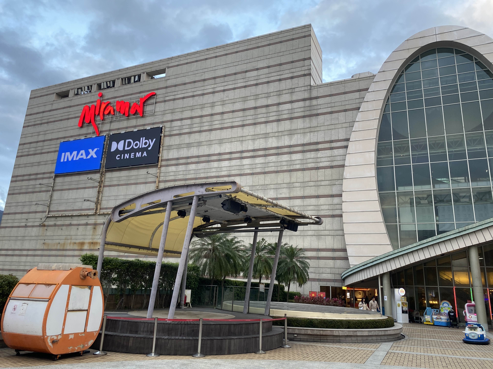

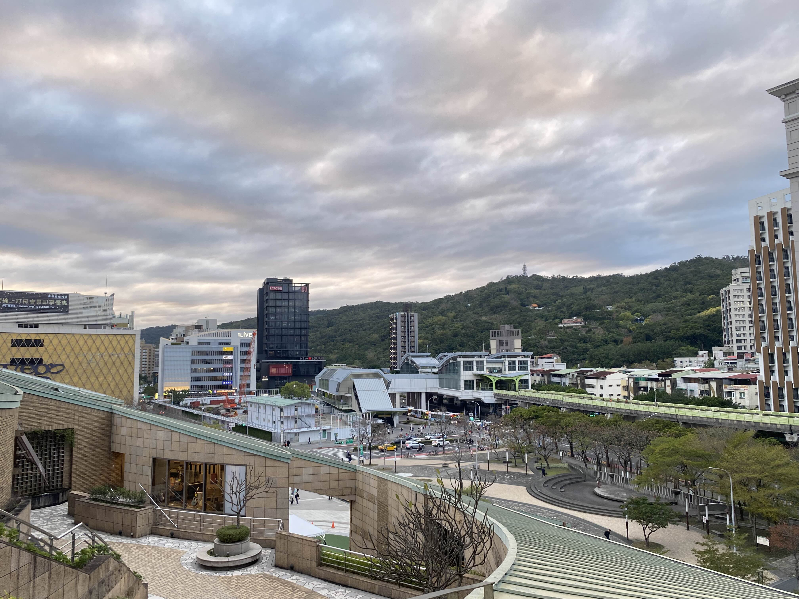
<figcaption class="text-center text-muted-foreground" style="margin-top: -10px">
it would have been way better if I captured the right moment when the train arrived 😭
</figcaption>

Okay, time's up. Time for the closing party!

To be honest, I was really tempted to wander around and chit-chat with everyone, so I did not take many pictures of the actual servings, but here were some of them.

*>*]:my-0">

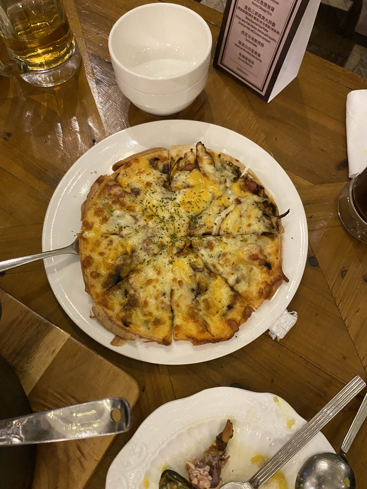

The real highlight of our closing party turned out to be the karaoke session. We had a blast singing songs from all over the world and dancing the night away!

Even the _big guys_ joined as well 💀

    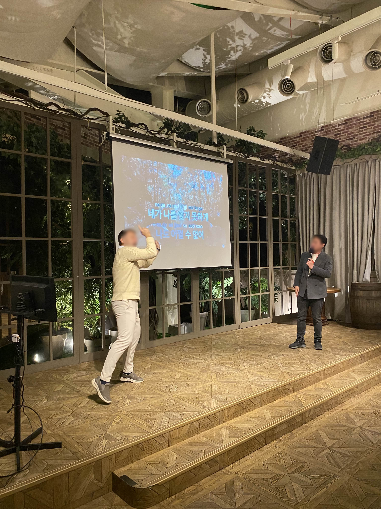

Following the earlier closing ceremony, the party served as the unofficial send-off for GCC'25 Taiwan 😭

## The end?

    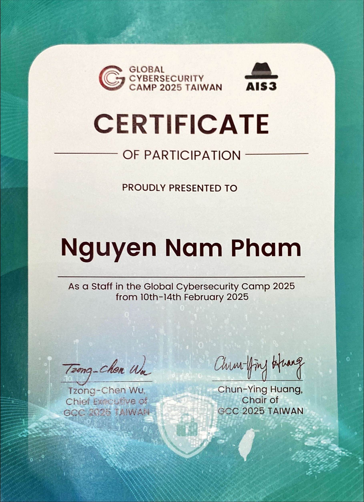

<figcaption class="text-center text-muted-foreground" style="margin-top: -10px">
GCC'25 Certificate of Participation
</figcaption>

Every journey has a beginning, a middle, and an end. But the end of this journey holds the seed of new dreams. Yes, we are proud to announce that: Next year GCC'26 will be held in Vietnam 🎊!

Having participated in both GCC'24 Thailand and GCC'25 Taiwan as different roles, I have learnt different things from different cultures. I hope we Vietnamese can adapt to the diversity and prepare well for the event next year, even though these guys already set a really high standard for us to match 💀

Psst, here is a little sneak peek on what Vietnam has to offer:

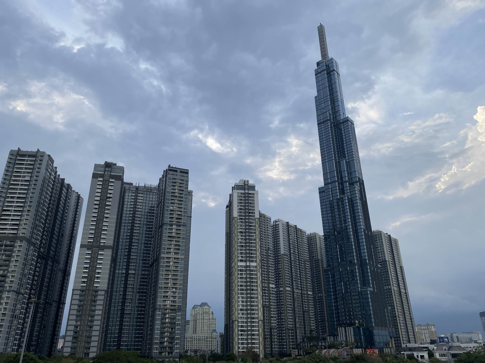

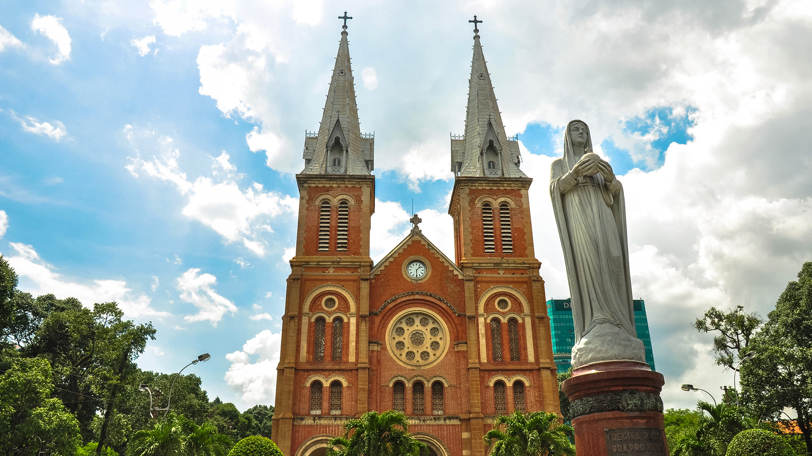
<figcaption class="text-center text-muted-foreground" style="margin-top: -10px">
[Landmark 81](https://en.wikipedia.org/wiki/Landmark_81) and [Notre-Dame Cathedral](https://en.wikipedia.org/wiki/Notre-Dame_Cathedral_Basilica_of_Saigon) - the icons of HCMC
</figcaption>

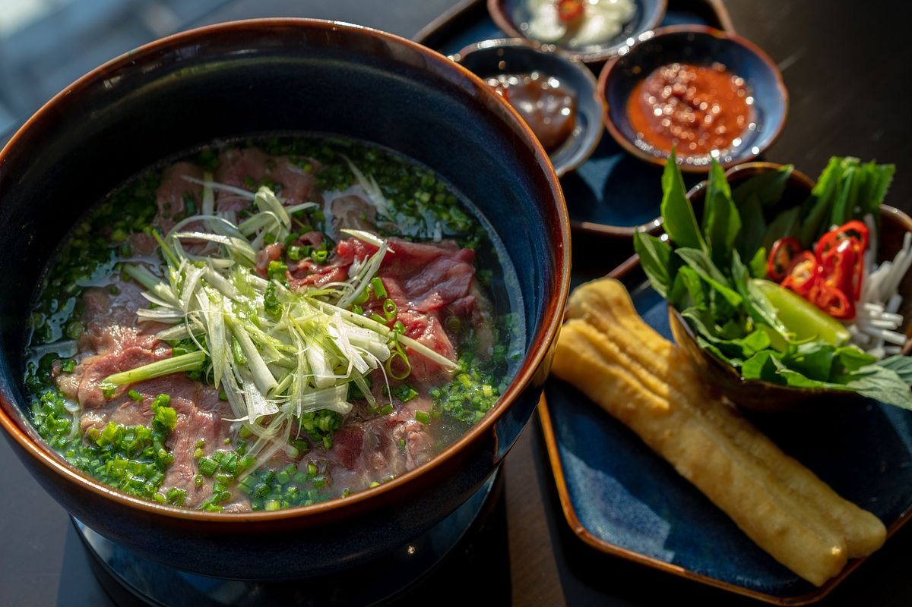

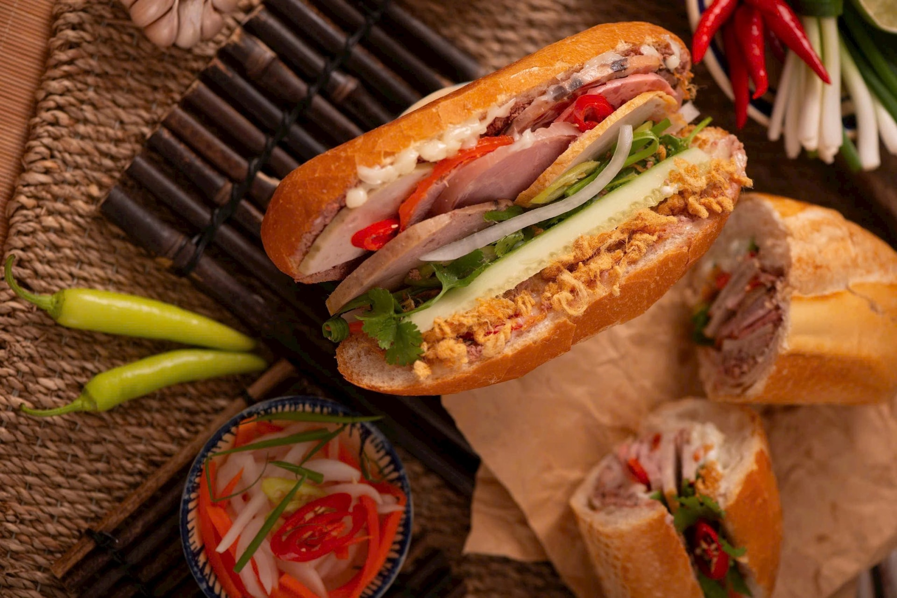
<figcaption class="text-center text-muted-foreground" style="margin-top: -10px">
Pho and Banh mi - Vietnamese cuisine's top notch
</figcaption>

Anyways, see you all in GCC'26 Vietnam, as well as in other cybersecurity events!