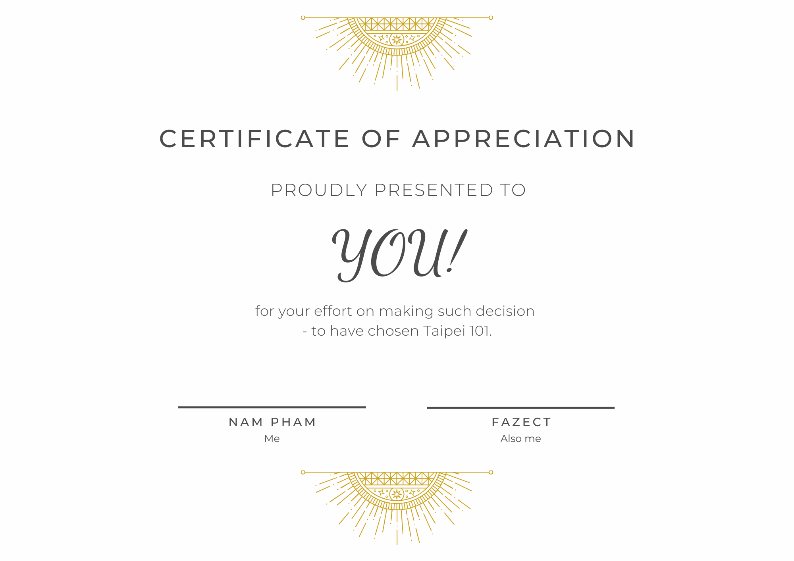

## Taipei 101

Nah, we Vietnamese did not choose this one, plus I had to return to Vietnam very early on Saturday morning so I could not go there by my own neither. Maybe next time I guess?

Anyways, here is something for you 😂

