My second time in Korea actually lol, last time was for Hacktheon Sejong 2023.

I will try my best not to turn this blog into a huge wall of text :>

Fun fact: My team name is `temot (🇻🇳)` and `temot` is how you say `T1` in Vietnamese 👀

Oh and also, information about Hacktheon Sejong 2024 can be found [here](https://hacktheon.org/eng/).

## Not even in Korea yet

The first tragedy already started even before our departure from Vietnam 💀

As planned, there are 11 students in total from my school that will participate in the event, and I would be the last to arrive at Incheon Int'l Airport.

And somehow, I arrived first - by far - not bc they chose the ~~worst airline possible in VN~~ (I'm looking at you Vietjet 👀), and I met the Malaysian team at the airport (the third time that I have met Zeynarz - or Ren - from Malaysia lol).

## Yup, Korea starts here

Let's just skip the boring 4-hour trip from the airport to the hotel in Sejong shall we 🙄

And the hotel was a HUGE upgrade compared to the accommodation in Hacktheon Sejong 2023, which was a camping site that had everything closed after 18:00 💀

*>*]:my-0">
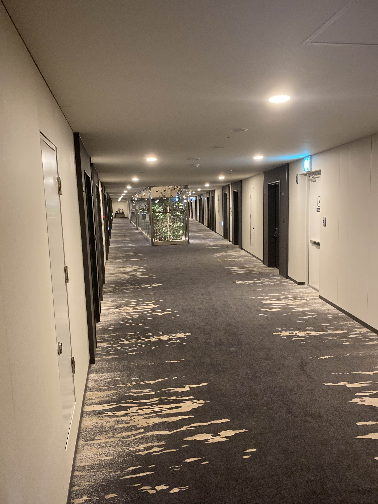

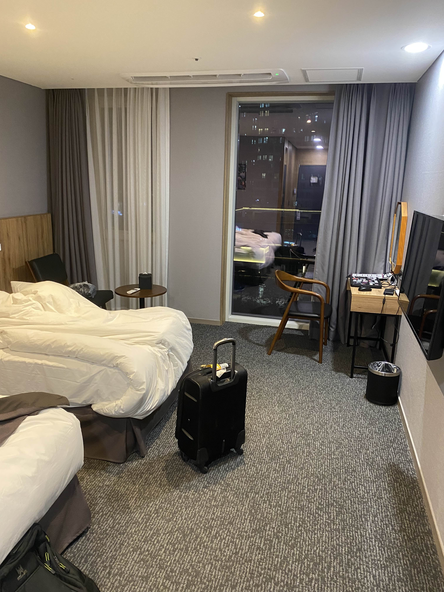

(not my teammate `Onirique` who was sleeping there, surely not 👀)

BTW this was the camping site of last year Hacktheon Sejong 2023.

After checked in, we went out for dinner, and we chose to have chicken. The meal was pretty good ~~but why every sauces are sour tho~~.

*>*]:my-0">

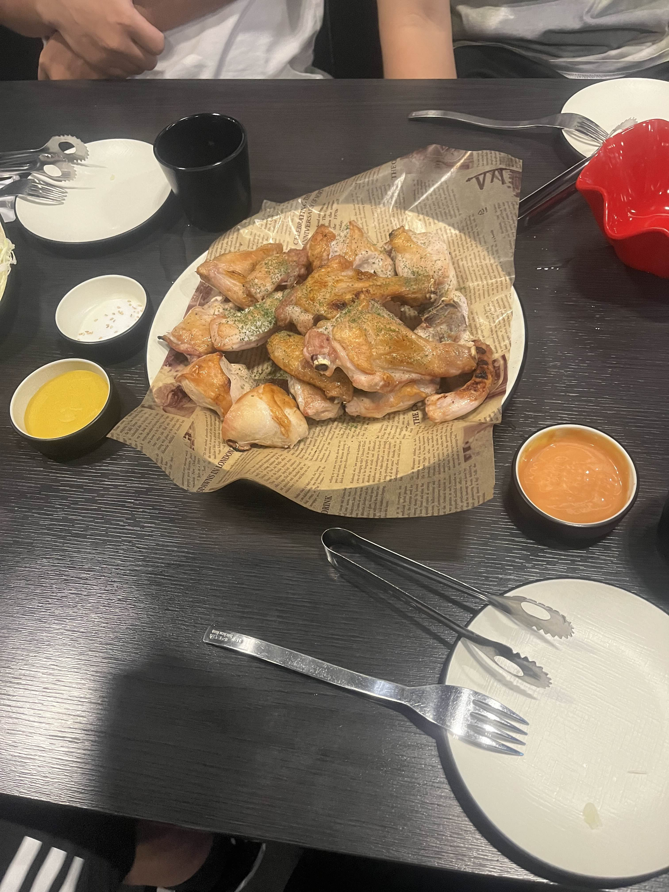

Yeah and the sky turned dark so fast after 20:00, which is not the case in Vietnam as well. And is it because the hotel is in the governmental area that the silence covered the surroundings after 22:00? 

*>*]:my-0">

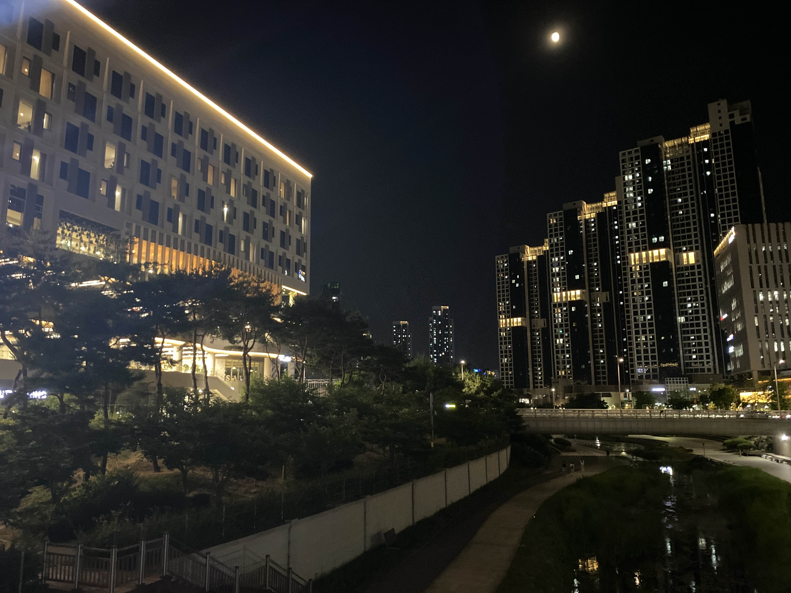

(yup I took those pictures while I were walking around alone, with Lo-fi music from my Airpod 🎧)

## The contest day

Good morning ladies and gentlemen ⛅

Yeah let's skip to the main event.

Hacktheon Sejong amazed me with how they arranged the event last time, and this time was also spot on. Beside the T-shirt, we also got a free power bank for each player.

Idk why they arranged the teams' tables by their country (which is weird).

Some Korean guys on my right even brought their own PC to the CTF. Hardcore! ☠️

It's a pity that we were one forensics challenge short from top 1-2, but hey we tried our best and got top 4 in the beginner category 🍻

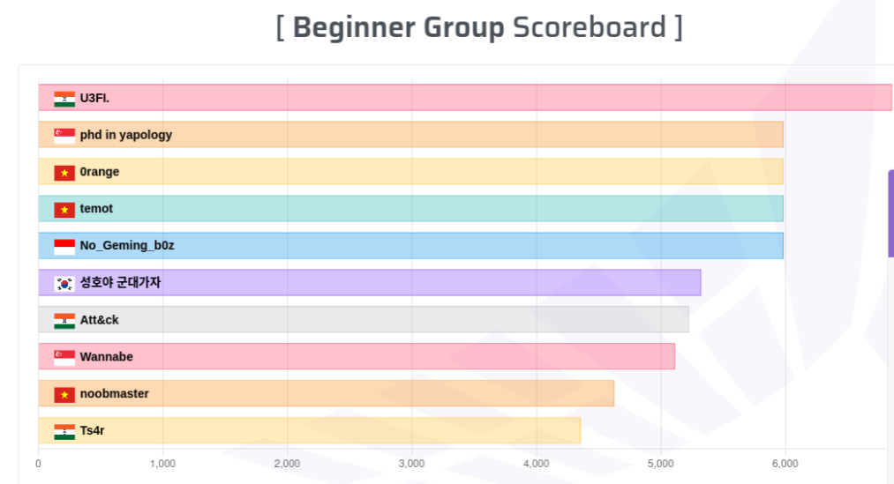

After the contest, we took a long walk from the hotel to Sejong downtown area. We tried so hard to find the exact grill restaurant that we had our dinner there last year (without any saved address), and we found it!

Dishes were all good, but the thing was we met the SAME Vietnamese waitress from last year, and it made me shocked that she said she remembered us all 😧

We hanged out with some Singaporean and Malaysian before we had a long sleep to end our contest day.

## Ending ceremony and prizes

Yeah, it was confirmed that we got top 4 - which was Honorable Mention IV. We got 500.000 KRW and a Pierre Cardin pen for each player.

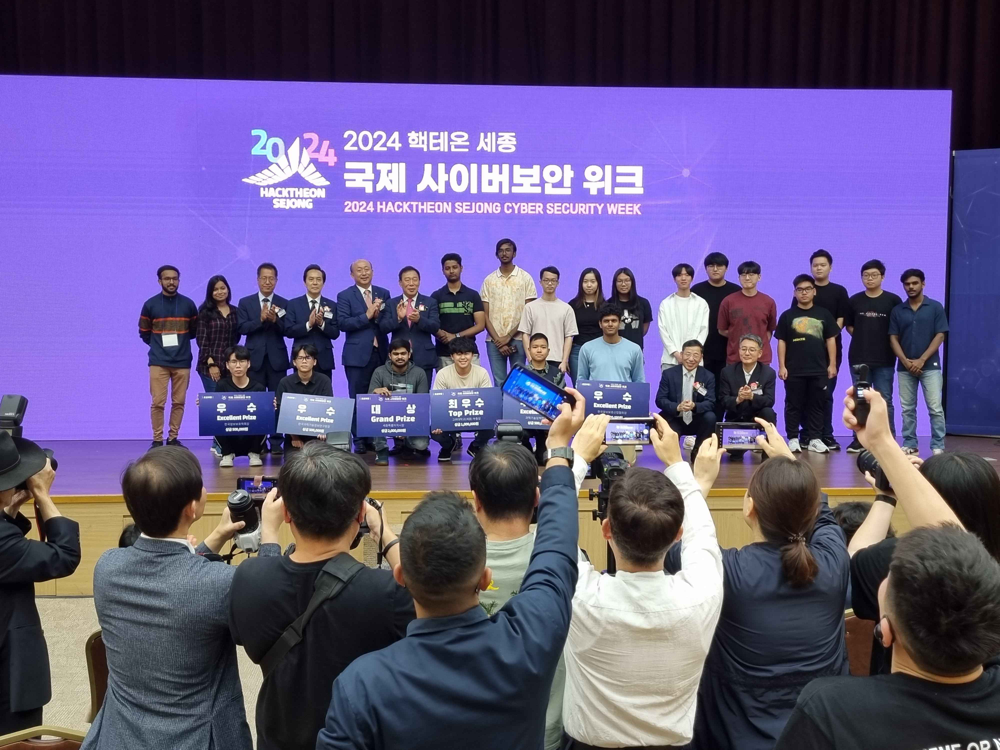

Oh, almost forgot about the lucky draw. Last year they put a Smart TV as the prize, and for this year the prizes were `Galaxy Fit x5`, `Apple Watch SE2 x2` and `PS5 x1`.

AND SOMEHOW THE INDIAN TOOK LIKE HALF OF THE PRIZES 😧

what is that luck? 😧

## GCC and THC meetups

I met the Malaysian and Singaporean GCC 2024 students at the event, and we enjoyed our time together during our stay.

Also, finally I have met Ainsetin - a pwn god ~~once from thehackerscrew~~. He was a little bit introvert so I did not take any picture with him. Sad!

## First day in Myeongdong

After the CTF, all of us headed to Myeongdong for the remaining part of the trip.

Last year we went from Sejong to Seoul Station by bus, but this time we took a bullet train from Osong Station instead.

We arrived at the same hotel as last year, but with worse rooms compared to last year's. But I didn't care because we went to Myeongdong for the fun lol. The distance to the walking street from our hotel was a 3-min walk anyway.

We enjoyed our time walking around the walking street, tried foods and bought many goods.

(bruh this lobster was like `13$` ☠️)

## Here goes the first incident

Let me introduce you to our very first incident - the clogged toilet ☠️

The toilet was clogged, the room started to smell really bad and the exhaust fan was as weak as my team.

We asked the hotel staff but received zero response, so we went down to the Emart below and bought a plunger to solve the problem by ourselves.

And, my teammate did not wash the plunger after the mission ☠️☠️☠️

I made an idea to spray perfume inside the toilet, but that really made the smell worse ☠️☠️☠️

The smell was still there for the rest of our stay ☠️

## Second day in Myeongdong

Bro I swear this was the best day of the whole trip!

We went to T1 base camp, and I was really surprised of the environment there.

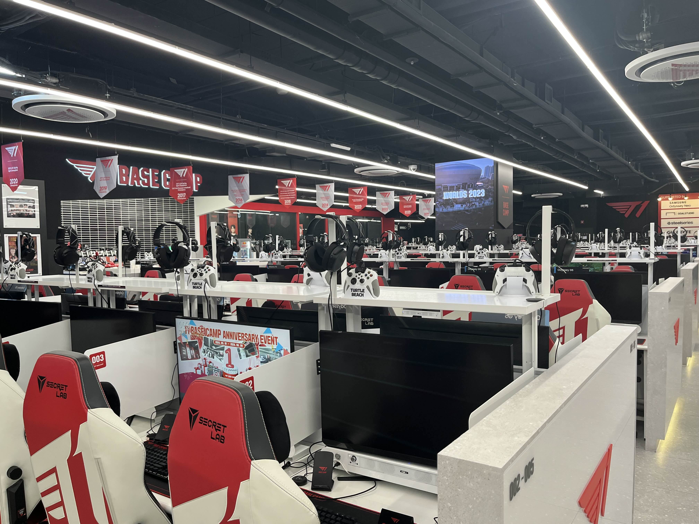

I bought so many things at the T1 souvenir store, including this cute T1 Faker figure for `25$`.

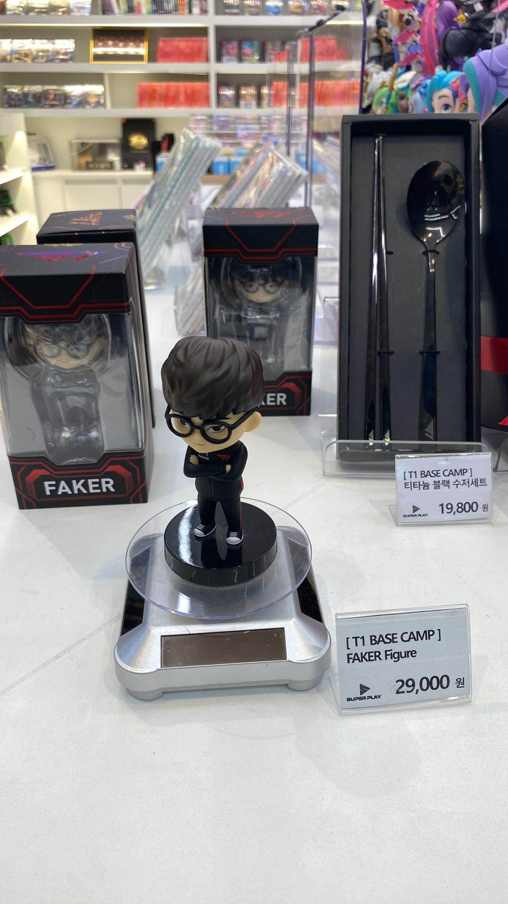

I also bought a T1 badge - World Champions edition - for `8$`, a T1 chopsticks & spoon set for `17$` and a T1 towel for `14$`.

*>*]:my-0">
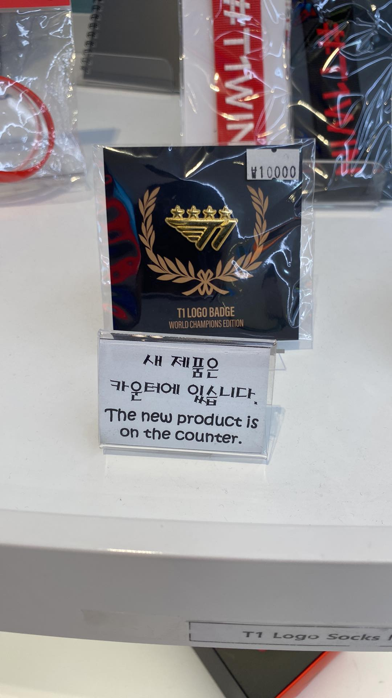

And finally, the best part is here!

I got to try some games for an hour in the internet cafe section of the base camp, and it was worth it! 

Despite the high cost (roughly `3$` for an hour), the service was spot on. All the gaming gears and things were so good, and they even provided a chargeable dock for your phone!

I also ordered a blueberry smoothie (Faker pick) for `5.5$` and it tasted good.

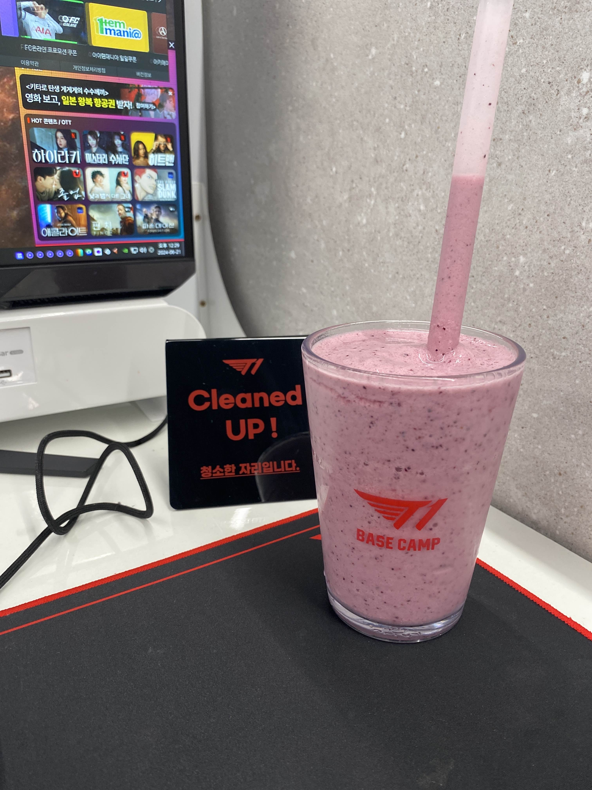

Yep, I decided to play some PUBG matches with my teammates. Best PUBG match ever lol!

After T1 base camp, we took a short walk to the nearby `AK Plaza Hongdae` to seek for anime souvenirs.

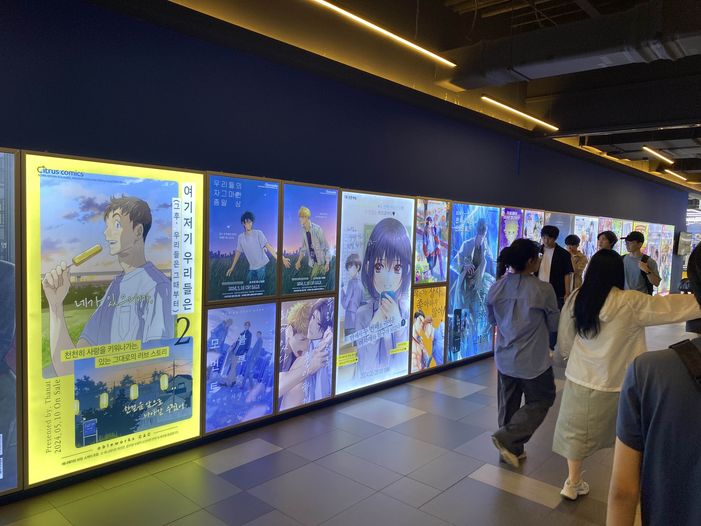

I don't usually watch anime, but I'm a HUGE fan of gacha games (Genshin Impact, Wuthering Waves, Honkai and more) so I ran straight to the Genshin corner.

*>*]:my-0">

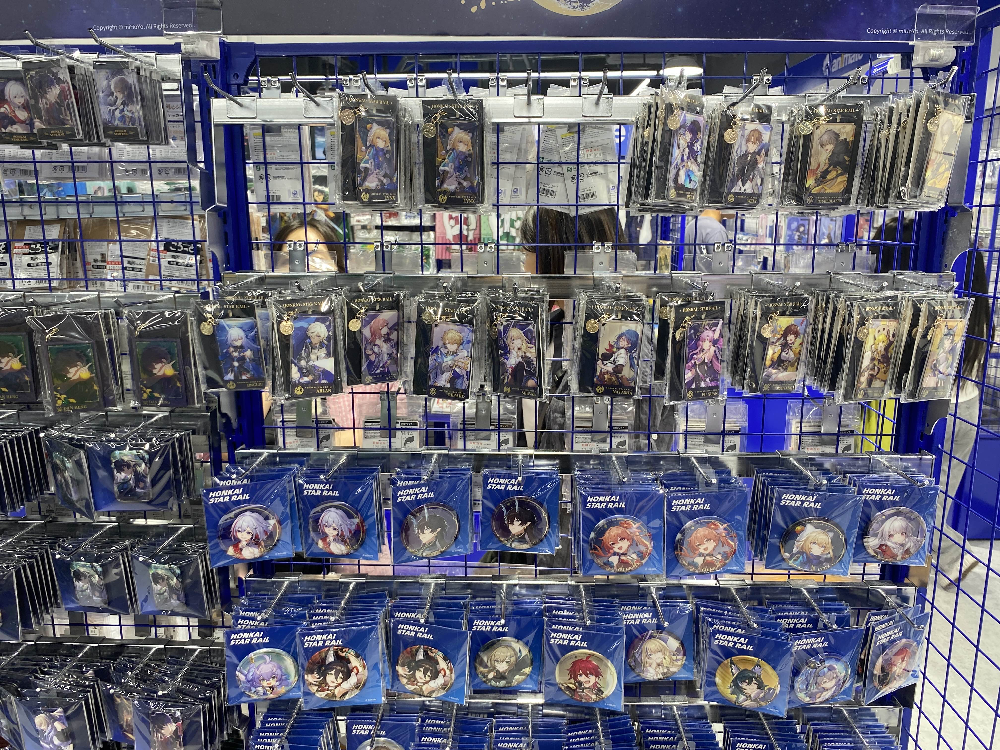

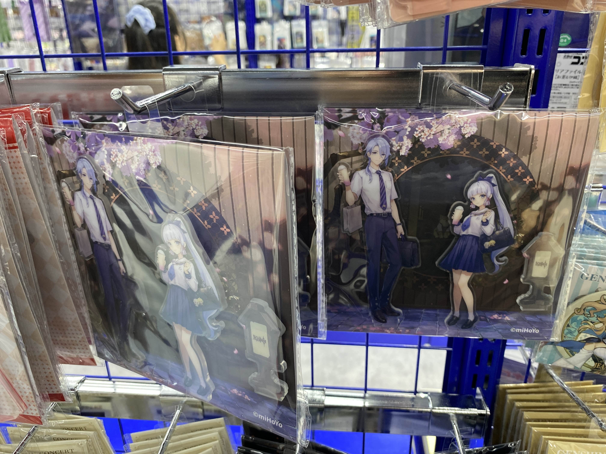

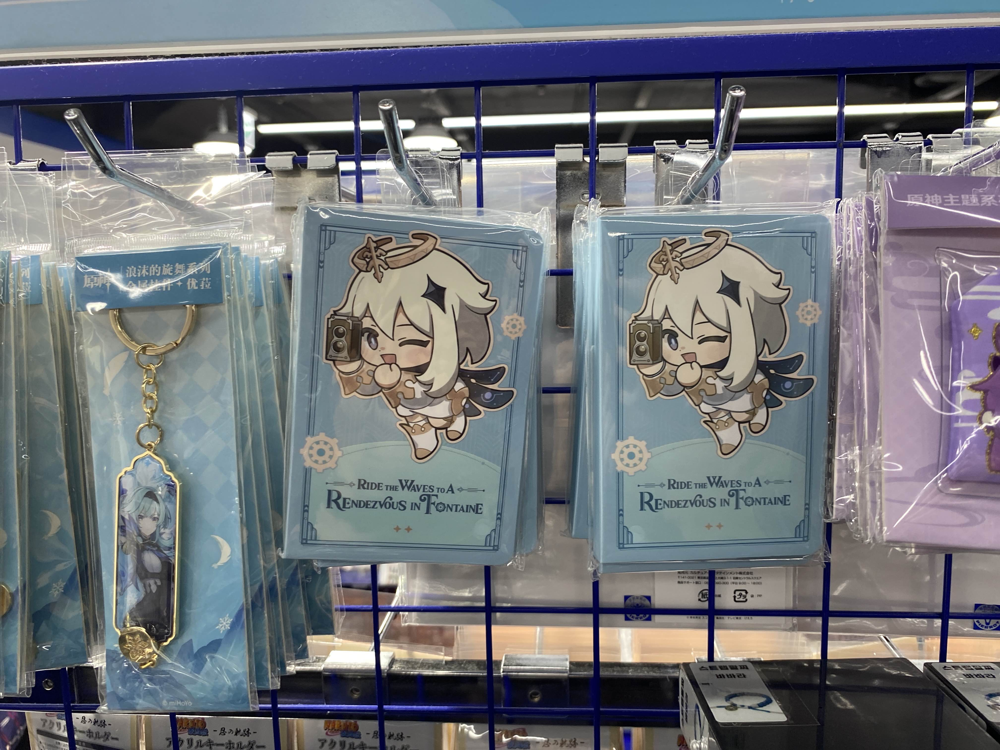

AND WHY THERE WERE EVERY CHARACTERS' ACRYLIC KEYCHAINS EXCEPT AYAKA MY WAIFUUU .-.

For the dinner, we went to the exact same chicken & beer restaurant as last year (again without any saved address) and it was worth it.

*>*]:my-0">
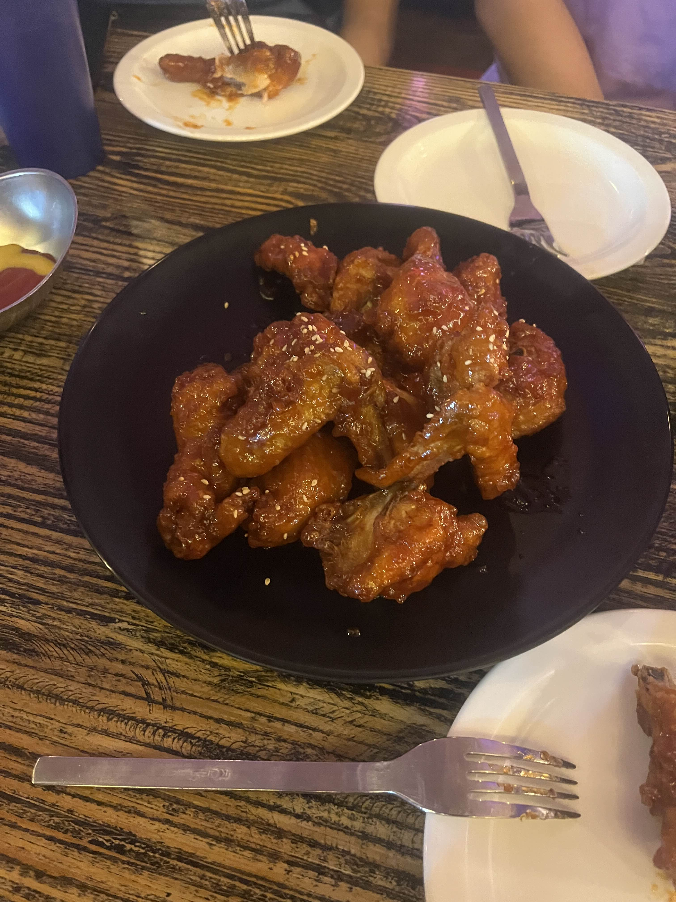

I separated myself from the team after dinner and went for a LOOOONG walk around Myeongdong with one of the groupmates. We had a walk from the walking street to the base of Namsan tower.

We learned from the nearby memorial hall that this place was to pay respect for `Comfort Women` in the war between Japanese and Korean.

We went to a CU store to end up our day, and that was my first time seeing like 10 different Monster flavors ☠️

I stayed awake to play WaniCTF with friends while having T1 soda drink (the drink was meh for me btw).

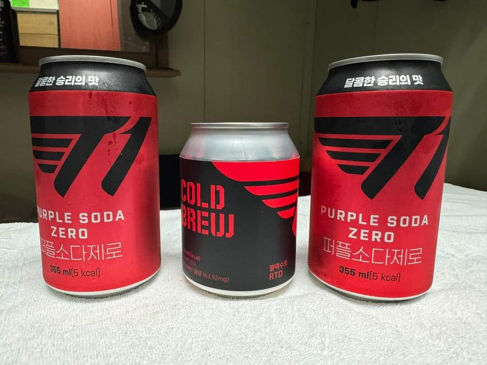

(not my image but it was this drink)

## Here goes the second incident

Let me introduce you to our second incident - the rainy day ☠️

Our plan was cancelled due to the not-so-heavy-but-heavy-enough-to-ruin-our-plan rain, and we stayed indoor to play GoogleCTF.

In the afternoon, we met `brwook` - a pwn player from team cr3.mov (which is the international team of some of my teammates). 

He took the whole group to the palace thing, except me. I had to pack stuffs to go to Unseo in the evening so I didn't join them.

## Evening in Unseo

While they were having fun near Seoul Station, I went to Unseo and stayed there for the remaining of the trip.

I finally got to taste grilled pork intestine (I've planned to tried it at least once in the whole trip).

And, that kinda wrapped up the evening.

## Last day in Korea

I woke up at 12:00 ☠️ That was it ☠️

## Time to go home

By the time I wrote this line, I was on the plane back to Ho Chi Minh City. 

Yeah, and the trip ended. Gotta get back to work and stuffs soon.

Hope that the Hacktheon Sejong 2025 finals won't be organized anytime during my thesis defense phase 🙏

Oh and I think I will have to register as Advanced team if I want to participate again. Time to fight against the KAIST ☠️

I will end this blog here and hope to see all of you soon in future onsite events!