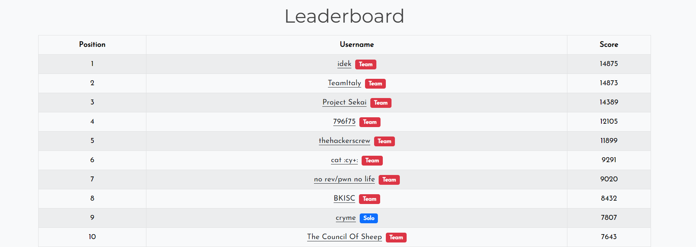
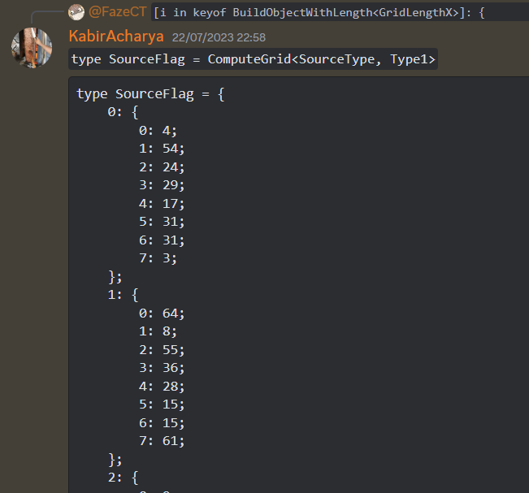

## Overview

Last weekend, I participated in the event with my team, `thehackerscrew`, and we finished at rank `5/878`. Was really hoping that we could get the last banger from a crypto challenge to bring us `4th`, but we couldn't make it.



For reverse engineering, we did `6/8` challenges.

All of the challenges' binaries can be found here: [Click me!](https://github.com/FazeCT/ctf/tree/main/imaginaryCTF%202023)

## chaos


> * **Given file:** `chall.py`
> * **Description:** Can you find order in the midst of chaos?

For this challenge, we are given a Python source with an one-liner checker. Even though it seems to be heavily obfuscated, we can still see some really interesting parts, one of which is shown below.

```py title="src/chall.py" showLineNumbers{1} /apply/ /components/
    [...] if "rni" in n.__name__ and n.__name__ == n.__name__.lower()][0]()._module.__builtins__.__getitem__("\x62\x79\x74\x65\x73"),"\x36\x39\x20\x36\x65\x20\x37\x30").decode()).__getitem__(12340^12346).__pow__(95).__eq__(19244817692775379254742950967455327011704665906495063967001221701622487413797394300000000000000000000000000000000000000000000000000000000000000000000000000000000000000000000000) [...]
```

The part `\x62\x79\x74\x65\x73` evaluates to `bytes` and `\x36\x39\x20\x36\x65\x20\x37\x30` evaluates to `69 6e 70`, which is `inp`.

So, we can easily sketch out the checker scheme, like this:

`assert inp[a ^ b] ** e == ct`

Knowing the algorithm, I wrote a quick and dirty script to solve it.

```py title="solve/solver.py" showLineNumbers{1} /apply/ /components/
    a = '''if [n for n in ().__class__.__base__.__subclasses__() if "rni" in n.__name__ and n.__name__ == n.__name__.lower()][0]()._module.__builtins__.__getitem__([n for n in ().__class__.__base__.__subclasses__() if "rni" in n.__name__ and n.__name__ == n.__name__.lower [...] in n.__name__ and n.__name__ == n.__name__.lower()][0]()._module.__builtins__.__getitem__("bytes"),"\x36\x39\x20\x36\x65\x20\x37\x30").decode()).__getitem__(37143^37127).__pow__(39).__eq__(698305725136602387487529275219403181042627701878718020159538228622689033147)]):
    print("Correct!")
    else:
    print("Wrong!")'''

    flag = [0] * 51
    for i in range(0, 20):
        s = a.find('getitem')
        a = a[s + 7:]

    for i in range(0, 500):
        s = a.find('getitem')
        if i % 9 == 0:
            try:
                k = a[s:s+300][10:].split(')')
                idx = eval(k[0])
                e = int(k[1][9:])
                res = int(k[2][8:])
                for c in range(32, 128):
                    if pow(c, e) == res:
                        flag[idx] = c
                        break
            except:
                pass
        a = a[s + 7:]

    print(''.join(chr(i) for i in flag))

    # ictf{pYthOn_obFuScAtION_iS_N0_M4TCH_f0r_U_9e1b23f9
```

Somehow the `}` character didn't show up, but that didn't heavily affect the result anyway.

First blood for `thehackerscrew`!

Flag is: `ictf{pYthOn_obFuScAtION_iS_N0_M4TCH_f0r_U_9e1b23f9}`

## snailchecker


> * **Given file:** `check.py`
> * **Description:** Optimize me, if you dare. Or not. It might run if you try hard enough.

We are given a shorter (and cleaner) Python source. I modified the `enc()` to see what it does. 

The part `b[0] * 2 ** 24 + b[1] * 2 ** 16 + b[2] * 2 ** 8 + b[3] + 1` behaves the same with `int.from_bytes(b, 'big') + 1` so I changed it, then tried to call `enc(b'a')` while printing out the `a` array inside.

```py title="solve/test.py" showLineNumbers{1} /apply/ /components/
    def enc(b):
        a = [n for n in range(int.from_bytes(b, 'big') + 1)][1:]
        c, i = 0, 0
        while len([n for n in a if n != 0]) > 1:
            i %= len(a)
            if a[i] != 0 and c == 1:
                a[i], c = 0, 0
            if a[i] != 0:
                c += 1
            i += 1
            print(a)


    enc(b'a')
```

``` showLineNumbers{1} /apply/ /components/
    [...]
    [1, 0, 3, 4, 5, 6, 7, 8, 9, 10, 11, 12, 13, 14, 15, 16, 17, 18, 19, 20, 21, 22, 23, 24, 25, 26, 27, 28, 29, 30, 31, 32, 33, 34, 35, 36, 37, 38, 39, 40, 41, 42, 43, 44, 45, 46, 47, 48, 49, 50, 51, 52, 53, 54, 55, 56, 57, 58, 59, 60, 61, 62, 63, 64, 65, 66, 67, 68, 69, 70, 71, 72, 73, 74, 75, 76, 77, 78, 79, 80, 81, 82, 83, 84, 85, 86, 87, 88, 89, 90, 91, 92, 93, 94, 95, 96, 97]
    [...]
    [1, 0, 3, 0, 5, 6, 7, 8, 9, 10, 11, 12, 13, 14, 15, 16, 17, 18, 19, 20, 21, 22, 23, 24, 25, 26, 27, 28, 29, 30, 31, 32, 33, 34, 35, 36, 37, 38, 39, 40, 41, 42, 43, 44, 45, 46, 47, 48, 49, 50, 51, 52, 53, 54, 55, 56, 57, 58, 59, 60, 61, 62, 63, 64, 65, 66, 67, 68, 69, 70, 71, 72, 73, 74, 75, 76, 77, 78, 79, 80, 81, 82, 83, 84, 85, 86, 87, 88, 89, 90, 91, 92, 93, 94, 95, 96, 97]
    [...]
    [1, 0, 3, 0, 5, 0, 7, 8, 9, 10, 11, 12, 13, 14, 15, 16, 17, 18, 19, 20, 21, 22, 23, 24, 25, 26, 27, 28, 29, 30, 31, 32, 33, 34, 35, 36, 37, 38, 39, 40, 41, 42, 43, 44, 45, 46, 47, 48, 49, 50, 51, 52, 53, 54, 55, 56, 57, 58, 59, 60, 61, 62, 63, 64, 65, 66, 67, 68, 69, 70, 71, 72, 73, 74, 75, 76, 77, 78, 79, 80, 81, 82, 83, 84, 85, 86, 87, 88, 89, 90, 91, 92, 93, 94, 95, 96, 97]
    [...]
    [0, 0, 3, 0, 0, 0, 0, 0, 0, 0, 0, 0, 0, 0, 0, 0, 0, 0, 0, 0, 0, 0, 0, 0, 0, 0, 0, 0, 0, 0, 0, 0, 0, 0, 35, 0, 0, 0, 0, 0, 0, 0, 0, 0, 0, 0, 0, 0, 0, 0, 0, 0, 0, 0, 0, 0, 0, 0, 0, 0, 0, 0, 0, 0, 0, 0, 67, 0, 0, 0, 0, 0, 0, 0, 0, 0, 0, 0, 0, 0, 0, 0, 0, 0, 0, 0, 0, 0, 0, 0, 0, 0, 0, 0, 0, 0, 0]
    [...]
    [0, 0, 3, 0, 0, 0, 0, 0, 0, 0, 0, 0, 0, 0, 0, 0, 0, 0, 0, 0, 0, 0, 0, 0, 0, 0, 0, 0, 0, 0, 0, 0, 0, 0, 0, 0, 0, 0, 0, 0, 0, 0, 0, 0, 0, 0, 0, 0, 0, 0, 0, 0, 0, 0, 0, 0, 0, 0, 0, 0, 0, 0, 0, 0, 0, 0, 67, 0, 0, 0, 0, 0, 0, 0, 0, 0, 0, 0, 0, 0, 0, 0, 0, 0, 0, 0, 0, 0, 0, 0, 0, 0, 0, 0, 0, 0, 0]
    [...]
    [0, 0, 0, 0, 0, 0, 0, 0, 0, 0, 0, 0, 0, 0, 0, 0, 0, 0, 0, 0, 0, 0, 0, 0, 0, 0, 0, 0, 0, 0, 0, 0, 0, 0, 0, 0, 0, 0, 0, 0, 0, 0, 0, 0, 0, 0, 0, 0, 0, 0, 0, 0, 0, 0, 0, 0, 0, 0, 0, 0, 0, 0, 0, 0, 0, 0, 67, 0, 0, 0, 0, 0, 0, 0, 0, 0, 0, 0, 0, 0, 0, 0, 0, 0, 0, 0, 0, 0, 0, 0, 0, 0, 0, 0, 0, 0, 0]
```

From the result, we can see the behaviour of the `enc()`, that first it generates an array contains elements from `1` to `int.from_bytes(b, b'big')`. Consider the array as a circle, where every `2nd` element is erased until there is only `1` element left. The remaining element will be the return value of the function.

With Competitive Programming experience, I immediately recognized that this was implementing [Josephus Problem](https://www.geeksforgeeks.org/josephus-problem/). So our problem is given the winner of the game, we need to find how many people were involved in total.

I found [this paper on Josephus Problem](https://sites.math.northwestern.edu/~mlerma/problem_solving/solutions/josephus.pdf) to solve it. Given that we have `n` people involved. The winner's position - which is defined by `j(n)` - is calculated as:

`j(n) = left rotation of the binary digits of n`

And, by doing right rotation on the encrypted value, we have solved our problem!

```py title="solve/solver.py" showLineNumbers{1} /apply/ /components/
    def solve(n):
        k = bin(n + 1)[2:]
        return int(k[-1] + k[:-1], 2)


    enc = b'L\xe8\xc6\xd2f\xde\xd4\xf6j\xd0\xe0\xcad\xe0\xbe\xe6J\xd8\xc4\xde`\xe6\xbe\xda>\xc8\xca\xca^\xde\xde\xc4^\xde\xde\xdez\xe8\xe6\xde'
    for i in range(0, 40, 4):
        chunk = enc[i:i + 4]
        tmp = int.from_bytes(chunk, 'big')
        print(end=int.to_bytes(solve(tmp), 4, 'big').decode()[::-1])

    # ictf{josephus_problem_speed?boooooooost}
```

Somehow the flag should has `_` in place of that `?`, but again that didn't affect too much on the result.

Second blood for `thehackerscrew`!

Flag is: `ictf{josephus_problem_speed_boooooooost}`

## scrambled


> * **Given file:** `main`
> * **Description:** The flag is all jumbled up... or is it?

We are given an `ELF` file this time. Follow the xrefs of either `CORRECT!` or `INCORRECT!`, we can reach the main function for encryption. 

```c showLineNumbers{1} /apply/ /components/
    qmemcpy(v30, "zyx^wu%v!ts1r;q@op#nm$lk(ijgh*fed&ca0b-{})", 42);
    sub_407DF0(v27);
    sub_4050E4(v25, v30, 42LL, v27);
    sub_407E10(v27);
    sub_4051DE(v26, v25);
    v10 = sub_40534A(v26);
    v11 = sub_4052FE(v26);
    sub_40539A(v11, v10);
    sub_4051DE(v27, v25);
    for ( m = 0; m < (unsigned __int64)sub_4770C0(v28); ++m )
    {
        v12 = sub_4773E0(v28, m);
        v13 = sub_40534A(v25);
        v14 = sub_4052FE(v25);
        v15 = sub_4053D0(v14, v13, v12);
        v16 = sub_4052FE(v25);
        v23 = sub_40540C(v16, v15);
        LOBYTE(v15) = *(_BYTE *)sub_405442(v26, v23);
        *(_BYTE *)sub_4773E0(v28, m) = v15;
    }
    if ( (unsigned __int8)sub_405462(v28, "oynuuvefmqjn1qlfnw$j*vmx1dv") )
        sub_470AD0(&unk_5DF480, "CORRECT\n");
    else
        sub_470AD0(&unk_5DF480, "INCORRECT\n");
```

After some time debugging the code, I got the idea of it. Basically, the encryption is very simple. Consider `zyx^wu%v!ts1r;q@op#nm$lk(ijgh*fed&ca0b-{})` as the custom alphabet. Each character in the input is changed to the `opposite` character in terms of their positions in the alphabet - for example `z` will be changed into `)`, `y` will be changed to `}`, and so on.

I wrote a script to decode the data, as below.

```py title="solve/solver.py" showLineNumbers{1} /apply/ /components/
    alphabet = 'zyx^wu%v!ts1r;q@op#nm$lk(ijgh*fed&ca0b-{})'
    enc = 'ynuuvefmqjn1qlfnw$j*vmx1dvo'[::-1]
    for i in enc:
        s = alphabet.rfind(i)
        print(end=alphabet[len(alphabet) - 1 - s])

    # ictf{$cr@mbl1ngfl@g$1sc00l}
```

I had to change encoded data from `oynuuvefmqjn1qlfnw$j*vmx1dv` to `ynuuvefmqjn1qlfnw$j*vmx1dvo` to get the right order of the flag characters.

Flag is: `ictf{Scr@mbl1ngfl@g$1sc00l}`

## Sheepish


> * **Given file:** `sheepish.py`
> * **Description:** Mary had a flagchecker, its fleece was white as snow.

For this challenge, we are given a Python source. From the first glance, the source looks like it has control flow flattened by lambda functions.

So first, I did ... 

Actually, I found (probably) an unintended solution to just use side channel attack to bruteforce the flag. I tested for a while and saw that the flag is checked char by char, and when a char is wrong, the program immediately prints out `Try again`. So from that information, we can easily see that if we input in any correct prefix of the flag, the program should raise some errors.

I tried to do so and things went the same with what I had expected.

```py showLineNumbers{1} /apply/ /components/
>>> ictf
Traceback (most recent call last):
[...]
TypeError: 'str' object is not callable
```

So I went on and wrote a script using side channel attack to get the flag.

```py title="solve/solver.py" showLineNumbers{1} /apply/ /components/
flag = 'ictf{'
while flag[-1] != '}':
    for c in range(32, 128):
        tmp = flag + chr(c)
        try:
            print((((lambda m:((lambda c:m(lambda g:c(c)(g)))(lambda c:m(lambda g:c(c)(g)))))(lambda m:lambda k:lambda f:(lambda d:(lambda a:a(lambda j:lambda e:j))(d))(k)(lambda a:(lambda j:lambda e:j))(lambda a:(lambda j:lambda e:j(e)(lambda j:lambda e:e))((lambda j:lambda e:(lambda j:lambda e:j(e)(lambda j:lambda e:e))((lambda j:lambda e:(lambda j:j(lambda a:(lambda j:lambda e:e))(lambda j:lambda e:j))((lambda j:lambda e:e(lambda b:lambda m:lambda c:b(lambda l:lambda i:i(l(m)))(lambda a:c)(lambda j:j))(j))(e)(j)))(j)(e))((lambda j:lambda e:(lambda j:j(lambda a:(lambda j:lambda e:e))(lambda j:lambda e:j))((lambda j:lambda e:e(lambda b:lambda m:lambda c:b(lambda l:lambda i:i(l(m)))(lambda a:c)(lambda j:j))(j))(j)(e)))(j)(e)))((lambda d:(lambda a:a(lambda j:lambda e:j))((lambda a:a(lambda j:lambda e:e))(d)))(k))((lambda d:(lambda a:a(lambda j:lambda e:j))((lambda a:a(lambda j:lambda e:e))(d)))(f)))(m((lambda d:(lambda a:a(lambda j:lambda e:e))((lambda a:a(lambda j:lambda e:e))(d)))(k))((lambda d:(lambda a:a(lambda j:lambda e:e))((lambda a:a(lambda j:lambda e:e))(d)))(f))))(lambda j:lambda e:j)))((lambda d:lambda c:(lambda j:lambda e:lambda n:n(j)(e))(lambda j:lambda e:e)((lambda j:lambda e:lambda n:n(j)(e))(c)(d)))((lambda d:lambda c:(lambda j:lambda e:lambda n:n(j)(e))(lambda j:lambda e:e)((lambda j:lambda e:lambda n:n(j)(e))(c)(d)))((lambda d:lambda c:(lambda j:lambda e:lambda n:n(j)(e))(lambda j:lambda e:e)((lambda j:lambda e:lambda n:n(j)(e))(c)(d)))((lambda d:lambda c:(lambda j:lambda e:lambda n:n(j)(e))(lambda j:lambda e:e)((lambda j:lambda e:lambda n:n(j)(e))(c)(d)))((lambda d:lambda c:(lambda j:lambda e:lambda n:n(j)(e))(lambda j:lambda e:e)((lambda j:lambda e:lambda n:n(j)(e))(c)(d)))((lambda d:lambda c:(lambda j:lambda e:lambda n:n(j)(e))(lambda j:lambda e:e)((lambda j:lambda e:lambda n:n(j)(e))(c)(d)))((lambda d:lambda c:(lambda j:lambda e:lambda n:n(j)(e))(lambda j:lambda e:e)((lambda j:lambda e:lambda n:n(j)(e))(c)(d)))((lambda d:lambda c:(lambda j:lambda e:lambda n:n(j)(e))(lambda j:lambda e:e)((lambda j:lambda e:lambda n:n(j)(e))(c)(d)))((lambda d:lambda c:(lambda j:lambda e:lambda n:n(j)(e))(lambda j:lambda e:e)((lambda j:lambda e:lambda n:n(j)(e))(c)(d)))((lambda d:lambda c:(lambda j:lambda e:lambda n:n(j)(e))(lambda j:lambda e:e)((lambda j:lambda e:lambda n:n(j)(e))(c)(d)))((lambda d:lambda c:(lambda j:lambda e:lambda n:n(j)(e))(lambda j:lambda e:e)((lambda j:lambda e:lambda n:n(j)(e))(c)(d)))((lambda d:lambda c:(lambda j:lambda e:lambda n:n(j)(e))(lambda j:lambda e:e)((lambda j:lambda e:lambda n:n(j)(e))(c)(d)))((lambda d:lambda c:(lambda j:lambda e:lambda n:n(j)(e))(lambda j:lambda e:e)((lambda j:lambda e:lambda n:n(j)(e))(c)(d)))((lambda d:lambda c:(lambda j:lambda e:lambda n:n(j)(e))(lambda j:lambda e:e)((lambda j:lambda e:lambda n:n(j)(e))(c)(d)))((lambda d:lambda c:(lambda j:lambda e:lambda n:n(j)(e))(lambda j:lambda e:e)((lambda j:lambda e:lambda n:n(j)(e))(c)(d)))((lambda d:lambda c:(lambda j:lambda e:lambda n:n(j)(e))(lambda j:lambda e:e)((lambda j:lambda e:lambda n:n(j)(e))(c)(d)))((lambda d:lambda c:(lambda j:lambda e:lambda n:n(j)(e))(lambda j:lambda e:e)((lambda j:lambda e:lambda n:n(j)(e))(c)(d)))((lambda d:lambda c:(lambda j:lambda e:lambda n:n(j)(e))(lambda j:lambda e:e)((lambda j:lambda e:lambda n:n(j)(e))(c)(d)))((lambda d:lambda c:(lambda j:lambda e:lambda n:n(j)(e))(lambda j:lambda e:e)((lambda j:lambda e:lambda n:n(j)(e))(c)(d)))((lambda d:lambda c:(lambda j:lambda e:lambda n:n(j)(e))(lambda j:lambda e:e)((lambda j:lambda e:lambda n:n(j)(e))(c)(d)))((lambda j:lambda e:lambda n:n(j)(e))(lambda j:lambda e:j)(lambda j:lambda e:j))((lambda j:lambda e:j(lambda b:lambda j:lambda e:j(b(j)(e)))(e))((lambda j:lambda e:lambda n:j(e(n)))((lambda j:lambda e:e(j))(lambda j:lambda e:j(j(e)))((lambda b:lambda j:lambda e:j(b(j)(e)))(lambda j:lambda e:j(j(j(e))))))((lambda b:lambda j:lambda e:j(b(j)(e)))((lambda j:lambda e:lambda n:j(e(n)))(lambda j:lambda e:j(j(e)))(lambda j:lambda e:j(j(j(e)))))))((lambda j:lambda e:j(lambda b:lambda j:lambda e:j(b(j)(e)))(e))((lambda j:lambda e:lambda n:j(e(n)))(lambda j:lambda e:j(j(e)))(lambda j:lambda e:j(j(j(e)))))((lambda b:lambda j:lambda e:j(b(j)(e)))((lambda j:lambda e:lambda n:j(e(n)))(lambda j:lambda e:j(j(e)))(lambda j:lambda e:j(j(j(e)))))))))((lambda j:lambda e:j(lambda b:lambda j:lambda e:j(b(j)(e)))(e))((lambda j:lambda e:lambda n:j(e(n)))((lambda j:lambda e:e(j))(lambda j:lambda e:j(j(e)))((lambda b:lambda j:lambda e:j(b(j)(e)))(lambda j:lambda e:j(j(j(e))))))(lambda j:lambda e:j(j(j(e)))))((lambda j:lambda e:lambda n:j(e(n)))((lambda j:lambda e:j(lambda b:lambda j:lambda e:j(b(j)(e)))(e))(lambda j:lambda e:j(j(e)))(lambda j:lambda e:j(j(j(e)))))(lambda j:lambda e:j(j(j(e)))))))((lambda j:lambda e:j(lambda b:lambda j:lambda e:j(b(j)(e)))(e))((lambda j:lambda e:lambda n:j(e(n)))((lambda j:lambda e:e(j))(lambda j:lambda e:j(j(e)))((lambda b:lambda j:lambda e:j(b(j)(e)))(lambda j:lambda e:j(j(j(e))))))((lambda b:lambda j:lambda e:j(b(j)(e)))(lambda j:lambda e:j(j(j(e))))))(lambda j:lambda e:e)))((lambda j:lambda e:j(lambda b:lambda j:lambda e:j(b(j)(e)))(e))((lambda j:lambda e:lambda n:j(e(n)))((lambda j:lambda e:e(j))(lambda j:lambda e:j(j(e)))((lambda b:lambda j:lambda e:j(b(j)(e)))(lambda j:lambda e:j(j(j(e))))))((lambda b:lambda j:lambda e:j(b(j)(e)))(lambda j:lambda e:j(j(j(e))))))(lambda j:lambda e:e)))((lambda j:lambda e:j(lambda b:lambda j:lambda e:j(b(j)(e)))(e))((lambda j:lambda e:lambda n:j(e(n)))((lambda j:lambda e:e(j))(lambda j:lambda e:j(j(e)))((lambda b:lambda j:lambda e:j(b(j)(e)))(lambda j:lambda e:j(j(j(e))))))((lambda b:lambda j:lambda e:j(b(j)(e)))(lambda j:lambda e:j(j(j(e))))))(lambda j:lambda e:e)))((lambda j:lambda e:j(lambda b:lambda j:lambda e:j(b(j)(e)))(e))((lambda j:lambda e:lambda n:j(e(n)))((lambda j:lambda e:e(j))(lambda j:lambda e:j(j(e)))((lambda b:lambda j:lambda e:j(b(j)(e)))(lambda j:lambda e:j(j(j(e))))))((lambda j:lambda e:lambda n:j(e(n)))(lambda j:lambda e:j(j(e)))(lambda j:lambda e:j(j(j(e))))))(lambda j:lambda e:j(j(e)))))((lambda j:lambda e:j(lambda b:lambda j:lambda e:j(b(j)(e)))(e))((lambda j:lambda e:lambda n:j(e(n)))((lambda j:lambda e:e(j))(lambda j:lambda e:j(j(e)))((lambda b:lambda j:lambda e:j(b(j)(e)))(lambda j:lambda e:j(j(j(e))))))((lambda j:lambda e:j(lambda b:lambda j:lambda e:j(b(j)(e)))(e))(lambda j:lambda e:j(j(e)))(lambda j:lambda e:j(j(j(e))))))((lambda j:lambda e:lambda n:j(e(n)))((lambda j:lambda e:j(lambda b:lambda j:lambda e:j(b(j)(e)))(e))(lambda j:lambda e:j(j(e)))(lambda j:lambda e:j(j(j(e)))))(lambda j:lambda e:j(j(j(e)))))))((lambda j:lambda e:j(lambda b:lambda j:lambda e:j(b(j)(e)))(e))((lambda j:lambda e:lambda n:j(e(n)))((lambda j:lambda e:e(j))(lambda j:lambda e:j(j(e)))((lambda b:lambda j:lambda e:j(b(j)(e)))(lambda j:lambda e:j(j(j(e))))))((lambda b:lambda j:lambda e:j(b(j)(e)))((lambda j:lambda e:lambda n:j(e(n)))(lambda j:lambda e:j(j(e)))(lambda j:lambda e:j(j(j(e)))))))(lambda j:lambda e:e)))((lambda j:lambda e:j(lambda b:lambda j:lambda e:j(b(j)(e)))(e))((lambda j:lambda e:lambda n:j(e(n)))((lambda j:lambda e:e(j))(lambda j:lambda e:j(j(e)))((lambda b:lambda j:lambda e:j(b(j)(e)))(lambda j:lambda e:j(j(j(e))))))(lambda j:lambda e:j(j(j(e)))))(lambda j:lambda e:j(j(j(e))))))((lambda j:lambda e:j(lambda b:lambda j:lambda e:j(b(j)(e)))(e))((lambda j:lambda e:lambda n:j(e(n)))((lambda j:lambda e:e(j))(lambda j:lambda e:j(j(e)))((lambda b:lambda j:lambda e:j(b(j)(e)))(lambda j:lambda e:j(j(j(e))))))(lambda j:lambda e:j(j(j(e)))))(lambda j:lambda e:j(j(j(e))))))((lambda j:lambda e:j(lambda b:lambda j:lambda e:j(b(j)(e)))(e))((lambda j:lambda e:lambda n:j(e(n)))((lambda j:lambda e:e(j))(lambda j:lambda e:j(j(e)))((lambda b:lambda j:lambda e:j(b(j)(e)))(lambda j:lambda e:j(j(j(e))))))((lambda j:lambda e:lambda n:j(e(n)))(lambda j:lambda e:j(j(e)))(lambda j:lambda e:j(j(j(e))))))((lambda j:lambda e:lambda n:j(e(n)))((lambda b:lambda j:lambda e:j(b(j)(e)))(lambda j:lambda e:j(j(j(e)))))(lambda j:lambda e:j(j(e))))))((lambda j:lambda e:j(lambda b:lambda j:lambda e:j(b(j)(e)))(e))((lambda j:lambda e:lambda n:j(e(n)))((lambda j:lambda e:e(j))(lambda j:lambda e:j(j(e)))((lambda b:lambda j:lambda e:j(b(j)(e)))(lambda j:lambda e:j(j(j(e))))))((lambda b:lambda j:lambda e:j(b(j)(e)))((lambda j:lambda e:lambda n:j(e(n)))(lambda j:lambda e:j(j(e)))(lambda j:lambda e:j(j(j(e)))))))(lambda j:lambda e:j(j(j(e))))))((lambda j:lambda e:j(lambda b:lambda j:lambda e:j(b(j)(e)))(e))((lambda j:lambda e:lambda n:j(e(n)))((lambda j:lambda e:e(j))(lambda j:lambda e:j(j(e)))((lambda b:lambda j:lambda e:j(b(j)(e)))(lambda j:lambda e:j(j(j(e))))))((lambda j:lambda e:j(lambda b:lambda j:lambda e:j(b(j)(e)))(e))(lambda j:lambda e:j(j(e)))(lambda j:lambda e:j(j(j(e))))))((lambda j:lambda e:lambda n:j(e(n)))((lambda j:lambda e:j(lambda b:lambda j:lambda e:j(b(j)(e)))(e))(lambda j:lambda e:j(j(e)))(lambda j:lambda e:j(j(j(e)))))(lambda j:lambda e:j(j(j(e)))))))((lambda j:lambda e:j(lambda b:lambda j:lambda e:j(b(j)(e)))(e))((lambda j:lambda e:lambda n:j(e(n)))((lambda j:lambda e:e(j))(lambda j:lambda e:j(j(e)))((lambda b:lambda j:lambda e:j(b(j)(e)))(lambda j:lambda e:j(j(j(e))))))(lambda j:lambda e:j(j(j(e)))))(lambda j:lambda e:e)))((lambda j:lambda e:j(lambda b:lambda j:lambda e:j(b(j)(e)))(e))((lambda j:lambda e:lambda n:j(e(n)))((lambda j:lambda e:e(j))(lambda j:lambda e:j(j(e)))((lambda b:lambda j:lambda e:j(b(j)(e)))(lambda j:lambda e:j(j(j(e))))))((lambda j:lambda e:lambda n:j(e(n)))(lambda j:lambda e:j(j(e)))(lambda j:lambda e:j(j(j(e))))))((lambda b:lambda j:lambda e:j(b(j)(e)))(lambda j:lambda e:j(j(j(e)))))))((lambda j:lambda e:j(lambda b:lambda j:lambda e:j(b(j)(e)))(e))((lambda j:lambda e:lambda n:j(e(n)))((lambda j:lambda e:e(j))(lambda j:lambda e:j(j(e)))((lambda b:lambda j:lambda e:j(b(j)(e)))(lambda j:lambda e:j(j(j(e))))))((lambda b:lambda j:lambda e:j(b(j)(e)))((lambda j:lambda e:lambda n:j(e(n)))(lambda j:lambda e:j(j(e)))(lambda j:lambda e:j(j(j(e)))))))((lambda j:lambda e:j(lambda b:lambda j:lambda e:j(b(j)(e)))(e))((lambda b:lambda j:lambda e:j(b(j)(e)))((lambda j:lambda e:lambda n:j(e(n)))(lambda j:lambda e:j(j(e)))(lambda j:lambda e:j(j(j(e))))))((lambda b:lambda j:lambda e:j(b(j)(e)))(lambda j:lambda e:j(j(j(e))))))))((lambda j:lambda e:j(lambda b:lambda j:lambda e:j(b(j)(e)))(e))((lambda j:lambda e:lambda n:j(e(n)))((lambda j:lambda e:e(j))(lambda j:lambda e:j(j(e)))((lambda b:lambda j:lambda e:j(b(j)(e)))(lambda j:lambda e:j(j(j(e))))))((lambda j:lambda e:lambda n:j(e(n)))(lambda j:lambda e:j(j(e)))(lambda j:lambda e:j(j(j(e))))))((lambda j:lambda e:lambda n:j(e(n)))(lambda j:lambda e:j(j(e)))(lambda j:lambda e:j(j(j(e)))))))((lambda j:lambda e:j(lambda b:lambda j:lambda e:j(b(j)(e)))(e))((lambda j:lambda e:lambda n:j(e(n)))((lambda j:lambda e:e(j))(lambda j:lambda e:j(j(e)))((lambda b:lambda j:lambda e:j(b(j)(e)))(lambda j:lambda e:j(j(j(e))))))((lambda b:lambda j:lambda e:j(b(j)(e)))((lambda j:lambda e:lambda n:j(e(n)))(lambda j:lambda e:j(j(e)))(lambda j:lambda e:j(j(j(e)))))))((lambda b:lambda j:lambda e:j(b(j)(e)))(lambda j:lambda e:j(j(j(e)))))))((lambda j:lambda e:j(lambda b:lambda j:lambda e:j(b(j)(e)))(e))((lambda j:lambda e:lambda n:j(e(n)))((lambda j:lambda e:e(j))(lambda j:lambda e:j(j(e)))((lambda b:lambda j:lambda e:j(b(j)(e)))(lambda j:lambda e:j(j(j(e))))))((lambda j:lambda e:lambda n:j(e(n)))(lambda j:lambda e:j(j(e)))(lambda j:lambda e:j(j(j(e))))))(lambda j:lambda e:j(j(j(e))))))((lambda j:lambda e:j(lambda b:lambda j:lambda e:j(b(j)(e)))(e))((lambda j:lambda e:lambda n:j(e(n)))((lambda j:lambda e:e(j))(lambda j:lambda e:j(j(e)))((lambda b:lambda j:lambda e:j(b(j)(e)))(lambda j:lambda e:j(j(j(e))))))((lambda j:lambda e:lambda n:j(e(n)))(lambda j:lambda e:j(j(e)))(lambda j:lambda e:j(j(j(e))))))((lambda j:lambda e:e(j))(lambda j:lambda e:j(j(j(e))))(lambda j:lambda e:j(j(e))))))(((lambda m:((lambda c:m(lambda g:c(c)(g)))(lambda c:m(lambda g:c(c)(g)))))(lambda m:(lambda h:(((lambda d:lambda c:(lambda j:lambda e:lambda n:n(j)(e))(lambda j:lambda e:e)((lambda j:lambda e:lambda n:n(j)(e))(c)(d)))(m(h[1:]))(((lambda m:((lambda c:m(lambda g:c(c)(g)))(lambda c:m(lambda g:c(c)(g)))))(lambda m:(lambda b:(((lambda b:lambda j:lambda e:j(b(j)(e)))(m(b-1))) if b else (lambda j:lambda e:e)))))(h[0]))) if len(h) else ((lambda j:lambda e:lambda n:n(j)(e))(lambda j:lambda e:j)(lambda j:lambda e:j))))))(tmp.encode())))(tmp)(""))
        except TypeError:
            flag = tmp
            print(flag)
            break

# ictf{d0_sh33p_b@@@?}
```

Flag is: `ictf{d0_sh33p_b@@@?}`

## vmcastle


> * **Given file:** `vm` and `program`
> * **Description:** There are no rules of architecture for a castle in the clouds.

A `vm` challenge is given to us for this challenge. My way of tackling a `vm` challenge is to first write an interpreter.

But before doing that, we should take a look at how the `vm` and the variables are set up.

```c showLineNumbers{1} /apply/ /components/
    while ( 1 )
    {
        ((void (__fastcall *)(_QWORD))funcs_2838[(unsigned __int8)*(_WORD *)&ptr[2 * dword_6840]])((unsigned int)(char)HIBYTE(*(_WORD *)&ptr[2 * dword_6840]));
        ++dword_6840;
    }
```

Here is the main loop of the `vm`. We can easily see that with `ptr` contains the program, the vm works by continuously calling the following function: `funcs[ptr[2 * i]](ptr[2 * i + 1])`. So for each pair of bytes from the program, the first byte is used to indicate which function is called, and the second byte will be the parameter for that function.

The memory of the `vm` is declared as a block of length `1024` containing `DWORDs` from offset `0x5840`. Right next to the memory block within the bss segment are some global variables, as shown below.

``` showLineNumbers{1} /apply/ /components/
    bss:0000000000006840 dword_6840      dd ?                    ; DATA XREF: sub_24EA+D↑r
    .bss:0000000000006840                                         ; sub_24EA+36↑w ...
    .bss:0000000000006844 dword_6844      dd ?                    ; DATA XREF: sub_2269+D↑r
    .bss:0000000000006844                                         ; sub_2269+16↑w ...
    .bss:0000000000006848 ; char *ptr
    .bss:0000000000006848 ptr             dq ?                    ; DATA XREF: main+35↑w
    .bss:0000000000006848                                         ; main+CD↑r ...
    .bss:0000000000006850 dword_6850      dd ?                    ; DATA XREF: sub_238F+D↑r
    .bss:0000000000006850                                         ; sub_2455+D↑r ...
    .bss:0000000000006854 dword_6854      dd ?                    ; DATA XREF: sub_238F+13↑r
    .bss:0000000000006854                                         ; sub_2455+13↑r ...
    .bss:0000000000006858 dword_6858      dd ?                    ; DATA XREF: sub_2529+5D↑r
    .bss:000000000000685C dword_685C      dd ?                    ; DATA XREF: sub_238F+1B↑w
    .bss:000000000000685C                                         ; sub_2455+1B↑w ...
    .bss:000000000000685C _bss            ends
    .bss:000000000000685C
```

So to make the `vm` interpreter behaves correctly, we have to consider `dword_6840` as `memory[1025]`, `dword_6844` as `memory[1026]`, and so on. Also take into account that `ptr` takes up a 2-byte space, not 1-byte space.

Further more, the analysis into the functions also reveals that one function might be interpreted wrong if not handled correctly, which is the below function - corresponds with opcode `104`.

```c showLineNumbers{1} /apply/ /components/
    __int64 __fastcall sub_2351(char a1)
    {
    __int64 result; // rax

    ++dword_6844;
    result = (unsigned int)a1;
    dword_5840[dword_6844] = result;
    return result;
    }
```

The assembly code for this function uses `movsxd  rdx, edx` instead of move without sign extend to assign `a1` onto the memory, so we have to replicate that when writing an interpreter for the program.

Considered all of that, I wrote an interpreter for this `vm`.

```py title="solve/vm.py" showLineNumbers{1} /apply/ /components/
    f = open("D:/ctf/revChalls/imaginaryCTF/program", "rb").read()

    mem = [0] * 2000
    flag = "ictf{fake_flag}\n"

    while mem[1024] < len(f):

        op = f[mem[1024] * 2]
        par = f[mem[1024] * 2 + 1]

        if op == 102:
            v1 = mem[1025]
            mem[1025] -= 1
            mem[(par & 3) + 1028] = mem[v1]
            print('op {}: set mem[{}] = mem[{}] == {} and mem[1025] = {}'.format(op, (par & 3) + 1028, v1, mem[v1], mem[1025] % 1024))
            mem[1025] %= 1024

        elif op == 103:
            mem[1025] += 1
            mem[mem[1025]] = mem[(par & 3) + 1028]
            print('op {}: set mem[{}] = mem[{}] == {} and mem[1025] = {}'.format(op, mem[1025], (par & 3) + 1028, mem[mem[1025]], mem[1025] % 1024))
            mem[1025] %= 1024

        elif op == 104:
            mem[1025] += 1

            if par >= 128:
                par = par - 256

            print('op {}: set mem[{}] = {}'.format(op, mem[1025], par))
            mem[mem[1025]] = par

        elif op == 105:
            mem[1031] = (mem[1028] + mem[1029]) & 0xFFFFFFFF
            print('op {}: mem[1031] = mem[1028] + mem[1029] = {}'.format(op, mem[1031]))

        elif op == 106:
            mem[1031] = (mem[1028] - mem[1029]) & 0xFFFFFFFF
            print('op {}: mem[1031] = mem[1028] - mem[1029] = {}'.format(op, mem[1031]))

        elif op == 107:
            mem[1031] = (mem[1028] * mem[1029]) & 0xFFFFFFFF
            print('op {}: mem[1031] = mem[1028] * mem[1029] = {}'.format(op, mem[1031]))

        elif op == 108:
            mem[1031] = (mem[1028] // mem[1029]) & 0xFFFFFFFF
            print('op {}: mem[1031] = mem[1028] // mem[1029] = {}'.format(op, mem[1031]))

        elif op == 109:
            mem[1031] = (mem[1028] % mem[1029]) & 0xFFFFFFFF
            print('op {}: mem[1031] = mem[1028] % mem[1029] = {}'.format(op, mem[1031]))

        elif op == 110:
            mem[1024] += mem[(par & 3) + 1028]
            print('op {}: mem[1024] += mem[{}] = {}'.format(op, (par & 3) + 1028, mem[1024]))

        elif op == 111:
            if mem[1031]:
                if mem[1031] >= 0:
                    if mem[1031] > 0:
                        mem[1024] += mem[1030]
                        print('op {}: mem[1024] += mem[1030] = {}'.format(op, mem[1024]))
                else:
                    mem[1024] += mem[1028]
                    print('op {}: mem[1024] += mem[1028] = {}'.format(op, mem[1024]))
            else:
                mem[1024] += mem[1029]
                print('op {}: mem[1024] += mem[1029] = {}'.format(op, mem[1024]))

        elif op == 112:
            if mem[1028] == mem[1029]:
                mem[1031] = 0
            else:
                if mem[1028] >= mem[1029]:
                    if mem[1028] > mem[1029]:
                        mem[1031] = 1
                else:
                    mem[1031] = -1
            print('op {}: mem[1028] = {}, mem[1029] = {} -> mem[1031] = {}'.format(op, mem[1028], mem[1029], mem[1031]))

        elif op == 113:
            print('op {}: print mem[{}] = {}'.format(op, (par & 3) + 1028, chr((mem[(par & 3) + 1028] & 0xFF))))

        elif op == 114:
            inp = flag[0]
            flag = flag[1:]
            mem[(par & 3) + 1028] = ord(inp)
            print('op {}: set mem[{}] = {} (input)'.format(op, (par & 3) + 1028, ord(inp)))

        elif op == 115:
            mem[mem[1025]] <<= par & 1
            print('op {}: set mem[{}] <<= {} == {}'.format(op, mem[1025], (par & 1), mem[mem[1025]]))

        elif op == 116:
            mem[mem[1025]] += par & 1
            print('op {}: set mem[{}] += {} == {}'.format(op, mem[1025], (par & 1), mem[mem[1025]]))

        elif op == 117:
            break

        mem[1024] += 1
```

``` showLineNumbers{1} /apply/ /components/
    [...]
    op 114: set mem[1028] = 105 (input)
    [...]
    op 114: set mem[1028] = 99 (input)
    [...]
    op 114: set mem[1028] = 10 (input)
    [...]
    op 104: set mem[14] = 89
    op 102: set mem[1028] = mem[14] == 89 and mem[1025] = 13
    op 113: print mem[1028] = Y
    op 104: set mem[14] = 111
    op 102: set mem[1029] = mem[14] == 111 and mem[1025] = 13
    op 113: print mem[1029] = o
    op 104: set mem[14] = 117
    op 102: set mem[1030] = mem[14] == 117 and mem[1025] = 13
    op 113: print mem[1030] = u
    op 104: set mem[14] = 32
    op 102: set mem[1028] = mem[14] == 32 and mem[1025] = 13
    op 113: print mem[1028] =  
    op 104: set mem[14] = 108
    op 102: set mem[1030] = mem[14] == 108 and mem[1025] = 13
    op 113: print mem[1030] = l
    op 104: set mem[14] = 111
    op 102: set mem[1029] = mem[14] == 111 and mem[1025] = 13
    op 113: print mem[1029] = o
    op 104: set mem[14] = 115
    op 102: set mem[1028] = mem[14] == 115 and mem[1025] = 13
    op 113: print mem[1028] = s
    op 104: set mem[14] = 101
    op 102: set mem[1028] = mem[14] == 101 and mem[1025] = 13
    op 113: print mem[1028] = e
    op 104: set mem[14] = 33
    op 102: set mem[1029] = mem[14] == 33 and mem[1025] = 13
    op 113: print mem[1029] = !
    op 104: set mem[14] = 10
    op 102: set mem[1029] = mem[14] == 10 and mem[1025] = 13
    op 113: print mem[1029] = 
```

From the output, I saw that the input is read until the program encounters `\n`, which in `ASCII` is `10`. Then the flag is checked backward through some maths and then checked with a hardcoded value.

Again, I used side channel attack to bruteforce the flag backward, using the below script.

```py title="solve/solver.py" showLineNumbers{1} /apply/ /components/
    f = open("D:/ctf/revChalls/imaginaryCTF/program", "rb").read()

    ans = "}\n"
    cnt = 2

    while ans[0] != '{':
        for c in range(32, 128):
            flag = '*' + chr(c) + ans
            tmp = 0

            mem = [0] * 4096
            while mem[1024] < len(f):
                op = f[mem[1024] * 2]
                par = f[mem[1024] * 2 + 1]

                if op == 102:
                    v1 = mem[1025]
                    mem[1025] -= 1
                    mem[(par & 3) + 1028] = mem[v1]
                    mem[1025] %= 1024

                elif op == 103:
                    mem[1025] += 1
                    mem[mem[1025]] = mem[(par & 3) + 1028]
                    mem[1025] %= 1024

                elif op == 104:
                    mem[1025] += 1

                    if par >= 128:
                        par = par - 256

                    mem[mem[1025]] = par

                elif op == 105:
                    mem[1031] = (mem[1028] + mem[1029]) & 0xFFFFFFFF

                elif op == 106:
                    mem[1031] = (mem[1028] - mem[1029]) & 0xFFFFFFFF

                elif op == 107:
                    mem[1031] = (mem[1028] * mem[1029]) & 0xFFFFFFFF

                elif op == 108:
                    mem[1031] = (mem[1028] // mem[1029]) & 0xFFFFFFFF

                elif op == 109:
                    mem[1031] = (mem[1028] % mem[1029]) & 0xFFFFFFFF

                elif op == 110:
                    mem[1024] += mem[(par & 3) + 1028]

                elif op == 111:
                    if mem[1031]:
                        if mem[1031] >= 0:
                            if mem[1031] > 0:
                                mem[1024] += mem[1030]
                        else:
                            mem[1024] += mem[1028]
                    else:
                        mem[1024] += mem[1029]

                elif op == 112:
                    if mem[1028] == mem[1029]:
                        mem[1031] = 0
                    else:
                        if mem[1028] >= mem[1029]:
                            if mem[1028] > mem[1029]:
                                mem[1031] = 1
                        else:
                            mem[1031] = -1

                    if mem[1028] == mem[1029]:
                        tmp += 1

                elif op == 113:
                    abcd = 0  # does nothing lol

                elif op == 114:
                    inp = flag[0]
                    flag = flag[1:]
                    mem[(par & 3) + 1028] = ord(inp)

                elif op == 115:
                    mem[mem[1025]] <<= par & 1

                elif op == 116:
                    mem[mem[1025]] += par & 1

                elif op == 117:
                    break

                mem[1024] += 1

            if tmp == cnt + 1:
                ans = chr(c) + ans
                cnt += 1
                break

    print('ictf' + ans)

    # ictf{babyvm_sUccessfULly_craCKEd_ee938a5954da916add9bae5f1ebc458561e231134ae5ea06}
```

Flag is: `ictf{babyvm_sUccessfULly_craCKEd_ee938a5954da916add9bae5f1ebc458561e231134ae5ea06}`

## Typechecker


> * **Given file:** `ts.ts`
> * **Description:** All you need is to make it compile without error!

We are given a source written in Typescript. From what was given in the source, I can see that it probably does something related to matrix. But first we should deobfuscate the variable names xD

```ts title="src/ts.ts" showLineNumbers{1} /apply/ /components/
    /**
     * Change the flag below until it compiles correctly on TypeScript 5.1.6 :)
     */
    const flag = 'ictf{__________________________________________________________}'
    /* Do not change anything below */
    type SourceString = 'eZ!gjyTdSLcJ3{!Y_pTcMqW7qu{cMoyb04JXFHUaXx{8gTCIwIGE-AAWb1_wu32{'
    type TargetString = 'HuuMKaxLVHVqC6NSB1Rwl2WC1F7zkxxrxAuZFpPogbBd4LGGgBfK9!eUaaSIuqJK'
    type CharSet = '0123456789abcdefghijklmnopqrstuvwxyzABCDEFGHIJKLMNOPQRSTUVWXYZ{_-!}'
    type InitialLength = 8
    type TargetLength = 67
    type SplitStringToChars<
        InputString extends string,
        SplitStringArray extends string[] = []
    > = InputString extends `${infer head}${infer rest}`
        ? SplitStringToChars<rest, [...SplitStringArray, head]>
        : SplitStringArray
    type ConstructObject<
        CharSequence extends string[],
        NumberSequence extends number[] = [],
        ResultObject = {}
    > = NumberSequence['length'] extends CharSequence['length']
        ? ResultObject
        : ConstructObject<
                CharSequence,
                [...NumberSequence, any],
                ResultObject & {
                    [_ in CharSequence[NumberSequence['length']]]: NumberSequence['length']
                }
        >
    type ObjectFromCharSet = ConstructObject<SplitStringToChars<CharSet>>
    type BuildNumberArray<
        KeyNumberObject extends {
            [k in string]: number
        },
        KeyArray extends (keyof KeyNumberObject)[],
        NumberArray extends number[] = []
    > = NumberArray['length'] extends KeyArray['length']
        ? NumberArray
        : BuildNumberArray<
                KeyNumberObject,
                KeyArray,
                [...NumberArray, KeyNumberObject[KeyArray[NumberArray['length']]]]
        >
    type TypeComparison<Type1, Type2> = (<T>() => T extends Type1 ? 1 : 2) extends <
        T
    >() => T extends Type2 ? 1 : 2
        ? true
        : false
    type FirstElement<ArrayType extends unknown[]> = ArrayType[0]
    type LastElement<ArrayType extends unknown[]> = [any, ...ArrayType][ArrayType['length']]
    type ArrayBuild<
        InputArray extends unknown[],
        TargetLength extends number,
        OutputArray extends unknown[] = []
    > = OutputArray['length'] extends TargetLength
        ? OutputArray
        : ArrayBuild<
                InputArray,
                TargetLength,
                [...OutputArray, InputArray[OutputArray['length']]]
        >
    type ArrayExtend<
        InputArray extends unknown[],
        TargetLength extends number,
        OutputArray extends unknown[] = []
    > = OutputArray['length'] extends TargetLength
        ? OutputArray
        : ArrayExtend<
                InputArray,
                TargetLength,
                [[...OutputArray, any, ...InputArray][InputArray['length']], ...OutputArray]
        >
    type ArrayWithLast<InputArray extends unknown[], TargetLength extends number> = [
        LastElement<InputArray>,
        ...ArrayBuild<InputArray, TargetLength>
    ]
    type ArrayWithFirst<InputArray extends unknown[], TargetLength extends number> = [
        ...ArrayExtend<InputArray, TargetLength>,
        FirstElement<InputArray>
    ]
    type ArrayToLength<
        TargetLength extends number,
        OutputArray extends unknown[] = []
    > = TargetLength extends OutputArray['length']
        ? OutputArray
        : ArrayToLength<TargetLength, [...OutputArray, OutputArray['length']]>
    type BuildObjectWithLength<
        TargetLength,
        IntermediateArray extends unknown[] = [],
        ResultObject = {}
    > = IntermediateArray['length'] extends TargetLength
        ? ResultObject
        : BuildObjectWithLength<
                TargetLength,
                [...IntermediateArray, any],
                ResultObject & {
                    [_ in IntermediateArray['length']]: unknown
                }
        >
    // @ts-ignore
    type GetElementAt<Length extends number> = [any, ...ArrayToLength<Length>][Length]
    type TargetArray = ArrayToLength<TargetLength>
    type ArrayWithFirstAndLast = ArrayWithFirst<TargetArray, GetElementAt<TargetLength>>
    type ArrayWithLastAndBuild = ArrayWithLast<TargetArray, GetElementAt<TargetLength>>
    type RecursivePick<StartIndex extends number, Depth extends number> = Depth extends 0
        ? StartIndex
        : RecursivePick<ArrayWithFirstAndLast[StartIndex], ArrayWithLastAndBuild[Depth]>
    type RecursiveDepth<
        StartIndex extends number,
        Depth extends number,
        CurrentValue extends number = 0
    > = Depth extends 0
        ? CurrentValue
        : RecursiveDepth<
                StartIndex,
                ArrayWithLastAndBuild[Depth],
                RecursivePick<CurrentValue, StartIndex>
        >
    type RecursiveArrayBuilder<
        ArraySequence extends unknown[],
        ArrayLength extends number = InitialLength,
        TargetLength extends number = InitialLength,
        IntermediateArray extends unknown[][] = [],
        ArrayTracker extends unknown[] = [],
        ArrayIndexTracker extends unknown[] = []
    > = IntermediateArray['length'] extends ArrayLength
        ? IntermediateArray
        : ArrayTracker['length'] extends TargetLength
        ? RecursiveArrayBuilder<
                ArraySequence,
                ArrayLength,
                TargetLength,
                [...IntermediateArray, ArrayTracker],
                [],
                ArrayIndexTracker
        >
        : RecursiveArrayBuilder<
                ArraySequence,
                ArrayLength,
                TargetLength,
                IntermediateArray,
                [...ArrayTracker, ArraySequence[ArrayIndexTracker['length']]],
                [...ArrayIndexTracker, any]
        >
    type ConstructObjectGrid<GridLengthX, GridLengthY extends number, TargetLength extends number> = {
        [i in keyof BuildObjectWithLength<GridLengthY>]: {
            [j in keyof BuildObjectWithLength<TargetLength>]: GridLengthX
        }
    }
    type ComputeRecursion<
        ArraySequence extends ArrayLike<number>,
        RecursionResult extends number = 0,
        RecursionTracker extends unknown[] = []
    > = RecursionTracker['length'] extends ArraySequence['length']
        ? RecursionResult
        : ComputeRecursion<
                ArraySequence,
                RecursivePick<RecursionResult, ArraySequence[RecursionTracker['length']]>,
                [...RecursionTracker, any]
        >
    type ComputeGrid<
        Grid1 extends ConstructObjectGrid<number, GridLengthX, GridLengthY>,
        Grid2 extends ConstructObjectGrid<number, GridLengthY, GridLengthZ>,
        GridLengthX extends number = InitialLength,
        GridLengthY extends number = InitialLength,
        GridLengthZ extends number = InitialLength
    > = {
        [i in keyof BuildObjectWithLength<GridLengthX>]: {
            [k in keyof BuildObjectWithLength<GridLengthZ>]: ComputeRecursion<
                {
                    [j in keyof BuildObjectWithLength<GridLengthY>]: RecursiveDepth<
                        Grid1[i][j],
                        Grid2[j][k]
                    >
                } & {
                    length: GridLengthY
                }
            >
        }
    }
    type BuildNumericArray<Source extends string> = RecursiveArrayBuilder<
        BuildNumberArray<ObjectFromCharSet, SplitStringToChars<Source>>
    >
    type Type1 = BuildNumericArray<typeof flag>
    type SourceType = BuildNumericArray<SourceString>
    type TargetType = BuildNumericArray<TargetString>
    type SourceFlag = ComputeGrid<SourceType, Type1>
    type TargetFlag = ComputeGrid<Type1, TargetType>
    function isTheFlagCorrect(
        good: TypeComparison<
            SourceFlag,
            TargetFlag
        >,
        flag: string
    ) {
        if (/^ictf{.{56}}$/.test(flag) && good) {
            console.log('Correct, the flag is', flag)
        } else {
            console.log('Wrong!')
        }
    }
    isTheFlagCorrect(true, flag)
```

From the source, we probably can see that it is doing something with matrices. And it is also really easy to see that the `SourceString` and `TargetString` are converted into matrix using the `Charset`, or we can use `VSCode extension` to debug and retrieve values of `SourceType` and `TargetType`.

Our team was stucked for quite a while on what to do next then someone made a guess that `ComputeGrid` was just doing matrix multiplication in `GF(67)`. So I went on and wrote a sage script, while another person tried to debug, then compared the results.




And, it was indeed doing matrix multiplication in `GF(67)`. From the source, with that precious information, we went on to conclude that matrix `x` of size `8 * 8`, with `2` last elements are padded with `2` `0s` such that `ax = xb` in `GF(67)` will be the flag for our challenge.

The final works were handled by a Crypto player from the team, and he didn't let us down on this.

```py title="solve/solver.py" showLineNumbers{1} /apply/ /components/
    from sage.all import *
    import numpy as np

    def matmul(A, B):
        result = [[0 for i in range(8)] for j in range(8)]
        for i in range(len(A)):
            for j in range(len(B[0])):
                for k in range(len(B)):
                    result[i][j] = result[i][j] + A[i][k] * B[k][j]
        return result

    printable = '0123456789abcdefghijklmnopqrstuvwxyzABCDEFGHIJKLMNOPQRSTUVWXYZ{_-!}'
    map_print = {}
    for i, c in enumerate(printable):
        map_print[c] = i

    F = GF(67)
    a = [[14, 61, 65, 16, 19, 34, 55, 13], [54, 47, 12, 45, 3, 62, 65, 60], [63, 25, 55, 12, 48, 26, 58, 7],
        [26, 30, 62, 12, 48, 24, 34, 11], [0, 4, 45, 59, 41, 43, 56, 10], [59, 33, 62, 8, 16, 55, 38, 44],
        [32, 44, 42, 40, 64, 36, 36, 58], [11, 1, 63, 32, 30, 3, 2, 62]]
    b = [[43, 30, 30, 48, 46, 10, 33, 47], [57, 43, 57, 26, 38, 6, 49, 54], [37, 1, 53, 32, 21, 2, 58, 38],
        [1, 41, 7, 35, 20, 33, 33, 27], [33, 36, 30, 61, 41, 25, 51, 24], [16, 11, 37, 13, 4, 47, 42, 42],
        [16, 37, 15, 46, 9, 65, 14, 56], [10, 10, 54, 44, 30, 26, 45, 46]]

    xn = [f"x_{i}" for i in range(58)]
    P = PolynomialRing(GF(67), xn)
    xx = list(P.gens())[:-2]
    varss = list(P.gens())

    xx.extend([map_print["}"], varss[-2], varss[-1]])
    xxy = [map_print[i] for i in "ictf{"]
    xx = xxy + xx
    x = [xx[i:i + 8] for i in range(0, 64, 8)]
    a_m = matrix(P, a)
    b_m = matrix(P, b)
    x_m = matrix(P, x)
    amat = matmul(a, x)
    amat_m = a_m * x_m
    bmat = matmul(x, b)
    bmat_m = x_m * b_m

    states = []
    for i, j in zip(amat, bmat):
        for x, y in zip(i, j):
            states.append(x - y)
    mapv = {}

    for i, c in enumerate(varss):
        mapv[c] = i

    m = [[0] * 58 for i in range(64)]
    target = [0 for i in range(64)]
    for i, c in enumerate(states):
        for j in c:
            if j[1] != 1:
                m[i][mapv[j[1]]] = j[0]
            else:
                target[i] = -j[0]

    m = matrix(F, m)
    target = vector(GF(67), target)
    res = m.solve_right(target)
    res = [int(res[i]) for i in range(56)]

    flag = "ictf{"
    k = [printable[i] for i in res]
    flag += ''.join(k)

    print(flag + '}')

    # ictf{who_need_javascript_when_you_can_do_it_all_in_typescript}
```

Flag is: `ictf{who_need_javascript_when_you_can_do_it_all_in_typescript}`

After having solved it, he had a short comment on the challenge xD


## Appendix

The challenges for this year's edition were quite fun to do, our team had a good time solving them together.

If you have any question regarding the above solutions, you can DM me via my [Twitter](https://twitter.com/FazeCT1512) or my `Discord` (FazeCT #fazect).