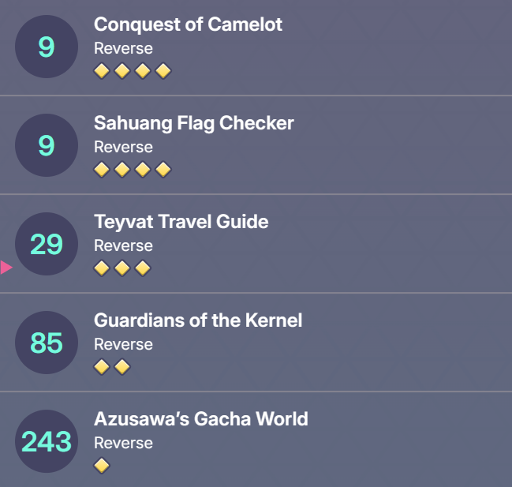

## Overview

Our team solved all reverse challenges from this year's SekaiCTF edition!



In this blog, I will only share my write-up for Sahuang Flag Checker challenge. For other challenges if needed, DM me via my [Twitter](https://twitter.com/FazeCT1512).

## Sahuang Flag Checker


> * **Given file:** [Get it here!](https://github.com/FazeCT/ctf/blob/main/SekaiCTF%202023/sahuang)
> * **Description:** Can you figure out what master sahuang flag checker is doing to satisfy the 🐸? Note: Your CPU needs to support AVX-512 to run the binary.
> * **Category:** Reverse Engineering

We are given a binary filled with bunch of `AVX-512` instructions to work with. Using IDA to analyze the binary, we get this code.

```c showLineNumbers{1} /apply/ /components/
    __printf_chk(1LL, "Enter the flag: ", envp);
    __isoc99_scanf("%60s", v31);
    while ( 1 )
    {
    v10 = strlen(v31);
    if ( (v10 & 0xF) <= v8 )
        break;
    __memcpy_chk(&v31[v10], "X", 2LL, 80 - v10); // fill using 'X'
    ++v8;
    }
```

So we are prompted for an input, and it will be extended using `X` to make the length divisible by `16`.

```c showLineNumbers{1} /apply/ /components/
    if ( v10 >> 4 )
    {
        [...]
        do
        {
            _RBX = v28;
            v12 = v26;
            do
            {
                [...]
            }
            while ( _RBX != v29 );
            
            [...]

            do
            {
                [...]
            }
            while ( &v30 != _RBX );
            
            [...]
        }
        while ( strlen(v31) >> 4 > v27 );
    }
```

The big do-while makes it clear to see that our input is encrypted by chunks of length `16` each.

```c showLineNumbers{1} /apply/ /components/
    do
    {
        rc(input[v12] - 33, 3);
        __asm
        {
            vxorpd  xmm3, xmm3, xmm3
            vcvtusi2sd xmm0, xmm3, eax
        }
        _RBX += 128;
        ++v12;
        __asm { vmovsd  qword ptr [rbx-80h], xmm0 }
    }
    while ( _RBX != v29 );
    matmult_SSE4((__int64)v29, (__int64)A, (__int64)v28);
```

I used IDA debugger to analyze this, and I actually guessed how `rc()` works by inputting `ABCD...`.

> ### How it works?
> * First thing we have to observe is `rc()` changes the value in `eax` register. By inputting `ABCD`, which is `0x41424344`, gives `0x20`, `0x28`, `0x21`, `0x29` in `eax` register, respectively. 
> * From that I got the hang of this function. It basically just does some manglings on `input[i] - 33`, by performing rotate left 3 times on the lower 4 bits of `input[i] - 33`. Refer to the script below to get how the function works. 

```py title="solve/partial_problem.py" showLineNumbers{1} /apply/ /components/
    inp = b'SEKAI{test_flag}'
    eax = []

    rol = lambda val, r_bits, max_bits=4: \
        (val << r_bits%max_bits) & (2**max_bits-1) | \
        ((val & (2**max_bits-1)) >> (max_bits-(r_bits%max_bits)))

    for i in inp:
        p = i - 33
        q = p // 16
        r = p % 16 # Extracts lower 4 bits of p
        
        eax.append(q * 16 + rol(r, 3))

    print(eax)

    # [49, 34, 37, 32, 36, 85, 89, 66, 81, 89, 55, 74, 77, 64, 67, 86]
```

To reverse it is a fairly easy task, just do rotate right 3 times on the lower 4 bits of the encrypted value, then add `33` to the result.

```py title="solve/partial_solver.py" showLineNumbers{1} /apply/ /components/
    eax = [49, 34, 37, 32, 36, 85, 89, 66, 81, 89, 55, 74, 77, 64, 67, 86]

    ror = lambda val, r_bits, max_bits=4: \
        ((val & (2**max_bits-1)) >> r_bits%max_bits) | \
        (val << (max_bits-(r_bits%max_bits)) & (2**max_bits-1))

    for i in eax:
        q = i // 16
        r = i % 16

        print(end=chr(q * 16 + ror(r, 3) + 33))
    print()

    # SEKAI{test_flag}
```

Continue on this part, specifically this line: `matmult_SSE4((__int64)v29, (__int64)A, (__int64)v28);`, we can see that `v29 = A * v28`, with `A` is a `16 * 16` matrix and `v28` is a vector of size `16` that contains our mangled input chunk.

Since `A`'s elements are treated as doubles from qwords in little endian, matrix `A` can easily be extracted by using Python struct, like below.

```py title="solve/partial_problem.py" showLineNumbers{1} /apply/ /components/
    import struct 

    A = [ 0x00, 0x00, 0x00, 0x00, 0x00, 0x80, 0x4B, 0x40, 0x00, 0x00, 
    0x00, 0x00, 0x00, 0x40, 0x54, 0x40, 0x00, 0x00, 0x00, 0x00, 
    [...] 
    0x57, 0x40, 0x00, 0x00, 0x00, 0x00, 0x00, 0x00, 0x44, 0x40, 
    0x00, 0x00, 0x00, 0x00, 0x00, 0xC0, 0x52, 0x40]

    matA = [int(struct.unpack("<d", bytes(A[8 * i: 8 * i + 8]))[0]) for i in range(256)]
    print(matA)

    # [55, 81, 66, 68, 86, 67, 51, 34, 88, 43, 44, 70, 65, 51, 93, 54, 73, 45, 54, 35, 82, 59, 67, 84, 87, 46, 69, 46, 46, 80, 79, 51, 39, 50, 57, 67, 51, 68, 61, 32, 79, 48, 35, 90, 63, 69, 66, 52, 70, 55, 64, 40, 52, 84, 79, 77, 51, 60, 74, 57, 95, 78, 93, 41, 70, 77, 58, 78, 68, 83, 49, 37, 90, 53, 61, 91, 65, 65, 95, 58, 71, 64, 91, 90, 87, 57, 53, 75, 48, 68, 48, 69, 73, 63, 47, 51, 63, 49, 74, 50, 52, 95, 32, 83, 65, 85, 66, 53, 85, 74, 42, 81, 33, 46, 63, 85, 39, 80, 89, 50, 62, 70, 47, 70, 39, 56, 54, 61, 67, 36, 84, 70, 91, 58, 68, 87, 33, 77, 91, 88, 87, 46, 66, 67, 60, 80, 35, 79, 69, 45, 54, 79, 76, 49, 38, 75, 35, 77, 70, 91, 91, 74, 63, 55, 63, 76, 83, 39, 61, 69, 61, 49, 92, 34, 75, 52, 87, 80, 83, 43, 36, 49, 62, 86, 51, 49, 67, 65, 69, 92, 95, 42, 44, 66, 68, 88, 79, 45, 46, 70, 74, 94, 75, 50, 75, 77, 66, 66, 48, 39, 58, 73, 65, 66, 63, 77, 56, 80, 85, 57, 79, 58, 78, 64, 37, 78, 75, 90, 78, 49, 76, 79, 68, 82, 76, 87, 82, 73, 52, 46, 93, 36, 34, 41, 94, 55, 42, 58, 54, 37, 40, 76, 90, 95, 40, 75]
```

```c showLineNumbers{1} /apply/ /components/
    do
    {
        __asm
        {
            vmovss  xmm1, cs:constant1; float
            vxorps  xmm2, xmm2, xmm2
            vcvtsd2ss xmm0, xmm2, qword ptr [rbx]; float
        }
        mul(*(float *)&_XMM0, *(float *)&_XMM1);
        __asm
        {
            vcvttss2usi eax, xmm0
            vxorps  xmm2, xmm2, xmm2
            vmovss  xmm0, cs:constant2; float
        }
        _RBX += 16;
        __asm { vcvtusi2ss xmm1, xmm2, eax; float }
        mul(*(float *)&_XMM0, *(float *)&_XMM1);
        __asm
        {
            vcvttss2usi esi, xmm0; unsigned int
            vcvttsd2usi edi, qword ptr [rbx-80h]; unsigned int
        }
        v24 = sub(_EDI, _ESI);
        *((_BYTE *)ct + v14++) = add(v24, 33u);
    }
    while ( &v30 != _RBX );
```

First, the program sets `rbx = v29`, means that now the `rbx` points to the vector that was calculated from the operation `v29 = A * v28`.

We encounter `2` constants here, as shown below.

``` showLineNumbers{1} /apply/ /components/
    .rodata:000055FF636BE0A0 constant1       dd 3C2E4C41h            ; DATA XREF: main:loc_55FF636BD2A0↑r
    .rodata:000055FF636BE0A4 constant2       dd 42BC0000h            ; DATA XREF: main+1BF↑r
```

The first constant is loaded into `xmm1` using this instruction: `vmovss  xmm1, cs:constant1; float`, which we can easily retrieve using Python struct using this line of code.

```py showLineNumbers{1} /apply/ /components/
    >>> struct.unpack("<f", int.to_bytes(0x3C2E4C41, 4, 'little'))[0]
    0.010638297535479069
```

The second constant is loaded into `xmm0` using this instruction: `vmovss  xmm0, cs:constant2; float`. We will use the same approach to get the floating point value.

```py showLineNumbers{1} /apply/ /components/
    >>> struct.unpack("<f", int.to_bytes(0x42BC0000, 4, 'little'))[0]
    94.0
```

The `mul()` function simply sets `XMM0 = XMM0 * XMM1`. From that I was able to summarize the algorithm flow, using this script.

```py title="solve/partial_problem.py" showLineNumbers{1} /apply/ /components/
    from Sage.all import *

    ct = b'/M=ldDLcPkWR*8s<F#/=\TIJ=*b\)uY4-G%O"FEct"Gi[}{JH>[yC`Baf0p}(=-t'
    l = [ct[16 * i: 16 * i + 16] for i in range(4)]

    con1 = 0.010638298 # I debugged to get this new value, didn't believe in Python struct lol
    con2 = 94

    mat = Matrix([[55, 81, 66, 68, 86, 67, 51, 34, 88, 43, 44, 70, 65, 51, 93, 54], [73, 45, 54, 35, 82, 59, 67, 84, 87, 46, 69, 46, 46, 80, 79, 51], [39, 50, 57, 67, 51, 68, 61, 32, 79, 48, 35, 90, 63, 69, 66, 52], [70, 55, 64, 40, 52, 84, 79, 77, 51, 60, 74, 57, 95, 78, 93, 41], [70, 77, 58, 78, 68, 83, 49, 37, 90, 53, 61, 91, 65, 65, 95, 58], [71, 64, 91, 90, 87, 57, 53, 75, 48, 68, 48, 69, 73, 63, 47, 51], [63, 49, 74, 50, 52, 95, 32, 83, 65, 85, 66, 53, 85, 74, 42, 81], [33, 46, 63, 85, 39, 80, 89, 50, 62, 70, 47, 70, 39, 56, 54, 61], [67, 36, 84, 70, 91, 58, 68, 87, 33, 77, 91, 88, 87, 46, 66, 67], [60, 80, 35, 79, 69, 45, 54, 79, 76, 49, 38, 75, 35, 77, 70, 91], [91, 74, 63, 55, 63, 76, 83, 39, 61, 69, 61, 49, 92, 34, 75, 52], [87, 80, 83, 43, 36, 49, 62, 86, 51, 49, 67, 65, 69, 92, 95, 42], [44, 66, 68, 88, 79, 45, 46, 70, 74, 94, 75, 50, 75, 77, 66, 66], [48, 39, 58, 73, 65, 66, 63, 77, 56, 80, 85, 57, 79, 58, 78, 64], [37, 78, 75, 90, 78, 49, 76, 79, 68, 82, 76, 87, 82, 73, 52, 46], [93, 36, 34, 41, 94, 55, 42, 58, 54, 37, 40, 76, 90, 95, 40, 75]])

    vec = vector([x] * 16) # to-find

    tmp = mat * vec

    # For each of l[0], l[1], l[2], l[3]
    for i in range(16):
        esi = edi = tmp[i]
        esi = int(esi * con1) * con2

        assert(edi - esi + 33 == l[0][i])
```

So, clearly, it is just maths. To be able to solve this, refer to the note below.

> ### A note to solve the problem
> * The elements are all in range `[0, 93]`, so we can work on stuffs in `Zmod(94)`. 
> * From this, we do a simple solve_right on `AX = B` in `Zmod(94)` with A being our matrix in `Zmod(94)` and B being our target vector, with the elements all subtracted by `33`, since we have this line `*((_BYTE *)ct + v14++) = add(v24, 33u);`.


```py title="solve/partial_solver.py" showLineNumbers{1} /apply/ /components/
    from sage.all import *

    ct = b'/M=ldDLcPkWR*8s<F#/=\TIJ=*b\)uY4-G%O"FEct"Gi[}{JH>[yC`Baf0p}(=-t'
    l = [ct[16 * i: 16 * i + 16] for i in range(4)]

    con1 = 0.010638298
    con2 = 94

    mat = Matrix(Zmod(94),[[55, 81, 66, 68, 86, 67, 51, 34, 88, 43, 44, 70, 65, 51, 93, 54], [73, 45, 54, 35, 82, 59, 67, 84, 87, 46, 69, 46, 46, 80, 79, 51], [39, 50, 57, 67, 51, 68, 61, 32, 79, 48, 35, 90, 63, 69, 66, 52], [70, 55, 64, 40, 52, 84, 79, 77, 51, 60, 74, 57, 95, 78, 93, 41], [70, 77, 58, 78, 68, 83, 49, 37, 90, 53, 61, 91, 65, 65, 95, 58], [71, 64, 91, 90, 87, 57, 53, 75, 48, 68, 48, 69, 73, 63, 47, 51], [63, 49, 74, 50, 52, 95, 32, 83, 65, 85, 66, 53, 85, 74, 42, 81], [33, 46, 63, 85, 39, 80, 89, 50, 62, 70, 47, 70, 39, 56, 54, 61], [67, 36, 84, 70, 91, 58, 68, 87, 33, 77, 91, 88, 87, 46, 66, 67], [60, 80, 35, 79, 69, 45, 54, 79, 76, 49, 38, 75, 35, 77, 70, 91], [91, 74, 63, 55, 63, 76, 83, 39, 61, 69, 61, 49, 92, 34, 75, 52], [87, 80, 83, 43, 36, 49, 62, 86, 51, 49, 67, 65, 69, 92, 95, 42], [44, 66, 68, 88, 79, 45, 46, 70, 74, 94, 75, 50, 75, 77, 66, 66], [48, 39, 58, 73, 65, 66, 63, 77, 56, 80, 85, 57, 79, 58, 78, 64], [37, 78, 75, 90, 78, 49, 76, 79, 68, 82, 76, 87, 82, 73, 52, 46], [93, 36, 34, 41, 94, 55, 42, 58, 54, 37, 40, 76, 90, 95, 40, 75]])

    target=[]
    for i in range(16):
        target.append(l[0][i] - 33) # For the first chunk
    target = vector(Zmod(94),target)
    print(mat.solve_right(target))

    # [49, 34, 37, 32, 36, 85, 16, 55, 36, 55, 68, 55, 93, 55, 43, 15]
    # [71, 39, 71, 31, 79, 17, 66, 34, 66, 55, 52, 15, 50, 82, 61, 55] 
    # [7, 41, 68, 73, 78, 3, 89, 55, 40, 88, 82, 57, 17, 42, 15, 88] 
    # [33, 66, 55, 35, 82, 52, 84, 18, 86, 59, 59, 59, 59, 59, 59, 59]
```

And, combine this with our very first script, we have our flag for the challenge!

```py title="solve/final_solver.py" showLineNumbers{1} /apply/ /components/
    res = [49, 34, 37, 32, 36, 85, 16, 55, 36, 55, 68, 55, 93, 55, 43, 15] + [71, 39, 71, 31, 79, 17, 66, 34, 66, 55, 52, 15, 50, 82, 61, 55] + [7, 41, 68, 73, 78, 3, 89, 55, 40, 88, 82, 57, 17, 42, 15, 88] + [33, 66, 55, 35, 82, 52, 84, 18, 86, 59, 59, 59, 59, 59, 59, 59]

    ror = lambda val, r_bits, max_bits=4: \
        ((val & (2**max_bits-1)) >> r_bits%max_bits) | \
        (val << (max_bits-(r_bits%max_bits)) & (2**max_bits-1))

    for i in res:
        q = i // 16
        r = i % 16

        print(end=chr(q * 16 + ror(r, 3) + 33))
    print()

    # SEKAI{1_I_i_|_H0oOo@p3eEe_Y0Uu\_/Didn't_BruT3F0rCe_GuYy5}XXXXXXX
```

Flag is: `SEKAI{1_I_i_|_H0oOo@p3eEe_Y0Uu\_/Didn't_BruT3F0rCe_GuYy5}`