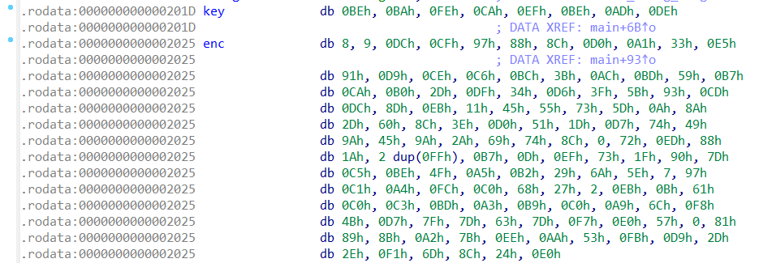
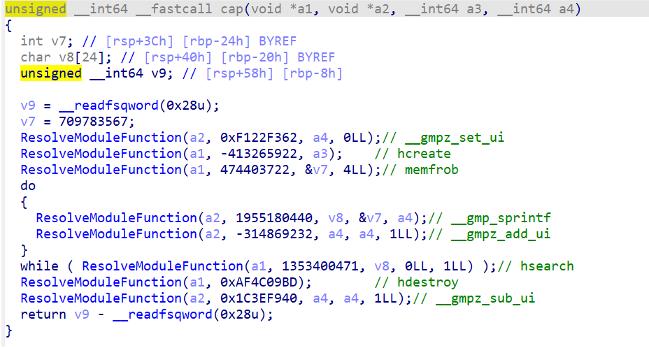

## Overview

I had a great time participating in the CTF with team `thehackerscrew` this week. Out of the four reverse engineering challenges, I managed to solve three, which was a fantastic accomplishment.

The challenges were both enjoyable and educational, allowing me to learn and grow as I tackled them.

## decompile me

> * **Given file:** [Get it here!](https://2023.ctf.zer0pts.com/tasks/860740813/)
> * **Description:** Reverse engineering is getting easier thanks to IDA/Ghidra decompiler!

We are given a binary file named `chall`. Load it in `IDA`, and it was easy to see that the binary just does `RC4 encryption` on the input we provide it.



However, when I tried to decrypt the ciphertext using the key given, I failed to get the flag.

At this point I read the description again and saw that it said something about `IDA/Ghidra`, and my thought was that `IDA` and `Ghidra` might give false results.

So I went on and tried to decompile the binary using `Binary Ninja` instead. And my thought was correct, `key` and `enc` was wrongly mapped.


I wrote a simple script to get the flag.

```py title="solve/solver.py" showLineNumbers{1} /apply/ /components/
    from malduck import rc4

    key = b'1\t\x81\x19\x19\x14E\x11'
    enc = b'x\xcf\xc4\x85\xdc3\x07L\x935\xfb|\x10\x8e\xbe\x93(\xe6.u\xda^\x85\xc5\x91\x15u\x89H\x0e)\xa4\xf9\xa6:n\x1f\x84\xf7B\xb0\x931\xf0h\xc0C8\x072\tW\xda2D\xcf\xcd\x8f\xe5\xbf\xe3\xd6\xbbY\x9aj\x84\x85\xd3\"\xa9\x8e\xb5\xea\xbdW\xde\xb1l\x93\xe4tp\xac\x1a\x03\xd9\x16\x9f\xbc\x97\xfb\x85\xd9\xa6\x9e\xd4\xd6\x02Y\xd5(\xb3\x93\x16\xb6\xc4x\xc4\xa2\x12\xd2\xef\xb1T\x18\xfdvQ\xa3^W\xb8XK\x1e\xe2A'

    print(rc4(key, enc))
```

Flag is: `zer0pts{d0n'7_4lw4y5_7ru57_d3c0mp1l3r}`

## mimikyu

> * **Given file:** [Get it here!](https://2023.ctf.zer0pts.com/tasks/3675284017/)
> * **Description:** Deja vu in Windows.

For this challenge, we are given a binary and 2 library files. A quick look into the binary reveals that it is using `dynamic linking` in the implementation of the program.

> How the binary works?
> * To briefly explain, `ResolveModuleFunction()` is used with a hash value to retrieve functions from a library file (which we call `dynamic linking`).

So first thing we should do is to retrieve all the functions called. That should be fairly easy with some debuggings, since `dlsym()` function directly returns function name from the library.

> How to get function names?
> * Set a breakpoint at `dlsym()` call and read parameter `name`.




After a while, I saw that our flag is splitted into chunks of `4 bytes`, and the scheme of the checker should look like this:

`encoded = pow(chunks[i], e, m)`

with `e` and `m` are the values we get from `rand()` calls.

I've been doing both `Crypto` and `Reversing`, so I quickly realized that this is just doing `RSA encryption`. So I wrote a script, with some debuggings to retrieve `rand()` values runtime, and I got the flag.

```py title="solve/solver.py" showLineNumbers{1} /apply/ /components/
    from Crypto.Util.number import *
    from factordb.factordb import FactorDB

    x = [0xf0d3, 0x085f, 0x8e63, 0x8249, 0xc6a1, 0x0c6d, 0xaef5, 0xd5df, 0xe68d, 0xf3fb]
    y = [0x00002350f23a0dff, 0x000032d18e9d4d33, 0x000003866cd71f1b, 0x000010ae9be3fc8f, 0x000009d942eff67d, 0x00001de2e3aa8bb1, 0x0000103fc65841f3, 0x0000011a0970edc9, 0x00005f8d20bddf39, 0x000045b14e11e0ed]

    enc = [0xFE4C025C5F4, 0x1B792FF17E8A, 0x183B156AB40, 0xBEFFCF5E5DA, 0x297CF86E251, 0xEB3EDC1D4B4, 0xFA10CE3A08, 0x2BDD418672, 0x5EBB5050EA46, 0x5BF9B73CF86]

    flag = b""

    for i in range(len(x)):
        f = FactorDB(y[i])
        f.connect()
        ls = f.get_factor_list()

        phi = 1
        for j in ls:
            phi *= (j - 1)

        d = inverse(x[i], phi)
        dec = pow(enc[i], d, y[i]).to_bytes(4, "little")
        flag += dec

    print(flag.decode())
```

Flag is: `zer0pts{L00k_th3_1nt3rn4l_0f_l1br4r13s!}`

## topology

> * **Given file:** [Get it here!](https://2023.ctf.zer0pts.com/tasks/2548907142/)
> * **Description:** No worries. It's a network topology, not an algebraic one.

For this challenge, we are provided with a binary file, `topology`. I did some analysis on it, and noted out some comments about how the challenge works.

> My note
> * Input is splitted into `10` chunks, each has `8 bytes`.
> * The parent process spawns many child process, each has a different `whoami` value.
> * Each child process is linked with a function, which is derived from `f[whoami - 1]` (in `handle_message`).
> * Each function has `10` cases, each case has a unique solution to make `result = 0` (so that `OK` is sent from the child process back to the parent process).
> * Suppose that the first time a function is called, `case 0` is used to check the input, and next time `case 1` is used, and so on.

Move on to the main check function in `network_main`, and here is where things get more obvious.

> How the checker works?
> * The first chunk of the input is checked using `case 0` of all the functions (that is linked with all child processes).
> * Similarly, the second chunk of the input is checked using `case 1` of all the functions (since all of them are already called once), and thing goes the same for all remaining chunks of the input.
> * A chunk is considered correct if at least `5` functions accept it.

So our problem is how to solve the cases. At first I was thinking of using `angr`, but I failed to do so, and I ended up using `z3` to solve them.

Below is the example of solving a case which leads to the first chunk of our flag:

```py title="solve/solver.py" showLineNumbers{1} /apply/ /components/
    from z3 import *
    from Crypto.Util.number import *

    s = Solver()
    x = BitVec("x", 64)


    def _byteswap_uint64(x):
        chunks = [Extract((i + 1) * 8 - 1, i * 8, x) for i in range(8)]
        reversed_chunks = chunks
        return Concat(reversed_chunks)


    def __ROL8__(x, a):
        return RotateLeft(x, a)


    def __ROR8__(x, a):
        return RotateRight(x, a)


    s.add(
        __ROL8__(
            _byteswap_uint64(
                [...]
            ),
            12,
        )
        == 0x6AA189484E6B1D4
    )

    if s.check() == sat:
        result = s.model()
        print(long_to_bytes(result[x].as_long()).decode()[::-1])

    # zer0pts{
```

To know which chunk is correct, we can set a breakpoint at `base + 0xE5C6F` and read `ebp` register to know the amount of functions that accept it.

And, here is my note again, and this time it contains the flag instead.

> My note
> * 1  `zer0pts{`
> * 2  `kMo7UtDh`
> * 3  `qMfXhaUp`
> * 4  `0kP8MEPL`
> * 5  `PJFgKUx7`
> * 6  `YlWyyxB9`
> * 7  `POKUhegF`
> * 8  `qdNm5sXI`
> * 9  `fxk2FIfV`
> * 10 `}`

Flag is: `zer0pts{kMo7UtDhqMfXhaUp0kP8MEPLPJFgKUx7YlWyyxB9POKUhegFqdNm5sXIfxk2FIfV}`

## fvm

> * **Given file:** [Get it here!](https://2023.ctf.zer0pts.com/tasks/4003740730/)
> * **Description:** Are you bored with x86? Enjoy this x87 VM.

Too bad I didn't solve it at the end, was really sleepy for the whole last `12` hours of the CTF, but anyway here is the interpreter me and my teammates wrote for the `VM` before I went to sleep and stopped doing it.

```py title="solve/vm.py" showLineNumbers{1} /apply/ /components/
    import decimal
    import math

    class VM:
        def __init__(self):
            self.stack = []
            self.memory = [decimal.Decimal(0)] * 20
            self.opcodes = {
                '!': self.opcode_exclamation,
                '"': self.opcode_quote,
                '#': self.opcode_hash,
                '$': self.opcode_dollar,
                '%': self.opcode_percent,
                '&': self.opcode_ampersand,
                '\'': self.opcode_single_quote,
                '1': self.opcode_1,
                '2': self.opcode_2,
                '3': self.opcode_3,
                '4': self.opcode_4,
                '5': self.opcode_5,
                '6': self.opcode_6,
                '7': self.opcode_7,
                '8': self.opcode_8,
                ':': self.opcode_colon,
                'A': self.opcode_A,
                'B': self.opcode_B,
                'C': self.opcode_C,
                'D': self.opcode_D,
                'E': self.opcode_E,
                'Q': self.opcode_Q,
                'R': self.opcode_R,
                'S': self.opcode_S,
                'T': self.opcode_T,
                'a': self.opcode_a,
                'b': self.opcode_b,
                #'c': self.opcode_c,
                'd': self.opcode_d,
                'e': self.opcode_e,
                'f': self.opcode_f,
                'g': self.opcode_g,
                'h': self.opcode_h,
                'i': self.opcode_i,
                '9': self.opcode_9,
                'r': self.opcode_r,
                's': self.opcode_s,
            }

        def interpret(self, code):
            for opcode in code:
                func = self.opcodes.get(opcode, self.opcode_default)
                func()
                # print(self.stack)

        def opcode_default(self):
            raise ValueError("Invalid or unsupported opcode")

        def opcode_exclamation(self):
            self.stack.append(decimal.Decimal(0.0))

        def opcode_quote(self):
            self.stack.append(decimal.Decimal(1.0))

        def opcode_hash(self):
            self.stack.append(decimal.Decimal(math.pi))

        def opcode_dollar(self):
            self.stack.append(decimal.Decimal(math.log2(10)))

        def opcode_percent(self):
            self.stack.append(decimal.Decimal(math.log2(math.e)))

        def opcode_ampersand(self):
            self.stack.append(decimal.Decimal(math.log10(2)))

        def opcode_single_quote(self):
            self.stack.append(decimal.Decimal(math.log(2, math.e)))

        def opcode_8(self):
            self.stack.append(self.stack[-1])

        def opcode_colon(self):
            self.stack = self.stack.pop()

        def opcode_A(self):
            self.stack.append(self.stack.pop() + self.stack.pop())

        def opcode_B(self):
            self.stack.append(self.stack.pop(-2) - self.stack.pop())

        def opcode_C(self):
            self.stack.append(self.stack.pop() * self.stack.pop())

        def opcode_D(self):
            self.stack.append(self.stack.pop(-2) / self.stack.pop())

        def opcode_E(self):
            self.stack[-1] *= decimal.Decimal(-1)

        def opcode_Q(self):
            self.stack[-1] = decimal.Decimal(math.sqrt(self.stack[-1]))

        def opcode_R(self):
            self.stack[-1] = decimal.Decimal(math.sin(self.stack[-1]))

        def opcode_S(self):
            self.stack[-1] = decimal.Decimal(math.cos(self.stack[-1]))

        def opcode_T(self):
            self.stack[-1] = decimal.Decimal(round(self.stack[-1]))

        def opcode_a(self):
            self.memory[13] = self.stack.pop()

        def opcode_b(self):
            self.stack.append(self.memory[13])

        def opcode_d(self):
            self.flags = int(self.stack.pop() < self.stack.pop())

        def opcode_e(self):
            self.flags = int(self.stack.pop() <= self.stack.pop())

        def opcode_f(self):
            self.flags = int(self.stack.pop() == self.stack.pop())

        def opcode_g(self):
            self.flags = int(self.stack.pop() != self.stack.pop())

        def opcode_h(self):
            self.flags = int(self.stack.pop() >= self.stack.pop())

        def opcode_i(self):
            for _ in range(self.flags):
                if self.code:
                    self.code.pop(0)

        def opcode_r(self):
            self.stack.append(decimal.Decimal(ord(input("Enter a character: "))))

        def opcode_s(self):
            print(chr(int(self.stack.pop())), end='')

        def opcode_1(self):
            self.stack[0], self.stack[1] = self.stack[1], self.stack[0]

        def opcode_2(self):
            self.stack[0], self.stack[2] = self.stack[2], self.stack[0]

        def opcode_3(self):
            self.stack[0], self.stack[3] = self.stack[3], self.stack[0]

        def opcode_4(self):
            self.stack[0], self.stack[4] = self.stack[4], self.stack[0]

        def opcode_5(self):
            self.stack[0], self.stack[5] = self.stack[5], self.stack[0]

        def opcode_6(self):
            self.stack[0], self.stack[6] = self.stack[6], self.stack[0]

        def opcode_7(self):
            self.stack[0], self.stack[7] = self.stack[7], self.stack[0]

        def opcode_9(self):
            self.stack.append(decimal.Decimal(input("Enter a number: ")))


    vm = VM()
    vm.interpret('#8A$CT$CTs$88AC\'A$CTs$88#QCCCTs#$A$8CCTs#88QCC$CTs#88CCT"As')

    # FLAG: 
```